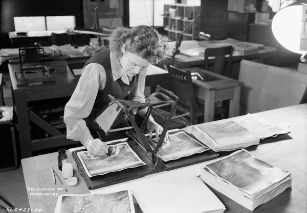

```{r echo=FALSE}
yml_content <- yaml::read_yaml("chapterauthors.yml")
author <- yml_content[["whatIsGeomatics"]][["author"]]
```
# What is Geomatics? {#what-is-geomatics}

Written by
```{r results='asis', echo=FALSE}
cat(author)
```

```{r, include=FALSE}
baseurl <- "https://ubc-geomatics-textbook.github.io/geomatics-textbook/"
nrcanlicense <- "https://open.canada.ca/en/open-government-licence-canada"
library(leaflet)
```

<style>
.html-widget {
    margin: auto;
}
</style>

We encounter and use geographic information on a regular basis in our everyday lives. Whether it is finding directions to a retailer that has an item in stock you want to buy or recording the path of your last morning jog, you have probably used a Geographic Information System (GIS) and not even realized it. In this chapter, we explore what geomatics is all about.

:::: {.box-content .learning-objectives-content}
  
::: {.box-title .learning-objectives-top}
## Learning Objectives {-}
::: 

1. Understand what a Geographic Information System (GIS) is and what it can do
2. Understand how the five components of GIS are integrated to solve spatial questions
3. Recognize the significant Canadian contributions in the advancement of geomatics as a field

::::
  
## Key Terms {-}
  
Geomatics, Geographic Information Systems (GIS), Remote Sensing, Capture, Store, Analyze, Model, Data Model, Conceptual Model, Map, Query, Analyze, Display, Output

## The Science and Technology of Geomatics

**Geomatics** is the science and technology of collecting geographic data and converting it to geographic information for use in a wide variety of industries. As a technical field, it encompasses many different work processes including surveying, remote sensing, global navigation satellite systems, geospatial analysis, and information technology and systems management. In turn, these processes support a wide variety of spatial decision-making such as urban planning, ecological conservation, forest management, real-time planetary systems monitoring, and rapid response to natural disasters. Many more emerging technologies such as self-driving vehicles, ride-sharing apps, and augmented reality video games depend directly on the science and technology of geomatics.

## Information Systems

An **information system** is used to store, code, and recall information. In the Information Age, we are surrounded and depend heavily on information systems such as financial systems that record the transactions in your bank account or navigation systems that tell you the fastest route to a destination or autonomous vehicles such as the SkyTrain rapid transit network in Vancouver, Canada that moves more than a half million people every day across the Metro Vancouver region. These are all examples of systems that require high synchronization and integration of many varied sources of information in order to move people and assets around. It should come as no surprise then that information systems and information technology contribute significantly to nearly every sector of developed and developing economies. 

What makes a **Geographic Information System** different from other information systems is the type of information that is handled: geographic location. With a GIS you can know the quantity and quality of something and the __location__ of that event, activity, or feature. For example, you might have recorded your heart rate and timed your morning jog using your phone or other fitness tracking device. Since you also have the location or coordinates of your jog, you can calculate or derive additional information such as speed (distance per time), the total distance you jogged, and also your elevation above sea level. You could even relate your heart rate to different locations along your jog to better understand your performance on different terrain. This is an example of a GIS at work. You are storing geographic information into a system that allows you to code the information with different qualities (e.g., the type of surface your ran on) and quantities (e.g., your heart rate) and then recall that information in a way that allows you to explore trends and ask and answer __spatial__ questions.

## The Five Components of GIS

A GIS is a collection of five inter-connected, inter-acting, and inter-dependent components (Figure \@ref(fig:01-five-components-gis)).

```{r 01-five-components-gis, fig.cap = fig_cap, out.width= "75%", echo = FALSE}
    fig_cap <- paste0("The five components of a geographic information system.. Pickell, CC-BY-SA-4.0.")
    knitr::include_graphics("images/01-five-components-gis.png")
```
<br/>

**Data** – Data are a collection of qualitative and quantitative variables about real world entities. At the very least, the type of data stored in a GIS is usually spatial in nature, meaning we have some set of coordinates or representation of location. But a GIS can also store aspatial data, data that does not necessarily have coordinates, but may still be relevant to other geographic data For example, you might also record the dates that you jogged or the weather during your jogs. These are examples of aspatial information that we might want to relate to your jogs.

```{r 01-jogging-path, fig.cap = fig_cap, out.width= "75%", echo = FALSE}
    fig_cap <- paste0("Abstracted spatial and aspatial information from a jogging path represented by three ordered points. Pickell, CC-BY-SA-4.0.")
    knitr::include_graphics("images/01-jogging-path.png")
```
<br/>

Spatial data can take many forms in a GIS, which we will explore more in [Chapter 2](https://ubc-geomatics-textbook.github.io/geomatics-textbook/mapping-data.html). For the sake of our jogging example, you can imagine your jogging path could be represented as a line or a set of ordered points. In turn, your jogging path can be described by different qualities (day of the week, weather) and quantities (distance, speed, heart rate), which are called **attributes** (Figure \@ref(fig:01-jogging-path)). An important role of a GIS is to govern how data can interact and behave with other types of data. For example, we can calculate distance from a line, but not area, which is a special property of a polygon. We will explore data behaviors in more detail in [Chapter 2](https://ubc-geomatics-textbook.github.io/geomatics-textbook/mapping-data.html).

**Software** – There are a lot of different GIS software packages available and the choice of which software to use is usually driven by preference, availability, and/or cost. For example, some GIS software are freely available while others require a paid license. Nearly all GIS software packages can perform the same operations and analyses, but there are some differences like integrated cloud computing or availability of certain plugins. The most widely-used paid software is ESRI's ArcGIS, while the most widely-used Free and Open Source Software (FOSS) is QGIS (Q for Quantum). There are many other historically-significant FOSS software packages like GRASS, SAGA, and MOSS that are discussed in more detail later in this chapter.

**Hardware** – GIS software operate on hardware comprised of computer components and human interface devices (HID). High resolution and high refresh rate monitors are often required when dealing with high resolution imaging and other digitizing, which require high-end graphics cards. Solid State Disks (SSD) with high capacity are important for fast read-write speeds to access and process data while Random Access Memory (RAM) and Central Processing Unit (CPU) clock speed can also be limiting factors for processing. Some specialized HID are designed specifically for working with GIS such as active shutter and polarized glasses for stereo vision, and joysticks for navigating in 3D space.

**Methods** – All organizations must design business processes in order to effectively operationalize GIS for solving real-world problems. Methods will vary from organization to organization based on industry, client needs, and the types of data needed. For example, the business process of a forestry company will involve digitizing forest stands and other natural resources, enumerating attributes for stand inventories, road and forest harvest planning, forest regeneration monitoring, and creating operational maps. It is important for an organization to define exactly the activities, standards, and quality assurance (i.e., methods) that will be needed to achieve operational goals. Well-defined and well-documented methods also ensure that organizational knowledge is retained during staff turnover.

**People** – We are responsible for identifying the information needs, defining the procedures, coding the software, and building the hardware for a Geographic Information System. We are also responsible for interpreting, analyzing, and reporting our results and communicating our findings through maps and reports. Geographic Information Systems do not occur naturally and because a they are a product of our imagination and skill, they inherit our best and worst traits. For example, we often make mistakes when we define our procedures or identify our information needs, which lead to incorrect conclusions. Moreover, our biases intentionally and unintentionally creep into our map-making, distorting shape, size, and importance of features that we want to represent.

## What a GIS can do

Like other information systems, a GIS should be able to do the following things with geospatial data:

- Capture geospatial data
- Store geospatial data
- Query geospatial data
- Analyze geospatial data
- Display geospatial data
- Output geospatial data

Geospatial data may be **captured** from remote sensing ([Chapter 11](https://ubc-geomatics-textbook.github.io/geomatics-textbook/collecting-and-editing-data.html)) or digitized/scanned from other sources ([Chapter 4](https://ubc-geomatics-textbook.github.io/geomatics-textbook/collecting-and-editing-data.html)). Data can be **stored** in many different formats with different behaviours and rules and are kept in databases ([Chapter 3](https://ubc-geomatics-textbook.github.io/geomatics-textbook/types-of-data.html)). Data can be queried (or selected) from a database using a standard query language ([Chapter 5](https://ubc-geomatics-textbook.github.io/geomatics-textbook/relational-databases.html)). Once data are queried, they can then be **analyzed** using operations like proximity, overlay, intersection and zonal statistics ([Chapter 6](https://ubc-geomatics-textbook.github.io/geomatics-textbook/overlay-and-proximity-analysis.html)). A primary justification for investing resources into a GIS is to display and **output** data in the form of graphs, tables, charts, and maps ([Chapter 17](https://ubc-geomatics-textbook.github.io/geomatics-textbook/making-beautiful-maps.html)).

A GIS ultimately answers spatial questions like:

- Where should I buy a home?
- Where is population density highest in Vancouver, Canada?
- Where is the most economical location for a new mill?
- Where should land be protected or conserved?

## Modelling the world with GIS

Together, the five components of a GIS allow us to model our spatial environment. A **model** is an abstraction or simplification of reality. Models are necessary for us to understand how complex things work and communicate that understanding to others. For example, the hydrologic cycle describes the states and processes of water in the atmosphere, over land, in the ocean as well as forms of precipitation and evaporation. The concept of the hydrologic cycle is a simplification, of course, because movement and the phase of water is caused by all kinds of interacting forces such as gravity, temperature, pressure, and climate. For this reason, the hydrologic cycle is an example of a **conceptual model**, which is used to hypothesize and theorize about how our world works. This brings us to the second important quality of models: they are reproducible. A model must be reproducible so that we can validate it or check that the result or output is in line with what we expect or observe. For example, the principles of the hydrologic cycle are universal, that is they apply anywhere on Earth and even on other planets because they are based on physical properties that are shared across our universe (e.g., temperature, pressure, gravity).

We can also create models that allow us to play out different scenarios and assess the possible range of outcomes in geographic space. For example, you might be interested in purchasing a home, but you have some spatial and aspatial criteria such as price range, preference of neighborhood, distance to your work, or the quality of the nearby schools. This is the type of spatial optimization problem that we often seek to solve with a GIS. If you go onto a property listing website, you will notice that the results will change based on the criteria that you enter. And this brings us to the final type of model that is important to a GIS: the map.

**Maps** are spatial models. They abstract geographic information like location and attributes of things. It is important to underscore the difference between spatial models such as maps and conceptual models such as the hydrologic cycle. With a map, you could abstract or represent the location, distance and area of a lake, but you would need the conceptual model of the hydrologic cycle to describe the interaction of the lake with the atmosphere (i.e., evaporation). There are many aspects of the hydrologic cycle that can be specifically modelled in a GIS, which is something we will explore further in [Chapter 9](https://ubc-geomatics-textbook.github.io/geomatics-textbook/raster-analysis-and-terrain-modelling.html).

## A Canadian History of GIS

Modern GIS cannot be understood without the context of three majors technological leaps in the nineteenth and twentieth centuries: the photograph, the airplane, and the computer. None of these technologies were discovered by Canadians, yet all were instrumental for the Canadian cartographic advances that followed.

### The Photograph

The first successful attempt to record light on a durable image can be traced to France. Nicéphore Niépce is widely credited with the invention of photography by producing the oldest surviving photograph from the window of his home in 1826 or 1827 simply titled, _View from the Window at Le Gras_ (Figure \@ref(fig:01-View-from-the-Window-at-Le-Gras)). His process involved using a camera obscura (a discovery handed down from antiquity) to project a real-world scene onto a photosensitive metal plate for hours and possibly days on end. Though the results were crude, it was a major advancement over all earlier attempts that failed to produce a durable photograph. Niépce died only a few years later in 1833 before he was able to publish his invention. Before his death, he shared his secrets with Louis Daguerre who would perfect his process and announce the daguerreotype to the world in 1839, a photographic process that was much faster and commercially viable. The announcement of the daguerreotype from France spread rapidly and resulted in the first known photograph captured of Canada the very next year of Niagara Falls, Ontario (Figure \@ref(fig:01-niagara-falls-daguerreotype-1840)).

```{r 01-View-from-the-Window-at-Le-Gras, fig.cap = fig_cap, out.width= "75%", echo = FALSE}
    fig_cap <- paste("View from the Window at Le Gras showing some buildings and a tree in the distance. This image has been flipped from the original metal plate along both the horizontal and vertical axes. The camera obscura would have originally recorded the upper right corner in the lower left corner. Public Domain.")
    knitr::include_graphics("images/01-View-from-the-Window-at-Le-Gras.jpg")
```
</br>

```{r 01-niagara-falls-daguerreotype-1840, fig.cap = fig_cap, out.width= "75%", echo = FALSE}
    fig_cap <- paste("The earliest known photograph of present-day Canada was this daguerreotype taken in 1840 by Hugh Lee Pattinson of Niagara Falls, Ontario (Horseshoe Falls). Due to the dagguerrotype capture process, the image is flipped on the vertical axis so that image right is the United States on the East side of the falls and image left is Canada on the West side of the falls (image is looking South). Courtesy of Newcastle University Library Special Collections, CC-BY-SA-4.0")
    knitr::include_graphics("images/01-niagara-falls-daguerreotype-1840.png")
```
</br>

It was not long before more Canadian landscapes became the subjects of photography. In the next decade, French colonel Aimé Laussedat developed a new instrument that combined a contemporaneous camera with a theolodite (a surveying instrument) that he called a phototheodolite. The phototheodolite allowed photographs to be precisely taken such that multiple photographs could provide various perspectives of known locations in order to produce topographic maps. By 1867, Laussedat exhibited the first map of Paris produced with a phototheodolite and in doing so he ushered in the field of **photogrammetry**, the science of deriving 3D measurements from 2D photographs. In 1887, the Geological Survey of Canada set out to photograph the Rocky Mountains using these photogrammetric techniques and the Canadian Rockies became one of the most photographed landscapes of the day with over 25,000 historical images captured between 1887 and 1958. Today, these historical images have been digitised from Library and Archives Canada through the [Mountain Legacy Project](http://mountainlegacy.ca/) and many locations have been re-imaged more than a century later by researchers at the University of Alberta and University of Victoria, illuminating dramatic changes to glaciers and forest cover on these Canadian landscapes (Figure #).

### The Airplane

The next technological leap came at the turn of the century and forever transformed photography and photogrammetry. From 1900 to 1902, Orville and Wilbur Wright had been designing and experimenting with light-than-air gliders and kites near Kitty Hawk, North Carolina. By 1903, the brothers had designed the first heavier-than-air airplane capable of powered flight by a gasoline engine called the _Wright Flyer_. Incidentally, because the technology of photography had developed six decades earlier, the moment of this first flight was captured in one of the most iconic photographs ever taken by John T. Daniels, member of the U.S. Lifesaving Service Station at Kill Devil Hills who was standing by (Figure \@ref(fig:01-wright-flyer)).

```{r 01-wright-flyer, fig.cap = fig_cap, out.width= "75%", echo = FALSE}
    fig_cap <- paste("Restored image taken by John T. Daniels on December 17, 1903 near Kitty Hawk, North Carolina only seconds into the 12 second first powered flight piloted by Orville Wright. Wilbur Wright is seen to the right. Public Domain.")
    knitr::include_graphics("images/01-wright-flyer.jpg")
```
</br>

Aviation developed quickly following the first successful powered flight by the Wright Brothers and so did aerial photography. In 1912, Frederick Charles Victor Laws of the British Royal Flying Corps discovered that aerial photographs taken with at least 60% overlap could be used to produce a 3D stereographic effect when viewed through a **stereoscope** (Figure \@ref(fig:01-woman-stereoscope)). Following Laws' realization, flight paths were more intentionally planned to achieve this effect and in the coming years many more personnel were employed to help with **air photo interpretation**, the process of viewing air photos and discerning types of features based on tone, shade, shape, pattern, texture, and spatial association. At the outset of World War I, aircraft were being equipped with cameras for reconnaissance at the front lines. In 1919, Canada became the first country to regulate the domain of aviation with the establishment of the short-lived Air Board. Six air stations were established by the Air Board around the country primarily for civil patrols and surveying.

```{r 01-woman-stereoscope, fig.cap = fig_cap, out.width= "75%", echo = FALSE}
    fig_cap <- paste("A woman is seen annotating an overlapping air photo pair with a stereoscope in 1945. Canada. Dept. of National Defence / Library and Archives Canada / PA-065599, Public Domain.")
    
```

</br>

1919 - Air Board is established to regulate aircraft in Canada
1922 - National Air Photo Library established
1926 - Earliest image in archives of camera mounted on aircraft
1930s - Private aerial surveys of north for minerals, early mapping of Canada commences

Airplanes played a more significant role in World War II both as weapons and for reconnaissance. A new process for collecting aerial imagery was developed called **trimetrogon**, which basically involves capturing three photos at the same time: one directly down and two oblique images to the right and left of the airplane. 

```{r 01-trimetrogon-airplane, fig.cap = fig_cap, out.width= "75%", echo = FALSE}
    fig_cap <- paste('Trimetrogon camera installation in North American "Mitchell" II aircraft of No. 14 Photo Squadron, Royal Canadian Air Force seen in 1945. One of the oblique angle cameras can be seen on the side of the aircraft toward the nose. Library and Archives Canada / PA-065503, Public Domain.')
    knitr::include_graphics("images/01-trimetrogon-airplane.jpg")
```

### The Computer

1944 - Air survey techniques mature and rapidly expand for war effort
1946 - Spartan Air Services Limited established in Ottawa, Ont. by former RCAF pilots

### The Land Use Problem in Canada

1961 - Resources for Tomorrow Conference
1963 - 

The post-war economy of Canada saw significant growth in the 1940s and 1950s and huge demographic shifts were underway. Agrarian societies were transformed by the new economy and rapid urbanization. Prior to the Second World War, about half of all Canadians lived in rural areas. By the 1950s, nearly 62% of the total population lived in urban centres and 37% lived in just the fifteen largest cities (Figure \@ref(fig:01-ninth-census-1951-map)). Faced with the prospect of failed crops and uncertain economic outcomes, many chose to head for better opportunities promised in the metropolitan areas. In the decade from 1941 to 1951, 105 Canadian families left their farms every week, despite an overall increase in farmland across the country.

```{r 01-ninth-census-1951-map, fig.cap = fig_cap, out.width= "75%", echo = FALSE}
    fig_cap <- paste("Ninth Census of Canada 1951, Population Distribution. Dominion of Bureau Statistics, Public Domain.")
    knitr::include_graphics("images/01-ninth-census-1951-map.PNG")
```
</br>

As cities sprawled, land use and land planning conflicts emerged. City waistlines grew as adjacent farmland was consumed to welcome new urban dwellers. In 1957, the Senate established the Special Committee on Land Use in Canada whose purpose was "to consider and report on land use in Canada and what should be done to ensure that our land resources are most effectively utilized for the benefit of the Canadian economy and the Canadian people and, in particular, to increase both agricultural production and the incomes of those engaged in it" (@CanadaSenate_1958). Over the next four years, the special committee heard testimony from 109 witnesses and recorded 1,606 pages of evidence on the issue of land use in Canada (@CanadaSenateSpecialCommitteeLandUseCanada_1963).

Following years of hearings by the Senate Special Committee on Land Use in Canada, the Agricultural and Rural Development Act was passed by Parliament in June 1961 (@McCrorie_1969). The new legislation empowered the Minister of Agriculture to work with the Provinces and Territories to address rural poverty and promote the development and conservation of Canada's prized farmland. By October, the federal government had organized a national conference in Montreal, "The Resources for Tomorrow". Over 700 delegates from government, non-governmental organizations, university, and industry contributed to a unique national conversation on the future of Canada's renewable natural resources with workshops on agriculture, forestry, fisheries, recreation, wildlife, water and urban growth (@Gray_1961). The conference was attended by then Govenor General , Prime Minister Diefenbaker, and future Prime Minister Pierre Elliot Trudeau.

In the following year, Rachel Carson published her landmark __Silent Spring__. The publication catalyzed public sentiment for protecting people and the environment from harmful pesticide and herbicide use. It was clear that a national approach to mapping renewable resources was needed in order to protect and conserve them, so in 1963 the federal government established an ambitious project called the Canada Land Inventory whose chief purpose was to provide a "comprehensive survey of land capability and use designed to provide a basis for resource and land use planning" (@CLIReport1_1965). 

But how could the Canada Land Inventory ever be achieved for such a vast country using traditional paper maps? To be sure, Canada was not lacking the mapped data. In fact there were tens of thousands of maps produced, cataloged, and housed by the federal government on everything from soils to agriculture to recreation to forests. Still, the scale of agricultural land loss was not known at the time because paper maps of soil fertility could not easily be combined with other information like census data. Decision-makers relied on human interpretation and analysis of paper maps, a time-consuming task that could only accommodate a handful of mapped attributes at a time over a small area. Paper maps had to be reproduced at the same scale, aligned, and analysed polygon-by-polygon. The process to create maps at the time was entirely manual, requiring approximately 10 hours by a skilled technician to produce a single map sheet and about as much time by another to check and make any corrections (@Tomlinson_1974). At that rate, it would have taken a A new approach was needed to cope with the overwhelming amount of information being produced.

```{r 01-data-for-decisions, fig.cap = fig_cap, out.width= "75%", echo = FALSE}
    fig_cap <- paste('Roger Tomlinson talks about the use of computers for the Canada Land Inventory in 1967. Frame from "Data for Decisions", a National Film Board of Canada documentary, directed by Michael Millar.')
    knitr::include_graphics("images/01-data-for-decisions.png")
```
</br>

It was 29-year old Roger Tomlinson who recognized the need for computers to handle the massive influx of mapped data (Figure \@ref(fig:01-data-for-decisions)). Tomlinson was working in Ottawa for an aerial survey company called Spartan Air Services Ltd., when he serendipitously met the head of the Canada Land Inventory, Lee Pratt, aboard a flight. Pratt and Tomlinson exchanged ideas about creating a computer system for handling mapped data.

Cartographic puberty, the awkward but necessary transition from paper to magnetic tape.

to lead the development of the world's first computerized GIS. That was 1962. Tomlinson first described it as a "geo-information system" (@Tomlinson_1967), but it was later renamed the Canadian Geographic Information System before it was shortened to the **Canada Geographic Information System (CGIS)**. In the years that followed, the Canada Land Inventory produced over 12,000 map sheets showing the capability of Canada's lands for agriculture, forestry, recreation, and wildlife (@FisherandMacDonald_1979). At the time, a major function of the CGIS was to scan and digitize maps, all of which were on paper sheets. 


Other advances in computer hardware were achieved as a result of the pioneering work by Tomlinson, including the development and integration of map scanners and digitizer tables for inputting and updating geographic data into the computer. Tomlinson is widely acknowledged as the creator of modern computerized GIS.

```{r 01-Canada-land-inventory, fig.cap = fig_cap, out.width= "75%", echo = FALSE}
    fig_cap <- paste("Excerpt from a brochure describing initial mapping efforts of the Canada Land Inventory in British Columbia. Published by the Minister of Supply and Services Canada, n.d.")
    knitr::include_graphics("images/01-Canada-land-inventory.png")
```
</br>

While the Canada Land Inventory was underway with the aid of the CGIS, provinces moved to create the agricultural land reserves to ensure that the most fertile areas remained available as farmland. In 1973, British Columbia established the Agriculture Land Reserves, setting aside 5% of its land base for farming priority. Newfoundland and Labrador established an Agriculture Development Area around the city of St. John's in the same year. By 1977, it was learned from CGIS analysis that only 0.5% the second largest country in the world supports prime farmland and half of that occurs in the vicinity of the most populous metropolitan area: Toronto (Figure \@ref(fig:01-cli-agriculture-capability-toronto)) (@CLIReport11_1977). Ontario published Food Land Guidelines the next year that effectively laid out a land use planning framework for municipalities and the province to protect and maximize the efficiency of farming on the best available land (@LandFoodGuidelines_1978).

``` {r echo=FALSE, warning=FALSE, message=FALSE}
m <- leaflet() %>%
  setView(lng = -79.46, lat = 43.695, zoom = 11) %>% 
  addTiles() %>%
  addWMSTiles(
    "https://206-12-122-94.cloud.computecanada.ca/geoserver/CLI_Agriculture_Capability/wms",
    layers = "cli_250k_agr_30m_toronto",
    options = WMSTileOptions(format = "image/png", transparent = TRUE),
  )
```

``` {r 01-cli-agriculture-capability-toronto, fig.cap = fig_cap, out.width= "75%", echo = FALSE, fig.align="center"}
if (knitr::is_latex_output()) {
  fig_cap <- paste0("Soil capability for agriculture from the Canada Land Inventory for the area surrounding Toronto, Canada. The majority of the best soils for farming in Canada (Class 1 - No significant limitations in use for crops) are found in southeastern Ontario. <a
  \\href='",baseurl,"\\#fig:1-cli-agriculture-capability-toronto'>Interactive web map can be viewed in the web browser version of the textbook</a>. Queen's Printer, Public Domain.")
  knitr::include_graphics(here::here("images", "01-cli-agriculture-capability-toronto.PNG"))
} else {
  fig_cap <- paste0("Soil capability for agriculture from the Canada Land Inventory for the area surrounding Toronto, Canada. The majority of the best soils for farming in Canada (Class 1 - No significant limitations in use for crops) are found in southeastern Ontario. Queen's Printer, Public Domain.")
  m
}
```
</br>

On the opposite shore of Lake Erie from where some of the best Canadian soils for farming were deposited millennia ago by the glacial processes that formed the Great Lakes, the Cuyahoga River quietly empties a small drainage basin of approximately 2,100 km^2^ and bisects the city of Cleveland, Ohio in the United States. This relatively small, crooked river is one of many that fills Lake Erie and flows slowly by former sleepy industrial towns along the lake shore. The first European settler built his cabin on the shore of the Cuyahoga River in 1797 at the site of present-day Cleveland and over the next 155 years of industrialization, the river was reported to have caught fire nine times (@LaBella_2009). Ignited once every 17 years or so from volatile oil slicks and other pollutants suspended in the water column (Figure \@ref(fig:01-Cuyahoga-River-fire-1952)). 

```{r 01-Cuyahoga-River-fire-1952, fig.cap = fig_cap, out.width= "75%", echo = FALSE}
    fig_cap <- paste("The Cuyahoga River burns in 1952 near Cleveland, Ohio in the United States as an oil slick is ignited. Special Collections, Cleveland State University Library.")
    knitr::include_graphics("images/01-Cuyahoga-River-fire-1952.png")
```

In 1968, 16 years after the last burning, just 60 km upstream, a symposium at Kent State University described the state of a 4 km reach of the river (@KentStateUniversity_1968):

> [...] Large quantities of black heavy oil floating in slicks, sometimes several inches thick, are observed frequently. Debris and trash are commonly caught up in these slicks forming an unsightly floating mess. Anaerobic action is common as the dissolved oxygen is seldom above a fraction of a part per million. The discharge of cooling water increases the temperature by 10 to 15 °F [5.6 to 8.3 °C]. The velocity is negligible, and sludge accumulates on the bottom. Animal life does not exist.

The following year in the summer of 1969, the Cuyahoga River burned again. This time, the fire ignited a national conversation in the United States about pollution and was a catalyst for the passage of landmark legislation for protecting the environment. A month after the fire was extinguished, the United States Senate unanimously passed the National Environmental Policy Act (NEPA), legislation that required the federal government to consider the environmental impact of its land use. The following year, the Environmental Protection Agency (EPA) was established by an executive order of President Nixon and the Clean Air Act was passed. By 1972, the United States Congress passed the Clean Water Act. These events in the late 1960s and early 1970s provided new environmental and regulatory imperatives for the continued development of computerized GIS.

By 1976, 

## Summary

## Reflection Questions {-}
1. What is the difference between a conceptual model and a spatial model?
2. What was the initial purpose for developing the first GIS?

## Practice Questions {-}
1. Name the five components of GIS.
2. What is a model? Give an example of a model.
3. What was the name of the first computerized GIS? Who developed it?
