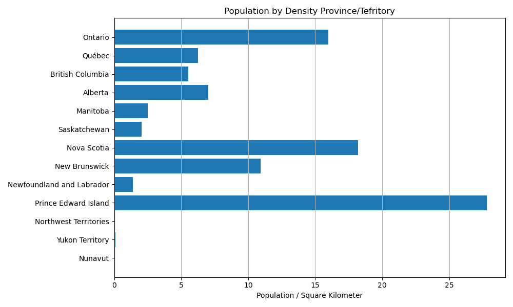

---
output:
  pdf_document: default
  html_document: default
---
# Types of Data {#types-of-data}
^^ Can we change the chapter name?  I think something like **Spatial Data Models & Data Types** would be more appropriate

**Types of Data** Within the context of a Geographic Information System, each piece of information pertaining to an phenomena can be referred to as an **Attribute**.  An phenomena can have many different attributes associated with it, but each attribute can broadly be said to address one of three questions: **What**, **When**, or **Where**?  Attributes that describe *where* are known as **Spatial Data** while all other attributes are **Non-Spatial Data**.  

In the previous chapter, we discussed some of the unique challenges associated with representing spatial data in a GIS, and how to account for these these with geographic coordinates systems and map projections.  In this chapter we will discuss more broadly how to represent both spatial and non-spatial data in a Geographic Information System.  We will introduce the different types of data that can represent non-spatial attributes and discuss the different scales this data can be measured on.  Then we will introduce the different models we use to link the spatial and non-spatial data.  Finally, we will cover some of the different file types that can be used to store data.

:::: {.box-content .learning-objectives-content}

::: {.box-title .learning-objectives-top}
#### Learning Objectives {-}
::: 

1. Data types and measurement scales
2. Introduce spatial data models
3. File types we use in GIS

::::

### Key Terms {-}

Attribute, Qualitative, Quantitative, Discrete, Continuous, Vector, Raster, Measurement Scale


## Types of Data

All data, spatial and non-spatial, can broadly be classified as either **qualitative** or **quantitative**.  These data types fundamentally different and are therefore measured on fundamentally different scales. The types of analysis we can conduct with qualitative data are more limited than quantitative data, but that does not necessarily mean quantitative data are “better” than qualitative.

{.center}

{.center}


### Qualitative Data

Qualitative data are categorical; they are strictly descriptive and lack any meaningful numeric value.  They describe the qualities of an phenomena, without giving us any numeric information.  Most qualitative data you will work with in a GIS are textual or coded numerals, but there are circumstances where you may encounter non-textual data (e.g. images, sound clips, videos) in a dataset.  Qualitative data can be "spatial" in nature (e.g. relative directional descriptors: left/right, near/far, north/south), but because they lack numeric values, they cannot be used for spatial analysis.  Qualitative data can be measured on either a **Nominal** or **Ordinal** scale.

**Nominal** data that just consists of names or categories with no ranking or direction are nominal.  One category is not more or less, better or worse than another, they are just different.  A good example would be flower types (see fig).  Other examples would be zoning categories, colors, flavors of ice cream, place names, etc.  

{.center}

**Oridnal** data are categories that also have a some ranking or directionality.  A good example would be relative sizes (see fig).  Some other good examples of ordinal data include spice levels (mild, medium, hot), residential zoning density (low, medium, high), and survey responses.  

{.center}

The only arithmetic operations we can do with nominal data are checking for equality (True/False), counting occurrences (frequencies), and calculating the mode (most frequent occurrence).  With ordinal data, we can these operations as well, plus a few more.  We can check the order/rank (greater than, less than) and in some circumstances we can calculate the median (see figure).

{.center}
 
![In some circumstances, we can directly calculate the median (middle value) of an ordinal set.  With odd numbered sets (e.g. Group 1), the median, is simply the middle value of the set, when sorted lowest to highest.  We can always take the median when we have an odd number.  With even numbered sets, its a bit more complicated.  The median, is the average of the middle two values.  For Group 2, the middle values (5th and 6th) are both "Neutral", so we don't have an issue.  But for Group 3, the 5th value is "Neutral" and the 6th value is "Agree".  We can't directly average these two ordinal values.  One solution is to arbitrarily assign a numeric score to the ordinal categories (e.g. 1-5).  This would then allow you to show the median is between "Neutral" and "Agree"](images/03-ordinal-operatons.png){.center}

### Quantitative Data

Quantitative data are numeric; they describe the quantities associated with an phenomena.  The numerical values that are separated by a unit that has some inherent meaning (as opposed to the arbitrary numeric codes like in the ordinal data example).  This allows us to conduct a wider range of arithmetic operations on quantitative data.  In addition to the operations we perform on Qualitative data; with numeric data we can always calculate measures of central tendency (mean/median) and we can add/subtract values to calculate differences.  

Numeric data can be either **discrete** or **continuous**.  Discrete variables (e.g. population) are obtained by counting and values within a range cannot be infinitely subdivided.  You can have a population of 1, 37, or 179 but you cannot have a population of 2.3.  Continuous variables (e.g. temperature) can take an infinite number of values a given range, but they cannot be counted.  You can have temperatures of 10, 10.5, or 10.1167 &deg;C, but a temperature of 10&deg;C does not mean you have 10 individual degrees of temperature.

Quantitative data (both discrete and continuous) can be measured on either an **Interval** or **Ratio** scale.  These types of quantitative data are closely related, but have one important distinction.  **Ratio** data have fixed, meaningful, absolute zero points.  The absolute zero point means ratio data cannot take negative values.  It also means that we can multiply/divide two values to calculate a meaningful ratio between them (hence the name).  A good example of ratio data are population total (see figure).  Other examples of ratio data include: temperature (in Kelvin), precipitation, height, income, rental cost.  **Interval** data on the other hand, have arbitrary zero points, meaning they can can take negative values.  Because the zero point is arbitrary, we cannot multiply/divide two values or calculate meaningful ratios between two values.  A good example of interval data is temperature measured in Celsius, and comparing it to Kelvin highlights the difference between the two data types (see fig).  Other examples of interval data include: the pH scale, IQ test scores, dates, and times.  

{.center}

![Celsius and Kelvin are measurements of temperature, and the conversion between the two is very simple: &deg;C = &deg;K-273.15.  Celsius' zero point is arbitrarily fixed to the freezing point of water, 273.15 degrees above absolute zero.  The ratio between two temperatures in Celsius is not meaningful, 20&deg;C is not "twice" as warm as 10&deg;C.  Kelvin's zero point is fixed to absolute zero, the "absence" of temperature.  So we can calculate the ratio, 293.15&deg;K is 1.035 times warmer than 283.15&deg;K.](images/03-interval-ratio-temperature.png){.center}


{.center}

### Other Measurement Scales

I'll elaborate on this more later.

- Derived Ratio - 'Data Normalization' - Dividing one value by another to get the ratio of the two

{.center}


- Log scale - Changing the base value of the data to a logarithmic scale can make it easier to work with data that varies by many orders of magnitude.

{.center}

- Graded membership - When one category doesn't fit ...


## Spatial is Special

You might encounter the phrase "Spatial is special" in your time studying GIS.  Spatial data is the foundation of Geographic Information Science, it is what distinguishes GIS from the broader field of data science.  One of the unique qualities of spatial data was succinctly summarized by Waldo Tobler as the First Law of Geography: *"Everything is related to everything else, but near things are more related than distant things."*  This might seem obvious, of course this is true!  People in the same neighborhood are more likely to interact than those living on different continents.  Red Cedars on Vancouver Island are more related to each other than they are Black Spruce in the Mackenzie River Valley.  But there is some nuance to the statement.  Near things are more related to one another, but it does not guarantee similarity.  Downtown Vancouver averages about 40 cm of snow per year, but the summit of Grouse Mountain 15 km to the north, receives over 9 meters of snow in a typical year.  Being so close together, these locations are impacted by the same storm systems, but the 1200 m elevation difference causes the same storms to produce vastly different quantities and different types of precipitation.  The measure of similarity between objects across space called spatial **autocorrelation**.  Spatial autocorrelation is both a curse and a blessing in the geospatial sciences.  We can exploit this unique property to our advantage to make spatial inferences, but it also violates the assumptions of many statistical tests.  **Note - Will the concept of autocorrelation be covered in more detail further along in the book?  I think its important to introduce early on, but not sure if giving more than a cursory reference here is necessary?**

![Visualization of Tobler's First Law. [8]](images/03-spatial-is-special.jpg){.center}

## Spatial Data Models

As discussed in the previous chapter, spatial data is three-dimensional, though we usually project it into two-dimensions for simplicity.  Because of the unique transformations that must be applied to spatial data, it must be treated and represented differently than the non-spatial data that describe *what* is happening and *when*.  We can't simply put all of our data into a spreadsheet and start analyzing it.  We have to use **Spatial Data Models** to organize our data and link our spatial and non-spatial data.  Spatial data models store geographic data in a systematic way so that we can effectively display, query, edit, and analyze our data within a GIS.  

There are two main types of spatial data models: the **Raster** and **Vector** models.  The raster data model represents spatial data as grid of cells, and each has a non-spatial attributes associated with it.  The vector data model represents spatial data as either points, lines, or polygons that are each linked to non-spatial attributes.  These two models represent the world in fundamentally different ways.  One is not inherently better than the other, but they are better suited for different circumstances.  The choice of which model to use is often dictated by three main factors:

1) The  type of phenomena we are trying to represent.
2) The scale at which we plan to analyze our data.
3) How we plan to use the data.

Before we dive deeper into an explanation of what the raster and vector models are, lets first talk a bit about the different types of phenomena we encounter and the types of analysis we want to conduct.


![Representing space in the raster model vs. the vector model [8]](images/03-vector-v-raster.jpg){.center}

### Types of Phenomena

^^ Move to top

There are two kinds of phenomena we observe in the real world and represent in a GIS **Discrete Objects** and **Continuous Fields**.  Discrete objects have distinct, well-defined boundaries meaning their geography can be exactly measured (e.g. a building, a street, a tree).  They are also countable, meaning there are a finite number of them.  Continuous fields lack clearly-defined boundaries and can be measured at an infinite number of points (e.g. elevation, precipitation, land cover).  The values of a continuous field can vary dramatically over short distances.  The vector data model is typically better suited for discrete objects and the raster data model is better for continuous fields.  However, either model *can* be used to represent either type of phenomena, and there are some circumstances where one model may be preferable over the other because of the task at hand rather than the type of phenomena.  *Note* Discrete objects can continuous fields can both be described with quantitative or qualitative data depending on the context.

{.center}


## Raster Data Model

Raster data is any pixelated (or gridded) data where each pixel (or cell) is associated with a specific geographical location. The value of a pixel can be quantitative (e.g. elevation) or qualitative (e.g. land use). If this sounds familiar, it is because this data structure is very common: it’s how we represent any digital image. A geospatial raster is only different from a digital photo in that it is accompanied by spatial information that connects the data to a particular location. This includes the raster’s extent and cell size, the number of rows and columns, and its coordinate reference system (or CRS). (Adapted from [4])

In GIS, rasters are most commonly encountered as: satellite imagery, drone imagery, elevation models, and scanned maps.  Raster data is very well suited for representing continuous fields, where the phenomenon varies across space and cell values correspond to measured (or estimated) value at specific location.  It can also be used to represent discrete objects.  Also called thematic rasters
Data classes represented with different integer values

In a raster layer, each pixel/cell can only have a single value associated with it.  Multiple bands can be combined to store or more information, as is done with a RGB color photograph.  Algebraic expressions can also be performed quickly and efficiently with raster layers a inputs.  This is known as raster overlay, and is one of the key advantages to raster data.  If layer A = Average July Temperature and layer B = Average January Temperature, then A – B will give us the Average Temperature Range across the rasters domain.

{.center}

{.center}

## Vector data

Vectors data represents spatial entities as points, lines, and/or polygons.  Attributes (What/When) are stored in a separate database table and linked using a unique identifier, sometimes refereed to as an Index or object ID.  The index is unique to each entity (eg. there can only be one shape with an index value of 34, and only one row in the attribute table with a corresponding index value of 34).  
 
{.center}
 

{.center}


<iframe width=100% height=800px src='images/03-vector-reolution.html' frameBorder="0" >
  <p>Your browser does not support iframes</p>
</iframe>

### Points
Points are “zero-dimensional”:
They don’t have length, width, or height in the system
Points have an (𝒙,𝒚) coordinate pair describing their location

{.center}

### Lines
Lines are one-dimensional:
They have length, but no width or height
Lines have at least two points, a beginning point and an end point
Lines may also have any number of middle points, called vertices

{.center}

### Polygons
Polygons are two-dimensional:
They may have length and width
Polygons have at least three points
The beginning and end points must be the same 
Polygons have straight or curved line segments, sometimes called “edges”

{.center}

### Tabular Data (Attributes)
Information about a point, line, or area
Only one data type per column
Data type limits what kind and how much information 
Text
Numeric: Float/Double, Long/Short Integer
Object 
One entry per cell
Rows are distinct
Null values possible


<!-- - Map of Census Tracts in Toronto showing lots of attributes? -->
{.center}


## Triangulated Irregular Networks
How important is it to mention these?  I've never used a TIN for anything except in making surfaces from drone imagery.  I can definitional mention them, but how much focus to the really deserve?

#### Case Study {-}
:::

#### Police Involved Deaths in Canada {#box-text -}

<p id="box-text">I'll flush this out in more depth later when I can dedicate some time to working on the actual project.Here is a <a href="https://github.com/PoliceInvolvedDeathsInCanada">link</a> to the github org where I'll be hosting the data.</p>

<p id="box-text">Data types used:
1) Nominal (Race)
2) Ratio (Counts & PKR)
3) Ordinal (Ranking)
4) Interval (PKDI)

Methods Discussed:
1) Normalization
2) Classification
</p>

{.center}


<iframe width=100% height=800px src='images/03-PoliceViolenceIncidents_BC.html' frameBorder="0" >
  <p>Your browser does not support iframes</p>
</iframe>


::::

VV This might be better at the top?
## How is Data Represented in a Computer

Before we talk about the different types of data, lets briefly discuss how information is represented inside a computer, the

### Bits & Bytes

Bits are singular pieces of information, representing 1's and 0's.  A circut is either on or off.  The next step up from that, is the byte.  "The byte is a unit of digital information that most commonly consists of eight bits. Historically, the byte was the number of bits used to encode a single character of text in a computer and for this reason it is the smallest addressable unit of memory in many computer architectures." - copy pasta from Wikipedia

### Types of Numbers

Integer vs. Floating-point (Discreet vs. Continuous)

### Other types of information

Text, Boolean, Dates


## Common file types

In GIS we work with many different types of files.

### Shapefile (.shp)

--From [4] -- Will adapt/adjust later

Like raster data, vector data can also come in many different formats. For this workshop, we will use the Shapefile format which has the extension .shp. A .shp file stores the geographic coordinates of each vertice in the vector, as well as metadata including:

    Extent - the spatial extent of the shapefile (i.e. geographic area that the shapefile covers). The spatial extent for a shapefile represents the combined extent for all spatial objects in the shapefile.
    Object type - whether the shapefile includes points, lines, or polygons.
    Coordinate reference system (CRS)
    Other attributes - for example, a line shapefile that contains the locations of streams, might contain the name of each stream.

Because the structure of points, lines, and polygons are different, each individual shapefile can only contain one vector type (all points, all lines or all polygons). You will not find a mixture of point, line and polygon objects in a single shapefile.


### Geodatabase (.gdb)

This isn't really a file type?  Might this go better in chapter 5?

### LAS (.las)

### Comma Separated Values (.csv)

Comma separated values are a common human readable file format that is suitable for storing attribute data.  It can also be used to efficiently store spatial data in point format.   

### GPS data (.gpx)


### Keyhole Markup Language (.kml)


### ASCII images (.asc)


### ENVI-format images (.dat)


### GeoTiff images (.tif)

--From [4] -- Will adapt/adjust later

Raster data can come in many different formats. For this workshop, we will use the GeoTIFF format which has the extension .tif. A .tif file stores metadata or attributes about the file as embedded tif tags. For instance, your camera might store a tag that describes the make and model of the camera or the date the photo was taken when it saves a .tif. A GeoTIFF is a standard .tif image format with additional spatial (georeferencing) information embedded in the file as tags. These tags should include the following raster metadata:

    Extent
    Resolution
    Coordinate Reference System (CRS) - we will introduce this concept in a later episode
    Values that represent missing data (NoDataValue) - we will introduce this concept in a later lesson.

We will discuss these attributes in more detail in a later lesson. In that lesson, we will also learn how to use R to extract raster attributes from a GeoTIFF file.


:::: {.box-content .your-turn-content}

::: {.box-title .your-turn-top}
#### Your turn! {-}
:::

<p id="box-text">I'll do some exercise building on the case study.</p>

::::

Lorem ipsum dolor sit amet, consectetur adipiscing elit. Ut in dolor nibh. Lorem ipsum dolor sit amet, consectetur adipiscing elit. Praesent et augue scelerisque, consectetur lorem eu, auctor lacus. Fusce metus leo, aliquet at velit eu, aliquam vehicula lacus. Donec libero mauris, pharetra sed tristique eu, gravida ac ex. Phasellus quis lectus lacus. Vivamus gravida eu nibh ac malesuada. Integer in libero pellentesque, tincidunt urna sed, feugiat risus. Sed at viverra magna. Sed sed neque sed purus malesuada auctor quis quis massa.

:::: {.box-content .call-out-content}

::: {.box-title .call-out-top}
#### Call out {-}
:::

<p id="box-text">
This is a call out. Put some important concept or fact in here.
</p>

::::

## Summary

Lorem ipsum dolor sit amet, consectetur adipiscing elit. Ut in dolor nibh. Lorem ipsum dolor sit amet, consectetur adipiscing elit. Praesent et augue scelerisque, consectetur lorem eu, auctor lacus. Fusce metus leo, aliquet at velit eu, aliquam vehicula lacus. Donec libero mauris, pharetra sed tristique eu, gravida ac ex. Phasellus quis lectus lacus. Vivamus gravida eu nibh ac malesuada. Integer in libero pellentesque, tincidunt urna sed, feugiat risus. Sed at viverra magna. Sed sed neque sed purus malesuada auctor quis quis massa.

### Reflection Questions {-}

1. Explain ipsum lorem.
2. Define ipsum lorem.
3. What is the role of ispum lorem?
4. How does ipsum lorem work?

### Practice Questions {-}

2. Given ipsum, solve for lorem.
3. Draw ipsum lorem.

`r if (knitr::is_html_output()) '
## Recommended Readings {-}
'`

Ensure all inline citations are properly referenced here.

```{r include=FALSE}
knitr::write_bib(c(
  .packages(), 'bookdown', 'knitr', 'rmarkdown', 'htmlwidgets', 'webshot', 'DT',
  'miniUI', 'tufte', 'servr', 'citr', 'rticles'
), 'packages.bib')
```
