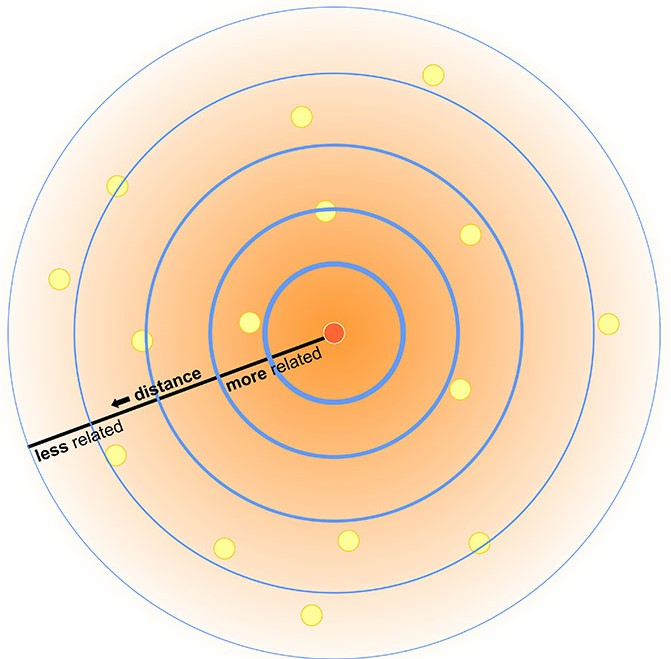
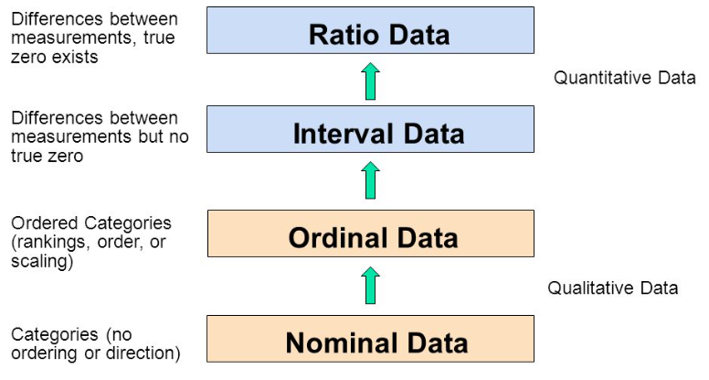
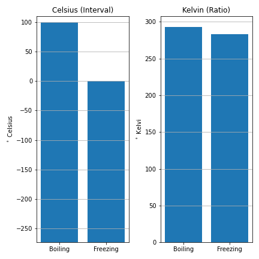

---
output:
  pdf_document: default
  html_document: default
---
# Types of Data {#types-of-data}
^^ Can we change the chapter name?  I think something like **Spatial Data Models & Data Types** would be more appropriate


**Data Types** Within the context of a Geographic Information System, each piece of information pertaining to an entity can be referred to as an **Attribute**.  An entity can have many different attributes associated with it, but each attribute can broadly be said to address one of three questions: What, When, or Where?  A collection of attributes representing a set of entities are known as a **Dataset**.  The attributes that describe *where* the entities occurs are known as **Spatial Data** while all other attributes are **Non-Spatial Data**.  

In the previous chapter, we discussed some of the unique challenges associated with representing spatial data in a GIS, and how to account for these these with geographic coordinates systems and map projections.  In this chapter we will discuss more broadly how to represent both spatial and non-spatial data in a Geographic Information System.  We will introduce the different types of data that can represent non-spatial attributes and discuss the different scales this data can be measured on.  Then we will introduce the different models we use to link the spatial and non-spatial data.  Finally, we will cover some of the different file types that can be used to store data.

:::: {.box-content .learning-objectives-content}

::: {.box-title .learning-objectives-top}
#### Learning Objectives {-}
::: 

1. Learn about spatial data models and how they work
2. Learn about the various scales we use to measure data
3. Learn about the different file types we use in GIS

::::

### Key Terms {-}

Attribute, Qualitative, Quantitative, Vector, Raster, Measurement Scale

## Spatial Data

You might encounter the phrase "Spatial is special" in your time studying GIS.  Spatial data is the foundation of Geographic Information Science, it is what distinguishes GIS from the broader field of data science.  One of the unique qualities of spatial data was succinctly summarized by Waldo Tobler as the First Law of Geography: *"Everything is related to everything else, but near things are more related than distant things."*  This might seem obvious, of course this is true!  People in the same neighborhood are more likely to interact than those living on different continents.  Red Cedars on Vancouver Island are more related to each other than they are Black Spruce in the Mackenzie River Valley.  But there is some nuance to the statement.  Near things are more related to one another, but it does not guarantee similarity.  Downtown Vancouver averages about 40 cm of snow per year, but the summit of Grouse Mountain 15 km to the north, receives over 9 meters of snow in a typical year.  Being so close together, these locations are impacted by the same storm systems, but the 1200 m elevation difference causes the same storms to produce vastly different quantities and different types of precipitation.  The measure of similarity between objects across space called spatial **autocorrelation**.  Spatial autocorrelation is both a curse and a blessing in the geospatial sciences.  We can exploit this unique property to our advantage to make spatial inferences, but it also violates the assumptions of many statistical tests.  **Note - Will the concept of autocorrelation be covered in more detail further along in the book?  I think its important to introduce early on, but not sure if giving more than a cursory reference here is necessary?**

{.center}

As discussed in the previous chapter, spatial data is three-dimensional, though we usually project it into two-dimensions for simplicity.  Because of the unique transformations that must be applied to spatial data, it must be treated and represented differently than the non-spatial data that describe *what* is happening and *when*.  We can't simply put all of our data into a spreadsheet and start analyzing it.  We have to use **Spatial Data Models** to organize our spatial and non-spatial data into a format that can be interpreted by a GIS.  There are two main types of spatial data models: the **Raster** and **Vector** models.  These two models represent the world in fundamentally different ways, and the choice of which model to use is often dictated by the specific data we are working with and the task at hand.  Before we dive into an explanation of the raster and vector models, lets first talk a bit about the different types of phenomena we encounter and the types of data we can use to describe them.

### Types of Phenomena

**Discrete Objects**: have distinct, well-defined boundaries, are countable (ie. there are a finite number of them), and their boundaries can be exactly measured (e.g. a building).

**Continuous Fields**: lack clearly-defined boundaries, can be measured at an infinite number of points, and values can vary dramatically over short distances.

## Types of Data

All data can broadly be classified as either **qualitative** or **quantitative**.  Data that are strictly descriptive and lack any numeric quantity are qualitative and data with numerical values that are separated by some meaningful interval are quantitative.  The types of analysis we can conduct with qualitative data are more limited than quantitative data, but that does not necessarily mean quantitative data are "better" than qualitative.


**Discrete Data** data can only take a limited set of values (e.g. land cover types, zoning classes)
**Continuous Data**: measurements can take any value within some range (e.g. temperature)

*This isn't a fully comprehensive framework for understanding data types (Chrisman, Nicholas R. "Rethinking Levels of Measurement for Cartography", Vol. 25, pg. 231-242, 1998). but I think it's sufficient for an intro level GIS text?  I think going into log scales, derived ratios, graded membership etc. might just overly complicate things.  There really isnt much literature out them within the context of GIS anyway.  I've elected to keep it simple, but I can add more if y'all think its necessary*

## Qualitative Data

Qualitative data describes the qualities of an entity, without giving us any numeric information about that entity.  Most qualitative data you will work with in a GIS are textual, but there are circumstances where you may encounter non-textual data (e.g. images) in a dataset.  There are two key categories we can consider when trying to understand Qualitative Data: Nominal and Ordinal Data.


## Quantitative Data

Qualitative data describes the quantities associated with an entity.  Qualitative data are numeric and the difference between data points has inherent meaning (as opposed to the arbitrary numbers assigned in the ordinal data example).  This allows us to conduct a wider range of arithmetic operations on quantitative data.  There are two key categories we can consider when trying to understand quantitative data: Interval and Ratio Data.

## Measurement Scales

{.center}

{.center}


### Ratio

Quantitative data on a fixed scale with an absolute zero point is known as ratio data.  This is the most flexible type of data, allowing us to do any kind of arithmetic operation.  Because of the fixed and meaningful zero point, we can multiply/divide data points to calculate meaningful ratios (hence the name) describing the relationship between those data points.  Multiplication/division of two data values are not meaningful when performed on other types of data.  Additionally, we can: add/subtract values, calculate measures of central tendency (mean & median), rank/order the data, count frequencies, and check for equality.

A good example of ratio data are population total (see figure).  Population counts start at zero and go up from there.  A population of zero means there are no residents, and its impossible to have a negative population.  Because of these properties, we can calculate ratios between populations: Manitoba's population is 1/10th that of Ontario, British Columbia has 129 times as many people as Nunavut.  Other examples of ratio data include: temperature (in Kelvin), precipitation, height, income, rental cost.

{.center}

### Interval

Quantitative data on a fixed scale but with an arbitrary zero point is known as interval data.  A good example of this type of data is temperature in degrees Celsius (see fig).  Other examples include the pH scale, IQ test scores, dates, and times (Dates and Times are a special type of data discussed in a bit more detail below).  The defining quality of Interval data is that the zero point is arbitrary, i.e. it lacks definitive meaning.  This limits some of the operations we can do with interval data.

{.center}


### Nominal

Qualitative data that just consists of names or categories with no ranking or direction are known as nominal data.  One category is not more or less, better or worse than another, they are just different.  A good example would be flower types (see fig).  Other examples would be zoning categories, colors, flavors of ice cream, place names, etc.  The only arithmetic operations we can do with nominal data are checking for equality (True/False), counting occurrences (frequencies), and calculating the mode (most frequent occurrence).


{.center}

{.center}


### Ordinal

Qualitative data that have some sort of ranking or directionality, but no associated or meaningful numerical scale are known as Ordinal.  A good example would be relative sizes (see fig).  Some other good examples of ordinal data include spice levels (mild, medium, hot), residential zoning density (low, medium, high), and survey responses.  With ordinal data, we can do all the operations we can do with nominal data, plus a few more.  We can check the order/rank (greater than, less than) and in some circumstances we can calculate the median (see figure).


{.center}

![In some circumstances, we can directly calculate the median (middle value) of an ordinal set.  With odd numbered sets (e.g. Group 1), the median, is simply the middle value of the set, when sorted lowest to highest.  We can always take the median when we have an odd number.  With even numbered sets, its a bit more complicated.  The median, is the average of the middle two values.  For Group 2, the middle values (5th and 6th) are both "Neutral", so we don't have an issue.  But for Group 3, the 5th value is "Neutral" and the 6th value is "Agree".  We can't directly average these two ordinal values.  One solution is to arbitrarily assign a numeric score to the ordinal categories (e.g. 1-5).  This would then allow you to show the median is between "Neutral" and "Agree"](images/03-ordinal-operatons.png){.center}


### Temporal

Temporal data is a special type of numeric data because it is formatted in a unique way.

## Spatial data models

Spatial data models what we use to link spatial and non-spatial data.  Spatial data models allow us to organize and store geographic data in a systematic way so that we can effectively display, query, and edit our data within a GIS.  There are two primary types of data models that we rely on in GIS: Vector and Raster.   

### Vector data

Vectors data represents spatial entities as points, lines, and/or polygons.  Attributes (What/When) are stored in a separate database table and linked using a unique identifier, sometimes refereed to as an Index or object ID.  The index is unique to each entity (eg. there can only be one shape with an index value of 34, and only one row in the attribute table with a corresponding index value of 34).  
 

{.center}
 

#### Points
Points are “zero-dimensional”:
They don’t have length, width, or height in the system
Points have an (𝒙,𝒚) coordinate pair describing their location

{.center}


#### Lines
Lines are one-dimensional:
They have length, but no width or height
Lines have at least two points, a beginning point and an end point
Lines may also have any number of middle points, called vertices


{.center}


#### Polygons
Polygons are two-dimensional:
They may have length and width
Polygons have at least three points
The beginning and end points must be the same 
Polygons have straight or curved line segments, sometimes called “edges”


{.center}


#### Tabular Data (Attributes)
Information about a point, line, or area
Only one data type per column
Data type limits what kind and how much information 
Text
Numeric: Float/Double, Long/Short Integer
Object 
One entry per cell
Rows are distinct
Null values possible


- Map of Census Tracts in Toronto showing lots of attributes?
<!-- {.center} -->

### Raster data
Space represented with a grid of equally sized pixels/grid cells.
A single value is assigned to each cell
In GIS, rasters are most commonly encountered as:
Satellite imagery
Drone imagery
Elevation models
Bathymetric models
Scanned maps

Numeric data value assigned to each grid cell at each location, corresponding to the entity being modelled. 
Typically used to represent surfaces, since every grid cell is assigned a data value.


Multiple layers can be combined
Each layer represents a different field
Raster Math:
Layers can be combined with expressions get new information
A = Average July Temperature
B = Average January Temperature
C = A – B
Average Temperature Range

{.center}

{.center}

#### Cell data
#### Digital numbers

### Triangulated Irregular Networks
Are these worth more than a passing mention?


#### Case Study {-}
:::

#### Police Involved Deaths in Canada {#box-text -}

<p id="box-text">I'll flush this out in more depth later when I can dedicate some time to working on the actual project.Here is a <a href="https://github.com/PoliceInvolvedDeathsInCanada">link</a> to the github org where I'll be hosting the data.</p>

<p id="box-text">Data types used:
1) Nominal (Race)
2) Ratio (Counts & PKR)
3) Ordinal (Ranking)
4) Interval (PKDI)

Methods Discussed:
1) Normalization
2) Classification
</p>

<iframe width=100% height=800px src='images/03-PoliceViolenceIncidents_BC.html' frameBorder="0" >
  <p>Your browser does not support iframes</p>
</iframe>

<p id="box-text">Case studies should have at least one image or map (no more than 2 total) and the written length should be around 300 words (shown above). Any references to external literature should by hyperlinked with the Digitial Object Identifier (DOI) permanent URL and [entered into the bibliography](https://bookdown.org/yihui/bookdown/citations.html){target="_blank"}. Avoid linking to external resources without a DOI and permanent URL. Contact Paul or try using the Leaflet package in R if you want to add an interactive web map.</p>

::::


## How is Data Represented in a Computer
Before we talk about the different types of data, lets briefly discuss how information is represented inside a computer, the

### Bits & Bytes
Bits are singluar pieces of information, representing 1's and 0's.  A circut is either on or off.  The next step up from that, is the byte.  "The byte is a unit of digital information that most commonly consists of eight bits. Historically, the byte was the number of bits used to encode a single character of text in a computer and for this reason it is the smallest addressable unit of memory in many computer architectures." - copy pasta from Wikipedia

### Types of Numbers
Integer vs. Floating-point  Discreet vs. Continuous

### Other types of information
Text, Boolean, Dates


## Common file types
### Shapefile (.shp)
### Geodatabase (.gdb)
This isn't really a file type?  Might this go better in chapter 5?

### LAS (.las)
### Comma Separated Values (.csv)
### GPS data (.gpx)
### Keyhole Markup Language (.kml)
### ASCII images (.asc)
### ENVI-format images (.dat)
### GeoTiff images (.tif)
:::: {.box-content .your-turn-content}

::: {.box-title .your-turn-top}
#### Your turn! {-}
:::

<p id="box-text">I'll do some exercise building on the case study.</p>

::::

Lorem ipsum dolor sit amet, consectetur adipiscing elit. Ut in dolor nibh. Lorem ipsum dolor sit amet, consectetur adipiscing elit. Praesent et augue scelerisque, consectetur lorem eu, auctor lacus. Fusce metus leo, aliquet at velit eu, aliquam vehicula lacus. Donec libero mauris, pharetra sed tristique eu, gravida ac ex. Phasellus quis lectus lacus. Vivamus gravida eu nibh ac malesuada. Integer in libero pellentesque, tincidunt urna sed, feugiat risus. Sed at viverra magna. Sed sed neque sed purus malesuada auctor quis quis massa.

:::: {.box-content .call-out-content}

::: {.box-title .call-out-top}
#### Call out {-}
:::

<p id="box-text">
This is a call out. Put some important concept or fact in here.
</p>

::::

## Summary

Lorem ipsum dolor sit amet, consectetur adipiscing elit. Ut in dolor nibh. Lorem ipsum dolor sit amet, consectetur adipiscing elit. Praesent et augue scelerisque, consectetur lorem eu, auctor lacus. Fusce metus leo, aliquet at velit eu, aliquam vehicula lacus. Donec libero mauris, pharetra sed tristique eu, gravida ac ex. Phasellus quis lectus lacus. Vivamus gravida eu nibh ac malesuada. Integer in libero pellentesque, tincidunt urna sed, feugiat risus. Sed at viverra magna. Sed sed neque sed purus malesuada auctor quis quis massa.

### Reflection Questions {-}

1. Explain ipsum lorem.
2. Define ipsum lorem.
3. What is the role of ispum lorem?
4. How does ipsum lorem work?

### Practice Questions {-}

2. Given ipsum, solve for lorem.
3. Draw ipsum lorem.

`r if (knitr::is_html_output()) '
## Recommended Readings {-}
'`

Ensure all inline citations are properly referenced here.

```{r include=FALSE}
knitr::write_bib(c(
  .packages(), 'bookdown', 'knitr', 'rmarkdown', 'htmlwidgets', 'webshot', 'DT',
  'miniUI', 'tufte', 'servr', 'citr', 'rticles'
), 'packages.bib')
```
