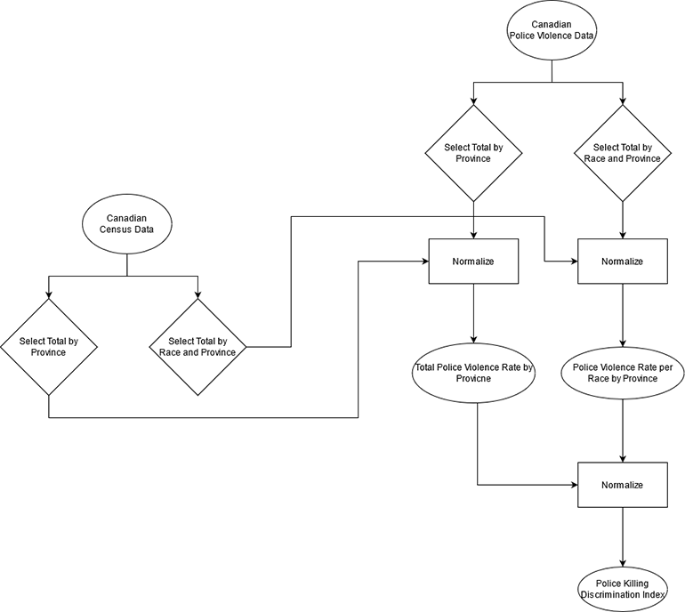

---
output:
  pdf_document: default
  html_document: default
---
# Types of Data {#types-of-data}
^^ Can we change the chapter name?  I think something like **Spatial Data Models & Data Types** would be more appropriate.

In the previous chapter, we discussed some of the unique challenges associated with representing spatial data in a GIS, and how to account for these these with geographic coordinates systems and map projections.  In this chapter we will discuss more broadly how to represent both spatial and non-spatial data in a Geographic Information System.  We will introduce the different types of data that can represent non-spatial attributes and discuss the different scales this data can be measured on.  Then we will introduce the different *spatial data models* we use to link the spatial and non-spatial data.  Finally, we will cover some of the different file types that can be used to store data.

:::: {.box-content .learning-objectives-content}

::: {.box-title .learning-objectives-top}
## Learning Objectives {-}
::: 

1. Data types and measurement scales
2. Introduce spatial data models
3. File types we use in GIS

::::

## Key Terms {-}

Attribute, Qualitative, Quantitative, Discrete, Continuous, Vector, Raster, Measurement Scale

## Types of Phenomena

There are two kinds of phenomena we observe in the real world and represent in a GIS **Discrete Objects** and **Continuous Fields**.  Discrete objects have distinct, well-defined boundaries meaning their geography can be exactly measured (e.g. a building, a street, a tree).  They are also countable, meaning there are a finite number of them.  Continuous fields lack clearly-defined boundaries and can be measured at an infinite number of points (e.g. elevation, precipitation, land cover).  The values of a continuous field can vary dramatically over short distances.  Both kinds of phenomena can be represented in a GIS, but they requrie different considerations and are usually use different data models.

<!--   The vector data model is typically better suited for discrete objects and the raster data model is better for continuous fields.  However, either model *can* be used to represent either type of phenomena, and there are some circumstances where one model may be preferable over the other because of the task at hand rather than the type of phenomena.  *Note* Discrete objects can continuous fields can both be described with quantitative or qualitative data depending on the context. -->

{.center}

## Types of Data

Within the context of a Geographic Information System, each piece of information pertaining to a phenomena can be referred to as an **Attribute**.  An phenomena can have many different attributes associated with it, but each attribute can broadly be said to address one of three questions: **What**, **When**, or **Where**?  Attributes that describe *where* are known as **Spatial Data** while all other attributes are **Non-Spatial Data**.  All data, spatial and non-spatial, can broadly be classified as either **qualitative** or **quantitative**.  These data types fundamentally different and are therefore measured on fundamentally different scales. The types of analysis we can conduct with qualitative data are more limited than quantitative data, but that does not necessarily mean quantitative data are “better” than qualitative.

{.center}

## Qualitative Data

Qualitative data are categorical; they are strictly descriptive and lack any meaningful numeric value.  They describe the qualities of an phenomena, without giving us any numeric information.  Most qualitative data you will work with in a GIS are textual or coded numerals, but there are circumstances where you may encounter non-textual data (e.g. images, sound clips, videos) in a dataset.  Qualitative data can be "spatial" in nature (e.g. relative directional descriptors: left/right, near/far, north/south), but because they lack numeric values, they cannot be used for spatial analysis.  Qualitative data can be measured on either a **Nominal** or **Ordinal** scale.

## Nominal Scale

These are data that just consists of names or categories with no ranking or direction are nominal.  One category is not more or less, better or worse than another, they are just different.  A good example would be flower types (see fig).  Other examples would be zoning categories, colors, flavors of ice cream, place names, etc.  

{.center}

{.center}


## Ordinal Scale

These data are categories that also have a some ranking or directionality.  A good example would be relative sizes (see fig).  Some other good examples of ordinal data include spice levels (mild, medium, hot), residential zoning density (low, medium, high), and survey responses.  

{.center}

The only arithmetic operations we can do with nominal data are checking for equality (True/False), counting occurrences (frequencies), and calculating the mode (most frequent occurrence).  With ordinal data, we can these operations as well, plus a few more.  We can check the order/rank (greater than, less than) and in some circumstances we can calculate the median (see figure).

![In some circumstances, we can directly calculate the median (middle value) of an ordinal set.  With odd numbered sets (e.g. Group 1), the median, is simply the middle value of the set, when sorted lowest to highest.  We can always take the median when we have an odd number.  With even numbered sets, its a bit more complicated.  The median, is the average of the middle two values.  For Group 2, the middle values (5th and 6th) are both "Neutral", so we don't have an issue.  But for Group 3, the 5th value is "Neutral" and the 6th value is "Agree".  We can't directly average these two ordinal values.  One solution is to arbitrarily assign a numeric score to the ordinal categories (e.g. 1-5).  This would then allow you to show the median is between "Neutral" and "Agree".](images/03-ordinal-operatons.png){.center}

## Graded Membership

When trying to group real world phenomena into categories, there are often "exceptions" that blur the lines a bit.  Take this example: you are trying to develop a land cover classification scheme for Garibaldi Provincial park in British Columbia.  Some of the land surface is unquestionably alpine tundra and some is certainly forest area.  However, the transition between forest and alpine meadow is not an abrupt line.  How/where do you draw the line?  Examples like this are known as fuzzy variables, and we often use a **Graded Membership** scale to assign them to categories.  With the landscape classification, a simple approach would be a "winner take all" approach.  If a plot is 5% bare rock, 40% forest, and 45% alpine meadow, the area will be classified as alpine meadow.  From that point forward, in the GIS, that area will be treated as alpine meadow, any information about the variability within the area will be lost.  In practice, many of the qualitative data we work with in GIS, especially those describing natural phenomena, are actually graded membership variables. 

{.center}

## Quantitative Data

Quantitative data are numeric; they describe the quantities associated with an phenomena.  The numerical values that are separated by a unit that has some inherent meaning (as opposed to the arbitrary numeric codes like in the ordinal data example).  This allows us to conduct a wider range of arithmetic operations on quantitative data.  In addition to the operations we perform on Qualitative data; with numeric data we can always calculate measures of central tendency (mean/median) and we can add/subtract values to calculate differences.  

Numeric data can be either **discrete** or **continuous**.  Discrete variables (e.g. population) are obtained by counting and values within a range cannot be infinitely subdivided.  You can have a population of 1, 37, or 179 but you cannot have a population of 2.3.  Continuous variables (e.g. temperature) can take an infinite number of values a given range, but they cannot be counted.  You can have temperatures of 10, 10.5, or 10.1167 &deg;C, but a temperature of 10&deg;C does not mean you have 10 individual degrees of temperature.  Quantitative data (both discrete and continuous) can be measured on either an **Interval** or **Ratio** scale.  These types of quantitative data are closely related, but have one important distinction.  

## Ratio Data

These data have fixed, meaningful, absolute zero points.  The absolute zero point means ratio data cannot take negative values.  It also means that we can multiply/divide two values to calculate a meaningful ratio between them (hence the name).  A good example of ratio data are population total (see figure).  Population counts start at zero and go up from there.  A population of zero means there are no residents, and its impossible to have a negative population.  Other examples of ratio data include: temperature (*in degrees Kelvin*), precipitation, tree height, income, rental cost, and units of time (years, seconds, etc.)  

{.center}

## Interval Data

These data on the other hand, have an arbitrarily set zero point.  This means they can can take negative values.  Because the zero point is arbitrary, we cannot multiply/divide two values or calculate meaningful ratios between two values.  A good example of interval data is temperature measured in Celsius, and comparing it to Kelvin highlights the difference between the two data types (see fig).  The conversion between Kelvin (ratio) and Celsius (interval) is very simple: &deg;C = &deg;K-273.15.  Zero Kelvin is "Absolute Zero" - ie. the lack of temperature, while zero Celsius is the freezing point of water (273.15 degrees above absolute zero).  Other examples of interval data include: the pH scale, IQ test scores, elevation (relative to a datum) dates (April 12th, 2011), and times (11:00 A.M.).

{.center}

## Derived Ratio: Normalizing Data

Sometimes we want to account for the influence of one variable when analyzing another.  To do this, we can divide one value by by another to get the ratio of the two, also known as a **derived ratio**.  This process is sometimes referred to as **Normalizing** or **Standardizing** our data.  The basic formula is: $C=\frac{A}{B}$, where A is our variable of interest, B is our confounding variable, and C is our new derived ratio.  There are many circumstances where we might need to do this.  One common example is population density (see figure).  Another key example is housing affordability.  

{.center}

## Summary of Data Types

{.center}


{.center}

## Spatial is Special

  *"Everything is related to everything else, but near things are more related than distant things."* -

You might encounter the phrase "Spatial is special" in your time studying GIS.  Spatial data is the foundation of Geographic Information Science, it is what distinguishes GIS from the broader field of data science.  This was succinctly summarized by Waldo Tobler in The First Law of Geography:
  - *"Everything is related to everything else, but near things are more related than distant things."* 

This might seem obvious: people interact more if they live in the same city, orca pods in different areas develop different dialects, A hemlock on Vancouver Island are more related to its neighbors than to a hemlock in the New Brunswick.  Generally, near things are more related to one another, but it **does not guarantee similarity**.  Downtown Vancouver averages 40 cm of snow/year, but the ski resort on Grouse Mountain 15 km north gets over 9 m.  These locations are impacted by the same storm systems, but the 1200 m elevation difference causes vastly different quantities and different types of precipitation.

The measure of similarity between objects across space called **spatial autocorrelation**.  Spatial autocorrelation allows us to make some a key assumptions when representing spatial data.  We don't have to measure a phenomena everywhere in order to represent it adequately.  We only need to measure it at specific locations or over regular intervals.  If point A is in dense forest, it is likely point B 10 m away is also in a dense forest.  We don't have to get the location of every tree in the forest.  Instead, we can look at the average presence of trees over a larger area.  

![Visualization of Tobler's First Law. [8]](images/03-spatial-is-special.jpg){.center}

## Spatial Data Models

As discussed in the previous chapter, spatial data is three-dimensional, though we usually project it into two-dimensions for simplicity.  Because of the unique transformations that must be applied to spatial data, it must be treated and represented differently than the non-spatial data that describe **what** is happening and **when**.  We can't simply put all of our data into a spreadsheet and start analyzing it.  We have to use **Spatial Data Models** to organize our data and link our spatial and non-spatial data.  Spatial data models store geographic data in a systematic way so that we can effectively display, query, edit, and analyze our data within a GIS.

There are two main types of spatial data models: the **Raster** and **Vector** models.  The raster data model represents spatial data as grid of cells, and each cell has one non-spatial attribute associated with it.  The vector data model represents spatial data as either points, lines, or polygons that are each linked to one or more non-spatial attributes.  These two models represent the world in fundamentally different ways.  One is not inherently better than the other, but they are better suited for different circumstances.  The choice of which model to use is often dictated by three main factors:

1) The  type of phenomena we are trying to represent.
2) The scale at which we plan to analyze our data.
3) How we plan to use the data.


![Representing space in the raster model vs. the vector model [8]](images/03-vector-v-raster.jpg){.center}


## Raster Data Model

The raster data model represents a phenomena across space as a gridded set of cell (or pixels).  The cell size determines the **Resolution** of the raster image, that is the smallest feature we can resolve with the raster.  A 10 m resolution raster has cells that are 10 x 10 m (100 m2), a 2 m resolution has cells that are 2 x 2 m (4 m2).  Along with the cell size, the number of rows and columns dictates the bounds (or extent) of a raster image.  A raster with a 2 m cell size, 15 rows, and 10 columns, will cover an area of 30 m x 20 m (600 m2).  Because of the full coverage within their bounds, raster data models are very well suited for representing **continuous phenomena** where cell values correspond to measured (or estimated) value at specific location.  In GIS, rasters are commonly encountered as: satellite and drone imagery, elevation models, climate data, model outputs, and scanned maps.  

![I think this one is pretty good, I use it in my lecture notes. [8]](images/03-raster-example.png){.center}

The value of a pixel can be quantitative (e.g. elevation) or qualitative (e.g. land use).  Each pixel/cell can only have a single value associated with it.  Multiple bands can be combined to store or more information, as is done with a RGB color photograph.  Algebraic expressions can also be performed quickly and efficiently with raster layers a inputs.  This is known as raster overlay, and is one of the key advantages to raster data.  If layer A = Average July Temperature and layer B = Average January Temperature, then A – B will give us the Average Temperature Range across the rasters domain.

{.center}

Rasters data relies on Spatial Autocorrelation and The First Law of Geography, the model assumes that *all areas* within a given cell are equally represented by the cell value.  Depending on the resolution of the raster and the scale of the task at hand, this may or may not be an effective assumption.  If you are trying to represent the coastline of Nova Scotia, 100 m or even 1 km resolution cells will likely suffice (see figure).  However, 10 km cells severely degrade the quality of the representation.  At a 100 km cell size, the province is indistinguishable.

{.center}

## File Types

Raster data can come in many different formats.  One of the most common/functional is the GeoTIFF format which has the extension .tif. A .tif file stores metadata or attributes about the file as embedded tif tags. For instance, your camera might store a tag that describes the make and model of the camera or the date the photo was taken when it saves a .tif. A GeoTIFF is a standard .tif image format with additional spatial (georeferencing) information embedded in the file as tags. These tags should include the following raster metadata:
* Extent
* Resolution
* Coordinate Reference System (CRS) - we will introduce this concept in a later episode
* Values that represent missing data (NoDataValue) - we will introduce this concept in a later lesson.

^ Adapted from [4]

Other file types you will likely encounter include:
* 1) IMG - A proprietary image format commonly used by ESRI products
* 2) JPEG2000 - A geospatial version of the common .jpg image type
* 3) ASCII - An older human readable format (simple text file) with slower performance than the types listed above.

## Vector Data

The vector data model is much more well suited to represent discrete phenomena than the raster data model.  A vector feature is a representation of a discrete object as a set of x,y coordinate pairs (points) linked to set of descriptive attribute about that object.  A vector feature's coordinates can consist of just one x,y pair to form a single point feature, or multiple points which can be connected to form lines or polygons (see figure).  The non-spatial attribute data is typically stored in a **Tabular** format separate from the spatial data, and it is linked using an index.  One of the key advantages of the vector model is the ability to store and retrieve many attributes them quickly.

**Points** are “zero-dimensional”, they have no length, or width.  A point feature is just an individual 𝒙,𝒚 coordinate pair representing a precise location, that has some linked attribute information.  Points are great for representing a variety of objects, depending on the scale.  Fire hydrants, light poles, and trees are suitable to be represented as points in almost any application.  If you are making a map of mines in British Columbia, or cities across Canada, it's probably acceptable to just display them as points.

**Lines** are one-dimensional, they have length, but no width and thus no area.  A line consists of two or more points.  Every line must have start point and an end point, but they may also have any number of middle points, called vertices.  A vertex is just any point where two or more lines meet.  Lines are also great for representing a variety of objects, depending on the scale.  Hiking trails, flight paths, coastlines, and power lines are suitable to be represented as lines in almost most applications.  When making smaller scale maps, its often sufficient to represent rivers as lines, though at large scales we might elect to use a polygon.  

**Polygons** are two-dimensional, they have both a length and width and therefore we can also calculate their area.  All polygons consist of a set of at three or more points (vertices) connected by line segments called “edges” that connect to form an enclosed shape.  All polygons form an enclosed shape, but some can also have"holes" (think doughnuts!), these holes are sometimes called interior rings.  Each interior ring is a separate set vertices and edges that is wholly contained within the polygon and no two interior rings can overlap.  Polygons are useful for representing many different objects depending: political boundaries boundaries, Köppen climate zones, lakes, continents, etc.  At large scales they can represent things like buildings which we might choose to represent as points at smaller scales.

{.center}

Sometimes, a discrete object has multiple parts, that are spatially separated.  In these circumstances, the vector model allows for multi-polygon, multi-line, or multi-point objects.  A good example of when a multi-polygon would be useful is the StatsCanada provincial boundary file (see figure).  Roads sometimes need to be stored as multi-lines as well, for example Highway 1 crosses the Georgia Straight from Vancouver to Nanaimo.  If we want the to represent the entire Highway as one object, we need to use a multi-line.

{.center}

Vector data also has a **Resolution** although it has a somewhat different definition in the context of the vector model.  
 
{.center}


## File Types

--From [4] -- Will adapt/adjust later

Like raster data, vector data can also come in many different formats. For this workshop, we will use the Shapefile format which has the extension .shp. A .shp file stores the geographic coordinates of each vertice in the vector, as well as metadata including:

    Extent - the spatial extent of the shapefile (i.e. geographic area that the shapefile covers). The spatial extent for a shapefile represents the combined extent for all spatial objects in the shapefile.
    Object type - whether the shapefile includes points, lines, or polygons.
    Coordinate reference system (CRS)
    Other attributes - for example, a line shapefile that contains the locations of streams, might contain the name of each stream.

Because the structure of points, lines, and polygons are different, each individual shapefile can only contain one vector type (all points, all lines or all polygons). You will not find a mixture of point, line and polygon objects in a single shapefile.

**Simple text files** are human readable file formats (.txt, .csv) that are suitable for storing point and attribute data.  You will often encounter .txt or .csv files when working with weather data for instance (see Table).  Coordinates (typically latitude and longitude) are stored in a text files along with the other attributes.  We can bring this type of file into a GIS, but we need to convert the data to point features before we can display it. 

## Canadian Weather Station File

|          Name          |    Province    |Climate ID|Latitude (Decimal Degrees)|Longitude (Decimal Degrees)|
|------------------------|----------------|---------:|-------------------------:|--------------------------:|
|ACTIVE PASS             |BRITISH COLUMBIA|   1010066|                     48.87|                    -123.28|
|ALBERT HEAD             |BRITISH COLUMBIA|   1010235|                     48.40|                    -123.48|
|BAMBERTON OCEAN CEMENT  |BRITISH COLUMBIA|   1010595|                     48.58|                    -123.52|
|BEAR CREEK              |BRITISH COLUMBIA|   1010720|                     48.50|                    -124.00|
|BEAVER LAKE             |BRITISH COLUMBIA|   1010774|                     48.50|                    -123.35|
|BECHER BAY              |BRITISH COLUMBIA|   1010780|                     48.33|                    -123.63|
|BRENTWOOD BAY 2         |BRITISH COLUMBIA|   1010960|                     48.60|                    -123.47|
|BRENTWOOD CLARKE ROAD   |BRITISH COLUMBIA|   1010961|                     48.57|                    -123.45|
|BRENTWOOD W SAANICH RD  |BRITISH COLUMBIA|   1010965|                     48.57|                    -123.43|
|CENTRAL SAANICH VEYANESS|BRITISH COLUMBIA|   1011467|                     48.58|                    -123.42|

**GeoJSON**
```json
{
  "type": "FeatureCollection",
  "features": [
    {
      "type": "Feature",
      "geometry": {
        "type": "Polygon",
        "coordinates": [
          [
            [100.0, 0.0], [101.0, 0.0], [101.0, 1.0],
            [100.0, 1.0], [100.0, 0.0]
          ]
        ]
      },
      "properties": {
        "prop0": "value0",
        "prop1": { "this": "that" }
      }
    }
  ]
}
```


## Choice of Data Model
Vector data has some important advantages:

    The geometry itself contains information about what the dataset creator thought was important
    The geometry structures hold information in themselves - why choose point over polygon, for instance?
    Each geometry feature can carry multiple attributes instead of just one, e.g. a database of cities can have attributes for name, country, population, etc
    Data storage can be very efficient compared to rasters

The downsides of vector data include:

    potential loss of detail compared to raster
    potential bias in datasets - what didn’t get recorded?
    Calculations involving multiple vector layers need to do math on the geometry as well as the attributes, so can be slow compared to raster math.

Vector datasets are in use in many industries besides geospatial fields. For instance, computer graphics are largely vector-based, although the data structures in use tend to join points using arcs and complex curves rather than straight lines. Computer-aided design (CAD) is also vector- based. The difference is that geospatial datasets are accompanied by information tying their features to real-world locations.


## Case Study: Title of Case Study Here 
You see textual case study content here 

## Police Involved Deaths in Canada {#box-text -}

<p id="box-text">I'll flush this out in more depth later when I can dedicate some time to working on the actual project.Here is a <a href="https://github.com/PoliceInvolvedDeathsInCanada">link</a> to the github org where I'll be hosting the data.</p>

<p id="box-text">Data types used:
1) Nominal (Race)
2) Ratio (Counts & PKR)
3) Ordinal (Ranking)
4) Interval (PKDI)

Methods Discussed:
1) Normalization
2) Classification
</p>

{.center}


<iframe width=100% height=800px src='images/03-PoliceViolenceIncidents_BC.html' frameBorder="0" >
  <p>Your browser does not support iframes</p>
</iframe>


::::  


:::: {.box-content .your-turn-content}

::: {.box-title .your-turn-top}
## Your Turn! {-}
:::

<p id="box-text">I'll do some exercise building on the case study.</p>

::::

Lorem ipsum dolor sit amet, consectetur adipiscing elit. Ut in dolor nibh. Lorem ipsum dolor sit amet, consectetur adipiscing elit. Praesent et augue scelerisque, consectetur lorem eu, auctor lacus. Fusce metus leo, aliquet at velit eu, aliquam vehicula lacus. Donec libero mauris, pharetra sed tristique eu, gravida ac ex. Phasellus quis lectus lacus. Vivamus gravida eu nibh ac malesuada. Integer in libero pellentesque, tincidunt urna sed, feugiat risus. Sed at viverra magna. Sed sed neque sed purus malesuada auctor quis quis massa.

:::: {.box-content .call-out-content}

::: {.box-title .call-out-top}
## Call Out {-}
:::

<p id="box-text">
This is a call out. Put some important concept or fact in here.
</p>

::::

## Summary

Lorem ipsum dolor sit amet, consectetur adipiscing elit. Ut in dolor nibh. Lorem ipsum dolor sit amet, consectetur adipiscing elit. Praesent et augue scelerisque, consectetur lorem eu, auctor lacus. Fusce metus leo, aliquet at velit eu, aliquam vehicula lacus. Donec libero mauris, pharetra sed tristique eu, gravida ac ex. Phasellus quis lectus lacus. Vivamus gravida eu nibh ac malesuada. Integer in libero pellentesque, tincidunt urna sed, feugiat risus. Sed at viverra magna. Sed sed neque sed purus malesuada auctor quis quis massa.

## Reflection Questions {-}

1. Explain ipsum lorem.
2. Define ipsum lorem.
3. What is the role of ispum lorem?
4. How does ipsum lorem work?

## Practice Questions {-}

2. Given ipsum, solve for lorem.
3. Draw ipsum lorem.

`r if (knitr::is_html_output()) '
## Recommended Readings {-}
'`

Ensure all inline citations are properly referenced here.

```{r include=FALSE}
knitr::write_bib(c(
  .packages(), 'bookdown', 'knitr', 'rmarkdown', 'htmlwidgets', 'webshot', 'DT',
  'miniUI', 'tufte', 'servr', 'citr', 'rticles'
), 'packages.bib')
```
