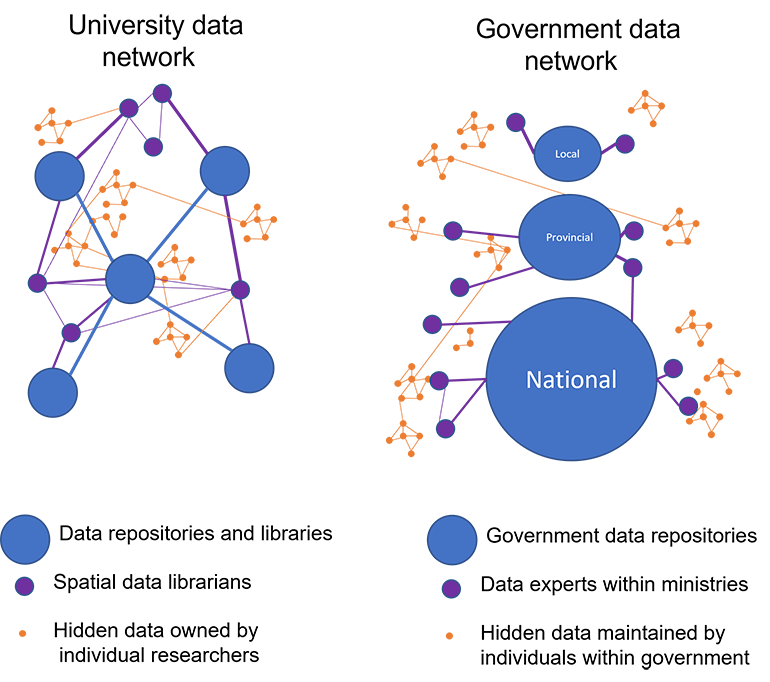
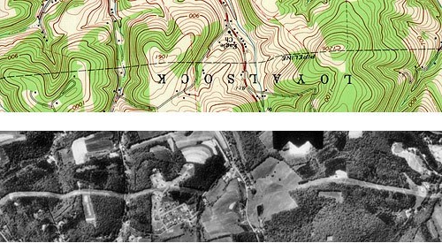

---
output:
  pdf_document: default
  html_document: default
---
# Collecting and editing data {#04-collecting-and-editing-data}

The ability of a geomatician to answer research questions or produce a map or other visuals, rests, in part, on first finding the right data to do so. Geomaticians often spend much of their time finding, collecting, and editing data, yet the critical activity of finding data is often left as something that geomaticians are assumed to pick up along the way. Thus, this chapter first introduces a range of possible data sources along with some theory, tips, and strategies to access them.

Environmental management increasingly grapples with complex environmental problems involving intertwined social and ecological processes (Biggs et al. 2021). Therefore, the spatial datasets presented in this chapter draw on a fairly wide range of possible subject areas. For instance, biophysical data can be used to map wetlands and wetland declines, but the implications of wetland decline may only be noticed by linking those spatial observations to other spatial data. An increase of floods may be detected by temporal records at a single monitoring station, or declines in fish stocks through statistical data from fish population monitoringt. Having access to a wide range of data can open opportunities to increase the policy-relevance of spatial research.

Because the data we require sometimes does not exist (or is not exist in a ready-to-use format) we must sometimes create our own datasets. Thus, we cover GNSS data collections, georeferencing, digitizing historical maps and orthorectification of aerial photos. These tools together with existing data are designed to help equip the geomatician with a toolbox to answer pressing research questions. Thus, this chapter is intended especially for students of GIS but also researchers starting out on their spatial research projects. Thankfully, due to a fast rate of data production and the open data movement these barriers are becoming fewer and easier to navigate. This is a particularly exciting moment to review the range of spatial datasets at your disposal.

:::: {.box-content .learning-objectives-content}

::: {.box-title .learning-objectives-top}
#### Learning Objectives {-}
::: 

1. Become familiar with a wide range of existing datasets and strategies to access them.
2. Understand where and how you may need to create your own data.
3. Understand georeferencing and rubber sheeting as a tool to edit or create spatial data.

::::

### Key Terms {-}
aerial photography, data repository, orthophoto, historical collections, georeferencing, information networks, In progress

## Spatial data in geomatics

The ability of a geomatician to answer research questions or produce a map or other visuals, rests, in part, on first finding the right data to do so. Geomaticians can spend much of their time finding, collecting, and editing data, yet the critical activity is often left as something assumed to be picked up along the way. This chapter introduces a range of possible data sources along with some theory, tips, and strategies to access them.

Environmental management increasingly grapples with complex environmental problems involving intertwined social and ecological processes (Biggs et al. 2021). Therefore, the spatial datasets presented in this chapter draw on a fairly wide range of possible subject areas. For instance, biophysical data can be used to map wetlands and wetland declines, but the implications of wetland decline may only be noticed by linking those spatial observations to other spatial data. An increase of floods may be detected by temporal records at a single monitoring station, or declines in fish stocks through statistical data from fish population monitoringt. Having access to a wide range of data can open opportunities to increase the policy-relevance of spatial research.

Because the data we require sometimes does not exist (or is not exist in a ready-to-use format) we must sometimes create our own datasets. Thus, we cover GNSS data collections, georeferencing, digitizing historical maps and orthorectification of aerial photos. These tools together with existing data are designed to help equip the geomatician with a toolbox to answer pressing research questions. Thus, this chapter is intended especially for students of GIS but also researchers starting out on their spatial research projects. Thankfully, due to a fast rate of data production and the open data movement these barriers are becoming fewer and easier to navigate. This is a particularly exciting moment to review the range of spatial datasets at your disposal.

### Open data

Data is becoming increasingly accessible thanks to the open data movement. The concept of open data suggests that governmental data should be available to anyone with a possibility of redistribution in any form without any copyright restriction,&quot; (Kassen 2013) or as others have recognized with minimal restrictions such as providing recognition.

Keeping data closed or charging for data has been a persistent controversy. Charging for data has motivated debate in the U.S. about the viability and ethics of recouping costs associated with public data. Britain is slowly opening up its national geographic database (housed as the &#39;Ordnance Survey&#39;) for use. USGS data is considered to be in the public domain (USGS 2021). Unfortunately, many datasets are not yet fully open, and even if they were, some know how will help locate them.

## Finding and Collecting data

This chapter introduces a network model to set a framework for finding data. Imagine that nearly all the data and information in the world is connected in some way through networks of information, composed of individuals, libraries, and institutions. We use information networks every day such as the internet and social media to find and answer to our questions. For example, me might ask Google: &quot;what is the best lake in Canada to plan a summer holiday?&quot; A common answer returned is &#39;Lake Louise, Alberta,&#39; which is a stunning lake surrounded by tall Rocky Mountains, as well as hordes of tourists! If we asked our friends – and maybe one happens to be an expert fishing guide - we may receive different answers including secret lakes that have not yet been discovered by tourists, such as the best lake for fishing. Our friends can also consider our specific interests, suggest helpful resources (such as an old fishing guidebook), and offer additional information about our query such as the best places on that lake to fish and what type of fishing gear to use. The point in this example is that there are different networks of information available to us, including formal networks of information organized on the internet and other information systems as well informal networks of individuals and experts. The amount and types of data we uncover may differ depending on whom we ask. In this section, we think about navigating data networks to find, interpret, and document spatial information.

A useful step to get oriented on your data hunt is start by asking colleagues and experts, such as spatial data librarians who may be able to help. Talking to a data librarian can help inform you of other potential datasets and may alert you to strengths and weaknesses of different datasets. They are also likely connected to other data librarians and possibly individual researchers who may have the data you need. The following sections provide a range of data sources.

{.center}

Figure 4.1 can be used to think about how data can be discovered in academic and government to find data. Figure 4.1 Panel A) envisions that data are becoming increasingly easy to discover through data repositories, but that data librarians are particularly well connected and trained in their use. Librarians may also be well connected with other data experts, outside repositories, and researchers who may have insights for finding unpublished data. Some unpublished data remains 'hidden,' only known about by individuals or small clusters of individual researchers. Figure 4.2 Panel B shows government data, which is also increasingly published at repositories specific to the level of government, and increasingly via centralized repositories that span multiple levels of government. Considerable data remains hidden with within different Ministries and government branches. 

Finding data is becoming easier thanks to the growing number (and centralization) of spatial data repositories, which can give access to governmental, academic, non-governmental, international, crowdsources datasets. Here we introduce each type and explain what type is most likely to provide different forms of environmental data. Repositories can be your one stop shop to find data. But the trick remains on where to start the search. The first question is often who might have data on this subject? And to inform that question, you should be thinking about what level of government may be in charge of managing it, as well as who, if anyone, would fill in data not provided by the government.

### Government data

Spatial data is often provided through government repositories. However, there are multiple levels to government, including municipalities (the smallest), provinces (or states), and nations (the largest), each of which likely has its own data repository. A good starting place is to check centralized repositories, which are becoming increasingly common and are connected as central nodes connecting multiple levels of Government. In the US, federal, municipal, and state geospatial data are being consolidated under [https://www.data.gov/](https://www.data.gov/). The Federated Research Data Repository ([https://frdr-dfdr.ca](https://t.co/MmuohBmSek?amp=1)) is an aggregation of Canadian open data repositories, including municipal, provincial, academic sources. It includes a map-based search for datasets with location information tied to their metadata called Geodisy. [Geodisy](https://twitter.com/hashtag/Geodisy?src=hashtag_click) is built with [GeoBlacklight](https://twitter.com/hashtag/GeoBlacklight?src=hashtag_click), which is in use as a discovery layer for shared geospatial metadata, such as through the [BIG Academic Alliance](https://geo.btaa.org/).

However, not all repositories are yet connected by a centralized repository, so you may need to look at individual repositories. Sometimes it may be obvious where to look. Other times, you must first consider the level of government that has jurisdiction over your subject area and geographic area of interest. For example, if you are interested in land use zoning and engineering features within a given city, this data is likely best provided by that individual city, either as an open data repository or emailing them with a data request (discussed later). In Canada, the provinces have jurisdiction over most natural resources (but not fish, which is federal) and thus provincial government data repositories provide data on natural resources, such as, water features, forests, wildlife, minerals, and topography. In British Columbia DataBC, houses over a thousand datasets on natural resources, including forest cover mapping, hunting statistics, and administrative boundaries. Canada&#39;s open data portal provides data on fish as well as environmental conditions (e.g., water quality, air quality, etc), which is under federal jurisdiction. Hydrological monitoring is readily accessible across Canada through the Hydat database, which can be easily accessed through the R package TidyHydat (Albers 2017).

Differences in public data availability exist among countries and are partly explained by the ways in which responsibilities for mapping and for land titles registration are distributed among national, state, and local governments in each country (Masser 1998). Affluent countries and countries with especially valuable natural resources, and countries with large or unusually active militaries, tend to be mapped more completely than others. The types of data availabile also varies among nations as a result of land ownership patterns within a jurisdiction: Governments typically have more complete data for public land and so countries with greater proportions of public land compared to private land are thus more likely to have more comprehensive depositories of spatial and statistical data.

\&lt;Id like to also talk about uncovering long-standing administrative records on natural resources – maybe in historical data section\&gt;

Try this: see if you can locate by using web searches the government open data pages for your city, province/state, and nation. What kinds of data do you see (probably a lot!), and could any help you answer questions of your own interest?

Special note: In Canada, Environment Canada has the mandate to monitor ambient environment including detecting water quality, flows, weather (via weather stations), as well as air quality. Of course, data such as this has often been transformed into contiguous rasters model forms, such as gridded rasters of temperature and precipitation.

### Non-governmental organization data 

Many important environmental features are not managed by most governments and sometimes these knowledge gaps are filled by non-governmental organizations and citizen science initiatives. Notable examples include the [Pacific Salmon Explorer](https://www.salmonexplorer.ca/#!/), which offers opportunity to explore and download long-term salmon catch and population data in British Columbia. Organizations such International Union for Conservation of Nature often synthesize and offer datasets that support their mandates such as monitoring species at risk and expanding protected areas [https://www.iucn.org/resources/conservation-tools](https://www.iucn.org/resources/conservation-tools)

### Citizen science
To add: overview of crowdsourced data, open street map.

Citizen science includes all activities where members of the general public contribute information and data to help generate new knowledge and information (Lee et al. 2020). Citizen science has been used to fill in data gaps for widely distributed phenomenon such as the distribution of global bird species, such as E-bird, which has generated nearly 1 billion bird observations as of 2021. It has also been used to capture information on rare phenomenon such as alpine wildlife, which owing to their location are very difficult and costly to study, but regularly spotted by mountain climbing members of the general public (Jackson et al. 2015). It is also used in fast-moving situations like natural disaster and to monitor long-term trends in the environment. For example, the [British Columbia Big Tree Registry](https://bigtrees.forestry.ubc.ca/bc-bigtree-registry/) collates data on the largest trees in old-growth forests through public, thereby engaging citizens to help support policies to protect the largest trees in BC (link).

A useful starting point to check for citizen science datasets is [Scistarter](https://scistarter.org/), which can be searched by keyword or location to identify citizen science projects. These datasets may be readily downloaded or downloaded through contacting the project leaders.

#### your turn
Can you think of any other environmental datasets that may be expensive or difficult to collect but that are addressed through citizen science initiatives? 

### International data

Some research questions extend beyond broders, even globally. Data on oceans can be searched through the [Ocean Biodiversity Information System](https://obis.org/). Data on food production and timber is published by the [United Nations Food and Agricultural Organization](http://www.fao.org/faostat/en/). Academic research that attempts to answer environmental problems at the global scale now often publishes their datasets for open use, such as the global tree canopy height map by Potopov et al. (2020).

### Unpublished Government Data

Governments manage a wide variety of data, which is sometimes located in relatively siloed ministries and departments. Some datasets are not readily accessible online, but may exist and can potentially be retrieved through a data request to an appropriate government employee. In the spirit of open data, many governments are becoming increasingly responsive to data requests, but success of this approach often hinges on finding that the data exists in the first place and then connecting with the right person to help you retrieve it. This requires networking.

While this textbook is primarily centered on technical skills, it&#39;s worth considering the old adage that &quot;it&#39;s not what you know, but who know.&quot; Collecting data that is not readily available offers a greater challenge but can reward you with new research and networking opportunities. During data collection it is sometimes necessary to reach out to individuals during data requests or queries about the data, and this can foster productive relationships. Always be respectful of their time, and be tactful. Data requests should typically state your name and affiliation (University department and supervisor), briefly state your intended research ((1-2 sentences) and your inquiry (e.g., do you know if such data exists?) or request (if you are already know what you are looking for). Include your area of interest if known (e.g., bald eagle habitat in Lake Superior, Ontario). Thank them for their time and if you don&#39;t hear back from them within 1-2 weeks reply back with another, shorter email (e.g., can someone in your office provide this bald eagle habitat mapping?). Always be patient and remember that the individual you contacted is busy and may appreciate a reminder in case your first email slipped through.

### Census data

\*In progress – would like to create an image of different census levels.

Census data are …. Census offers a rich insight into the social and, to a lesser extent, ecological fabric of a country. It is used extensively in social sciences (e.g., deomgraphics) and is increasingly used in environmental and social-ecological research, such as to document changes in land cover over the past century. For example, Clark (2016) compiled census data on agricultural production and diversity to track spatial in Canada&#39;s food systems from 1911 to 2011. Census includes data on age and gender demographics as well as health, which has been analyzed alongside environmental data to reveal striking and previously unrecognized relationships between the positive benefits of nature on human health as well as how gender inequity has been assocatied with environmental degradation

Census are repeated roughly ever five years and thus offer long-term records. The US census dates to 1791, and early census in Canada date to census of the French colony in Quebec in 1666. Early census asked relatively few questions, often centered around the numbers of free persons, slaves, and free males over age 16, as well as the sex and race of each individual. (You can [view replicas of US historical census survey forms here](http://www.ancestry.com/download/forms)). The amount and variety of data collected during census has expanded overtime to include questions about housing characteristics, expenses, citizenship, military service, health problems, employment status, place of work, commuting, and income. Census are carried out on a subset of the population and sampled data are used to produced estimated data on these variables for the entire population.

To protect respondents&#39; confidentiality, as well as to make the data most useful to legislators, the Census Bureau aggregates the data it collects from household surveys to several different types of geographic areas.

### Metadata

\&lt;to be written by Evan: at cursory level on how to collect and find metadata, why its important, how it can lead to other findings. IS also had the thought that sections on creating metadata should possibly also address metadata creation\&gt;

## Historical data collections

To add: The importance of baselines, underutilized historical datasets, potential for surprising discoveries.

### Historical Aerial Photos

The advent of aerial photographs, which are photographs of the Earth&#39;s surface taken from above (generally from an airplane), greatly improved mapping beginning in the 1930&#39;s and remain an invaluable spatial datasource type today. Aerial photos quickly became the primary source of data for delineating land covers, forest inventory, topographic mapping, as well as national defence. This section focusses on aerial photos including their availability in historical collection, potential uses in environmental research, and the background theory of how they must be prepared for use.

An important note to begin is that for most uses aerial photos must be first orthorectifiedwhich is discussed below). Many modern aerial photos have already been orthorectified. Historical collections are often not.

### Aerial photograph collections

Aerial photography missions involve capturing sequences of overlapping images along many parallel flight paths. A flight path produces a &#39;roll&#39; of numerous adjacent images. The availability of historical photographs is typically searched using index maps that display the extent of available photographs captured side by side.

The Canada National Air Photo Library has a collection of roughly 6 million aerial photos some dating back to the 1920&#39;s. The location of these photos can be searched using the Earth Observation Data Management System.

Recall that natural resources fall under the jurisdiction of provinces in Canada. Therefore, more extensive aerial photo collections are sometimes managed provincially, such as the BC collection housed in the UBC Geography Library. Aerial photos often cost money to cover the cost of scanning.

### Aerial photos in Environmental research

Historical aerial photos are useful for the unique spatial and temporal resolutions they offer. Temporally, aerial photos offer snapshots of landscapes that predate satellite-based imagery by many decades. For example, aerial photography from planes became common in the 1930&#39;s in many parts of Canada. Hence older photos can be used to track changes in landscape change, and capture impacts that have caused ecosystems to depart from their ecological baselines (Harker et al. 2021). Aerial photos vary in their spatial resolution, but sometimes offer a surprisingly high spatial resolution that can be used to study fine-scale landscape attributes and their changes, such as stream courses (Little et al. 2013), fish habitat (Tomlinson et al. 2011), and flooding (Harker et al. 2021).

Before delving into the processing of aerial photographs in the next section, note that even in their un-orthorectified state, historical aerial photos can offer a powerful communication tool. They offer a window into historical landscapes that can be easily discerned and appreciated by viewers. Thus, even without performing spatial analysis, historical images can offer a useful angle in a research report. One common such application is during the scoping phase of ecological restoration, which often strive to recognize and consider the long-term historical condition and processes of landscapes.

Turning aerial photographs into forms that can be analyzed in GIS requires first &#39;tying&#39; them to the Earth through the process of orthorectification, discussed next.

### Orthoimagery

An orthoimage is an aerial photograph or satellite imagery geometrically corrected so that the scale is uniform. Unlike orthoimages, the scale of ordinary aerial images varies across the image, due to the changing elevation of the terrain surface (among other things). The process of creating an orthoimage from an ordinary aerial image is called orthorectification. Photogrammetrists are the professionals who specialize in creating orthorectified aerial imagery, and in compiling geometrically-accurate vector data from aerial images.

Compare the map and photograph below. Both show the same gas pipeline, which passes through hilly terrain. Note the deformation of the pipeline route in the photo relative to the shape of the route on the topographic map. The deformation in the photo is caused by relief displacement. The photo would not serve well on its own as a source for topographic mapping.

{.center}

Think of it this way: where the terrain elevation is high, the ground is closer to the aerial camera, and the photo scale is a little larger than where the terrain elevation is lower. Although the altitude of the camera is constant, the effect of the undulating terrain is to zoom in and out. The effect of continuously-varying scale is to distort the geometry of the aerial photo. This effect is called relief displacement.

### Orthorectification

Digital aerial photographs can be rectified using specialized photogrammetric software that shifts image pixels toward or away from the principal point of each photo in proportion to two variables: the elevation of the point of the Earth&#39;s surface at the location that corresponds to each pixel, and each pixel&#39;s distance from the principal point of the photo. Aerial images need to be transformed from perspective views into plan views before they can be used to trace the features that appear on topographic maps, or to digitize vector features in digital data sets.

An orthoimage (or orthophoto) is a single aerial image in which distortions caused by relief displacement have been removed. The scale of an orthoimage is uniform. Like a planimetrically correct map, orthoimages depict scenes as though every point were viewed simultaneously from directly above. In other words, as if every optical axis were orthogonal to the ground surface. Notice how the power line clearing has been straightened in the orthophoto on the right below.

{.center}

Comparison of a vertical aerial photograph (left) and an orthophoto.

Relief displacement is caused by differences in elevation. If the elevation of the terrain surface is known throughout a scene, the geometric distortion it causes can be rectified. Since photogrammetry can be used to measure vertical as well as horizontal positions, it can be used to create a collection of vertical positions called a terrain model. Automated procedures for transforming vertical aerial photos into orthophotos require digital terrain models.

Since the early 1990s, orthophotos have been commonly used as sources for editing and revising of digital vector data.

### Old paper maps

Old paper maps capture historical landscape change, and are often required to spatialize historical government statistics, such as where and when timber was harvested. They also insight into how historical landscapes were perceived by society and are studied by scholars in the humanities fields, such as history classical studies because they reveal types of bias present in the map, thus offering insight into societal perceptions and power dynamics that shaped modern landscapes. For example, the history of fur trapping adminsitration has been considerable interest in understanding early pattern of colonization in western Canada (Iceton 2019)

To be added: BC 1937 historical forest inventory map OR, a First Nations TEK map using symbols for resources (if I can find one I can use)

### Field books / ship logs / herbarium

In depth material can be adapted from GBIF.

## Editing data 

### Digitizing

To talk about creating polygons using editing in GE, GIS.

### Classifying maps into rasters

Not my area of expertise. Include in this chapter?

### Digitizing polygons

To talk about creating polygons using editing in GE, GIS.

## Georeferencing

\*Need to review the order of sections around here.

Although many types of data are georeferenced at the time of their creation, such as photos taken from a mobile phone, much information must be first processed into a form that can be analyzed by the geomatician. This is especially true for any data captured prior to the 2000&#39;s. For example, decades of data exist in the form of herbaria, ship logs, tree ring records, that offer salient information on the spatial distribution of biodiversity and natural processes, yet are not readily brought into a GIS. This is often because the data were collected prior to advent of widespread gps.

In other cases, data collected today must be tied into the Earth surface, such as plot centeres from a forest inventory plot. Georeferencing describes assigning non-spatial information a spatial location (x and y coordinates) based on a coordinate system.

A common use case for georeferencing in landscape studies is when a useful historical map is discovered but must be brought into GIS and overlayed with other data. The historical map can potentially create a shapefile for analysis (discussed later). Georeferencing is the process of assigning geospatial positioning information to raster data based on a defined coordinate system. Why is this necessary? Imagine you have a paper map and you use a desktop scanning device to save a digital image of the map to your computer - this map depicts a particular area on Earth but there is no way for your scanner or computer to automatically know that (1) it is a map and (2) what area on earth the map depicts. Thus, by default there is no geographic information associated with the image file and any GIS software you try to load this file into would not know where on Earth to place this map image. In order to solve this problem, it is necessary to manually generate geographic coordinate information that can be associated with scanned map image file so that GIS software can process the map image correctly and align it successfully with other georeferenced data.

{.center}

This georeferencing process is typically carried out using GIS software like QGIS, ArcMap, or ArcGIS Pro and is a powerful way to add value to scanned images of paper maps or other geospatial raster data that is missing coordinate. The georeferencing process may also be combined with the process of clipping raster data to remove unwanted portions of a scanned image and with the process of image compression to reduce the raster file size.

The process of georeferencing varies slightly based on the GIS software you are using and the characteristics of the raster data you are working with, but here are a few common workflows, which are determined by the type of map you are working with. All georeferencing will require setting control points and performing a transformation to fit the entire map to the GIS space you are working within.

### Control points.

Control points should be spaced evenly across the area the map. There must be at least 3, and preferably 10-25 relatively evenly spaced control points to obtain a good rendering. Two options are discussed for control points

### Control points on maps with grids or graticule.

Large area maps (e.g., an entire country or province) typically have graticule, which depict geographic coordinates (latitude and longitude), and smaller maps often have grids, which link the map to a projected coordinate system such as UTM degrees. These grids or graticule may span across the map, or just be located along the corner or edges of a map. Such maps can often be georeferenced in a GIS by first setting the desired coordinate system and then toggling on the grid or graticule. Control points can be placed on the scanned raster at the line intersections than tied to the grid toggled on in the GIS. Here is a guide to georeferencing doing this in [QGIS](https://guides.lib.utexas.edu/georeference-raster-data/qgis-georeference-by-map-corners).

### Grid and graticule as control points

Not all maps have geographic coordinates for the map corners though, and may not even supply coordinate information at all, but it is still possible to georeference these types of maps using a slightly different process. If your map does not have coordinate information for its map corners (see example B below), click on the following link to access a guide that will walk you through the process of using QGIS to georeference based on identifiable map features and an already georeferenced basemap. Here is a [guide to georeferencing by map features using QGIS](https://guides.lib.utexas.edu/georeference-raster-data/qgis-georeference-by-map-features) 

{.center}

### Documenting georeferencing results

During the process of georeferencing you must document the number of control points and the root mean square error (RMSE). Although there are multiple sources of uncertainty in your spatial precision, this information is critical to communicating the uncertainty that arose through the georeferencing process.

### Rubbersheeting

This practice of using control points and transformations is an example of rubber sheeting. In cartography, rubbersheeting refers to the process by which a layer is distorted to allow it to be seamlessly joined to an adjacent geographic layer of matching imagery, such as satellite imagery (most commonly vector cartographic data) which are digital maps. This is sometimes referred to as image-to-vector conflation. Often this has to be done when layers created from adjacent map sheets are joined together. Rubber-sheeting is necessary because the imagery and the vector data will rarely match up correctly due to various reasons, such as the angle at which the image was taken, the curvature of the surface of the earth, minor movements in the imaging platform (such as a satellite or aircraft), and other errors in the imagery.

## Data transformations

To be written by Paul 

### Affine

### Similarity

### Projective

### References

**Not complete/carefully edited yet

Statements on open data, aerial photos, and comparisons of government data among countries adaped from Biase ([https://opentextbc.ca/natureofgeographicinformation/chapter/1-overview-2/](https://opentextbc.ca/natureofgeographicinformation/chapter/1-overview-2/)). Georeferencing images and text adapted from University of Texas Libraries (2021) . Rubber sheeting text is adapted from Wikipedia.

Albers S (2017). &quot;tidyhydat: Extract and Tidy Canadian Hydrometric Data.&quot; _The Journal of Open Source Software_, 2(20). doi: [10.21105/joss.00511](https://doi.org/10.21105/joss.00511), [http://dx.doi.org/10.21105/joss.00511](http://dx.doi.org/10.21105/joss.00511).

DeBiase, D. Nature of Geographic Information Systems. https://opentextbc.ca/natureofgeographicinformation/chapter/1-overview-2/

Biggs, R., de Vos, A., Preiser, R., Clements, H., Maciejewski, K., &amp; Schlüter, M. (2021). _The Routledge Handbook of Research Methods for Social-Ecological Systems_ (p. 526). Taylor &amp; Francis

To talk about creating polygons using editing in GE, GIS.

Clark, E. (2016). _Historical Trends of Ecosystem Services in Canada, 1911-2011_. McGill University (Canada).

Iceton, G. (2019). “Many Families of Unseen Indians”: Trapline Registration and Understandings of Aboriginal Title in the BC-Yukon Borderlands. BC Studies: The British Columbian Quarterly, (201), 67-91.

Jackson, M. M., Gergel, S. E., &amp; Martin, K. (2015). Citizen science and field survey observations provide comparable results for mapping Vancouver Island White-tailed Ptarmigan (Lagopus leucura saxatilis) distributions. _Biological Conservation_, _181_, 162-172

Kassen, M. (2013). A promising phenomenon of open data: A case study of the Chicago open data project. _Government information quarterly_, _30_(4), 508-513.

Lee, K. A., Lee, J. R., &amp; Bell, P. (2020). A review of Citizen Science within the Earth Sciences: potential benefits and obstacles. _Proceedings of the Geologists&#39; Association_.

Little, P. J., Richardson, J. S., &amp; Alila, Y. (2013). Channel and landscape dynamics in the alluvial forest mosaic of the Carmanah River valley, British Columbia, Canada. _Geomorphology_, _202_, 86-100

Potapov, P., Li, X., Hernandez-Serna, A., Tyukavina, A., Hansen, M. C., Kommareddy, A., ... &amp; Hofton, M. (2021). Mapping global forest canopy height through integration of GEDI and Landsat data. _Remote Sensing of Environment_, _253_, 112165.

Rubbersheeting. (2020, June 11). In Wikipedia. https://en.wikipedia.org/wiki/Rubbersheeting

Tomlinson, Matthew J., et al. &quot;Long‐term changes in river–floodplain dynamics: implications for salmonid habitat in the Interior Columbia Basin, USA.&quot; _Ecological Applications_ 21.5 (2011): 1643-1658.

University of Texas Libraries. (2020, July 26). Intro to Georeferencing. https://guides.lib.utexas.edu/georeference-raster-data

USGS &quot;https://www.usgs.gov/information-policies-and-instructions/copyrights-and-credits&quot;

Wikipedia. [https://en.wikipedia.org/wiki/Ordnance\_Survey#Data\_access\_and\_criticisms](https://en.wikipedia.org/wiki/Ordnance_Survey#Data_access_and_criticisms)
