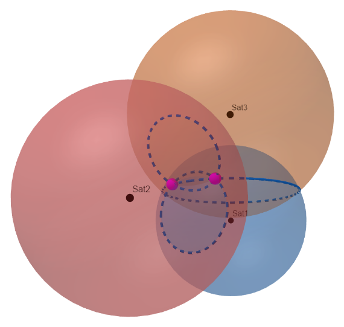

```{r echo=FALSE}
yml_content <- yaml::read_yaml("chapterauthors.yml")
author <- yml_content[["collectingAndEditingData"]][["author"]]
coauthor <- yml_content[["collectingAndEditingData"]][["coauthor"]]
canadalicense <- "https://open.canada.ca/en/open-government-licence-canada"
baseurl <- "https://ubc-geomatics-textbook.github.io/geomatics-textbook/"
```
# Collecting and Editing Data {#collecting-and-editing-data}

```{r setup, include=FALSE}
## This allows us to add an id attribute to a chunk
knitr::opts_chunk$set(echo = FALSE)

knitr::opts_hooks$set(out.extra = function(options) {
  options$out.extra <- paste0(ifelse(!is.logical(options$out.extra), options$out.extra, "")," id='", options$label, "'")
  options
})
```

```{js, echo=FALSE}
var images = new Array()
var tec1date = new Date();
tec1date.setDate(tec1date.getDate() - 1);
var tec2date = new Date();
tec2date.setDate(tec2date.getDate() - 2);
var tec3date = new Date();
tec3date.setDate(tec3date.getDate() - 3);
var tec4date = new Date();
tec4date.setDate(tec4date.getDate() - 4);
var tec5date = new Date();
tec5date.setDate(tec5date.getDate() - 5);
var tec6date = new Date();
tec6date.setDate(tec6date.getDate() - 6);
var tec7date = new Date();
tec7date.setDate(tec7date.getDate() - 7);

var part1 = "https://www.spaceweather.gc.ca/service/tools/tec/?date="
var part2 = ":00&format=png&maxlevel=40&type=1&lang=en"

var loaded = [];
function preload() {
    for (var i = 0; i < arguments.length; i++) {
        loaded[i] = new Image();
        loaded[i].src = preload.arguments[i];
    }
}

preload(
  part1 + tec7date.toISOString().substring(0,13) + part2,
  part1 + tec6date.toISOString().substring(0,13) + part2,
  part1 + tec5date.toISOString().substring(0,13) + part2,
  part1 + tec4date.toISOString().substring(0,13) + part2,
  part1 + tec3date.toISOString().substring(0,13) + part2,
  part1 + tec2date.toISOString().substring(0,13) + part2,
  part1 + tec1date.toISOString().substring(0,13) + part2,
  "https://www.spaceweather.gc.ca/auto_generated_products/tec/latest/tec-en.png"
)
```

Written by
```{r results='asis', echo=FALSE}
cat(author, "and", coauthor)
```

Our ability to answer spatial questions or produce a map or other visuals relies, in part, on first finding the right data for the question. We often spend much of our time finding, collecting, and editing data, yet the critical activity of finding data is often left as something that practitioners are assumed to pick up along the way. This chapter addresses that gap by first introducing a range of possible data sources along with some theory, tips, and strategies to access them. We also address some common instances when data do not yet exist, and so we must create them. This chapter may be particularly useful for students and practitioners starting out on their spatial research projects, and for anyone interested in the rapidly changing data universe. 

:::: {.box-content .learning-objectives-content}

::: {.box-title .learning-objectives-top}
## Learning Objectives {-}
::: 

1. Become familiar with a wide range of spatial datasets and strategies to access them
2. Identify several sources of historical spatial data, including historical maps and aerial photos, and the steps required to analyze them
2. Recognize good practices and strategies for writing and reading metadata
4. Understand how data are collected by Global Navigation Satellite Systems (GNSS)

::::

## Key Terms {-}
Aerial Photography, Area of Interest, Census, Data Repository, Data Request, Georeferencing, Global Navigation Satellite Systems (GNSS), Graticule, Natural Resource Administrative Data, Historical Collections, Open Data, Orthophoto, Relief Displacement, Rubbersheeting, Spatial Panel Data

## Open Data

Data are becoming increasingly easy to access thanks to the open data movement. The concept of **open data** suggests that governmental data should be available to anyone to use and, if desired, redistribute in any form without any copyright restriction or with minimal restrictions such as providing recognition [@kassen_promising_2013].

Until recently, most government data were simply unavailable or could only be accessed by request or by paying the data provider. Countries around the world are moving to an open data model. For example, Britain is opening up its national geographic database (housed as the 'Ordnance Survey'). The United States (US) has moved its data housed within the US Geological Survey into the public domain [@usgs_copyrights_nodate]. Canada has signed a [Directive on Open Government](https://www.tbs-sct.gc.ca/pol/doc-eng.aspx?id=28108), which promotes the proactive and ongoing release of government information. The province of British Columbia (BC) has just released all [government LiDAR data](https://governmentofbc.maps.arcgis.com/apps/MapSeries/index.html?appid=d06b37979b0c4709b7fcf2a1ed458e03) under an open government license and many provinces and municipalities release data under similar licenses. Canada is also signatory of the Treaty of Open Skies, which is an international effort that encourages the sharing of aerial imagery to promote openness and transparency of each signatory nation's military forces and activities. Despite the tremendous momentum towards open data, many datasets are not yet fully open. The tips and strategies below will help locate both open and not-so-open datasets. 

## Finding Data

Here we introduce a network model to set a framework for finding data. Imagine that nearly all the data and information in the world is connected in some way through networks of information, composed of individuals, libraries, and institutions. The internet is an important component in this network, one we all use every day to answer questions. For example, me might ask Google: __what is the best lake in Canada to plan a summer holiday?__ A common answer returned is Lake Louise, Alberta, which is a stunning lake surrounded by tall Rocky Mountains, as well as hordes of tourists! If we asked this question to our friends – and maybe one happens to be an expert angler - we may receive different answers including secret lakes that have not yet been discovered by tourists or the best lake for fishing. Our friends can also consider our specific interests, suggest helpful resources (such as a lesser known forum on local fishing), and offer additional information about our query such as the best places on that lake to camp, where to fish on the lake, and what type of fishing gear to use. The point in this example is that there are different networks of information available to us, including formal networks of information organized on the internet and accessed by search engines as well as informal networks of individuals and experts who offer an additional strategy to connect us with the right data

Data are becoming increasingly easy to discover through the use of **data repositories** (Figure \@ref(fig:04-data-network-model)). Below we discuss the growing number (and centralization) of spatial data repositories, which can give access to academic, government non-governmental, international, and crowd-sourced datasets. Here we introduce each type of repository and offer some hints at what environmental data can be discovered in each.

```{r 04-data-network-model, fig.cap = fig_cap, out.width= "75%", echo = FALSE}
fig_cap <- paste0("Envisioning university and government data networks. Data within each network is concentrated within data repositories, yet considerable data remains 'hidden' among individual researchers and silos of the Ministry, but can potentially be accessed by finding the right connections. Sutherland, CC BY 4.0.")
knitr::include_graphics(here::here("images", "04-data-network-model.png"))
```
</br>

## Data in Academia

Data librarians are particularly well-connected and trained to help you navigate these repositories and contacting them can be a good starting point in your search. Nonetheless, considerable data are not yet published. Some of these unpublished data have been analyzed in previous research and its existence could be discovered through a review of the academic literature. Other unpublished data remains essentially hidden, only known about by individuals or small clusters of individual researchers who created those data. In such a case, your only possibility to find such data are through a combination of asking around and reaching out to experts in the field. Once you know it exists, unpublished data could potentially be accessed through connecting with those researchers themselves, and requesting the data or inquiring about the possibility for a collaboration. 

## Government Data

Government data are also increasingly published in data repositories, specific to the level of government (Figure \@ref(fig:04-data-network-model)). There are multiple levels to government, including municipalities (the smallest), sometimes counties (precincts, townships, or parishes), provinces (or states), and nations (the largest), each of which often has its own data repository. Centralized repositories are becoming increasingly common and connect open data from all levels of Government. The [Federated Research data repository](https://www.frdr-dfdr.ca/repo/) is an aggregation of Canadian open data repositories, including municipal, provincial, and academic repositories. It includes a map-based search for datasets with location information tied to their metadata. In the US, geospatial data from federal, municipal, and state government repositories are being consolidated under [Data.gov](https://www.data.gov/](https://www.data.gov/).

Because not all repositories are yet connected by a centralized repository, one must search in the correct repository. To do this, consider which government has jurisdiction over the specific subject area and geography of interest. For example, if you are interested in land use zoning and engineering features within a given city, this data are likely best provided by that individual city, either by finding it within a data repository or e-mailing the municipality with a data request. In Canada, the provinces have jurisdiction over most natural resources and thus provincial government data repositories tend to provide the best data coverage on natural resources such as, water, forests, wildlife, minerals, and topography. In British Columbia, for example, [DataBC](https://www.data.gov.bc.ca/) houses over a thousand datasets on natural resources, including forest inventory maps, natural disturbances, hunting statistics, administrative boundaries, and much more. [Canada's open data portal](https://open.canada.ca/en/open-data) provides data on fish as well as environmental conditions (e.g., water quality, air quality, historical weather, etc.), which is under federal jurisdiction. Hydrological flow and water quality monitoring are readily accessible across Canada through the Hydat database, which can be easily accessed through the R package called [TidyHydat](https://cran.r-project.org/web/packages/tidyhydat/vignettes/tidyhydat_an_introduction.html) (@albers_tidyhydat_2017).

:::: {.box-content .your-turn-content}

::: {.box-title .your-turn-top}
## Your Turn! {-}
:::

<p id="box-text">
Try using a web search to find the government open data pages for your city, province/state, and nation. What kinds of data can you find?
</p>

::::

## Census Data

This section introduces the census at a cursory level before launching into the applied question of how to find census data for your spatial analysis, using the Census of Canada as an example.

A **census** generally refers to a complete count by government of a specific region's population and includes demographic attributes such as age, gender, language, income, and housing. Census data inform public policy, such as allocation of public funds, transportation network planning, and electoral area delineation. Census data also provide researchers with an opportunity to gain insight into the social and, to a lesser extent, environmental fabric of a country and are increasingly used in environmental and social-ecological research that aims to address social elements of environmental challenges [@tomscha_guide_2016] [@biggs_routledge_2021]. Censuses are typically conducted once every five years in Canada and every 10 years in the US.

In addition to demographics, many nations survey information related to economics or specific industries, such as agriculture. For example, Canada's Census of Agriculture captures information on fertilizers, irrigation, livestock, farm types, and crop production across Canada. The Longform Census in Canada surveys additional questions but is only sent to a subset of the population, and the data are then used to estimate the attributes for the entire population.

A starting point to using census data in spatial analysis is to understand the geographic levels of census data, and then we address where the geography files and data can be downloaded.

## Census of Canada Geographic Levels

To protect respondents' confidentiality, the individual data collected during census enumeration is obscured from the public. Thus, census data can only be accessed by researchers in the form of statistics aggregated to varying geographic levels. Knowing these geographic levels is key to accessing census data and using them appropriately to answer your spatial questions.

```{r 04-census-geographies, fig.cap = fig_cap, out.width= "75%", echo = FALSE}
fig_cap <- paste0("The geographic levels of the Census of Canada include general units (applicable everywhere throughout Canada) and also an additional layer for urban areas only. Sutherland, CC BY 4.0.")
knitr::include_graphics(here::here("images", "04-census-geographies.png"))
```
</br>

At the top of Figure \@ref(fig:04-census-geographies) are Canada's provinces and territories, which are then divided into census divisions, which in turn are divided into census subdivisions. Census subdivisions correspond to municipalities, but also include Indian reserves, and 'unorganized areas.' These three areas (municipalities, Indian reserves, and unorganized areas) are also aggregated into census consolidated subdivisions, which offer a more consistent geographic unit for mapping large areas as compared to subdivisions themselves. Census subdivisions are divided into dissemination areas, composed of one or more 'dissemination area blocks' (generally, a city block bounded by roads on all sides).

In addition to these general geographies, which apply throughout Canada, special geographic units are implemented as an additional layer of aggregation for urban centers. A Census Metropolitan Area (CMA) is a grouping of census subdivisions comprising a large urban area and its surroundings. To become a CMA, an area must register an urban core population of at least 100,000 at the previous census. A Census Agglomeration (CA) is a smaller version of a CMA in which the urban core population at the previous census was greater than 10,000 but less than 100,000. CMA and CA are useful for making comparisons across cities. CMAs and CAs with a population greater than 50,000 are subdivided into census tracts which have populations ranging from 2,500 to 8,000 and are intended to be relatively homogeneous in their demographic identity (i.e., a local neighbourhood).
Using census data for geographic analysis typically involves first identifying the smallest spatial unit at which the data are available. Recall that to protect the privacy of respondents, some data are only available at higher geographic levels. Another consideration is that if you plan to compile multiple census years, the geographic boundaries have typically changed over time in response to how the landscapes and information needs have changed. This creates substantial (though, not insurmountable) additional work that limits how the data can be used, especially for finer spatial scale analysis. An example of changes in the geography of census divisions is seen for British Columbia in Figure \@ref(fig:04-shifting-census-boundaries).

(ref:4-shifting-census-boundaries-caption) An example of how census boundaries have changed, showing changes in Census divisions for British Columbia from 1911 to 1986. Data from @clark_historical_2016. Sutherland, CC BY 4.0.

```{r 04-shifting-census-boundaries, fig.cap = fig_cap, out.width= "75%", echo = FALSE}
fig_cap ="(ref:4-shifting-census-boundaries-caption)"
knitr::include_graphics(here::here("images", "04-shifting-census-boundaries.png"))
```
 
:::: {.box-content .call-out-content}

::: {.box-title .call-out-top}
## Call Out {-}
:::

<p id="box-text">
Some spatial analyses will want to work with the smallest geographic level available. The smallest geographic unit of the Canada census is the dissemination block. Census tracts are also used frequently in spatial analysis but this geographic unit is only applicable to metropolitan areas.
</p>

::::

## Accessing Census Data

Statistics Canada maintains the geographic boundaries for the Census for each level in Canada. The [Canadian Socio-economic Information Management System Statistics Canada data portal](https://www150.statcan.gc.ca/n1/en/type/data) provides access to the Census of Canada as well as the Census of Agriculture, Aboriginal Peoples Survey, and other government statistical datasets. You have the option to search by a vector or an area of interest. Students with access to [CHASS Canadian Census Analyzer](http://dc1.chass.utoronto.ca/census/index.html) (students of University of Toronto as well as many other subscribing universities) can use CHASS to access additional statistical data, which they can aggregate to census geographic units of their choosing.

:::: {.box-content .your-turn-content}

::: {.box-title .your-turn-top}

### Your Turn! {-}
:::

<p id="box-text">
Try this: Navigate to [Canadian Socio-economic Information Management System Statistics Canada data portal](https://www150.statcan.gc.ca/n1/en/type/data) and search a key word such as: "age." A list of available geographic levels should be present on the left side, allowing you to check which geographic levels you would like to retrieve the data for. What geographic levels are present for age and which is the smallest geographic level (refer to Figure \@ref(fig:04-shifting-census-boundaries))? Now try searching the keyword: crop production. What is the smallest geographic level for crop production now?
</p>

::::

## Non-Governmental Organization Data 

Many elements of the environment, such as biodiversity and large old trees, are not monitored by most governments. These knowledge gaps are sometimes filled by other organizations not associated with the government (i.e.,  non-governmental organizations) or by citizen science initiatives. 

[Pacific Salmon Foundation](https://www.salmonexplorer.ca/#!/) has collaborated with the help of First Nations and government to compile salmon information for BC so that the data can be readily viewed and downloaded for further analysis. Organizations such as the International Union for Conservation of Nature often synthesize and [offer datasets](https://www.iucn.org/resources/conservation-tools) that support their mandates such as monitoring species at risk and expanding protected areas. 

[Global Forest Watch](https://www.globalforestwatch.org/) specializes in monitoring forest cover across the planet. Canada was one of the original pilot countries for collecting early forest cover loss data. Global Forest Watch provides a number of data products and online web mapping applications on forest loss/gain, wildfire, land use, land cover, climate, and biodiversity that are readily available for analysis.

[Ducks Unlimited](https://www.ducks.ca) provides maps of the Canadian Wetland Inventory and reports on future wetland loss, degradation, and restoration. Their website also includes online web mapping applications to interact with their datasets involving water fowl.

Do you know a non-governmental organization that is based in Canada or collects environmental data about Canada that should be highlighted here? [Submit a request!](https://github.com/ubc-geomatics-textbook/geomatics-textbook/issues/new/choose)

## Citizen Science

Citizen science describes activities where members of the general public contribute information and data to help generate new knowledge and information [@lee_review_2020]. Citizen science has been used to fill in data gaps for widely distributed phenomenon that are otherwise difficult to gather. In addition to [Open Street Map](https://www.openstreetmap.org/), which has created a free open geodatabase of the world, one of the most important examples is a collective global effort to map the distribution of global bird species using a mobile app known as [E-bird](https://ebird.org/home), which has generated nearly 1 billion bird observations as of 2021. Likewise, alpine wildlife are  difficult for researchers to observe and are costly to study owing to the effort and risk associated with accessing alpine areas, yet may be frequently spotted by mountain climbers who venture into alpine areas during their recreational pursuits [@jackson_citizen_2015]. Citizen science is also used in fast-moving situations like natural disaster and to monitor long-term trends in the environment. For example, the [British Columbia Big Tree Registry](https://bigtrees.forestry.ubc.ca/bc-bigtree-registry/) collates citizen science data on the locations of the largest trees in BC, thereby engaging citizens to help support policies to protect the largest trees in BC.

A useful starting point to check for citizen science datasets is [Scistarter](https://scistarter.org/), which can be searched by keyword or location to identify citizen science projects around the globe. These datasets may be readily downloaded or downloaded through contacting the project leaders.

## International Data

Some research questions extend beyond borders. For example, oceans are primarily international and data on oceans can be searched through the [Ocean Biodiversity Information System](https://obis.org/). A database on food production and timber is published by the [United Nations Food and Agricultural Organization](http://www.fao.org/faostat/en/). Research that attempts to address environmental problems at the global scale are often openly published online such as the [global tree canopy height map](https://glad.umd.edu/dataset/gedi) [@potapov_mapping_2021].

## Metadata

To be written by Evan: at cursory level on how to collect and find metadata, why its important, how it can lead to other findings.

## Unpublished Data and the Data Request

Governments manage a wide variety of data, which is sometimes located out of public sight. Datasets that are not readily accessible online, may still exist and can potentially be retrieved through a data request to the appropriate government agency. In the spirit of open data, many governments are becoming increasingly responsive to data requests, but success of this approach often hinges on knowing what to request and who to make the request to.

Accessing data that are not readily available adds extra challenge but can reward you with new research and networking opportunities that can be highly beneficial for both parties. Since these data are not immediately available to everyone, one benefit to researchers is the novelty of analysis that can be applied. The data provider may also benefit from the knowledge gained by your research. They may be able to assist you with understanding the data, disseminating the final report, and even connecting you with job opportunities and other ways to continue your skill development. When sending a data request or data query, always be respectful of their time, and be tactful. A data request template is provided below: 

```
Dear ... (person, or institution)

State your name and affiliation (e.g., university department and program/supervisor)

Briefly state your intended research or research aspiration (1-2 sentences)

State your **data inquiry** (e.g., do you know if x data exists?) or **data request** in bold text. Although you may not know exactly what you are looking for, try to be as specific as possible on the type of data you are requesting by describing. Give your geographical area of interest if known either descriptively, in a map, or as a shapefile.]

Thank them for considering your request. 
```

## Historical Data Collections

**Historical data** collections generally include any spatial data source excluding satellite-based remote sensing that was produced prior to the widespread commercialization of GIS in the mid 1990's. Historical data are typically not available as ready-to-use digital layers, and thus work is required up front to digitize these data in preparation for spatial analysis. 

Historical datasets can be extremely valuable in environmental research because they extend our ability to observe how the environment has changed over longer time horizons, potentially revealing vastly different landscapes and environmental conditions from those seen today. This insight can help remind us of levels of degradation or abundance that have become 'forgotten' by today's environmental managers, and can lead to surprising discoveries [@mcclenachan_importance_2015].

Although **historical datasets** can be very useful, they were often not collected for the intended purpose of being analyzed by future researchers. Data were often collected to serve the needs of the day, and were collected in a cost effective manner using tools and science that were available at that time. While this is not usually an issue for Census data, which has used relatively consistent survey questions through time, it complicates use of other datasets such as historical forest inventories, which have evolved their methods in step with technology and changing perceptions of how the forest ought to be monitored and valued. Thus, knowledge of how **historical data** were collected is sometimes required to accurately understand and interpret it. Overall, the process of locating, digitizing, and interpreting historical data can be a substantial portion of the work in a historical spatial analysis. In this section we cover historical **aerial photograph** collections, historical **natural resource administrative data** as well as **historical maps**.

### Historical Aerial Photographs

The advent of **aerial photographs**, which are photographs of the Earth's surface taken from above (generally from an airplane), greatly improved mapping beginning in the 1930's and became the primary source of data for mapping land cover, timber volumes, topography, and national defense planning. Today, they offer a valuable tool for the unique spatial and temporal resolutions they offer. Temporally, **aerial photos** offer snapshots of landscapes that predate satellite-based remotely-sensed data by many decades [@morgan_historical_2017], which can help inform restoration targets and cumulative effects assessments [@harker_perspectives_2021]. Aerial photos vary in their spatial resolution, but sometimes offer a surprisingly high spatial resolution that can be used to study fine-scale landscape attributes and their changes, such as stream courses [@little_channel_2013], fish habitat [@tomlinson_long-term_2011], and soil hydrodynamics [@harker_perspectives_2021].

Using **aerial photographs** to track landscape change often requires first 'tying' them to the Earth to produce and orthophoto, a process discussed as it applies generally to image processing in [Chapter 13](https://ubc-geomatics-textbook.github.io/geomatics-textbook/image-processing.html) and discussed briefly here. An orthoimage is an aerial photograph or satellite imagery geometrically corrected so that the scale is uniform, such as in Figure \@ref(fig:04-crooked-aerialphoto). Unlike orthoimages, the scale of ordinary aerial images varies across the image, due to the changing elevation of the terrain surface (among other things). The process of creating an orthoimage from an ordinary aerial image is called orthorectification. Photogrammetrists are the professionals who specialize in creating orthorectified aerial imagery, and in compiling geometrically-accurate vector data from aerial images.

Compare the map and photograph below. Both show the same gas pipeline, which passes through hilly terrain. Note the deformation of the pipeline route in the photo relative to the shape of the route on the topographic map. Only the topographic map is accurate here. The deformation in the photo is caused by relief displacement. The photo would not serve well on its own as a source for topographic mapping.

(ref:04-crooked-aerialphoto-caption) Example of how a linear feature can appear crooked in an aerial photograph that has not yet been orthorectified due to relief displacement. @dibiase_census_2014, CC BY 4.0.

```{r 04-crooked-aerialphoto, fig.cap = fig_cap, out.width= "75%", echo = FALSE}
fig_cap = "(ref:04-crooked-aerialphoto-caption)"
knitr::include_graphics(here::here("images", "04-crooked-aerialphoto.png"))
```

Even in their un-orthorectified state, historical aerial photos can offer a powerful communication tool. They offer a window into historical landscapes that can be easily discerned and appreciated by viewers. Thus, even without orthorectification and performing spatial analysis, historical aerial photos can enrich a research report and other communications. 

### Accessing Historical Aerial Photograph Collections

**Aerial photography** missions involved capturing sequences of overlapping images along parallel flight paths. A flight path produces a "roll" of numerous adjacent images that overlap. Flight paths tend to be here and there, but not necessarily exactly where you need them! Therefore, the first step is to determine the availability of historical photographs rolls for your time frame and **area of interest**. Some collections can be searched relatively easily using a web-based GIS. For example, the Canada National Air Photo Library has a collection of roughly 6 million aerial photos some dating back to the 1920's, which can be searched using the Earth Observation Data Management System. A search generally follows these steps: 

1. Determine your area of interest.
2. Decide on the time-frame of interest. 
3. Search via a GIS web map or paper flight line maps and examine which flight rolls cross over your time frame and area of interest.

```{r 04-accessing-aerial-photos, fig.cap = fig_cap, out.width= "75%", echo = FALSE}
fig_cap = "(ref:04-accessing-aerial-photos-caption)"
knitr::include_graphics(here::here("images", "04-accessing-aerial-photos.png"))
```
</br>

(ref:04-accessing-aerial-photos-caption) Example showing the availabiltiy of historical aerial photos in eastern Newfoundland at three time steps. Data from @natural_resources_canada_earth_nodate, Open Government License - Canada.

Figure \@ref(fig:04-accessing-aerial-photos) shows the results from an example search. In this example, the area of interest (large pink rectangle, figure \@ref(fig:04-accessing-aerial-photos) was set by navigating to the study site within the web map then setting the current extent as the area of interest. Here the extent is centered on the coastline between St. John's, Newfoundland and Cape Spear, the most easterly point in North America. We then searched for **aerial photographs at three different time frames: 1940-1945 (Figure \@ref(fig:04-accessing-aerial-photos) A, 1950-1955 Figure \@ref(fig:04-accessing-aerial-photos) B, and 1960-1965 Figure \@ref(fig:04-accessing-aerial-photos) C). Indeed, aerial photos were found to be available at each period. The photos with smaller boxes (or foot prints) tend to have higher spatial resolution but cover less area. Assuming that fine spatial resolution is desired, the smallest photos have been selected in this example and could then be requested from the library. Previews are often not available so we will not fully know the quality of the photos until we inspect them.

:::: {.box-content .your-turn-content}

::: {.box-title .your-turn-top}

## Your Turn! {-}
:::

<p id="box-text">
Go to the [Canada Eartch Observation Data Management System](https://www.eodms-sgdot.nrcan-rncan.gc.ca/index-en.html) and search for historical aerial photos in your chosen area of interest using the time frames 1935-1950 and then 1950-1980. What is the oldest photo available?
</p>

::::

</br>

If you searched but did not find anything helpful, do not be discouraged. The area of interest in the example of Cape Spear, Newfoundland, happens to be a strategic location for national defense so it not surprising that it has excellent coverage in the National Air Photo Library. In contrast, if you are interested in seeing an environmental feature such as historical forest cover in northern BC, recall that natural resources fall under the jurisdiction of provinces in Canada. Consequently, provinces may house aerial photo collections for your area. Some of these collections have been preserved by government or other institutions, such as the Geographic Information Center (GIC) at the University of British Columbia, which rescued a collection of 2.5 million aerial photos. These photos are available for researchers and commercial use. The GIC also maintains a [list of other aerial photograph libraries](https://gic.geog.ubc.ca/resources/air-photo-collection-and-services/other-sources-of-air-photo-information/), including for Alberta, Yukon, and the US. 

## Natural Resource Administrative Data 

Governments often conduct ecological and economic monitoring in their efforts to inform public policy and environmental management. Herein, these data are referred collectively to as natural resource administrative data. These data include information collected during the process of administering natural resources use, such as to calculate fees, royalties, and licensing payments that the resource users must pay to the government for the use of public natural resources. Administering natural resources also requires monitoring data to spatially allocate harvest quotas on resources such as fish, big game, and timber. As opposed to remotely sensed data, these data often describe the actual amounts of natural resources available or used, and sometimes the number of users, who the users are, and their subsistence and dependence on the resources.

These data often come in a form called spatial panel data. Spatial panel data describe time series associated with particular spatial units (e.g., cities, wildlife management units, timber harvesting areas). Using spatial panel data typically requires:

1. Downloading (or digitizing, if necessary) the statistical data as a spreadsheet 
2. Downloading the spatial geometry file
3. Linking the two files using an attribute join

An example of a marvelous and yet relatively easy to use natural resource administrative data record is the [BC big Game Hunting Statistics](https://catalogue.data.gov.bc.ca/dataset/big-game-harvest-statistics-1976-to-current), which documents the number of large game hunted in BC by species, by hunter type (BC resident vs. non-resident hunter), and the effort (number of days) that went into the hunts. These data can be made spatial by performing an attribute join with the [BC Wildlife Management Units Layer](https://catalogue.data.gov.bc.ca/dataset/wildlife-management-units). Attribute joins are discussed in [Chapter 5](https://www.opengeomatics.ca/relational-databases.html#joining-relations). 

Many natural resource administrative records are in digital form back to about 1980. Before that data often only exists in archival documents and must be digitized. Libraries are actively digitizing important archives, such as government annual reports, which are a rich source for natural resource administrative data. 

## Historical Maps

People have collected spatial information and mapped the world since long before GIS or aerial photos existed. Efforts are underway to preserve and digitize historical maps, and some collections are readily accessible. For example, insurance maps are maps made by insurance companies who mapped buildings, industrial complexes, and neighbourhoods to administer insurance policies since the late 1800's (e.g., for [BC](https://guides.library.ubc.ca/c.php?g=699984&p=4977440)). Forest cover mapping became common in the early to mid 1900's (though, the early maps rarely survived) to estimate timber volumes. Natural disturbance mapping also became widespread in the early 1900's and considerable work has already been done to digitize and turn those data into readily usable forms (e.g., for [wildfire](https://catalogue.data.gov.bc.ca/dataset/fire-perimeters-historical) and [insect disturbance](https://catalogue.data.gov.bc.ca/dataset/pest-infestation-polygons-historic) in BC). Land surveys dating back to the mid 1850's have also been used to systematically map historical forest cover, land ownership, and linear features such as roads [@tomscha_guide_2016].

Geographers recognize that all maps are subjective and **historical maps** are thus sometimes studied to understand how historical landscapes were perceived by cartographers, revealing potential social biases and political orientations of those who commissioned or created the map. This treads into the social sciences and humanities disciplines, which can offer additional and important ways to understand land management challenges today. For example, historical geographers have studied the history of [fur trapline mapping](https://catalogue.data.gov.bc.ca/dataset/traplines-of-british-columbia) because it offers insight into how First Nations traditional territories were ascribed into a form of information that could fit with the worldview of colonial governments [@iceton_many_2019]. Thus understanding the transcription of these areas into maps that happened a century ago may help inform the complex spatial problem of how First Nations rights and titles to their traditional territories can be addressed in treaty negotiations and reconciliation.

## Georeferencing Historical Maps

Although many types of data seem to be georeferenced, other data must be first processed into a form that can be analyzed. This is especially true for any data captured prior to when Global Navigation Satellite Systems (GNSS) became commercially available in the 2000's. For example, decades and sometimes centuries of data exist in the form of herbaria, ship logs, and tree ring records that offer salient information on the spatial distribution of biodiversity and natural processes. These data sources cannot readily be brought into a GIS. The solution is **georeferencing**, which is the process to assign spatial location (x and y coordinates) to non-spatial data based on a coordinate system. Here we discuss georeferencing as it applies to historical maps. To supplement this section, general theory is provided about georeferencing aerial images in [Chapter 13](https://www.opengeomatics.ca/image-processing.html). 

A common use case for georeferencing in landscape studies is when an historical map must be brought into GIS and overlaid with other data. Imagine you have a paper map and you use a desktop scanning device to scan it and save it as a digital image. This map depicts a particular area on Earth but there is no way for your computer to know where and how on Earth to place this map (figure \@ref(fig:04-georeferencing-concept)). In order to solve this problem, it is necessary to assign it geographic coordinate information so that GIS software can correctly align it with other georeferenced data.

(ref:04-georeferencing-concept-caption) The need for georeferencing illustrated conceptually. Adapted from @university_of_texas_libraries_intro_2021. CC by 2.0.

```{r 04-georeferencing-concept, fig.cap = fig_cap, out.width= "75%", echo = FALSE}
fig_cap = "(ref:04-georeferencing-concept-caption)"
knitr::include_graphics(here::here("images", "04-georeferencing-concept.png"))
```
</br>

Georeferencing is typically carried out using GIS software. The process of georeferencing varies slightly based on the GIS software you are using and the characteristics of the raster data you are working with, but the case study below provides a generalized workflow to help learn the overall process. Two important aspects are placing control points and rubbersheeting. 

**Control points** are the locations on the map that we will use to tie our historical map into a coordinate system. Control points should be spaced evenly across the the map. There must be at least 3 control points, but preferably more than 10. Control points should be spaced relatively evenly to obtain a good rendering. Two options are discussed below for control points

### Control Points on Maps with Grids or Graticule

Large area maps (e.g., an entire country or province) typically have a **graticule**, which depicts lines of latitude and longitude, and smaller scale maps often have UTM (Universal Transverse Mercator) grids (see [Chapter 2](https://www.opengeomatics.ca/mapping-data.html) for more on map coordinate systems). These grids or graticules may span across the map or just be located along the corner or edges of a map. Such maps can often be georeferenced in a GIS by first setting the desired coordinate system and then toggling on the grid or graticule within the GIS. Control points can be placed on the scanned raster at the line intersections than tied to the grid toggled on in the GIS.

```{r 04-control-points, fig.cap = fig_cap, out.width= "75%", echo = FALSE}
    fig_cap <- paste0("A comparison of (A) a historical census map from 1931 with no graticule versus (B) a 1961 census map with graticule representing latitude and longitude. Panel C shows a close-up of the coordinate detail. Sutherland, CC BY 4.0.")
knitr::include_graphics(here::here("images", "04-control-points.png"))
```
</br>

### Grid and Graticule as Control Points

Not all maps have geographic coordinates on the map or along its corners (Figure \@ref(fig:04-control-points) A). For such maps, control points must be placed on geographic features that can be linked to a base map that is already georeferenced and shows the locations of these features. Geographic features should be stable over time. For example, an ideal geographic feature is an island or cape in the ocean or a mountain top. Be aware that many features do change over time: rivers meander, lake shores change shape from flooding and drought, glaciers melt and recede, coastal beaches change with tides and sea level rise, and vegetation can migrate or disappear over time. In urban areas, try to identify features that have not changed over time. If using roads, use the center of road intersections. Avoid using roofs of buildings because these can be distorted by an image phenomenon called **relief displacement** where tall features will appear to "lean" away from the focal point of the centre of the image and thereby bias your georeferencing strategy. If you must use buildings, ensure you are using the visible corners where the building meets the ground level. For the same reason, you should avoid using any tall features as control points (e.g., trees, light poles, sign posts). You want to stay as low to the ground (datum) as possible to achieve an accurate georeferenced map.

### Rubbersheeting

Once the control points are set, a transformation is applied to mold the historical map as best as possible into a map coordinate system. The practice of georeferencing historical maps using control points and transformations is an example of rubbersheeting. In cartography, **rubbersheeting** refers to the process by which a layer is distorted to allow it to be seamlessly joined to an adjacent geographic layer of matching imagery. This is sometimes referred to as image-to-vector conflation. Often this has to be done when layers created from adjacent map sheets are joined together. Rubbersheeting is necessary because the imagery and the vector data will rarely match up correctly due to various reasons, such as the angle at which the image was taken, the curvature of the surface of Earth, minor movements in the imaging platform (such as a satellite or aircraft), and other errors in the imagery. A variety of transformations can be used during rubber sheeting. You should test a few to see how they work then choose one, which appears to produce the most satisfactory results in terms of the visual fit and lowest amount of error. If you are rubbersheeting multiple maps, it may be beneficial to use a consistent transformation to facilitate writing up your methods and communicating your research. 

### Documenting Georeferencing 

During the process of georeferencing you must document the number of control points and the root mean square error (RMSE). Although there are multiple sources of uncertainty in the spatial precision of a historical map, uncertainty should be characterized where possible to demonstrate rigour in your methods and for communicating uncertainty.

## Collecting Data from Global Navigation Satellite Systems

Most likely, the type of data that you will need to collect in the field will be location. You might need to locate some plots in the forest or walk the perimeter of a rare ecosystem in order to map these features. To do this, we rely on Global Navigation Satellite Systems (GNSS). In this section, we will explore how GNSS works, what are the sources of error, identify the main segments, and discuss how you can collect your own positional data from a GNSS.

### How GNSS Work

A GNSS is, fundamentally, a ranging system. Range is simply the distance between two points that are connected by a line-of-sight. One of those points is you, holding your GNSS receiver, and the other point is a satellite that is orbiting somewhere between 20,000 and 23,000 km above the surface of the Earth. The satellite is broadcasting a radio wave signal that is traveling at the speed of light $c = 299,792,458 m·s^{-1}$, which at a distance of 20,000 km would take about 67 _milliseconds_ to reach you on the ground if the satellite was directly above you. But the range to a single satellite cannot tell you much. For example, how would you know where you are if you knew that you were 20,000 km away from Vancouver, Canada? You could literally be 20,000 km in any direction, and you might visualise that as a sphere with a radius $r = 20,000 km$. The radius of the Earth's semi-major axis measures only $a=6,378.137km$ for the World Geodetic System 1984 (WGS 1984), which means a range of 20,000 km could place you anywhere on Earth, but also many other locations off in space. So how do we narrow our possible location and solve our position on Earth? We need more satellites!

With a range to a single satellite, you know you are somewhere on the surface of a sphere with a radius equal to that range. With known ranges to two satellites, you can reduce your possible positions to the intersection of the two spheres that are formed from the two ranges (Figure \@ref(fig:04-two-gnss-satellites)). It is important to recognize here that when you intersect two spheres, the arc (line) that forms the intersection represents the possible locations where both ranges are true. In other words, we have now reduced our possible positions from a 3D surface of a sphere to a 2D arc.

```{r 04-two-gnss-satellites, fig.cap = fig_cap, out.width= "75%", echo = FALSE}
    fig_cap <- paste0("Range to two satellites gives an intersection, which spatially is represented as a 2D arc of possible positions. Pickell, CC-BY-SA-4.0.")
    knitr::include_graphics("images/04-two-gnss-satellites.PNG")
```
<br/>

Adding the range to a third satellite gives us two more intersecting arcs, one with the first satellite and another with the second satellite. The intersection of these three arcs reduces our possible positions to just two locations (Figure \@ref(fig:04-three-gnss-satellites)) and usually only one of these is actually logical. This process of intersecting spheres from three or more satellites is known as **trilateration**.

```{r 04-three-gnss-satellites, fig.cap = fig_cap, out.width= "75%", echo = FALSE}
    fig_cap <- paste0("Range to three satellites gives us three intersections. These three arcs intersect only at two positions. Pickell, CC-BY-SA-4.0.")
    
```
<br/>

In theory, you could estimate your position with just three satellites if you were lucky and these three spheres perfectly intersected at a single location. But the satellites are of course in motion, orbiting the Earth at a speed of about $14,000 km·s^{-1}$, which complicates things in two ways. First, the range to the satellite is always changing because the satellite is moving, so any chance of having three intersect perfectly at a single location would not only be extremely rare but also instantaneous. Second, the satellite will eventually disappear over the horizon and then we do not have a line-of-sight anymore, so we end up losing and gaining satellites as they move across the sky. More importantly, however, we cannot know our exact range to any particular satellite because there are numerous errors that can compound and lead to uncertainty. Thus, in practice, we work with *estimated* ranges with bounds of uncertainty rather than the true range. For this reason, we typically use four or more satellites to estimate an accurate position on Earth.

### Segments of GNSS

GNSS consists of three segments that are important to distinguish for their differing roles and management.

The **user segment** describes the people, industries, and ground receivers and antennae that rely on the positioning accuracy provided by GNSS. 

The **space segment** describes the satellites, orbits, and launch vehicles that are controlled remotely.

The **control segment** describes the official management and control of the qualities and parameters of the other two segments. 

### Sources of Error

It is not possible for GNSS receivers to calculate the exact ranges to each satellite due to a number of factors that accumulate errors. For this reason, we usually refer to the estimated range to a single satellite as the **pseudorange**, which is calculated as:

$$
R_p=ρ+c(dt-dT)+I_f+T+E+M+ε_R+ε_S
$$

Where $ρ$ is the actual geometric range between the receiver and the satellite antennae, $c(dt-dT)$ is the difference between the satellite and receiver clock offsets multiplied by the speed of light $c$, $I_f$ is the distance of ionospheric delay for a particular frequency $f$, $T$ is the distance of tropospheric delay, $M$ is the distance of multipath delay, $E$ is the distance caused by ephemeris or satellite positional errors, $ε_R$ is the distance caused by receiver instrument noise, and $ε_S$ is the distance caused by satellite instrument noise. These terms are ordered in the approximate declining sequence of magnitude. In other words, clock errors will usually contribute more delay (range) than instrument noise. It is important to remember that any delay in the GNSS signal reaching the receiver from the satellite will cause $R_p>ρ$. You should think of each of these error terms as __delays__ that are multiplied by the speed of light $c$ and result in a distance or range. Next, we will look at each of these sources of error and how they are dealt with.

An important source of error in GNSS is clock drift: $c(dt-dT)$. Clock errors arise from both the satellite $dT$ and the user $dt$ segments of GNSS. The clocks on the satellites are highly precise atomic clocks that are synchronized and periodically corrected. This clock synchronization among the satellites is important because it allows us users, on the ground with our receivers, to rely on a consistent and comparable time stamp in the GNSS signal. So when we get a signal from one satellite and calculate the time difference, that time difference should be comparable to the time difference we get with any other satellite. However, the clocks in our receiver have no where near the same precision and are not synchronized with the clocks on the satellites. This means that the current time in our receiver on the ground is not precisely the same time as the satellite orbiting overhead and receiver clocks are more prone to time drift, which requires a periodic offset to be used to account for the drift. 

No matter how small this time difference is between the satellite and receiver, it is multiplied by the speed of light and ultimately impacts our estimation of position. For example, if the current time on the satellite differed by one-thousandth of a second (0.001 s or 1 ms) from our receiver, then our range to a single satellite will be off by about 300 km! All clocks drift over time which requires periodic corrections or offsets to keep them synchronised. Most receivers in the user segment are manufactured with clocks that have an estimated drift that can be corrected through a periodic offset, while satellite clocks are closely monitored by the control segment and offsets are periodically broadcast over the space segment. With offsets, we can reduce clock errors significantly, but some drift will always occur and result in error. Each nanosecond (one-billionth of a second) of clock error causes 30 cm of error in the pseudorange.

An important feature that exists between the GNSS user and space segments is Earth's atmosphere. The atmosphere has varying density, temperature, pressure, and composition, which can interact with the GNSS signals and result in delays. The speed of light $c$ in the equation above is given in a vacuum, but once light hits the atmosphere its path elongates as the wavelength is absorbed and reflected by the gases and suspended aerosols in the atmosphere. The two primary layers of the atmosphere that cause delays for the GNSS signal are the ionosphere and the troposphere. 

The ionosphere is the last layer of the upper atmosphere where the last oxygen, hydrogen, and helium atoms meet the vacuum of space and become ionized (gain electrons) from X-rays and ultraviolet radiation emitted by the Sun. The density of electrons in the ionosphere is usually expressed as the **Total Electron Count (TEC)**, which varies diurnally as the Sun rises and sets as well as sporadically due to solar activity and space weather. Figure \@ref(fig:04-total-electron-count-canada) shows the TEC for Canada over the last 7 days for the current hour. These electrons cause **ionospheric delay** in the GNSS signal $I_f$ and this delay is also frequency-dependent $f$ (i.e., the radio wavelength).

```{r 04-total-electron-count-canada, out.extra='id="tec"', fig.cap = fig_cap, out.width= "75%", echo = FALSE}
    fig_cap <- paste0("Total Electron Count (TEC) over Canada from the last 7 days. <a href='",baseurl,"#04-total-electron-count-canada'>Animated figure can be viewed in the web browser version of the textbook.</a> Data from Natural Resources Canada, Environment Canada, and the Canadian Space Agency. <a href='",canadalicense,"'>Open Government License - Canada</a>.")
    knitr::include_graphics("https://www.spaceweather.gc.ca/auto_generated_products/tec/latest/tec-en.png")
```

```{js, echo=FALSE}
images = [
  part1 + tec7date.toISOString().substring(0,13) + part2,
  part1 + tec6date.toISOString().substring(0,13) + part2,
  part1 + tec5date.toISOString().substring(0,13) + part2,
  part1 + tec4date.toISOString().substring(0,13) + part2,
  part1 + tec3date.toISOString().substring(0,13) + part2,
  part1 + tec2date.toISOString().substring(0,13) + part2,
  part1 + tec1date.toISOString().substring(0,13) + part2,
  "https://www.spaceweather.gc.ca/auto_generated_products/tec/latest/tec-en.png"
];

setInterval("Animate()", 1250);
var x = 0;

function Animate() {
  document.getElementById("tec").src = images[x]
  x++;
  if (images.length == x) {
    x = 0;
  }
}
```

The troposphere is the layer of atmosphere that we breath and live in near Earth's surface. It is considerably more dense and prone to changes in temperature and pressure from weather. **Tropospheric delays** $T$ are not dependent on the radio frequency of the GNSS signal (i.e., all frequencies are impacted similarly by the troposphere). Both ionospheric and tropospheric delays can be physically modeled from meteorological observations from ground stations, weather balloons, and weather satellites to improve accuracy of GNSS positional data.

The next significant source of errors are **multipath errors** $M$, which are caused by the reflection of the radio wave off of a flat or shiny surface thereby extending the range of the signal from the satellite to the receiver (Figure \@ref(fig:04-GNSS-multipath-error)). Usually, multipath errors occur as a result of an obstructed line-of-sight to a satellite in the sky, but the signal still reaches the receiver via reflection off another surface. Multipath errors are very common especially in urban areas where concrete, steel, and glass buildings are ubiquitous. Many professional receivers do attempt to filter out multipath signals through complex signal analysis and some receivers allow the user to "deselect" certain satellites below a threshold elevation above the horizon.

```{r 04-GNSS-multipath-error, fig.cap = fig_cap, out.width= "75%", echo = FALSE}
    fig_cap <- paste0("Multipath errors are caused by reflection of the GNSS signal off of another surface, thereby extending the pseudorange to the receiver. Pickell, CC-BY-SA-4.0.")
    knitr::include_graphics("images/04-GNSS-multipath-error.png")
```

There are also some small errors that can occur due to how well we know where the satellites are. Each satellite broadcasts **ephemeris** data, which is telemetry information about where the satellite is. The ephemeris will be different for each satellite since the satellites orbit on different planes. The ephemeris helps your receiver track the satellite in the sky and provides additional information that is useful in refining the pseudorange calculation. Thus, errors in the ephemeris data $E$ can propagate into the pseudorange calculation.

Finally, there are many electrical components that can contribute instrument noise to the signal from the receiver $ε_R$ and satellite $ε_S$. Instrument noise is caused primarily by the conversion between the analog radio signal and the digital signal as radiowave photons are converted into electrons and vice versa. Noise can be introduced by electrical components adjacent to the antenna, the temperature of the components, the wiring, cabling, and circuitry, as well as the antenna itself. Imagine the sounds that you sometimes hear on a radio: hissing, buzzing, whining. GNSS receivers also "hear" this noise in the signal, which can make it difficult to track satellites and accurately estimate the pseudorange. Instrument noise $ε$ usually contributes very little error to the pseudorange estimation, but it is theoretically always nonzero.

One important measure of error that is usually displayed on your GNSS receiver is the **Geometric Dilution of Precision (GDOP)**. GDOP is a measure of the uncertainty in your positional measurement as a result of the apparent satellite geometry in your sky. Since the pseudorange is an estimate with limited precision, the final measured position is prone to error propagation when the satellites in view are very close together in the sky. This phenomenon is illustrated in Figure \@ref(fig:04-GNSS-DOP): as two satellites converge on the same location in the sky, the ability to resolve the position is greatly reduced due to significant overlap in the pseudoranges. In fact, the pseudoranges are 3-dimensional spheres around the satellites, so in reality these intersecting uncertainties are actually volumes of space instead of areas. 

```{r 04-GNSS-DOP, fig.cap = fig_cap, out.width= "75%", echo = FALSE}
    fig_cap <- paste0("Geometric Diluation of Precision (GDOP) shown as the overlap between the pseudoranges of two satellites in a 2-dimensional view. GDOP increases with increasing overlap as the satellites are closer to each other. Lower DOP values are desired when collecting positional measurements. Pickell, CC-BY-SA-4.0.")
    knitr::include_graphics("images/04-GNSS-DOP-animation.gif")
```

### Planning Your GNSS Data Collection

You may recognize that many of the errors described in the previous section can be avoided or mitigated with careful planning. Choosing a GNSS receiver that is suitable for your data collection need is the first factor within your control. If you need centimeter-level accuracy for survey work, then you will probably be using a high-quality receiver with a pole- or tripod-mounted antenna. The pole allows the antenna to be above vegetation and other obstacles and away from electrical equipment near the ground that might interfere with the GNSS signal. The pole is also an effective way to ensure that your skull and hardhat do not block, reflect or attenuate the signal. On the other hand, if you are collecting positional data with meter-level accuracy, then a hand-held receiver from a reputable manufacturer will do just fine.

Equipment in hand, the next decision you can control is when and where you collect your measurements. When you go out is more important than where. You should use any of several free services to quickly analyze the satellite ephemeris and almanac to decide the time of day that you will have many satellites in your line-of-sight and good viewing geometry to reduce your dilution of precision. Additionally, check the space weather forecast and current conditions of the Total Electron Count (TEC) to minimize ionospheric delay. If you need high precision in your positions, then you will also want to consider software and services to model ionospheric and tropospheric errors. Finally, deciding where to collect your measurements can impact your line-of-sight to the satellites, availability of satellites generally, and possible multipath errors from buildings or other highly reflective surfaces. 

Although GNSS satellite constellations are launched into orbits that allow for wide global coverage, there are some locations on Earth that are limited in their coverage by these orbits. For example, GPS satellites have a maximum orbital inclination of 55° relative to the Equator, so if you are standing at the North or South Pole (i.e., 90° latitude), you will never observe a GPS satellite directly overhead or higher than about 45° above your horizon (Figure \@ref(fig:04-GNSS-satellite-coverage-by-latitude)). Similarly, if you are standing at the Equator (i.e., 0° latitude), you will never have a direct line-of-sight to a satellite in the far north or south of your horizon. The consequence of estimating position at higher latitudes where there are fewer satellite paths is that your GDOP will always be higher than lower latitudes. Since the orbits are fixed, this means you must take even more care to plan the timing of your acquisition to ensure you achieve the best possible GDOP for your data.

```{r 04-GNSS-satellite-coverage-by-latitude, fig.cap = fig_cap, out.width= "75%", echo = FALSE}
    fig_cap <- paste0("Sky plots showing the approximate coverage (red) of Global Position System satellites at different latitudes. The centre of the sky plot is directly overhead at the local latitude and the edge of the sky plot circle represents the horizon with the cardinal directions. Pickell, CC-BY-SA-4.0.")
    knitr::include_graphics("images/04-GNSS-satellite-coverage-by-latitude.png")
```

## Summary 

Data are becoming increasingly accessible thanks to the open data movement, but one must still need to know where to find it. The search for data, whether social, environmental, or economic in nature, is facilitated by data repositories as well as informal approaches such as networking with colleagues, consulting data librarians, and reaching out to experts in your subject area. When data does not exist, we can sometimes create it. Historical data such as aerial photos, natural resource administrative data, and historical maps must often by digitized into a form useable for spatial analysis. However, this effort can be worth while for researchers interested in history and for the unique information gained on social and ecological change.

## Reflection Questions 

1. What are the key levels of Government where you live, and what kind of spatial data might each one manage?
2. What are two ways to find unpublished spatial data that is owned by a researcher? 
3. What are the different types of data repositories where you can access spatial information?
4. If you were to start a citizen science project to capture environmental data to inform public policy, what kind of information would you try to capture? 

## Practice Questions 

1. Try the case study on **georeferencing** a historical map. Record the number of control points placed, the RMSE, and the transformation use.
2. Draft a data request for a shapefile of bus routes as well as bus ridership statistics for the previous year in your hometown.
