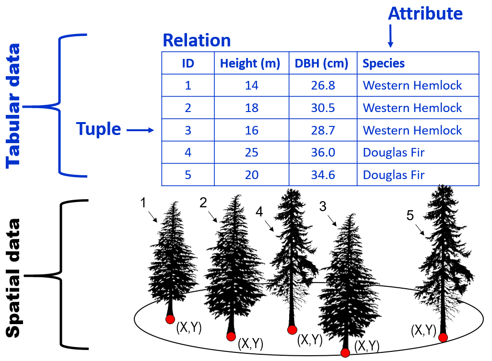
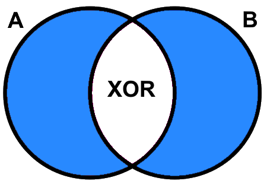

---
output:
  pdf_document: default
  html_document: default
---
```{r, include=FALSE}
baseurl <- "https://ubc-geomatics-textbook.github.io/geomatics-textbook/"
covlicence <- "https://opendata.vancouver.ca/pages/licence/"
library("dplyr")
library("rgdal")
library("leaflet")
library("xtable")
library("plyr")
```

```{r echo=FALSE}
yml_content <- yaml::read_yaml("chapterauthors.yml")
author <- yml_content[["relationalDatabases"]][["author"]]
```

# Relational Databases {#relational-databases}

Written by
```{r results='asis', echo=FALSE}
cat(author)
```

You have almost certainly used a relational database in some form during your life, probably without even realizing it. Relational databases are foundational for information management in a GIS. In this chapter, we will look at the formal construction of relational databases, how they are used across a wide range of fields, and how we can use them to analyze spatial and aspatial information for environmental management.

:::: {.box-content .learning-objectives-content}

::: {.box-title .learning-objectives-top}
## Learning Objectives {-}
::: 

1. Identify the purpose of Relational Database Management Systems in GIS
2. Describe the elements of relational databases
3. Practice applying relational algebra and Boolean logic to relations
4. Recognize the uses of different keys for joining and relating information
5. Understand how to query relational databases in order to extract or produce new information

::::

## Key Terms {-}

Relational Database Management Systems, Tables, Relations, Rows, Tuples, Records, Columns, Attributes, Items, Structured Query Language, Boolean Logic, Relational Algebra, Entity-Relationship Model, Cartesian Product, Schema, Unary, Binary, Georelational Data Model, Domain, Symmetric Difference

## Relational Database Management Systems

Suppose you have collected some data about some trees. You might have organized these data into a table, where each row represents a different plot, and each column represents some quantitative or qualitative measure about each record. How do you *manage* these data in order to extract useful information from your trees? This is where Relational Database Management Systems can help. A **Relational Database Management System (RDBMS)** is a software that allows the user to interact with tabular data. The basic services provided by a RDBMS include storing, querying, and manipulating relational databases. We say the databases are **relational** because they are based on a relational model first developed by Edgar Codd in the 1970s at IBM. The relational model for database management is distinguished from non-relational models by the fact that data are stored in highly structured tables instead of some other format like documents. This distinction is important, because the vast majority of GIS software utilize the relational model for database management.

## Relational Databases

Within a RDBMS, we find **relational databases**, which are highly structured tables comprised of rows and columns. In fact, a table in a relational database is called a **relation**, a row is a **tuple**, and a column is an **attribute**. Relational databases are a great way to store simple data structures that can be organized into a relation with tuples and attributes. When we say that a table or relation is "structured", we are referring to the fact that the data are organized according to a database **schema**, which is a set of constraints that ensure data integrity and consistency. For example, our set of trees likely all contain the same types of information and this can be easily organized into a relation. Suppose we measured the height, diameter at breast height (DBH), and species of each tree, then our relation would look like Figure \@ref(fig:5-tabular-data-spatial-data).

(ref:5-tabular-data-spatial-data-caption) Tabular and spatial data are related by a Relational Database Management System (RDBMS) in a Geographic Information System (GIS). Images of Douglas-Fir and Western Hemlock trees by @canadian_forest_service_douglas-fir_2013, Canadian Forest Service, modified with permission.

```{r 5-tabular-data-spatial-data, fig.cap = fig_cap, out.width= "75%", echo = FALSE}
    fig_cap = "(ref:5-tabular-data-spatial-data-caption)"
    
```

As you can see from the example above, there are two components to geospatial data: the tabular data containing tuples and attributes and the spatial data that contain the coordinate pairs for a projected or geographic coordinate system. This structure is known generically as the **georelational data model**. Many formats of geospatial data conform to the georelational data model, which stores a relation of tuples and attributes separately from another relation containing the geometry and coordinates. These two tables are then dynamically related to one another in a RDBMS using GIS software. You will almost never interact or see the relation that stores the geometry and coordinates of features contained in a relational database. Instead, the GIS software manages those files in the background for the purpose of displaying a set of features on a map, and you primarily interact with the tabular data stored in the relation of tuples and attributes.

The schema for the very simple example above would include the constraint and expectation that when we retrieve the height of a particular tree from the relation, it will be returned to us as an integer number and not a date. This logic is extended to all attributes so that types of values are never mixed and values are never unexpectedly changed by any database operation. That is to say, we can and often do intentionally change values in a relation, but any new values must conform to the database schema for a particular attribute, which may also be constrained by a range and type of potential values, known as an attribute **domain**.

More formally, a relation $R$ is a _subset_ of two sets, $A$ (tuples) and $B$ (attributes). The product of these sets $A×B$ is called the **Cartesian product**. In the same way that Cartesian coordinates are ordered pairs of values from two axes, the Cartesian product of two sets gives us an ordered pair of elements $(a,b)$ from sets $A$ and $B$, where $a$ is an element in the set $A$, written as $a∈A$, and $b$ is an element of set $B$, written as $b∈B$. Therefore, $R$ is both the Cartesian product as well as any subset of $A×B$.

(ref:5-cartesian-product-caption) Cartesian product A×B of A (tuples) and B (attributes). Image by @quartl_english_2012, CC BY-SA 3.0.

```{r 5-cartesian-product, fig.cap = fig_cap, out.width= "75%", echo = FALSE}
    fig_cap = "(ref:5-cartesian-product-caption)"
    knitr::include_graphics("images/05-cartesian-product.png")
```
<br/>

There are some important rules to be followed for organizing data into a relation:

1. Each tuple must share the same attributes as all the other tuples;
2. Each attribute has a unique name and is of the same _type_ of data (i.e., integer, floating-point decimal, text, date, boolean, etc.);
3. The order of tuples and attributes can be rearranged without changing the meaning or integrity of the data;
4. Each value of an element in a relation (i.e., combination of tuple and attribute) is _logically_ accessible; and 
5. Each tuple is unique (i.e., no duplicate observations).

If any of the above rules are broken, then $R≠A×B$ and you are just looking at a plain-old table instead of a relation. In fact, Codd described a total of 13 rules for a RDBMS, but since this chapter is only a cursory introduction of RDBMS for GIS, you only need to be familiar with the five rules above. In this way, relational databases are comprised of relations that are highly structured by a schema, which allows the user to query, retrieve, update, and delete data using a RDBMS. At this point, you should understand that relational databases are highly structured so that we can apply logical expressions and languages to interact with the information contained within and between the relations. In the next two sections, we will look at how to apply two branches of mathematical logic to relations in order to extract useful information.

## Relational Algebra

One of the fundamental jobs of a RDBMS is to apply relational algebra operations to relations stored in a relational database. Remember that we defined a relation as $R=A×B$ and that any subset of $A×B$ is also a relation. This transitive property of relations combined with the fact that relations are just sets allows us to apply set algebra. In other words, relational algebra operations take one relation as input and produce a new relation as an output without modifying the input relation. This new output relation can then be used as an input to another operation because it is also a relation.

## Selection

**Selection** is the simplest operation to understand and is probably the most-used in day-to-day GIS work. It does exactly what it sounds like, it retrieves a subset of a relation given some predicate or condition. For example, we could select all tree IDs from our relation $R$ in Figure \@ref(fig:5-tabular-data-spatial-data) that have a height greater than 20 m. This would yield tree ID=5. Formally, selection is expressed as $σ_{predicate}(R)$ and the example above would be written as $σ_{height>20}(R)$, which evaluates to the following:

```{r 5-selection-table, echo=FALSE}
ID <- 1:5
height <- c(14,18,16,25,20)
dbh <- c(26.8,30.5,28.7,36.0,34.6)
species <- c("Western Hemlock","Western Hemlock","Western Hemlock","Douglas-Fir","Douglas-Fir")
R <- data.frame(ID=ID,Height=height,DBH=dbh,Species=species)
names(R) <- c("ID","Height (m)", "DBH (cm)", "Species")
knitr::kable(
  R[which(R$`Height (m)`>20),], booktabs = TRUE, row.names = FALSE
)
```

## Projection

If selection is understood to operate on attributes to return tuples, then **projection** is an operation on tuples to return attributes. For example, suppose we are only interested in the height and DBH attributes for the trees. We would use projection to return this new subset of the relation. Formally, projection is expressed as $Π_{predicate}(R)$. Both projection and selection are referred to as **unary** operators because they only require a single relation as input. The example above would be expressed using the attributes that we want to preserve, so $Π_{height,dbh}(R)$, which evaluates to the following:

```{r 5-projection-table, echo=FALSE}
knitr::kable(
  R[,c(-1,-4)], booktabs = TRUE, row.names = FALSE
)
```

At this point, it is important to emphasize the case of $Π_{species}(R)$, which evaluates to:

```{r 5-projection-table-2, echo=FALSE}
spu <- unique(R$Species)
Tr <- data.frame(Species=spu)
knitr::kable(
  Tr, booktabs = TRUE, row.names = FALSE
)
```

Recall that the output of a relational algebra operation is also a relation. Remember the rule that a relation cannot have any duplicate tuples? Well, in the case of a 1-dimensional relation where we only have one attribute and several tuples, any duplicate values for the tuples must be eliminated, leaving us with only the two unique values "Douglas-Fir" and "Western Hemlock" when we project $R$ over $Species$. You should recognize now that this property of projection can be useful for identifying the unique values of any attribute, which is frequently needed when sorting through a relational database.

## Rename

**Rename** is an operator that allows us to assign a variable name to a relational algebra expression. This has the benefit of making it simpler to track or reuse previous operations in complex relational database algebra. For example, let $S = σ_{height>20}(R)$, then $Π_{species}(S)$ evaluates to:

```{r 5-rename-table, echo=FALSE}
knitr::kable(
  data.frame(Species=R[which(R$`Height (m)`>20),4]), booktabs = TRUE, row.names = FALSE
)
```

## Set Union

Next we will introduce **binary** operators, that is, they take two relations as input. **Set Union** is one such operator that effectively appends one relation to another. The important rule for union is that both input relations must share the same number and type of attributes or "union compatible". Formally, set union is expressed as $S∪T$ where $S$ and $T$ are the two input relations. You can think of set union as simply concatenating the tuples of the two relations together. In other words, the tuples of $S$ are appended to the tuples of $T$ to generate a new output relation. For example, suppose that we make two subsets of our relation $R$ of trees:

$$
S = σ_{height<20}(R)
$$

$$
T = σ_{height≥20}(R)
$$

Then we can union these two relations back into our original relation $R$ as $S∪T$, which evaluates to:

```{r 5-set-union-table, echo=FALSE}
knitr::kable(
  R, booktabs = TRUE, row.names = FALSE
)
```

Formally, this would all be expressed as $σ_{height<20}(R)∪σ_{height≥20}(R)$ or $S∪T$, which in this case is also just equivalent to $R$. You should see that the result of union is an inclusion of all tuples, so semantically a union can be read as "the tuples in relation $S$ _or_ the tuples in relation $T$". 

## Set Intersection

On the other hand, suppose that we want to define a new relation based on restricting the set of tuples that are in two different relations. This is known as **set intersection** and is formally expressed as $S∩T$. Just like union, intersection also requires that the two relations be union compatible. Suppose we have two relations defined by subsetting height by < 25 m and > 15 m:

$$S = σ_{height<25}(R)$$

```{r 5-set-intersection-table, echo=FALSE}
knitr::kable(
  R[which(R$`Height (m)`<25),], booktabs = TRUE, row.names = FALSE
)
```

$$T = σ_{height>15}(R)$$
```{r 5-set-intersection-table-2, echo=FALSE}
knitr::kable(
  R[which(R$`Height (m)`>15),], booktabs = TRUE, row.names = FALSE
)
```

There are 3 tuples that appear in both of these relations, so the intersection $S∩T$ would evaluate to:

```{r 5-set-intersection-table-3, echo=FALSE}
knitr::kable(
  R[c(2,3,5),], booktabs = TRUE, row.names = FALSE
)
```

Semantically, set intersection is read as "the tuples in relation S _and_ the tuples in relation T". 

## Set Difference

**Set difference** returns the tuples that are unique in one relation relative to another relation, but both relations must be union compatible. Formally, difference is expressed as $S-T$, and just like mathematical subtraction, the order of relations in the set difference is important and non-commutative. For example, $σ_{height<25}(R)-σ_{height>15}(R)$ evaluates to:

```{r 5-set-difference-table-1, echo=FALSE}
knitr::kable(
  R[1,], booktabs = TRUE, row.names = FALSE
)
```

and $σ_{height>15}(R)-σ_{height<25}(R)$ evaluates to:

```{r 5-set-difference-table-2, echo=FALSE}
knitr::kable(
  R[4,], booktabs = TRUE, row.names = FALSE
)
```

Semantically, you would read the set difference $S-T$ as "the tuples in relation $S$ minus any of the same tuples in relation $T$".

## Cartesian Product

So far, we have seen the cases of mathematical addition (set union) and subtraction (set difference), but we can also apply multiplication and division. Multiplication of two relations is simply known as the **Cartesian product**. In the same way that a set of tuples and attributes can be multiplied to create a relation $R=A×B$, we can also multiply two relations together and they do not need to be union compatible. For example, if $S = Π_{height,dbh}(σ_{height<20}(R))$ evaluates to:

```{r 5-cartesian-product-1, echo=FALSE}
Sr <- R[1:3,2:3]
knitr::kable(
  Sr, booktabs = TRUE, row.names = FALSE
)
```

and $T = Π_{ID,Species}(σ_{dbh>34}(R))$ evaluates to:

```{r 5-cartesian-product-2, echo=FALSE}
Tr <- R[4:5,c(1,4)]
knitr::kable(
  Tr, booktabs = TRUE, row.names = FALSE
)
```

then the Cartesian product of $S×T$ evaluates to:

```{r 5-cartesian-product-3, echo=FALSE}
i <- rep(R[4:5,1],3)
h <- rep(R[1:3,2],2)
d <- rep(R[1:3,3],2)
s <- rep(R[4:5,4],3)
df <- data.frame(i,h,d,s)
names(df) <- c("ID","Height (m)","DBH (cm)","Species")
knitr::kable(
  df, booktabs = TRUE, row.names = FALSE
)
```

## Set Divison

Finally, **set division** is an operation of division between two relations, and you can think of it semantically as, "all the values of an attribute in $R$ that are found with the tuples of $S$." Set division is expressed as $S÷T=U$ and like the Cartesian product and set difference, set division is non-commutative, so the order of $S$ and $T$ changes the value of $U$. 

For the next example of set division, we will introduce a new relation $S$, which is not a subset of $R$. Suppose, in addition to $R$, we have cataloged information about different tree species, some of which are in $R$ (these data are a small sample of a full list of tree species codes commonly used in British Columbia, Canada [@forest_practices_branch_silviculture_2005]):

```{r 5-set-division-1, echo=FALSE}
co <- c("AT","BB","CW","E","FD","HW","YC")
sp <- c("Trembling Aspen","Balsam Fir","Western Red Cedar","Birch","Douglas-Fir","Western Hemlock","Yellow Cedar")
S <- data.frame(Code=co,Species=sp)
knitr::kable(
  S, booktabs = TRUE, row.names = FALSE
)
```

Suppose we want to answer the question, _What are all the species codes that are present in our plot of trees?_ We can answer this question by first projecting $Species$ over $R$ to give relation $T=Π_{species}(R)$:

```{r 5-set-division-2, echo=FALSE}
Pt <- data.frame(Species=unique(R$Species))
knitr::kable(
  Pt, booktabs = TRUE, row.names = FALSE
)
```

Then, dividing $S$ by $T$, $S÷T=U$, can be formally expanded to:

$$
Π_{code}(S) - Π_{code}((Π_{code}(S) × T) - S)
$$

We read the first term $Π_{code}(S)$ as "the projection of the attributes of $S$ that are not in $T$". In our case, there is only one attribute in $S$ not in $T$, which is $Code$, so $Π_{code}(S)$ evaluates to:

```{r 5-set-division-3, echo=FALSE}
Ps <- data.frame(Code=unique(S$Code))
knitr::kable(
  Ps, booktabs = TRUE, row.names = FALSE
)
```

Then, $Π_{code}(S)×T$ is the Cartesian product of the previous projection and $T$, which yields a relation of all the combinations of $T$ with the attributes in $S$ that are not in $T$:

```{r 5-set-division-4, echo=FALSE}
Ct <- expand.grid(Ps$Code,Pt$Species)
names(Ct) <- c("Code","Species")
knitr::kable(
  Ct, booktabs = TRUE, row.names = FALSE
)
```

Next, we take the set difference between the Cartesian product above and $S$, $(Π_{code}(S)×T)-S$, which has the effect of removing the tuples already observed in $S$. This leaves us with a relation that has all the "incorrect" code-species combinations:

```{r 5-set-division-5, echo=FALSE}
Ds <- Ct[paste0(Ct$Code,Ct$Species)%in%setdiff(paste0(Ct$Code,Ct$Species),paste0(S$Code,S$Species)),]
knitr::kable(
  Ds, booktabs = TRUE, row.names = FALSE
)
```

Next, we project $Code$, which again is the only attribute in $S$ not in $T$, from the set difference above $Π_{code}((Π_{code}(S) × T) - S)$, which yields:

```{r 5-set-division-6, echo=FALSE}
PDs <- data.frame(Code=unique(Ds$Code))
knitr::kable(
  PDs, booktabs = TRUE, row.names = FALSE
)
```

And finally, we take the set difference between $Π_{code}(S)$ and the projection above to obtain the code for the trees in our plot:

```{r 5-set-division-7, echo=FALSE}
U <- data.frame(Code=S[S$Species%in%setdiff(Pt$Species,PDs$Code),1])
knitr::kable(
  U, booktabs = TRUE, row.names = FALSE
)
```

You can think of set division as the inverse of a Cartesian product. However, just like division, the Cartesian product itself is non-commutative because it is a set of _ordered_ pairs. If $S$ contains a tuple that is not in $T$, then the Cartesian product of $S×T$ has a different order than would be the case if both $S$ and $T$ were identical. As an example, $S×T$ evaluates to:

```{r 5-set-division-8, echo=FALSE}
C.ut <- data.frame(do.call(expand.grid, lapply(list(U$Code,Pt$Species), unique)))
names(C.ut) <- c("Code","Species")
knitr::kable(
  C.ut, booktabs = TRUE, row.names = FALSE
)
```

and $T×S$ evaluates to:

```{r 5-set-division-9, echo=FALSE}
C.tu <- data.frame(do.call(expand.grid, lapply(list(Pt$Species,U$Code), unique)))
names(C.tu) <- c("Species","Code")
knitr::kable(
  C.tu, booktabs = TRUE, row.names = FALSE
)
```

Therefore, we cannot simply rewrite $S÷T=U$ as $U×T=S$, but we could express $U÷S=T$, which evaluates to $T$:

```{r 5-set-division-10, echo=FALSE}
knitr::kable(
  Pt, booktabs = TRUE, row.names = FALSE
)
```

We have now considered the eight primary relational algebra operators (selection, projection, rename, set union, set intersection, set difference, Cartesian product, and set division) that can be applied to relations in a RDBMS. In the next section, we will look at another set of logical operators known as Boolean algebra, which give rise to logical languages for interacting with a RDBMS.

## Boolean Algebra

Whenever we create and solve an arithmetic or relational algebra expression, we usually focus on the _value_ of the output. In other words, $1+1$ evaluates to a value of $2$. But we often need to evaluate the _truth_ of a statement. For example, $1+1=2$ is a $true$ statement and $1+1=1$ is a $false$ statement. **Boolean algebra** seeks to express mathematical expressions in terms of _truth values_. Boolean truth values are usually expressed as $true$ or $false$, but it is also common in computer programming languages and GIS to see these encoded with values of $1$ for $true$ and $0$ for $false$. Attributes can also take on Boolean values of $true$ or $false$ as a data type. Boolean algebra uses equality and conditional operators, which we will consider next.

## Equality Operators

You are probably already familiar with the basic equality operators used in Boolean algebra:
- $=$ "exactly equal to" (usually expressed with $==$)
- $>$ "greater than"
- $≥$ "greater than or equal to" (usually expressed with $>=$)
- $<$ "less than"
- $≤$ "less than or equal to" (usually expressed with $<=$)
- $≠$ "not equal to" (usually expressed with $!=$ or $<>$)

All of the equality operators above evaluate to logical $true$ or $false$ values. They are quite elementary, so we will not go into much detail except to show that these equality operators are the basis for forming more complex Boolean expressions. Basic arithmetic expressions can also be applied to Boolean truth values and it can be helpful to rewrite Boolean values with values of $1$ and $0$:

- $true+true=2$
- $true+false=1$
- $false+false=0$
- $true-true=0$
- $true÷false=undefined$
- $false÷true=0$
- $true×true=1=true$
- $5×false=0=false$

Multiplication of Boolean values is a special case where the expression will always result in a Boolean value. That is, multiplying any combination of $1$ and $0$ will always return $1$ or $0$. In other words, the domain of the input $[0,1]$ is equivalent to the domain of the output $[0,1]$, which is a property that is frequently exploited in GIS in order to concatenate more complex expressions. For example, the statement $true×(1+2=3)×(4>3)$ can be rewritten as $1×1×1$ and evaluates to $true$, while $true×(1+2=3)×(4<3)$ can be rewritten as $1×1×0$ and evaluates to $false$. 

Below are some examples of using equality operators and what they evaluate to:

$true=false$ can be rewritten as $1=0$, which is $false$.
$true>false$ can be rewritten as $1>0$, which is $true$.
$true≠false$ is $true$.
$1+1=1$ is $false$.
$2+3=4+1$ is $true$.

Next, we will look at how to apply arithmetic and equality expressions to relations and evaluate them in Boolean terms. We have already seen how predicates allow us to do set selection with relational algebra. For example, we know that q evaluates to:

```{r 5-equality-operators, echo=FALSE}
knitr::kable(
  R[which(R$`Height (m)`>15),], booktabs = TRUE, row.names = FALSE
)
```

If we were to break this down in Boolean terms, the statement $height>15$ applied to $R$ returns the following Boolean values for each tuple:

```{r 5-equality-operators-2, echo=FALSE}
Rtf <- R
Rtf$Boolean <- R$`Height (m)`>15
knitr::kable(
  Rtf, booktabs = TRUE, row.names = FALSE
)
```

For another example, consider that $(height>15)×(species=WesternHemlock)$ evaluates to:

```{r 5-equality-operators-3, echo=FALSE}
Rtf$Boolean <- (R$`Height (m)`>15 & R$Species=="Western Hemlock")
knitr::kable(
  Rtf, booktabs = TRUE, row.names = FALSE
)
```

We can also evaluate the equivalency between two attributes such as $height=dbh$, which evaluates to:

```{r 5-equality-operators-4, echo=FALSE}
Rtf$Boolean <- R$`Height (m)`==R$`DBH (cm)`
knitr::kable(
  Rtf, booktabs = TRUE, row.names = FALSE
)
```

## Conditional Operators

Now that we have a good understanding of equivalency operators, let us turn to consider conditional operators, which are also known as Boolean operators. Boolean operators are, in some ways, similar to some arithmetic operators except that they are based on natural language. There are three primary Boolean operators: $AND$, $OR$, $XOR$, and $NOT$. These operators are commonly used for database queries and with search engines, and indeed they form an important basis for query languages that are used to interact with an RDBMS. 

Consider the statement $(height>15)AND(species=WesternHemlock)$. This statement is equivalent to $(height>15)×(species=WesternHemlock)$ and evaluates to exactly what what we saw earlier:

```{r 5-conditional-operators, echo=FALSE}
Rtf$Boolean <- (R$`Height (m)`>15 & R$Species=="Western Hemlock")
knitr::kable(
  Rtf, booktabs = TRUE, row.names = FALSE
)
```

Figure \@ref(fig:5-boolean-and) illustrates what is going on here, we are only returning the tuples that evaluate $true$ for both statements. Hence, Boolean $AND$ is equivalent to multiplying two Boolean truth values together. You should also recognize that a Boolean $AND$ is equivalent to what a set intersection $A∩B$ achieves between two relations.

```{r 5-boolean-and, fig.cap = fig_cap, out.width= "75%", echo = FALSE}
    fig_cap <- paste0("Boolean A AND B returns the area shaded blue. Pickell, CC-BY-SA-4.0.")
    knitr::include_graphics("images/05-boolean-and.png")
```

If we do not want to be so restrictive, we could use Boolean $OR$ such as $(height>15)OR(species=WesternHemlock)$, which evaluates to:

```{r 5-conditional-operators-2, echo=FALSE}
Rtf$Boolean <- (R$`Height (m)`>15 | R$Species=="Western Hemlock")
knitr::kable(
  Rtf, booktabs = TRUE, row.names = FALSE
)
```

Figure \@ref(fig:5-boolean-or) illustrates the case of the Boolean $OR$. As you can see, it returns everything where either of the statements evaluate to $true$, regardless if the other statement is $false$. You should also recognize that a Boolean $OR$ is equivalent to what a set union $A∪B$ achieves between two relations. 

```{r 5-boolean-or, fig.cap = fig_cap, out.width= "75%", echo = FALSE}
    fig_cap <- paste0("Boolean A OR B returns the area shaded blue. Pickell, CC-BY-SA-4.0.")
    knitr::include_graphics("images/05-boolean-or.png")
```

Suppose we want to identify all the trees that are greater than 15 m, but not Western Hemlock. In this case, we would use the expression $(height>15)NOT(species=WesternHemlock)$, which evaluates to:

```{r 5-conditional-operators-3, echo=FALSE}
Rtf$Boolean <- (R$`Height (m)`>15 & !R$Species=="Western Hemlock")
knitr::kable(
  Rtf, booktabs = TRUE, row.names = FALSE
)
```

Figure \@ref(fig:5-boolean-not) illustrates how Boolean $NOT$ essentially negates or inverts the statement that follows. In this case, instead of returning the Western Hemlock tuples, $NOT(species=WesternHemlock)$ returns "everything except" Western Hemlock, which is also equivalent to $species≠WesternHemlock$.

```{r 5-boolean-not, fig.cap = fig_cap, out.width= "75%", echo = FALSE}
    fig_cap <- paste0("Boolean A NOT B returns the area shaded blue. Pickell, CC-BY-SA-4.0.")
    knitr::include_graphics("images/05-boolean-not.png")
```
<br/>

Finally, the case of Boolean $XOR$ returns any tuples that are not $true$ for both statements, but are $true$ individually. This is known as the **symmetric difference** and "e**X**clusive **OR**" because we are only returning the tuples that are exclusive based on both statements. For example, $(height>15)XOR(species=WesternHemlock)$ evaluates to:

```{r 5-conditional-operators-4, echo=FALSE}
Rtf$Boolean <- (R$`Height (m)`>15 | R$Species=="Western Hemlock") & !(R$Species=="Western Hemlock"&R$`Height (m)`>15)
knitr::kable(
  Rtf, booktabs = TRUE, row.names = FALSE
)
```

Figure \@ref(fig:5-boolean-xor) illustrates how Boolean $XOR$ excludes all the tuples that evaluate to $true$ for both statements. In the example above, tuples ID=2 and ID=3 are excluded because both of the statements for height and species are $true$. 

```{r 5-boolean-xor, fig.cap = fig_cap, out.width= "75%", echo = FALSE}
    fig_cap <- paste0("Boolean A XOR B returns the area shaded blue. Pickell, CC-BY-SA-4.0.")
    
```
<br/>

## Joining Relations

More often than not, information is stored in separate relations, even if that information is about the same features like lakes, forests, or cities. Remember that a relation cannot have any duplicate tuples. This rule encourages the efficient storage and retrieval of information because information can be dynamically related as needed. For example, consider the overwhelming amount of information that is collected during a census. During the last census in 2016, there were over 14 million households in Canada. Can you imagine wielding a relation with 14 million tuples? These households can be segmented geographically by province, metropolitan areas, municipalities, and census subdivisions as well as by socioeconomic themes such as Indigenous peoples, age, sex, education, income, labour, housing, language, and others. Thus, those 14 million households can be divided up into many smaller relations, which can be accessed and summarized geographically and thematically. Since these relations represent different geographies or themes on the same set (i.e., households), we need to be more specific about how exactly two relations get combined if, for example, we want to combine themes with geographies. For this reason, we have joins. 

## Keys

Like the Cartesian product, joins are always binary operations, requiring two relations as input. While the Cartesian product combines relations by ordering all pairs of the elements from the two relations, we need a different method for correctly linking the tuples in relation $R$ that correspond to the tuples of $S$. To do this, we rely on a common attribute called a **key**, which acts as an address between two relations. A **primary key** serves the purpose to identify the unique tuples in a relation and so it can be used to link other attribute information to those tuples. In a GIS, anytime that you create, copy or modify features such as points, lines or polygons, the newly created data layer (within the relational database) will be indexed with a primary key that counts from 1 to the number of features (tuples) $n$ or from 0 to $n-1$. For example, $ID$ in our relation $R$ serves as the primary key. There are other attributes in $R$ that also uniquely identify all the tuples, but why do you think $Height$ or $DBH$ would be a poor operational choice as a primary key for a large field campaign?

While the primary key identifies the unique tuples in relation $R$, another key called the **foreign key**, serves to locate the same tuples in another relation $S$. In other words, a join is defined by a common attribute that is shared between two relations, the primary key in $R$ and the foreign key in $S$. For example, $Species$ is a foreign key in $R$ and a primary key in $S$. The case of joining two relations using a set of attributes instead of a single attribute requires a **composite key**. For example, suppose we have a spatial dataset of all the municipalities across Canada. Some of these municipalities will share the same name, though they are in different provinces. Richmond is a city in British Columbia, Ontario, and Quebec. If we need to join census data to these spatial features, we would need to use a composite key comprised of $CityName$ and $ProvinceName$.

## Natural Join

A **natural join** restrictively joins two relations based on a set of common attributes. In this way, natural join is similar to a set intersection in that we are only combining tuples that share an attribute value and any tuples that do not share an attribute value in the other relation are dropped from the output. However, a natural join does not require that two relations be union compatible like a set intersection. Instead, the only requirement is that at least one attribute is shared between the two relations and has the same domain. Formally, natural join is expressed as $R⋈S$. and is sometimes referred to as an inner join. As an example, consider our example relations $R$ and $S$:

$$R$$

```{r 5-natural-join, echo=FALSE}
ID <- 1:5
height <- c(14,18,16,25,20)
dbh <- c(26.8,30.5,28.7,36.0,34.6)
species <- c("Western Hemlock","Western Hemlock","Western Hemlock","Douglas-Fir","Douglas-Fir")
R <- data.frame(ID=ID,Height=height,DBH=dbh,Species=species)
names(R) <- c("ID","Height (m)", "DBH (cm)", "Species")
knitr::kable(
  R, booktabs = TRUE, row.names = FALSE
)
```

$$S$$

```{r 5-natural-join-2, echo=FALSE}
co <- c("AT","BB","CW","E","FD","HW","YC")
sp <- c("Trembling Aspen","Balsam Fir","Western Red Cedar","Birch","Douglas-Fir","Western Hemlock","Yellow Cedar")
S <- data.frame(Code=co,Species=sp)
knitr::kable(
  S, booktabs = TRUE, row.names = FALSE
)
```

The natural join $R⋈S$ evaluates to:

```{r 5-natural-join-3, echo=FALSE}
knitr::kable(
  inner_join(R,S), booktabs = TRUE, row.names = FALSE
)
```

## Outer Join

An **outer join** joins all the tuples of two relations based on a common attribute. The result is similar to a set union, except the input relations do not need to be union compatible. Formally, an outer join or sometimes called a full join is expressed as $R⟗S$, which  evaluates to:

```{r 5-outer-join, echo=FALSE}
knitr::kable(
  full_join(R,S), booktabs = TRUE, row.names = FALSE
)
```

## Right and Left Outer Join

Sometimes, it may be desirable to join attributes or tuples from one relation, but not the other. For these cases, we can use either **right outer join** or **left outer join**. Formally, right outer join is expressed as $R⋉S$ and evaluates to:

```{r 5-right-left-outer-join, echo=FALSE}
knitr::kable(
  right_join(R,S), booktabs = TRUE, row.names = FALSE
)
```

Formally, left outer join is expressed as $R⋊S$ and evaluates to:

```{r 5-right-left-outer-join-2, echo=FALSE}
knitr::kable(
  left_join(R,S), booktabs = TRUE, row.names = FALSE
)
```

## Theta Join

We can also join relations conditionally and without sharing a common attribute, which is known as a **theta join** and expressed as $R⋈_θS$. To understand how a theta join works, it is useful to recognize that $R⋈_θS=σ_{θ}(R×S)$. As you can see, a theta join is simply a selection of a Cartesian product where theta $θ$ is the predicate. For example, $R⋈_{height>19}S$ evaluates to:

```{r 5-theta-join, echo=FALSE}
knitr::kable(
  inner_join(R[which(R$Height>19),],S), booktabs = TRUE, row.names = FALSE
)
```

## Cardinality of Joins

Depending on the schema of the two relations being joined, the number of tuples joined from one relation to another can vary and is known as **cardinality**. In the simplest case, one tuple in $R$ is joined to one tuple in $S$, and this cardinality is known as **one-to-one** usually expressed as 1:1. The natural join example above, $R⋈S$, is an example of **one-to-many** (1:M) or **many-to-one** (M:1) cardinality because one species tuple found in $S$ corresponds to many species tuples in $R$. Finally, **many-to-many** (M:M) cardinality describes the case where there are multiple tuples in $R$ that correspond to multiple tuples in $S$. An example of a many-to-many relationship might be many species of trees in $R$ that correspond to many forest stands in $S$. In other words, a forest stand might be comprised of many species and any particular species might be found in many forest stands. Figure \@ref(fig:5-join-cardinality) illustrates how cardinality might emerge depending on the relational schema and problem at hand.

```{r 5-join-cardinality, fig.cap = fig_cap, out.width= "75%", echo = FALSE}
    fig_cap <- paste0("Cardinality of joins between relations R and S. Pickell, CC-BY-SA-4.0.")
    knitr::include_graphics("images/05-join-cardinality.png")
```

## Structured Query Language

Throughout this chapter, we have seen the various ways that relations are manipulated through relational algebra, Boolean logic, and joins. Since a GIS relies on a RDBMS to interact with data, especially data in the attribute table, geomatics professionals literally need a language to programmatically execute relational algebra, joins, and the other functions of a RDBMS within the GIS software. Such languages are known as query languages, each with its own syntax and use. By far, the most commonly used query language for RDBMS in GIS and across other systems is **Structured Query Language** abbreviated **SQL** and pronounced "sequel". SQL has five primary language elements:
1. Clauses state an action or operation;
2. Expressions evaluate to a value;
3. Predicates evaluate an expression using equivalency and Boolean operators;
4. Queries apply set selection on a predicate; and
5. Statements are the combination of all the elements above

SQL has numerous keywords, which are the actions that comprise a clause. It is beyond the scope of this textbook to describe all of them, but most of the SQL keywords are implemented within GIS software in other ways. For example, you would rarely need to programmatically `ADD` an attribute to a relation. Instead, you might click an "Add field" button within the GIS software you are using. Similarly, you might never programmatically `UPDATE` the value for a tuple because most GIS software will allow you to simply double-click a cell in the table and change the value. The primary action that is nearly always performed programmatically with proper SQL syntax is applying a query, which is what we will focus on for this section.

SQL queries are fundamental for implementing set selection $σ_{predicate}$ and they look like this:

```
SELECT attributes
FROM relation
WHERE predicate;
```

The entire form above is a statement, which is enclosed by a semi-colon at the end. The statement is comprised of three clauses using the keywords: `SELECT`,`FROM`, and `WHERE`. The `SELECT attributes` clause defines which attributes of the relation will be returned. You should recognize that this is the equivalent of applying a set projection $Π_{attributes}$ to the entire set selection statement. You can specify attributes by name (e.g., `SELECT Species`), but it is more common to return all of the attributes of the relation with an asterisk like `SELECT *`. The `FROM relation` clause defines which relation the selection is performed on. Keeping in mind that a RDBMS is comprised of many relations and at any given time you may have several different data sources open in your GIS software, the `FROM` keyword helps to clarify exactly which relation contains the attributes defined by the `SELECT` clause. Finally, the `WHERE predicate` clause defines the predicate that will be evaluated for the set selection, and this is where the magic happens. Although this is the formal syntax for a SQL query, most GIS software will usually only require the user to define the predicate, so next we will look at how to construct different SQL queries on our relation $R$.

Suppose we want to select the trees that are greater than 15 m, like in our previous equivalency example of $σ_{height>15}(R)$. The SQL statement looks like this `SELECT * FROM R WHERE height > 15;`. If we only want to return the species for tree heights greater than 15 m, then the SQL statement looks like this `SELECT Species FROM R WHERE height > 15;` and evaluates to:

```{r 5-SQL, echo=FALSE}
knitr::kable(
  data.frame(Species=R[which(R$`Height (m)`>15),4]), booktabs = TRUE, row.names = FALSE
)
```

The above SQL statement would be an example of $Π_{species}(σ_{height>15}(R))$. In SQL, the multiplication symbol has the arithmetic meaning and cannot be used to concatenate two predicates. For this reason, we have the Boolean operators for evaluating multiple predicates. For example, $(height>15)×(species=WesternHemlock)$ would be written in SQL as `SELECT * FROM R WHERE height > 15 AND species="Western Hemlock";`. Our previous example of using Boolean $NOT$ in SQL would be written as `SELECT * FROM R WHERE NOT species="Western Hemlock";`. These are all relatively simple examples, but it common to create more complicated queries that use several Boolean operators. Note here how the species value in the expression above is in quotation marks `"Western Hemlock"` because the data type of the species attribute is a _string_. By contrast, the height value in the previous expression is simply an _integer number_. It is important to emphasize at this point that the only equivalency operator that can be used with string data type attributes is $=$. In other words, `"Western Hemlock">"Douglas-Fir"` is illogical, cannot be evaluated, and will return an error. 

If you combine two or more Boolean operators into one statement, then they are evaluated in SQL according to the following precedence:
1. Anything enclosed within parentheses `()`
2. `NOT`
3. `AND`
3. `OR`
For example, `SELECT * FROM R WHERE dbh < 30 AND species="Douglas-Fir" OR species="Western Hemlock";` would evaluate to:

```{r 5-SQL-2, echo=FALSE}
knitr::kable(
  R[which(R$`DBH (cm)`<30 & R$Species=="Douglas-Fir" | R$Species=="Western Hemlock"),], booktabs = TRUE, row.names = FALSE
)
```

But if we want the `OR` to be evaluated before the `AND`, then we need to use parentheses like `SELECT * FROM R WHERE dbh < 30 AND (species="Douglas-Fir" OR species="Western Hemlock");`, which evaluates to:

```{r 5-SQL-3, echo=FALSE}
knitr::kable(
  R[which(R$`DBH (cm)`<30 & (R$Species=="Douglas-Fir" | R$Species=="Western Hemlock")),], booktabs = TRUE, row.names = FALSE
)
```

You may notice the case of $XOR$ conspicuously missing from the order above and this is because SQL does not natively implement the $XOR$ operator. If you want to evaluate the exclusive OR example used in the previous section, $(height>15)XOR(species=WesternHemlock)$, then you would construct a SQL statement like this `SELECT * FROM R WHERE (height > 15 OR species="Western Hemlock") AND NOT (species="Western Hemlock" AND height > 15);`. As you can see, SQL queries can quickly get complex and involve many Boolean operators, so it is important to understand operator precedence and whenever in doubt, you can always use parentheses to override any precedence rules. You should also recognize that there are many ways to write complex statements to achieve your desired selection and you should always prefer the simplest statement possible.

Finally, a very common query that involves returning all tuples that match an attribute value in a list of values can be applied using the `IN` operator in SQL. For example, suppose we want to select all conifer tree species (codes: BB, CW, FD, HW, and YC) from $S$ below:

```{r 5-SQL-4, echo=FALSE}
knitr::kable(
  S, booktabs = TRUE, row.names = FALSE
)
```

Your natural reaction to this problem might be to write a long SQL statement like `SELECT * FROM S WHERE code="BB" OR code="CW" OR code="FD" OR code="HW" OR code="YC";`. This is perfectly fine, but you can write this more economically with `IN` such as `SELECT * FROM S WHERE code IN("BB","CW","FD","HW","YC");`. Be aware that a common mistake is to write a long predicate using `OR` like `code="BB" OR "CW" OR "FD" OR "HW" OR "YC"`, but this is incorrect syntax in SQL. Remember that each side of an `OR` or `AND` operator is an _expression_ that evaluates to a Boolean truth value. So `code="BB" OR "CW"` will return an error because `"CW"` alone cannot be evaluated to a Boolean truth value.

## Case Study: Combining Socioeconomic and Vegetation Information for Assessing Population Vulnerability

*Case Study Author: Taelynn Lam (CC BY 4.0. unless otherwise indicated), University of British Columbia, Master of Geomatics for Environmental Management graduate, 2021*

Vegetation diversity in urban landscapes is important to support urban forest biodiversity and residents’ mental health. The aim of this case study is to link together socioeconomic data and vegetation information to identify areas to prioritize intervention in the City of Vancouver. The Canadian Index of Multiple Deprivation (CIMD) [@statistics_canada_canadian_2019] data has four dimensions of population vulnerability scores and we will aggregate these scores to obtain an overall vulnerability score for each dissemination area (DA) in Vancouver. We will compute the vegetation diversity score using street trees data [@city_of_vancouver_street_2012] and vegetation type cover richness data^[Obtained from reclassifying [Land Cover Classification 2014 - 2m Raster](http://www.metrovancouver.org/data) to one vegetation class and five vegetation classes and counted the number of vegetation type cover classes using the `Zonal Histogram` Tool.] and then use query to identify priority areas.

## Join

The raw CIMD tabular data includes the DA code and the corresponding vulnerability scores (table 1). In order to visualize these scores on a map, we will need to relate these scores to spatial data that include the information about the DA polygons and the coordinate pairs associated with each DA. Hence, a polygon shapefile of the DAs in Vancouver^[Extracted by clipping the [Canada-wide dissemination areas boundary](https://www12.statcan.gc.ca/census-recensement/2011/geo/bound-limit/bound-limit-2016-eng.cfm) to the [City of Vancouver's municipality boundary](https://opendata.vancouver.ca/explore/dataset/city-boundary).] is obtained, and its attributes are shown in Table 2.

```{r 5-case-join, echo=FALSE}
CIMD <- read.csv("data/05/bc_CIMD_scores.csv")
colnames(CIMD) <- c("PRCDDA", "Province","DA population", "Ethno-cultural composition quintiles", "Ethno-cultural composition scores", "Situational vulnerability quintiles", "Situational vulnerability scores", "Economic dependency quintiles", "Economic dependency scores", "Residential instability quintiles", "Residential instability scores")
knitr::kable(
  head(CIMD), booktabs = TRUE,
  caption = 'An excerpt of the CIMD data table.'
)
```

```{r 5-case-study-2, include=FALSE}
VancouverDA <- readOGR(dsn = "data/05", layer = "VancouverDA")
```

```{r 5-case-study-3, echo=FALSE}
knitr::kable(
  head(VancouverDA@data), booktabs = TRUE,
  caption = 'An excerpt of the Vancouver DA polygon shapefile attributes.'
)
```

The tabular data of the CIMD scores are related to the DAs polygon by the DA code. The cardinality of the relationship between these two tables is one-to-one as each DA is described by one set of the CIMD scores. To join the CIMD scores to the Vancouver DA polygons, we would use the `PRCDDA` attribute in the CIMD table as the foreign key to perform a join on the `DAUID` attribute in the Vancouver DA polygon relation. Now that the CIMD scores are joined to the Vancouver DA polygon attribute table, we can create choropleth maps to display the vulnerability scores of the DAs (Figure \@ref(fig:5-situational-vulnerability-leaflet)).

```{r 5-case-study-4, include=FALSE}
DA_CIMD <- readOGR(dsn = "data/05", layer = "VancouverDA_CIMD")

DA_CIMD@data <- DA_CIMD@data %>%
  mutate_if(is.numeric,round, digits = 3)

DA_CIMD_proj <- spTransform(DA_CIMD, "+proj=longlat +ellps=WGS84 +datum=WGS84 +no_defs")

pal <- colorNumeric(palette = "YlOrRd", domain = range(DA_CIMD@data$Situatio_1))

labels <- sprintf(
  "<strong>DAUID </strong> %s<br/><strong>Situational Vulnerabiltiy Score </strong> %g",
  DA_CIMD@data$DAUID, DA_CIMD@data$Situatio_1
) %>% lapply(htmltools::HTML)

m <- leaflet(DA_CIMD_proj) %>%
  addProviderTiles("CartoDB.Positron")%>%
  setView(lat = 49.255, lng = -123.153, zoom = 11) %>%
  addPolygons(fillColor = pal(DA_CIMD@data$Situatio_1), 
              weight = 0.6, 
              opacity = 1,
              color = "#c2c2c2",
              dashArray = NULL,
              fillOpacity = 0.8,
              highlight = highlightOptions(
                weight = 1.8, 
                color = "#6e6e6e",
                dashArray = NULL,
                fillOpacity = 0.7,
                bringToFront = TRUE),
              label = labels,
              labelOptions = labelOptions(
                style = list("font-weight" = "normal", padding = "3px 8px"), textsize = "12px", direction = "auto"
              )) %>%
  addLegend(pal = pal, values = ~DA_CIMD@data$Situatio_1, opacity = 0.7, 
            title = "Situational Vulnerabiltiy Score",
            position = "bottomleft")
```

```{r 5-situational-vulnerability-leaflet, echo=FALSE, out.width="100%", fig.cap=fig_cap}
if (knitr:::is_latex_output()) { fig_cap <- paste0("An example of choropleth map displaying the situational vulnerability scores in the City of Vancouver at DA level. Higher score represents the DA has higher situational vulnerable population e.g., population lacking a high school diploma, low-income population. Animated figure can be viewed in the web browser version of the textbook: https://ubc-geomatics-textbook.github.io/geomatics-textbook/relational-databases.html")
knitr::include_graphics("images/05-situational-vulnerability-leaflet.png")
} else { fig_cap <- paste0("An example of choropleth map displaying the situational vulnerability scores in the City of Vancouver at DA level. Higher score represents the DA has higher situational vulnerable population e.g., population lacking a high school diploma, low-income population.")
m
}
```
<br/>

## Calculation

Suppose we would like to calculate the overall vulnerability score for each DA. We would first name a new field (e.g., "aggregate_score"), set the data type to double (to allow negative values and values with decimal places), and then enter the mathematical expression to specify the calculation to sum the four dimensions of CIMD scores and divide it by four to obtain an averaged vulnerability score for each DA. Using similar steps, we could apply a min-max normalization to transform this overall vulnerability score to a range between 0 and 1 to allow for a quick interpretation of the score. The formula is as follows: $\frac{(X - X_{min})}{(X_{max} - X_{min})}$.

Using what you have learned, join the street tree data and the vegetation type cover richness data to the Vancouver DA attribute table and to compute a vegetation diversity score. The street trees data shows the number of unique street tree species at a DA. Make sure you apply a min-max normalization to obtain the street tree diversity score. The vegetation diversity score can be computed by averaging the normalized scores of the two vegetation data.

```{r 5-case-study-5, include=FALSE}
calculated <- readOGR(dsn = "data/05", layer = "Results")
calculated.full <- head(calculated@data[,c(1, 14, 15, 17, 16, 18, 21)])
colnames(calculated.full) <- c("DAUID","Aggregated scores", "Normalized aggregated scores", "Species count", "Street tree diversity", "Vegetation richness", "Vegetation diversity scores")
calculated.full <- calculated.full %>%
  mutate_if(is.numeric,round, digits = 3)
```

```{r 5-case-study-6, echo=FALSE}
knitr::kable(
  calculated.full, booktabs = TRUE,
  caption = 'An excerpt of the attribute table after the joins and calculations.'
)
```

```{r 5-case-study-7, include=FALSE}
full.results <- readOGR(dsn = "data/05", layer = "Results")
full.results_proj <- spTransform(full.results, "+proj=longlat +ellps=WGS84 +datum=WGS84 +no_defs")
full.results_proj$norm_aggre <- round(full.results_proj$norm_aggre, 2)
full.results_proj$veg_div_sc <- round(full.results_proj$veg_div_sc, 2)
pal1 <- colorNumeric(palette = "Greens", domain = range(full.results_proj@data$veg_div_sc))

labels <- sprintf(
  "<strong>DAUID </strong>%s<br/> <strong>Vegetation Diversity Score </strong>%g<br/><strong>Normalized Aggregated Vulnerabiltiy Score </strong>%g",
  full.results_proj$DAUID, full.results_proj$veg_div_sc, full.results_proj$norm_aggre
) %>% lapply(htmltools::HTML)

m1 <- leaflet(full.results_proj) %>%
  addProviderTiles("CartoDB.Positron")%>%
  setView(lat = 49.255, lng = -123.1533, zoom = 11) %>%
  addPolygons(fillColor = ~pal1(full.results_proj$veg_div_sc),
              weight = 0.6,
              opacity = 1,
              color = "#ffffff",
              dashArray = NULL,
              fillOpacity = 0.7,
              highlight = highlightOptions(
                weight = 1.8, 
                color = "#7d7d7d",
                dashArray = NULL,
                fillOpacity = 0.7,
                bringToFront = TRUE),
              label = labels,
              labelOptions = labelOptions(
                style = list("font-weight" = "normal", padding = "3px 8px"),
                textsize = "12px", direction = "auto")) %>%
  addLegend(pal = pal1, values = ~full.results_proj$veg_div_sc, opacity = 0.7, 
            title = "Vegetation Diversity Score",
            position = "bottomleft")
```

Figure \@ref(fig:5-vegetation-diversity-leaflet) shows a map of the vegetation diversity score at the DA level in Vancouver. The vegetation diversity score and the normalized aggregated vulnerability score are linked to each DA and can be viewed as you hover o-ver the DA.

```{r 5-vegetation-diversity-leaflet, echo=FALSE, out.width="100%", fig.cap=fig_cap}
if (knitr:::is_latex_output()) { fig_cap <- paste0("An example of choropleth map displaying vegetation diversity for each dissemination area in Vancouver. Data from City of Vancouver and licensed under the Open Government License - Vancouver. Lam, CC-BY-SA-4.0. Animated figure can be viewed in the web browser version of the textbook: https://ubc-geomatics-textbook.github.io/geomatics-textbook/relational-databases.html")
knitr::include_graphics("images/05-vegetation-diversity-leaflet.png")
} else { fig_cap <- paste0("An example of choropleth map displaying vegetation diversity for each dissemination area in Vancouver. Data from City of Vancouver and licensed under the Open Government License - Vancouver. Lam, CC-BY-SA-4.0.")
m1
}
```
<br/>

## Query  

Areas with a higher proportion of vulnerable populations and less variety of vegetation to support resident’s mental wellbeing are more in need for intervention. Supposed we define the priority area as DAs with a normalized aggregated vulnerability score greater than or equal to 0.5 and a vegetation diversity score less than 0.5. We could use the `Select By Attributes` tool to identify these priority areas by entering the appropriate query expression.

```{r 5-case-study-8, include=FALSE}
query.results <- calculated@data[calculated@data$norm_aggre >= 0.5 & calculated@data$veg_div_sc < 0.5,]
query.results <- query.results[,c(1,15,16,18,21)]
colnames(query.results) <- c("DAUID", "Normalized aggregated scores", "Street tree diversity", "Vegetation richness", "Vegetation diversity scores")
query.results <- query.results %>%
  mutate_if(is.numeric,round, digits = 3)
```

```{r 5-case-study-9, echo=FALSE}
knitr::kable(
  query.results, booktabs = TRUE,
  caption = 'Query result shows five records matched the priority area requirements.'
)
```

:::: {.box-content .call-out-content}

::: {.box-title .call-out-top}
## Remember This? {-}
:::

<p id="box-text">Models are abstractions of reality and help us understand and communicate complex ideas.</p>

::::

## Summary

Lorem ipsum dolor sit amet, consectetur adipiscing elit. Ut in dolor nibh. Lorem ipsum dolor sit amet, consectetur adipiscing elit. Praesent et augue scelerisque, consectetur lorem eu, auctor lacus. Fusce metus leo, aliquet at velit eu, aliquam vehicula lacus. Donec libero mauris, pharetra sed tristique eu, gravida ac ex. Phasellus quis lectus lacus. Vivamus gravida eu nibh ac malesuada. Integer in libero pellentesque, tincidunt urna sed, feugiat risus. Sed at viverra magna. Sed sed neque sed purus malesuada auctor quis quis massa.

## Reflection Questions {-}

1. Explain ipsum lorem.
2. Define ipsum lorem.
3. What is the role of ispum lorem?
4. How does ipsum lorem work?

## Practice Questions {-}

2. Given ipsum, solve for lorem.
3. Draw ipsum lorem.

## Recommended Readings {-}

Ensure all inline citations are properly referenced here.
