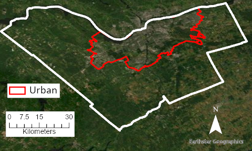
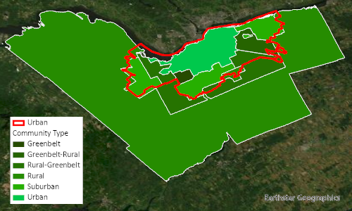

# Overlay and Proximity Analysis {#overlay-and-proximity-analysis}

Introduction here.

:::: {.box-content .learning-objectives-content}

::: {.box-title .learning-objectives-top}
## Learning Objectives {-}
::: 

1. Recognize the role of geoprocessing in applications of cartographic modeling
2. Understand the functions and opportunities of raster and vector overlay methods
3. Practice map algebra in raster overlay
4. Practice attribute transfer in vector overlay
5. Synthesize the role of relational databases in overlay analysis
6. 

::::

## Key Terms {-}

Overlay, Union, Intersect, Identity, Difference, Symmetrical Difference, Buffer, Near Distance, Thiessan Polygons, Dissolve?

## Cartographic Modelling

### Geoprocessing

### Capability Modelling

The result of capability modelling is a binary classification of features or cells in a raster: 1 or 0; yes or no; true or false; capable or not capable. Recall from Chapter 3 that ordinal data scales are used to rank or order categorical or qualitative data elements. Even with just two classes, a capability map uses an ordinal data scale because 1 (capable) is better than 0 (not capable).

### Suitability modelling

**Suitability modelling** is an extension of capability modelling that tells us how suitable a particular activity is for a given location. In other words, capability modelling gives us the spatial options that meet some minimum criteria and suitability modelling allows us to rank those options based on some attributes in our spatial data. From our earlier example, suppose we have identified 8 areas that are possible options for conserving habitat (i.e., capable), but we might only have the budget to proactively manage a few of these areas. So where should we prioritize our conservation and management activities? This is a question for suitability modelling!

Once we have calculated capability as an ordinal scale value (1 or 0), we can then use another set of attributes to calculate a **suitability score** for the capable areas. Frequently, the suitability score takes the form of a continuous ratio scale with values between $[0,1]$ or $[0,100]$ because we want to be able to place every capable feature on a spectrum from "least suitable" (0) to "most suitable" (1 or 100) based on some set of attributes. The calculation for the suitability score can take many forms and is dependent on the spatial problem that you are trying to solve. Some attributes can be used individually as a suitability score. For example, if bigger is better, then you could simply sort your capable features by area and you would have a suitability score on a continuous ratio scale, no further calculation needed. More commonly, we want to combine several attributes together in our scoring, which might represent data in different scales. Next, we will walk through an example for calculating a suitability score with nominal, ordinal, interval, and ratio data scales.

Suppose bigger really is better, so the area of the capable polygons will be one of our attributes for our suitability score, which is a ratio data scale. (By the way, you can extend this logic to lines and points as well: longer lines are preferred or a higher density of points is preferred.) Our first step here is to normalize these ratio data to a range of $[0,1]$ using the following equation: 

$$
X_{normalized} = (X-X_{min})/(X_{max}-X_{min})
$$

This is also called a min-max normalization, because the maximum value will be equal to 1 and the minimum value will be equal to 0:

```{r 6-area-normalization, echo=FALSE}
ID <- 1:8
areas <- c(9.96,7.02,6.46,6.15,5,3.33,2.8,2.23)
areas_norm <- (areas-min(areas))/(max(areas)-min(areas))
R <- data.frame(ID=ID,Area=areas,Normalized_Area=areas_norm)
names(R) <- c("ID","Area (ha)","Normalized Area (unitless)")
knitr::kable(
  R, booktabs = TRUE, row.names = FALSE
)
```

Maybe our species is also found in several possible habitats. Habitat cover is a nominal data scale (e.g., "forest", "wetland", "non-forest"). If we know that our species is found in "forest" 60% of the time, in "wetland" 30% of the time, and in "non-forest" 10% of the time, then we can actually convert these nominal habitat covers into a ratio scale (i.e., 0.6, 0.3 and 0.1). In the case that you do not have additional numerical data to make this conversion, you could also make an educated guess and assign weights to your classes that sum to 1. For example, based on the literature, we might hypothesize that our species has preferences for "forest", "wetland", and "non-forest" that can be quantified with the weights 0.5, 0.25, and 0.25, respectively. Either approach is sensible, as long as you are transparent about your choice. diuygudd

```{r 6-habitat-normalization, echo=FALSE}
habitats <- c("Non-forest","Wetland","Forest","Non-forest","Forest","Wetland","Wetland","Forest")
habitats_ratio <- c(0.1,0.3,0.6,0.1,0.6,0.3,0.3,0.6)
R <- data.frame(ID=ID,Habitat=habitats,Habitat_Ratio=habitats_ratio)
names(R) <- c("ID","Habitat (Nominal)","Habitat (Ratio)")
knitr::kable(
  R, booktabs = TRUE, row.names = FALSE
)
```

Maybe we also have land use intensities representing human activity and management that are classified as "high", "medium", and "low". These land use intensities are an ordinal data scale. Frequently, ordinal data scales in geomatics are derived from some other numerical analysis. For example, land use intensity may have initially been mapped from the density of roads in an area or the frequency of a particular industrial activity, which was then classified into "high", "medium", and "low" intensity classes. It is worth looking at the documentation of the mapped data you are working with to see how the ordinal data were generated and what assumptions went into the terms used (i.e., "high", "medium", and "low"). For our example, let us assume that we know nothing numerically about these land use intensities, just that "high" is worse for the conservation of our species than "low". If we return to our original question, __where should we prioritize our conservation and management activities?__, then most likely our efforts will be best spent conserving areas that currently have high land use intensity. In this case, we can convert these ordinal data into ratio data by assigning weights that sum to 1. For example, "high" is 0.8, "medium" is 0.15, and "low" is 0.05.

```{r 6-land-use-normalization, echo=FALSE}
landuse <- c("High","Low","Medium","Medium","Medium","Low","High","High")
landuse_ratio <- c(0.8,0.05,0.15,0.15,0.15,0.05,0.8,0.8)
R <- data.frame(ID=ID,Land_Use=landuse,Land_Use_Ratio=landuse_ratio)
names(R) <- c("ID","Land Use (Ordinal)","Land Use (Ratio)")
knitr::kable(
  R, booktabs = TRUE, row.names = FALSE
)

#do the weights for data that goes into the calculation have to sum to 1? I don't think so? I could see that for habitat type.. but for land use?  
```

Maybe we also have dates that represent the last year of a known disturbance like a fire. Dates are an interval data scale, but can easily be converted into a ratio scale by subtracting them from the current date to yield a measure of time-since something. For example, time-since last fire might be a good proxy for forage quality of our species regardless of the habitat cover. Once we have converted it to a ratio scale, we want to normalize it to a range of $[0,1]$, but suppose that more recent fire is better. In this case, we also need to reverse the range so that the oldest fire has a lower score than the most recent fire. We can achieve this by modifying the min-max equation so that we subtract $X$ from $X_{max}$:

$$
X_{normalized,reversed} = (X_{max}-X)/(X_{max}-X_{min})
$$

```{r 6-time-since-ratio, echo=FALSE}
years <- c(1972,1975,1978,1982,1984,1999,2013,2021)
years_ratio <- 2022-years
years_ratio_norm <- (max(years_ratio)-years_ratio)/(max(years_ratio)-min(years_ratio))
R <- data.frame(ID=ID,Years=years,Years_Ratio=years_ratio,Years_Normalized=years_ratio_norm)
names(R) <- c("ID","Year of fire (Interval)","Time-since last fire (Ratio)", "Time-since last fire (Normalized)")
knitr::kable(
  R, booktabs = TRUE, row.names = FALSE
)
```

Now we can put all the rescaled attributes together, add them up for each capable area, and divide by the total number of attributes that we used in our scoring process (four). This gives us an arithmetic mean that ranges between $[0,1]$ because all the other attributes also use this range. Sometimes this score is multiplied by 100 to convert the ratios into percentages. We can then sort the capable polygons in descending order by our suitability score:

```{r 6-final-score, echo=FALSE}
sum_scores <- areas_norm+habitats_ratio+landuse_ratio+years_ratio_norm
R <- data.frame(ID=ID,Normalized_Area=areas_norm,Habitat_Ratio=habitats_ratio,Land_Use_Ratio=landuse_ratio,Years_Normalized=years_ratio_norm,Sum_Scores=sum_scores,Suitability=sum_scores/4)
names(R) <- c("ID","Area","Habitat","Land Use","Time-since last fire","Sum of Scores","Suitability")
knitr::kable(
  R[order(R$Suitability, decreasing=T),], booktabs = TRUE, row.names = FALSE
)
```

We can see from the above suitability analysis that capable polygon number 8 has the highest overall suitability. It is important to highlight two points here: the suitability score is unitless (after all, we have combined four very different data scales together); and the scores are on the same ratio scale, which means they can be directly compared. In other words, the most suitable location is more than twice as suitable as the least suitable location, based on the criteria and scoring scheme we used.

Note that the choice of weights for ordinal and nominal data scales are arbitrary, but these numbers can be based on a hypothesis, other numerical data, or your project's values. You can also iterate the suitability scoring process with different weights for ordinal and nominal scale data so that you achieve your desired project outcomes such as statistical distribution of scores or frequency of scores above a particular threshold value. For example, if you are trying to simultaneously solve the related question, __I have X dollars, how should I allocate them?__, then you might run a cost analysis that uses attributes accounting for the cost of intervening at a location. If you can convert your attributes into a dollar (ratio) scale, then you can simply add everything together to get the total cost for the activity at any given location.

For example, suppose that we know that our conservation intervention costs \$10,000 per hectare and we have a total budget of \$150,000 to conserve 15 total hectares. Looking at the capable areas in the earlier table, the total area that __could__ be conserved is 44.22 hectares, which exceeds our budget. We need to solve two things: __where are our conservation efforts going to have the most impact on the species?__ and __how can we allocate our budget efficiently to achieve that impact?__ We have already solved the first problem, and the second problem is a matter of relating the costs to the suitability analysis, sorting the table based on the suitability score from our solution to the first problem, and then calculating a cumulative cost field that adds up the costs of the capable features in descending order of their suitability. This produces the following table:

```{r 6-final-score-and-cost, echo=FALSE}


cost=areas*10000

R <- data.frame(ID=ID,Normalized_Area=areas_norm,Area=areas,Suitability=sum_scores/4, Cost=cost)

R<-R[order(-R$Suitability),]
R$cum_cost=cumsum(R$Cost)


names(R) <- c('ID','Area (normalized)','Area (ha)','Suitability', 'Individual Cost (\\$)', 'Cumulative Cost (\\$)')

knitr::kable(
  R, booktabs = TRUE, row.names = FALSE
)


```
We can now see that prioritizing the top three suitable areas $ID = {8,7,1}$ for our conservation intervention will cost \$149,900, nearly exhausting our budget with \$100 left over for a party to celebrate the geomatics team. This is just one example of how cartographic modelling can provide powerful answers to very real spatial questions. Can you think of other mapped attributes, besides area, that could factor into this conservation cost analysis?

## Overlay Methods
In the above example, the data was provided already compiled. However, we often have to gather the data ourselves. Overlay methods allow us to get more information about a spatial area, based on other spatial attributes. One example of a suitability analysis would be an equity analysis. These analyses exist for many areas all across the globe. Ottawa, Ontario, for example, has a Neighborhood Equity Index (NEI). We will looking at Ottawa's NEI and will use data from Ottawa's Open Data Portal for the rest of this chapter.

(a highlighted box about the NEI)
Ottawa's NEI looks at several variables to assess the equitability of Ottawa's census tracts. The Index was published in 2021 using data from 2019 with the goal of improving Ottawa's decision-making. The 17 variables used to develop the index fit into five broad domains: economic opportunity, social and human development,  physical environment, health, and community and belonging. (Contains information licensed under the Open Government Licence – City of Ottawa.)

While the NEI is valuable and answers questions about the general well-being of citizens, it could be improved by the addition of cultural components. As it stands, the only cultural well-being component is citizens' closeness to community centres (which is in the physical environment domain).

Say, for example, you aimed to include citizens' exposure to cultural services. Such services could be public art, green spaces, street trees, and other points of interest. The developers of the NEI did consider the amount of usable green space within walking distance. However, that value did not make it into the final index.

For the rest of this chapter, we will develop a cultural equity index for Ottawa. The index can be developed at several scales: are you concerned with the city as a whole? Wards? Census tracts? Or are you assessing the service-providing assets individually? The answer to this is dependent on the question. For the following example, the study scale will be based on Ottawa's Wards in urban and suburban areas. 

We would start by downloading all of the necessary data we wish to work with. We will be working with several datasets: Ottawa's Urban Boundary, Ottawa's Wards, Street Trees, Parks and Greenspaces, and the Neighbourhood Equity Index (NEI) in Ottawa. All of this data can be found in Ottawa's Open Data Portal.


```Amy, verify all of the dataset names```

### Clip
A _clip_ is effectively a cookie-cutter, where the boundaries of the clipping feature become the boundaries of the input feature. However, a clip does not transfer attributes of the clipping file to the clipped product. Additionally, fields such as "area" must be recalculated after a clip.

Ottawa's open data catalogue contains a dataset with the "urban boundaries" of the City. This shapefile consists of one polygon and no additional information within the attribute table. If we wished to solely work within Ottawa's urban boundaries without suburban distinctions, we would _clip_ the data we have so far to the urban boundary. However, we want to differentiate between different community types within Ottawa; therefore, we must use a different tool.


```{r 6-ottawa-urb, echo=FALSE, out.width = '75%', fig.cap=fig_cap}
fig_cap <- paste0("An aerial image of Ottawa, Ontario. The City of Ottawa is bordered in while and the urban areas are bordered in red. Image created by Blood, CC-BY-SA-4.0. Contains information licensed under the Open Government Licence – City of Ottawa.")

```


### Dissolve
_Dissolve_ reduces the number of polygons in a shapefile by grouping everything with the same chosen attribute together. A _dissolve_ can be used to summarize data by a common attribute.

_If you look at Figure 6.1, what do you notice about the landscape within and then outside of the urban border?_ There is a lot of agricultural land within the City of Ottawa! The large amount of rural area within Ottawa makes it a demographically unique city.  However, analysis of cultural services is substantially different in rural areas than it is in urban areas. The NEI included all areas within Ottawa regardless of community type, but our analysis will not. Our analysis will focus solely on the urban and suburban areas within Ottawa. Therefore, we must classify our wards (study areas) by their level of urbanization. Then, we will remove the areas that are not urban or suburban (such as rural areas and those classified as greenbelt). The NEI dataset comprehensively classifies the areas within Ottawa as urban, suburban, rural, greenbelt, etc. However, we do not need to have our data divided into as many polygons as the NEI dataset. Therefore, we will reduce the amount of polygons (and therefore the amount of data and processing power) by using the _dissolve_ tool. 

```{r 6-dissolve, echo=FALSE, out.width = '75%', fig.cap=fig_cap}
fig_cap <- paste0("Census areas classified by urbanness according to the Neighborhood Equity Index of Ottawa. Image 1 is before the shapefile was dissolved, and Image 2 is after. The dissolve feature was 'Urban.' Image created by Blood, CC-BY-SA-4.0. Contains information licensed under the Open Government Licence – City of Ottawa.")
knitr::include_graphics("images/06-dissolve.gif")
```

The dissolve field we will use is URB_RURAL (the classification of urbanness). We will create multipart features for this dissolve. Multipart features are features that are considered as one, whether or not they are connected. They are further discussed in Chapter 7.7.1. After the _dissolve_, there are now six features rather than 196. As can be seen in the attribute table, the number of rows changes from 196 to 6 and the number of columns decreases from 26 to 3.
Additionally, the file size is halved. Removing extraneous data allows for easier analyses later on. NOTE: In this example, multipart features were created. If they had not been, there would have been 96 features. _When a shapefile with multipart features was created, why do you think the number of features decreases to exactly six?_ It's because there are six classes of urbanness!

```
In this example, the attribute was "URBAN_RURAL". 
[example attribute table?] **VV UNSURE ABOUT THIS**

make multipart

Paul, how do I link to other chapters? Or to the images I reference? is that a thing?
```

### Intersect
An _intersect_ keeps only the polygons that overlap in the specified shapefiles and results in a shapefile with the attributes of both input shapefiles.

For this assessment, we want to divide our study area into urban and suburban areas and exclude the rural ones. Therefore, it makes more sense for us to do an _intersect_ than a _clip_ as mentioned above.
 
We will select the polygons that are classified as urban and suburban, and then intersect these with Ottawa's wards. This will give us a dataset with the urban and suburban extent of Ottawa's wards. You can see that some wards are both urban and suburban.[highlight this with an image]

NOTE: The urban and suburban boundaries according to the NEI differ from those on Ottawa's website. The boundaries of "urban" are not always easily defined and are often specified as a result of geopolitical reasons. For example, the "urban" area as specified by the City of Ottawa is where urban development is legally allowed to happen (https://open.ottawa.ca/datasets/ottawa).

```{r 6-urban-discrepancy, echo=FALSE, out.width = '75%', fig.cap=fig_cap}
fig_cap <- paste0("The Ottawa-defined urban areas are bordered in red. The southernmost large polygon is rural, according to NEI. Image created by Blood, CC-BY-SA-4.0. Contains information licensed under the Open Government Licence – City of Ottawa.")

```

### Buffer
The _buffer_ tool creates a zone (a buffer) around a feature. To create the zone, a distance must be specified from a feature (point, line, polygon). Buffering is a type of proximity analysis. [image of buffers in general?]

Green spaces provide valuable cultural ecosystem services. Green spaces affect the area around them through cooling, viewing, and the ability to recreate. While we could solely assess the amount of green space compared to the amount of area in a ward, we would not be taking the total area around green spaces into account. Instead, we will look at the proportion of the ward that is within 100 meters of a green space. To do this, we will create buffers of 100 meters around the green spaces. [image]

### Clip
Many data download sites allow you to _clip_ data before downloading it.

Street trees also provide cultural ecosystem services, such as **list legit services** (CITE). Therefore, we want to assess the amount (in relative area) of street trees in each ward. Ottawa has an extensive city-wide tree inventory, containing over 275,000 trees maintained by the city. 
This results in a dataset much larger than what we need. Therefore, we will use _clip_ to reduce the number of features in our Tree Inventory shapefile. We will _clip_ the tree inventory file (input) with the urban and suburban boundaries (clip feature). Now the clipped file only has the city-maintained trees within the urban and suburban areas of Ottawa. 

### Near
_Near_ calculates the distance one feature is from another. These features can be within the same shapefile or different files. 

We are specifically interested in Ottawa's street trees, not the park trees or other city-maintained trees. To better assess the relative area of street trees, we want to be sure that we are only using trees along streets in our analysis. The tree inventory dataset contains city-maintained trees, not solely street trees. We will use the _near_ tool to determine the distance threshold to consider a tree a street tree and then filter out trees that do not qualify as such.

### Attribute-dependent buffer
Buffers can vary dependent on an attribute. Attribute-dependent buffers are used when features are better represented with differently-sized zones. Approximating the space represented by objects is an example of an _attribute-dependent buffer_ use case.

Many of the trees in the Ottawa street trees have diameter values, and every tree in the dataset that has a blank or zero diameter value will be assumed to be 10 centimeters. We will select for diameter values of zero or below and will set those values to 10. Then, we will use these values to create attribute-dependent buffers to represent tree sizes. NOTE: The values do not actually represent true crown area. Because we are completing a comparative analysis between wards, "true" values are not necessary. We will dissolve the buffers so that overlapping tree canopies do not get counted twice. [image]

### Eliminate
Post-dissolve, we would have expected the number of rows in the attribute table to reduce significantly. However, this was not the case. This is because there are many tiny slivers left. [image with zoomed in slivers] We can use eliminate to remove these slivers and clean up the dataset. (this probably happens more after the clip)

### Identity
_Identity_ computes a geometric intersection of the input features and identity features. The input features or portion thereof that overlap identity features will get the attributes of those identity features. 

The area of street trees is more powerful when compared to the length of streets in each ward. Rather than working with the absolute area, we will be calculating the relative area. To do this, we will use the _identity_ tool to assign a ward to each section of street in the Ottawa streets file. Then, we will use summary statistics to calculate the length of street in each ward. With that value, we will divide the area of street tree by the length of street to get the relative area of street trees per street. 

### whats the best tool to get the cultural info here too
Add Ottawa cultural. However, this data can be gotten through crowd sourcing, such as wayfinding/AR apps like those developed by Niantic. 

### union
bring it all together


### Erase
coul dremove from greenspaces


```
Although each neighborhood has a value from 1-100, we will use the ranking system developed by the people who created the NEI [cite who that is]. They categorized the neighbourhoods into four colour groups (from most to least equitable) -- Green, Light Green, Yellow, and Red. 
[Insert image with all neighborhoods and their colours]. The creators of the NEI did not use the same neighborhood or ward boundaries as those used by the City of Ottawa census. For the analysis we will complete, the neighborhood boundaries developed by the creators of the NEI are not ideal. Therefore, we can reduce the amount of polygons (and therefore the amount of data and processing power) by using the _dissolve_ tool. [Insert dissolved GIF] Dissolve reduces the number of polygons in a shapefile by grouping everything with the same chosen attribute together. In this example, the attribute was "colour".
Ottawa has created a Neighbourhood Equity Index (NEI). Each neighbourhood is given a value from 1-100 based on several factors. Greater numbers mean the neighbourhood is more equitable, lower numbers mean the neighborhood is less equitable. Some of the considerations were: walkability, income, commute time, accessibility of childcare, etc etc.  
```


### Attribute Transfer
things that support attribute transfer and things that dont

### Boolean Algebra

### Spatial Join


### Line Intersection

### Union

1:489,712


### Identity


### Split

### Symmetrical Difference

### Update

## Proximity Methods
often in raster form

### Euclidean distance

Raster and vector


###	Thiessen Polygons

## Summary

```
the story:
we want to make a green equity index
tph in wards
park per hectare in wards

would be great if wards were classed by whether theyre urban or not (union)

consider breaking up wards by the NEI colour within them

urban, suburban, rural. 

adjacency (do through buffer)

keep wards with labels throughout images
```

Lorem ipsum dolor sit amet, consectetur adipiscing elit. Ut in dolor nibh. Lorem ipsum dolor sit amet, consectetur adipiscing elit. Praesent et augue scelerisque, consectetur lorem eu, auctor lacus. Fusce metus leo, aliquet at velit eu, aliquam vehicula lacus. Donec libero mauris, pharetra sed tristique eu, gravida ac ex. Phasellus quis lectus lacus. Vivamus gravida eu nibh ac malesuada. Integer in libero pellentesque, tincidunt urna sed, feugiat risus. Sed at viverra magna. Sed sed neque sed purus malesuada auctor quis quis massa.

## Reflection Questions {-}

1. Explain ipsum lorem.
2. Define ipsum lorem.
3. What is the role of ispum lorem?
4. How does ipsum lorem work?

## Practice Questions {-}

2. Given ipsum, solve for lorem.
3. Draw ipsum lorem.

## Recommended Readings {-}

Ensure all inline citations are properly referenced here.
