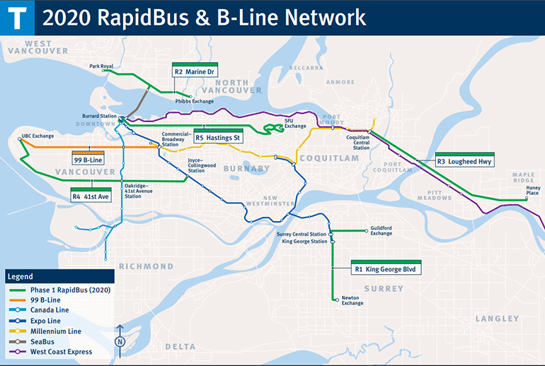
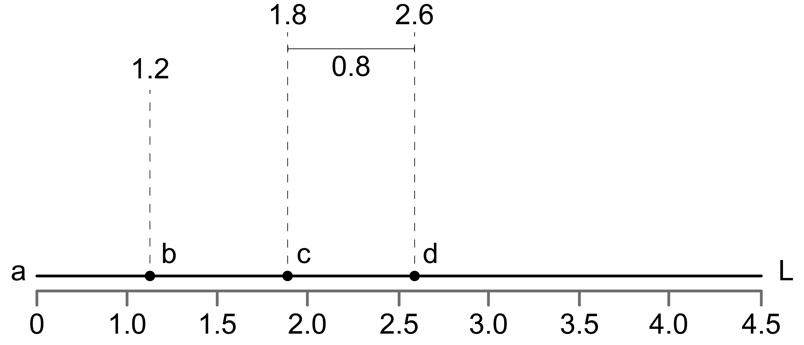

```{r setup, include=FALSE}
knitr::opts_chunk$set(echo = TRUE)
library(igraph)
library(rgdal)
library(rgeos)
library(leaflet)
library(ggplot2)
library(networkD3)
```


# Network Analysis

Networks are **abstract structures** commonly used to represent patterns of relationships among sets of various *things* [@ajorlouIntroductionNetworkModels2018]. Such structures can be used to represent social connections, spatial patterns, ecological relationships, etc. In GIS, the elements that compose geospatial networks are **geolocated** -- in other words: they have latitude and longitude values attached to them. Network analysis encompasses a series of techniques used to interpret information from those networks. This chapter introduces basic concepts for building, analyzing and applying spatial networks to real-world problems.


:::: {.box-content .learning-objectives-content}

::: {.box-title .learning-objectives-top}

#### Learning Objectives {-}

:::
<p id="box-text">By the end of the chapter, students will be able:</p>


1. To understand what networks are and to identify the elements that compose them;
1. To categorize different types of networks according to their topologies;
1. To create spatial networks and learn how to apply them in various applications;
1. To extract relevant information from spatial networks about the relationship between their elements, such as routes, distances and centralities.
:::

### Key Terms {-}
Network analysis, Spatial networks, Graph theory

## Introduction to Graph Theory
Graphs are the abstract language of networks [@systemsinnovationGraphTheoryOverview2015]. Graph theory is the area of mathematics that study graphs. By abstracting networks into graphs, one is able to measure different kinds of indicators that represents information about relationships that exist within a certain system. Why abstracting real-world elements into networks can be useful? Network analysis facilitates the study of data sets that demand information about their behaviour in terms of connectivity, flows, direction or paths. This is especially useful to understand the behaviour of complex adaptive systems such as societies, cities, ecosystems, etc. All graphs are composed of two parts: **nodes** and **edges** (or links).


### Nodes
A **node** (or vertex) may represent any thing that can be *connected* with other things. For example, it can represent people in social networks, street intersections in road networks, or chemical compounds in molecular networks, among others.

### Edges
**Edges** (or links), on the other hand, represent how vertices are interconnected to each other. So it may represent the vertices' social connections, street segments, molecular bindings, etc. The graph below represents rapid and frequent transit lines in Metro Vancouver. Each node represents a transit line and the edges represents connections between those lines.

```{r, echo=FALSE, fig.cap="Graph representing connection between Metro Vancouver rapid and frequent transit lines. Interactive figure in the online format of the textbook."}
data <- data.frame(
  from=c("Expo Line", "99-B Line", "R4", "Canada Line", "R4", "Millenium Line", "Millenium Line", "Seabus", "Seabus", "Seabus", "Expo Line", "R4", "West Coast Express", "West Coast Express", "R5", "R5", "West Coast Express", "Millenium Line", "West Coast Express",  "West Coast Express"),
  to=c("99-B Line", "Canada Line", "Canada Line", "Expo Line", "Expo Line", "Expo Line", "99-B Line", "Canada Line", "Expo Line", "R2", "R1", "99-B Line", "Expo Line", "Millenium Line", "Expo Line", "Canada Line", "R3", "R3", "Seabus", "Canada Line")
)

simpleNetwork(data, charge=-500, linkDistance=50, fontSize=10, zoom=TRUE)
```

``` {r, echo=FALSE, fig.cap="Rapid and frequent transit network in Metro Vancouver. Source: City of Pitt Meadows."}

```

## Connectivity and Order
There are two major types of connections within the graphs: **directed** and **undirected**. Connections are directed when they have a specific node of origin and destination.

### Direct
Directed graphs are networks where the order of elements change relationships between them. We represent directed connections with an arrow. The network below represents relationships between characters of Les Miserables.

<!-- For example, in the case of the transit network we could use a directed graph to represent the path one has to take in order to shift from one line to another. -->

```{r, echo=FALSE, fig.cap="Example of directed graph for social relationships. Interactive figure in the online format of the textbook."}

origins <- as.integer(c(1, 2, 3, 4, 3, 5, 5, 6, 6, 6, 1, 3, 7, 7, 8, 8, 7, 5, 7,  7))
destinations <- as.integer(c(2, 4, 4, 1, 1, 1, 2, 4, 1, 9, 10, 2, 1, 5, 1, 4, 11, 11, 6, 4))

node_names <- c("Expo Line", "99-B Line", "R4", "Canada Line", "Millenium Line", "Seabus", "West Coast Express", "R5", "R2", "R1", "R3")
groups <- c(1, 2, 2, 1, 1, 3, 1, 2, 2, 2, 2)

nodes <- data.frame(name=node_names, group=groups, size=10, id=seq.int(length(node_names)), row.names="id")

links <- data.frame(source=origins, target=destinations, id=seq.int(length(origins)), row.names="id", value=1)

forceNetwork(Links = MisLinks, Nodes = MisNodes, Source = "source", Value="value",
             Target = "target", NodeID = "name", Nodesize="size", linkColour="gray",
             Group = "group", opacity=0.8, zoom=TRUE, arrow=TRUE)
```

### Undirect
On the other hand, in an undirected graph, connections are represented as simple lines instead of arrows. The order of elements does not matter.

## Network Topologies
Topology is the study of how network elements are arranged. The same elements arranged in different ways can change the network **structure** and **dynamics**. A very common example is the arrangement of computer networks [@wikibooksCommunicationNetworksNetwork2018].

``` {r, echo=FALSE, fig.cap="Abstract examples of network topologies.", out.width="80%"}
knitr::include_graphics("images/08-network_topologies.png")
```

### Physical vs. Logical Topology
In GIS we use networks to represent spatial structures of various kinds. While all networks can be represented in an abstract space - this is, without a defined position in the real-world - some network analysis might be more useful when we attach physical properties to them, such as latitude and longitude coordinates. We call **logical topology** the study of how network elements are arranged in this abstract space. On the other hand, **physical topology** refers to the arrangemet of networks in the physical space. We can then classify "types" of networks according to the way their nodes is arranged.

### Non-Hierarchical Topologies
#### Lines
Lines are when nodes are arranged in series where every node has *no more than two connections*, except for the two end nodes. A rail transit line, for example, can be represented as a line network. The map below portrays the SkyTrain Millenium Line in Vancouver. Each node represents a stop and the lines  the connections between those stops.

```{r, echo=FALSE, fig.cap="Rail transit line in Vancouver. Interactive figure in the online format of the textbook."}

lineData <- readLines("data/08-transit_millenium_line.geojson") %>% paste(collapse = "\n")
nodeData <- readOGR("data/08-transit_millenium_stops.geojson", layer="transit_millenium_stops", verbose=FALSE)

leaflet(height=200, width="80%") %>% setView(lng=-122.9220614617343, lat=49.26585706918778, zoom=11) %>%
  addProviderTiles(providers$CartoDB.Positron) %>%
  addGeoJSON(lineData, weight=3, color="gray", fill=FALSE) %>%
  addCircles(data=nodeData, radius=20)
```

#### Rings
Rings are similar to lines except that there are no end nodes. So each and every node has *two connections and the "first" and "last" nodes are connected to each other* forming a circle. The spatial structure of the Stanley park seawall trail in Vancouver resembles a ring. In this example, nodes stand for intersections and view spots and edges are the connections between these spots along the seawall.

```{r, echo=FALSE, fig.cap="Ring of the Stanley Park seawall. Interactive figure in the online format of the textbook."}

lineData <- readLines("data/08-stanley_park_seawall.geojson") %>% paste(collapse = "\n")
nodeData <- readOGR("data/08-stanley_park_seawall_nodes.geojson", layer="stanley_park_seawall_nodes", verbose=FALSE)

leaflet(height=400, width="80%") %>% setView(lng=-123.14051382816635, lat=49.3035701861337, zoom=14) %>%
  addProviderTiles(providers$CartoDB.Positron) %>%
  addGeoJSON(lineData, weight=3, color="gray", fill=FALSE) %>%
  addCircles(data=nodeData)
```

#### Meshes
In a mesh, *every node is also connected to more than one node*. However, in this case nodes can be connected to more than two nodes. Connections in a mesh are non-hierarchical. Contrary to rings and lines where there is only one possible route from one node to another, in a mesh there are multiple routes to access other nodes in the network. A common way to generate a mesh network is using **Delaunay triangulation** [@wikimediaDelaunayTriangulation2021], where nodes are connected in order to form triangles and maximize the minimum angle of all triangles. Mesh configurations are commonly used in decentralized structures such as the internet.

```{r, echo=FALSE, fig.cap="Tree canopy mesh. Interactive figure in the online format of the textbook."}

lineData <- readLines("data/08-tree_canopy_mesh.geojson") %>% paste(collapse = "\n")
polyData <- readOGR("data/08-tree_canopy_shapes.geojson", layer="tree_canopy_shapes", verbose=FALSE, GDAL1_integer64_policy=TRUE)
nodeData <- readOGR("data/08-tree_canopy_centroids.geojson", layer="tree_canopy_centroids", verbose=FALSE)

leaflet(height=300, width="80%") %>% setView(lng=-123.13264678513188, lat=49.23942113799484, zoom=17) %>%
  addProviderTiles(providers$CartoDB.Positron) %>%
  addPolygons(data=polyData, color="green", weight=0) %>%
  addGeoJSON(lineData, weight=1, color="gray", fill=FALSE) %>%
  addCircles(data=nodeData, radius=0.5)
```


#### Fully Connected
As the name suggests, in fully connected networks *every node is connected to every other node*. The graph representing all possible origin-destination commutes among Metro Vancouver municipalities is a type of fully connected network.

```{r, echo=FALSE, fig.cap="Possible origin-destination commutes between municipalities within Metro Vancouver. Interactive figure in the online format of the textbook."}

polygonData <- readOGR("data/08-regional_boundaries.geojson", layer="regional_boundaries", verbose=FALSE)
lineData <- readLines("data/08-regional_commutes.geojson") %>% paste(collapse = "\n")
nodeData <- readOGR("data/08-regional_commutes_nodes.geojson", layer="regional_commutes_nodes", verbose=FALSE)

leaflet(height=420, width="80%") %>% setView(lng=-122.89050696548136, lat=49.19456939297959, zoom=10) %>%
  addProviderTiles(providers$CartoDB.Positron) %>%
  addGeoJSON(lineData, weight=2, color="gray", fill=FALSE) %>%
  addCircles(data=nodeData, radius=1)
```

### Hierarchical Topologies
Different from non-hierarchical topologies, hierarchical configurations are structured around a central node or link.
<!-- By looking into hierarchical topologies it becomes easier to understand the notion of depth. The more distant a node is from the central node or link, the more depth it has. Hover the mouse over the nodes in the following maps to check out their depth. -->

#### Stars
Stars are hierarchical structures where *two or more nodes are directly connected to a central node*. This concentric garden at the University of British Columbia, UBC, can be represented according to a star topology.

```{r, echo=FALSE, fig.cap="Spatial structure of a concentric garden at UBC. Interactive figure in the online format of the textbook."}

lineData <- readLines("data/08-concentric_garden.geojson") %>% paste(collapse = "\n")
nodeData <- readOGR("data/08-concentric_garden_nodes.geojson", layer="concentric_garden_nodes", verbose=FALSE)

leaflet(height=200, width="80%") %>% setView(lng=-123.24650254301488, lat=49.25331570212763, zoom=19) %>%
  addProviderTiles(providers$CartoDB.Positron) %>%
  addGeoJSON(lineData, weight=2, color="gray", fill=FALSE) %>%
  addCircles(data=nodeData, radius=1)
```

#### Buses
Buses are structures where *every path from one node to another passes through a central path or corridor*. If we isolate a street segment from an urban street network, the connections between buildings and streets depict a bus topology.

```{r, echo=FALSE, fig.cap="Connections between houses and streets. Interactive figure in the online format of the textbook."}

lineData <- readLines("data/08-row_houses.geojson") %>% paste(collapse = "\n")
nodeData <- readOGR("data/08-row_houses_nodes.geojson", layer="row_housses_nodes", verbose=FALSE)

leaflet(height=200, width="80%") %>% setView(lng=-123.17161003346679, lat=49.2547602831889, zoom=18) %>%
  addProviderTiles(providers$CartoDB.Positron) %>%
  addGeoJSON(lineData, weight=2, color="gray", fill=FALSE) %>%
  addCircles(data=nodeData, radius=1)
```

#### Trees
In tree topologies, nodes are *structured from a root node and arranged into edges* that are similar to branches of a tree. This highly hierarchical structure create a sort of **parent - child** relationship amongst nodes. The spatial configuration of boat marinas are usually structures in tree-like topologies. By definition, all tree network structures will always have more than one terminal nodes (a node that only has one connection to the network).

```{r, echo=FALSE, fig.cap="Tree spatial structure of a boat marina. Interactive figure in the online format of the textbook."}

lineData <- readLines("data/08-boat_marina.geojson") %>% paste(collapse = "\n")
nodeData <- readOGR("data/08-boat_marina_nodes.geojson", layer="boat_marina_nodes", verbose=FALSE)

leaflet(height=500, width="80%") %>% setView(lng=-123.1270252730915, lat=49.29535129069547, zoom=17) %>%
  addProviderTiles(providers$CartoDB.Positron) %>%
  addGeoJSON(lineData, weight=2, color="gray", fill=FALSE) %>%
  addCircles(data=nodeData, radius=1)
```

## Spatial Network Analysis
Networks can then be arranged according to various different configurations. Aside from classifying networks into different types according to their topologies, some of the most useful features of spatial network analysis refers to how to **extract information** from these structures given certain parameters.

### Network Tracing
The act of modelling spatial networks is called *network tracing*. When tracing a network it is important to bear in mind the **direction** with which information is added to the network, especially when this orientation information is important to further analyze **flows** and relationships within such structure. For example, when mapping hydrological networks to study its flows it might be useful to model the direction of streams coherently as this might be an important information to represent the dynamics of the network.

```{r, echo=FALSE, fig.cap="Graph representing Fraser River flows. Interactive figure in the online format of the textbook."}

nodes <- readOGR("data/08-fraser_river_nodes.geojson", verbose=FALSE)
links <- readOGR("data/08-fraser_river.geojson", verbose=FALSE)

leaflet(links, height=500, width="80%") %>% addTiles() %>%
  addProviderTiles(providers$CartoDB.Positron) %>%
  addPolylines(data=links, color="gray") %>%
  addCircles(data=nodes, radius=1)

```

### Linear Referencing
Linear referencing is a method of using geographic locations for measuring relative positions along a linear feature. In network analysis, linear referencing techniques can be used for finding the length of paths along the network [@ramsey23LinearReferencing2012]. In this method, the graph elements are defined in terms of their physical location and edges are used to calculate distances among parts of the network.

``` {r, echo=FALSE, fig.cap="Example of using linear referencing to measure distance between points.", out.width="80%"}

```

In the above figure we can see how linear referencing systems work. Considering one would like to measure distances from node *a* along a network link *L*, distance measures can be used to locate, for example, points *b*, *c* and *d* along line *L*.

### Routing
One application of linear referencing is to find routes between nodes is an useful application of spatial networks. This is how mapping tools help us navigate the world by finding the most efficient route to move around the city, for example. [@systemsinnovationNetworkDiffusionContagion2015].

#### Least Cost Paths
Usually multiple paths can be traced along a network to go from one point to another. The notion of **cost** allow us compare the degree of *difficulty* needed to cross such paths. With this information, it is possible to rank different routes. In spatial networks, cost usually relate to the necessary distance (either physically or logically) to go from a certain node to another, but they might also represent other aspects such as time, traffic, elevation, current flows, etc. For example, way finding tools that are commonly used to help us to locate and move around in the city usually takes into account multiple costs such as distance, traffic and/or elevation. The **least cost path** is the *easiest* way to go from one point of the network to another.

It can be found by associating the costs with elements of the network (either nodes or edges) and summarizing the total cost of certain routes. Usually **linear referencing** techniques are used to calculate costs by storing locations along measured linear features. The map below displays the least cost path in terms of physical distance (shortest path) between two points.

```{r, echo=FALSE, fig.cap="Least cost path (in terms of distance) between two points. Interactive figure in the online format of the textbook."}

nodes <- readOGR("data/08-shortest_path_nodes.geojson", verbose=FALSE)
path <- readOGR("data/08-shortest_path.geojson", verbose=FALSE)
map <- leaflet(nodes, height=500, width="80%") %>% addTiles()

map %>%
  addProviderTiles(providers$CartoDB.Positron) %>%
  addPolylines(data=path) %>%
  addCircles(data=nodes)

```

#### Least Cost Corridors
Although most network analysis techniques are suitable for vector data, raster layers can also be analyzed. One application of using network analysis with **raster data** is the finding of least cost corridors. While least cost paths helps to find linear paths along the network between two points, least cost corridors are based on the overlay of two *cost accumulative* rasters.

#### Reach Analysis
Reach techniques are commonly used to find the incidence of defined elements *within a certain radius from a chosen node*. All possible routes are modeled. The number of **terminal nodes** varies according to the network structure. Urban walkability indices usually uses reach techniques to assess the intensity of certain indicators (such as intersection density or non-residential land uses) given a walkable radius [@martinoSpatialNetworkAnalysis2020]. In the map below we portray the network reach from a given origin point into the Pacific Spirit Regional Park within 400m (red), 800m (yellow), 1200m (green) and 1600m (blue) radii.

```{r, echo=FALSE, fig.cap="Reachable segments within multiple distance radii. Interactive figure in the online format of the textbook."}

origin <- readOGR("data/08-pacific_spirit_origin.geojson", verbose=FALSE)
base_net <- readOGR("data/08-pacific_spirit_network.geojson", verbose=FALSE)
net_400 <- readOGR("data/08-pacific_spirit_400.geojson", verbose=FALSE)
net_800 <- readOGR("data/08-pacific_spirit_800.geojson", verbose=FALSE)
net_1200 <- readOGR("data/08-pacific_spirit_1200.geojson", verbose=FALSE)
net_1600 <- readOGR("data/08-pacific_spirit_1600.geojson", verbose=FALSE)

leaflet(net_1600, height=500, width="80%") %>% setView(lng=-123.22165125449455, lat=49.25752614491611, zoom=14) %>% addTiles() %>%
  addProviderTiles(providers$CartoDB.Positron) %>%
  addPolylines(data=base_net, color="lightgray") %>%
  addPolylines(data=net_1600, color="mediumaquamarine") %>%
  addPolylines(data=net_1200, color="lightblue") %>%
  addPolylines(data=net_800, color="gold") %>%
  addPolylines(data=net_400, color="lightcoral") %>%
  addCircles(data=origin, radius=2, color="black")

```

### Network Centrality
Nodes and edges of a graph can also be ranked in terms of how **important** they are to the overall network. Network centrality measures represent whether elements of a graph are more central or peripheral to the overall system. Such measures can then be interpreted as indicators of importance. Applications are endless. Centrality measures are used for ranking search engine pages [@wikimediaPageRank2021], for finding persons of interest in social networks [@ajorlouIntroductionNetworkModels2018] and for modelling movement in street network [@hillierNaturalMovementConfiguration1993]. There are several **centrality measures** that serve to the most various purposes. Some of the most commonly used ones are Closeness and Betweenness centrality.

#### Closeness Centrality
Closeness centrality measures *how close each node is to every other node of the graph* in terms of topological distances. It highlights nodes located in easily accessible spaces. For example when analyzing the closeness of street intersections at the University of British Columbia (UBC), intersections in core streets such as the Main Mall, Agronomy Road and Northwest Marine Drive are ranked as highly central whereas more residential and segregated areas such as Acadia Road are ranked with lower closeness centrality.

```{r, echo=FALSE, fig.cap="Closeness centrality of the street intersections at UBC. Interactive figure in the online format of the textbook."}

intersections <- readOGR("data/08-ubc_intersections.geojson", verbose=FALSE)
map <- leaflet(intersections, height=500, width="80%") %>% addTiles()
pal <- colorNumeric(palette="viridis", domain=intersections$closeness, n=6, reverse=TRUE)

map %>%
  addProviderTiles(providers$CartoDB.Positron) %>%
  addPolygons(data=intersections, color=~colorNumeric("viridis", closeness, reverse=TRUE)(closeness)) %>%
  addLegend("bottomright", pal=pal, values=~closeness, title="Closeness", opacity=1)

```

Closeness is calculated based on the **logical distance** from one vertex to all the other vertices in the network. The formula for estimating closeness centrality of a vertex $i$ is:

$c_i = \sum\limits_{j} \frac{1}{d_{ij}}$

where $d_{ij}$ means the logical distance from $i$ to $j$.

#### Betweenness Centrality
Betweenness centrality measures *how likely a node or an edge is to be passed through* when going from every node to every other node of the graph. If we imagine agents travelling from each node to every other node and back, betweenness centrality would be the trail left by those agents. While closeness highlights central spaces, betweenness highlights pathways that lead to those central spaces. Using the same street network at UBC we can calculate the betweenness of segments.

```{r, echo=FALSE, fig.cap="Betweenness centrality of street segments at UBC. Interactive figure in the online format of the textbook."}

segments <- readOGR("data/08-ubc_segments.geojson", verbose=FALSE)
map <- leaflet(segments, height=500, width="80%") %>% addTiles()
pal <- colorQuantile(palette="viridis", domain=segments$betweenness, n=6, reverse=TRUE)

map %>%
  addProviderTiles(providers$CartoDB.Positron) %>%
  addPolygons(data=segments, color=~colorQuantile("viridis", betweenness, reverse=TRUE)(betweenness)) %>%
  addLegend("bottomright", pal=pal, values=~betweenness, title="Betweenness", opacity=1)

```

Betweenness is calculated based on the number of **shortest paths** (in logical distances) from all nodes to all other nodes. According to the documentation of the [graph-tool software](https://graph-tool.skewed.de/static/doc/centrality.html), betweenness of a vertex $C_{B}(\upsilon)$ is defined as:

$C_{B}(\upsilon) = \sum\limits_{s \neq v \neq t \in V} \frac {\sigma_{st}(v)}{\sigma_{st}}$

where $(v)$ ${\sigma_{st}}$ represents the number of shortest paths from node $s$ to node $t$ and ${\sigma_{st}(v)}$ represents the number of those paths that pass through $v$. We can use centrality measures to evaluate how accessible certain spaces are from the point of view of their spatial structure with a broader system.

<br>

:::: {.box-content .case-study-content}

::: {.box-title .case-study-top}
#### Case Study {-}
:::

#### Central and Peripheral Green Spaces in Vancouver? {#box-text -}
<p id="box-text"></p>
Are green spaces evenly accessible throughout the whole city? Which parks are topologically *closer* to the city as a whole? Centrality analysis of the street network can be used to answer these questions.

First we need to find the Closeness measure for the street network of the City of Vancouver. The network information was downloaded from [OpenStreetMap](https://www.openstreetmap.org/). The [graph-tool](https://graph-tool.skewed.de/) software was used to calculate the centrality measure. With the results of centrality for all street intersections in the city, we can overlay Parks & Green spaces data from the [City of Vancouver Open Data portal](https://opendata.vancouver.ca/explore/dataset/parks-polygon-representation/information/) and get the average closeness of nodes within each green space.


``` {r, echo=FALSE, fig.cap="Closeness centrality of parks and green spaces at the City of Vancouver. Interactive figure in the online format of the textbook."}

parks <- readOGR("data/08-vancouver_parks.geojson", verbose=FALSE)

map <- leaflet(parks, height=500, width="100%") %>% addTiles()
pal <- colorNumeric(palette="viridis", domain=parks$betweenness, n=6, reverse=TRUE)

map %>%
  addProviderTiles(providers$CartoDB.Positron) %>%
  addPolygons(data=parks, color=~colorNumeric("viridis", closeness_mean, reverse=TRUE)(closeness_mean)) %>%
  addLegend("bottomright", pal=pal, values=~closeness_mean, title="Closeness", opacity=1)

parks_df = data.frame(parks$closeness_mean)
ggplot(parks_df, aes(x=parks.closeness_mean)) + geom_density(alpha=0.3, fill=rgb(160/255, 208/255, 224/255))

```

Results show parks located in the middle of the city have **higher closeness** than parks located at the edges. In other words, these parks are located in parts of the city that have easy access to the city's street network as a whole. As the histogram leans towards the right, we can conclude that there are more parks with higher closeness than parks with lower closeness.

<p id="box-text"></p>

<p id="box-text"></p>

::::

<br>


:::: {.box-content .case-study-content}

::: {.box-title .case-study-top}
#### Practice & Reflection {-}
:::

Some questions to reflect and better understand the basic concepts and applications of network analysis explained in this chapter:

<p id="box-text"></p>
* Which types of behaviour can be modelled and understood using network analysis techniques?
* What is the difference between *physical* and *logical* distances?
* How different *costs* can be used for routing along spatial networks?
* How can network centrality measures be interpreted in spatial networks?
<p id="box-text"></p>

::::

<br>
