```{r 9-load-packages-and-setup, include=FALSE}
baseurl <- "https://ubc-geomatics-textbook.github.io/geomatics-textbook/"
covlicence <- "https://opendata.vancouver.ca/pages/licence/"
knitr::opts_chunk$set(echo = TRUE)
library(DiagrammeR)
library(dplyr)
library(geojsonio)
library(htmlwidgets)
library(leafem)
library(leaflet)
library(plyr)
library(raster)
library(rgdal)
library(sf)
library(sp)
library(topoDistance)
library(xtable)
```

```{r echo=FALSE}
yml_content <- yaml::read_yaml("chapterauthors.yml")
author <- yml_content[["rasterAnalysisTerrainModelling"]][["author"]]
```
# Raster Analysis and Terrain Modelling {#raster-analysis-and-terrain-modelling}

Written by
```{r results='asis', echo=FALSE}
cat(author)
```

Many data are frequently collected and represented in a raster format. In this chapter, we will look at how rasters can be analyzed with a specific focus on deriving terrain information from elevation rasters. We will explore some useful properties of the raster structure that can be exploited for insightful analysis of land and water alike. Image-based raster analysis will be a later topic of [Chapter 14](https://ubc-geomatics-textbook.github.io/geomatics-textbook/image-analysis.html).

:::: {.box-content .learning-objectives-content}

::: {.box-title .learning-objectives-top}
## Learning Objectives {-}
::: 

1. Understand the principles of raster analysis
2. Recognize the types of digital vertical models and their uses
3. Synthesize the terrain and hydrological information that can be derived from a digital elevation model
4. Apply raster functions in terrain and hydrology workflows
5. Visualize terrain with 3D geovisualization methods

::::

## Key Terms {-}

Digital Elevation Model, Digital Vertical Model, Digital Terrain Model, Digital Surface Model, Anaglyph, High-Pass Filter, Low-Pass Filter, Focal Function, Local Function, Global Function, Zonal Function, Derived Raster, Classified Raster

## Raster Analysis

Raster analysis is the process of deriving, classifying, and combining raster data layers together. Although any given raster analysis may involve one or all of these steps, one thing that all raster analyses have in common is what is known as base data. **Base data** can be raster or vector data and represent some existing information about the area of interest. For example, you may have a digital air photo or other base map that you want to derive, classify, and/or combine with other information.

We can perform calculations on rasters to **derive** new rasters. For example, we could add, subtract, divide, or multiply a constant value to all cells in a raster. As well, we can calculate more complex indices or functions from a single raster, which we will see some examples of later in this chapter. 

We can also **classify** rasters, a process that involves modifying the values of the cells in the input raster based on some conditions to produce a new raster with new values. Sometimes this process is also referred to as **reclassification**. For example, maybe we desire a raster with binary values or 1 or 0 based on the condition that the value of a raster cell is greater than 10 (=1) or less than or equal to 10 (=0). Then, if a cell value in the input raster is 9, then the value for that cell in the output raster will be 0, and so on.

Finally, after deriving and classifying our rasters, we often need to **combine** or overlay them in order to solve some problem. Suppose we have a binary raster that represents land (=1) or water (=0) and we have another binary raster that represents good planting conditions (=1) and poor planting conditions (=0). Then, if we multiply these two rasters together, we will identify land that has good planting conditions (=1) across our area of interest. As you can see, combining raster data together can be a powerful tool for solving environmental management problems. Although it is common to reclassify rasters into binary rasters for a simple multiplication overlay like in the previous example, it is also possible to weight several rasters during combination and produce a continuous value in the output. We will see an example of this kind of combination in the case study.

## Digital Vertical Models

**Digital Vertical Models (DVM)** represent vertical heights and elevations of terrain and features. As we learned from [Chapter 2](https://ubc-geomatics-textbook.github.io/geomatics-textbook/mapping-data.html), *vertical* refers to the axis of geographic space that is orthogonal (i.e., perpendicular) to a vertical datum, such as a geoid or ellipsoid. Thus, a DVM may represent elevation of terrain or the height of a building. Both of these examples have specific meanings and calculations relative to the vertical datum, which we will explore in more detail in the following sections.

## Digital Elevation Models (DEM)

As the name suggests, a **Digital Elevation Model (DEM)** is a digital representation of elevation data or heights above a vertical datum. We call it a _model_ because, as you know from reading [Chapter 3](https://ubc-geomatics-textbook.github.io/geomatics-textbook/types-of-data.html), all spatial data formats are inherently spatial data models. As is the case for all rasters, DEMs represent sampled data. That is, the elevations that are represented continuously in the raster DEM are in fact samples of elevation at the raster cell centres. For this reason, a DEM is a model that is simplifying elevation to some degree depending on the cell size. 

Figure \@ref(fig:9-mount-assiniboine-dem) shows a DEM for Mount Assiniboine near the Alberta and British Columbia border. Mount Assiniboine has a distinctive pyramidal peak that is not immediately apparent from the bird's-eye view of a DEM. It is common to see DEMs displayed in this black and white colour scheme, where black represents lower elevations and white represents higher elevations. Can you tell where the peak is? We will look at more sophisticated colour schemes and geovisualizations of terrain in a later section.

(ref:9-mount-assiniboine-dem-caption) Digital Elevation Model of Mount Assiniboine at the border of Alberta and British Columbia, Canada. Data from @natural_resources_canada_canadian_2015. Pickell, CC-BY-4.0.

```{r 9-mount-assiniboine-dem, fig.cap = fig_cap, out.width= "75%", echo = FALSE}
    fig_cap = "(ref:9-mount-assiniboine-dem-caption)"
    knitr::include_graphics("images/09-mount-assiniboine-dem.png")
```
</br>

Figure \@ref(fig:9-nelson-river-dem) shows another DEM, but this time for some the flattest terrain in Canada over 1,600 km away from Mount Assiniboine on the Canadian Shield at the mouth of the Nelson River in Manitoba. The Nelson River drains an area of more than 1 million km^2 of land across much of the Canadian prairie provinces and pours into Hudson Bay. The Canadian Shield is home to the oldest terrain on Earth and millions of years of erosion have reduced it to rolling hills and flattened horizons. 

(ref:9-nelson-river-dem-caption) Digital Elevation Model of Nelson River pouring into Hudson Bay, Manitoba, Canada. Data from @earth_resources_observation_and_science_center_usgs_2018. Pickell, CC-BY-4.0.

```{r 9-nelson-river-dem, fig.cap = fig_cap, out.width= "75%", echo = FALSE}
    fig_cap = "(ref:9-nelson-river-dem-caption)"
    knitr::include_graphics("images/09-nelson-river-dem.png")
```

Over an entire extent of 3,300 km^2, the Nelson River DEM in Figure \@ref(fig:9-nelson-river-dem) only varies by 44 m. Compare that with the 1,328 m of difference from the white peak of Mount Assiniboine to the black valleys of the Rocky Mountains over about 5 km^2 in Figure \@ref(fig:9-mount-assiniboine-dem). Throughout the remainder of this chapter, we will look at raster analysis applied to these two extreme examples of terrain.

## Digital Terrain Models (DTM)

A **Digital Terrain Model (DTM)** represents elevation through points and lines and is often erroneously confused with a DEM. The vector-based data format allows elevation to be sampled at a higher density in areas where elevation changes quickly in space (e.g., Mount Assiniboine) and at lower density in areas where elevation changes gradually (e.g., Nelson River). Lines can be used to model mountain ridges, river banks, fault lines, and coast lines where elevation might be constant and it would be useful to represent the elevation as a line feature instead of a point of elevation. It is important to recognize that DTMs can be converted to DEMs through a process of interpolation (more on that in [Chapter 10](https://ubc-geomatics-textbook.github.io/geomatics-textbook/spatial-estimation.html)), but a DEM cannot be converted to a DTM because a DEM is a regular grid or equally-spaced elevation samples.

## Digital Surface Models (DSM)

Up to this point, we have been looking digital vertical models of _bare Earth_, that is, just plain old elevation of terrain above a vertical datum. If you want to represent the height of features above the bare Earth, like houses and trees, then you would need to use a **Digital Surface Model (DSM)**. Whereas a DTM and DEM both represent elevation above a vertical datum, which is usually mean sea level represented by the geoid, a DSM represents height above a DTM or DEM. In this way, we can model features on the surface and their heights. We will look at more examples of working with DSMs in [Chapter 15](https://ubc-geomatics-textbook.github.io/geomatics-textbook/LiDAR-acquisition-and-analysis.html).

## Raster Functions

Raster functions are algorithms that perform operations on one or more cells of the raster to produce new calculations or derivatives. In the following sections we will explore four commonly used raster functions: local, focal, global, and zonal.

## Local

A **local function** is the simplest to understand because each cell in the input raster is operated on independently of all other cells. Simple arithmetic operations such as addition, subtraction, division, and multiplication are all examples of focal functions when applied to a raster. 

```{r 9-local-function-raster, echo=FALSE}
x <- raster(nrow=5,ncol=5,crs="+proj=utm +zone=10 +ellps=WGS84 +datum=WGS84 +units=m +no_defs",xmn=0,xmx=300,ymn=0,ymx=300)
values(x) <- sample(1:255, ncell(x))
par(mfrow=c(1,2))
plot(x,xaxt="n",yaxt="n",main="Input Raster",bty="n",legend=F,col=grey.colors(255),axes=FALSE,box=FALSE)
text(x)
plot(x+5,xaxt="n",yaxt="n",main="Input Raster + 5",bty="n",legend=F,col=grey.colors(255),axes=FALSE,box=FALSE)
text(x+5)
```

## Focal

A **focal function** takes full advantage of the raster data model by moving a window or kernel over the raster in order to calculate new values. The kernel must always be a square with odd-numbered dimensions such as 3x3 or 11x11. This ensures that there is a focal cell at the centre of the kernel that determines which cell in the output will take on the value of the operation. In practice, the kernel is moved column-by-column, row-by-row over the entire raster and a calculation is performed using the values of the input raster that coincide with the kernel. The kernel itself is also comprised of weights that, when multiplied against the input raster at a given location, yields a set of values that can be summed or averaged. Thus, the operation of the focal function can take many different forms such as calculating the mean, minimum, maximum or any other operation over the kernel. As a simple example, a mean focal function with a 3x3 kernel will calculate the mean value of all 3x3 cell neighborhoods in the raster yielding the result below.

```{r 9-focal-function-raster, echo=FALSE}
y <- focal(x, w=matrix(1,nrow=3,ncol=3), fun=mean)
par(mfrow=c(1,2))
plot(x,xaxt="n",yaxt="n",main="Input Raster",bty="n",legend=F,col=grey.colors(255),axes=FALSE,box=FALSE)
text(x)
plot(y,xaxt="n",yaxt="n",main="3x3 Low-Pass Filter",bty="n",legend=F,col=grey.colors(255),axes=FALSE,box=FALSE)
text(y)
```

Mathematically, the weights of the 3x3 kernel are all 1's so that when it is multiplied against a particular location on the input raster the values of the input raster are returned.

$$k = \begin{bmatrix}1 & 1 & 1\\
1 & 1 & 1\\
1 & 1 & 1
\end{bmatrix}$$

The mean is then calculated by adding all the values together and dividing by the number of cells in the kernel. You will see that our input raster has shrunk down from dimensions of 5x5 to 3x3 after applying the 3x3 kernel. This is due to the fact that there are insufficient cells along the edge and corners of the raster to divide by the number of cells in the kernel. One solution is to use padding, which simply adds 0's along the outside of the input raster. Padding is not always an elegant solution because you will still have edge effects, but you will at least maintain the dimensions of your input raster in the output. Below is the result of the same focal function, but with padding of 0's.

```{r 9-low-pass-function-raster, echo=FALSE}
y <- focal(x, w=matrix(1,nrow=3,ncol=3), fun=mean, pad=T, padValue=0)
par(mfrow=c(1,2))
plot(x,xaxt="n",yaxt="n",main="Input Raster",bty="n",legend=F,col=grey.colors(255),axes=FALSE,box=FALSE)
text(x)
plot(y,xaxt="n",yaxt="n",main="3x3 Low-Pass Filter (Padding)",bty="n",legend=F,col=grey.colors(255),axes=FALSE,box=FALSE)
text(y)
```

You might recognize that a mean focal function has the property of smoothing out the variation in extreme values from cell-to-cell in the input raster. In fact, a mean focal function is special and also known as a **low-pass filter**, which has the effect of "blurring" a raster or image. On the other hand, we can apply a **high-pass filter** that performs edge enhancement. The kernel of a high-pass filter takes on a specific pattern of weights that usually involves a large weight to the focal (centre) cell of the kernel and negative weights to the neighbouring cells. Below is a common example of a high-pass kernel:

$$k = \begin{bmatrix}-0.7 & -1 & -0.7\\
-1 & 6.8 & -1\\
-0.7 & -1 & -0.7
\end{bmatrix}$$

The operation of a high-pass filter is to multiply the kernel weights above against the input raster cell values and then sum the result. The following is the result of applying the high-pass kernel weights above to our input raster with padding:

```{r 9-high-pass-function-raster, echo=FALSE}
y <- focal(x, w=matrix(c(-0.7,-1,-0.7,-1,6.8,-1,-0.7,-1,-0.7),nrow=3,ncol=3), fun=sum, pad=T, padValue=0)
par(mfrow=c(1,2))
plot(x,xaxt="n",yaxt="n",main="Input Raster",bty="n",legend=F,col=grey.colors(255),axes=FALSE,box=FALSE)
text(x)
plot(y,xaxt="n",yaxt="n",main="3x3 High-Pass Filter (Padding)",bty="n",legend=F,col=grey.colors(255),axes=FALSE,box=FALSE)
text(y)
```

## Global

**Global functions** apply some operation to all cells in the raster. These are usually simply referred to as summary statistics of the raster since we usually want to know what the minimum, maximum, and average values are of all cells in a given raster. As a result, global functions do not return a raster as an output, but rather individual values, depending on the operation. Below are the summary statistics for our input raster:

```{r 9-global-function-table, echo=FALSE}
t <- data.frame(Operation=c("Minimum","Maximum","Mean","Standard Deviation"),Value=c(min(values(x)),max(values(x)),mean(values(x)),sd(values(x))))
knitr::kable(
  t, booktabs = TRUE, row.names = FALSE
)
```

## Zonal

Lastly, **zonal functions** perform an operation over some subset of cells defined by a zonal raster. Again, the operation can be any calculation of interest: mean, minimum, sum, etc. Zonal functions are useful for deriving information over different regions of a raster that share some thematic classification like land cover, ecosystem type, or jurisdiction. Suppose we have the following input raster and zonal raster:

```{r 9-zonal-function-raster, echo=FALSE}
z <- raster(nrow=5,ncol=5,crs="+proj=utm +zone=10 +ellps=WGS84 +datum=WGS84 +units=m +no_defs",xmn=0,xmx=300,ymn=0,ymx=300)
values(z) <- c(1,1,1,1,1,1,1,1,2,2,2,2,2,2,2,2,2,3,3,3,3,3,3,3,3)
par(mfrow=c(1,2))
plot(x,xaxt="n",yaxt="n",main="Input Raster",bty="n",legend=F,col=grey.colors(255),axes=FALSE,box=FALSE)
text(x)
plot(z,xaxt="n",yaxt="n",main="Zonal Raster",bty="n",legend=F,col=grey.colors(255),axes=FALSE,box=FALSE)
text(z)
```

Like a global function, zonal functions do not return an output raster, but rather individual values for each zone:

```{r 9-zonal-function-table, echo=FALSE}
t <- data.frame(Zone=c(1,2,3),Minimum=c(min(values(x)[values(z)==1]),min(values(x)[values(z)==2]),min(values(x)[values(z)==3])),
                Maximum=c(max(values(x)[values(z)==1]),max(values(x)[values(z)==2]),max(values(x)[values(z)==3])),
                Mean=c(mean(values(x)[values(z)==1]),mean(values(x)[values(z)==2]),mean(values(x)[values(z)==3])),
                Standard.Deviation=c(sd(values(x)[values(z)==1]),sd(values(x)[values(z)==2]),sd(values(x)[values(z)==3])))
knitr::kable(
  t, booktabs = TRUE, row.names = FALSE
)
```

## Derivatives of Elevation Models

You can probably recognize by now that if we apply a raster function to a DEM, then there is a lot of derived information that we can exploit in a raster analysis of terrain. These are further classified as first order, second order, and compound terrain derivatives. In this next section we will explore several common derivatives of a DEM and, importantly, we will see how they appear differently in the flat terrain of Nelson River and the rugged terrain of Mount Assiniboine.

## Slope

**Slope** is a first order terrain derivative using a focal raster function that represents the change in elevation over the distance of a cell edge. Slope can be expressed as a percentage or as angular degrees. As a percentage, a 0% slope would represent flat terrain and a 150% slope would represent steep terrain. It is worth pointing out that there is no upper bound for expressing slope as a percentage, but angular degrees are limited by an upper bound of 90°. It is mathematically impossible to achieve a slope of exactly 90° from a raster DEM because the cell size of a raster must always be great than 0 and a 90° angle would only be possible if two cells overlaid one another in the same raster, hence the impossibility. Slope is a derivative that is usually necessary in order to calculate other terrain derivatives. 

Figure \@ref(fig:9-mount-assiniboine-slope) shows the slope of Mount Assiniboine where red represents steeper slopes and green represents flatter slopes. For the Mount Assiniboine DEM, the slope values range from 2° at the flattest to 80° at the steepest. Can you see the peak yet? 

(ref:9-mount-assiniboine-slope-caption) Slope of Mount Assiniboine at the border of Alberta and British Columbia, Canada. Data from @natural_resources_canada_canadian_2015. Pickell, CC-BY-SA-4.0.

```{r 9-mount-assiniboine-slope, fig.cap = fig_cap, out.width= "75%", echo = FALSE}
    fig_cap = "(ref:9-mount-assiniboine-slope-caption)"
    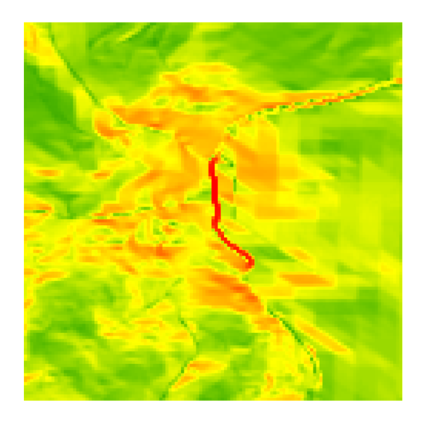
```
</br>

Figure \@ref(fig:9-nelson-river-slope) shows the slope of Nelson River pouring into Hudson Bay. Again, red is steeper and green is flatter, but the slope values here only range from 0° to 9° and the vast majority of cells are less than 2°. Very flat terrain that can hardly be distinguished from the sea.

(ref:9-nelson-river-slope-caption) Slope of Nelson River pouring into Hudson Bay, Manitoba, Canada. Data from @earth_resources_observation_and_science_center_usgs_2018. Pickell, CC-BY-SA-4.0.

```{r 9-nelson-river-slope, fig.cap = fig_cap, out.width= "75%", echo = FALSE}
    fig_cap = "(ref:9-nelson-river-slope-caption)"
    knitr::include_graphics("images/09-nelson-river-slope.png")
```
</br>

## Aspect

**Aspect** is another first order terrain derivative that represents the azimuthal direction that a slope faces. For example, an azimuth of 0° is North-facing slope, 90° is East-facing, 180° is South-facing, and 270° is West-facing with all other azimuths in between. Typically, aspect is most apparent when azimuths are dominate throughout the DEM. For example, the slope aspects are clearly visible in Figure \@ref(fig:9-mount-assiniboine-aspect) showing Mount Assiniboine. By contrast, when slopes are very flat as is the case for the Nelson River, aspect can alternate frequently and produce a nearly random sequence except for the relatively steeper south bank of the river shown in Figure \@ref(fig:9-nelson-river-aspect). It is possible to have an undefined aspect when the slope is 0°, which is the case for water seen coloured grey in Figure \@ref(fig:9-nelson-river-aspect).

(ref:9-mount-assiniboine-aspect-caption) Aspect of Mount Assiniboine at the border of Alberta and British Columbia, Canada. Data from @natural_resources_canada_canadian_2015. Pickell, CC-BY-SA-4.0.

```{r 9-mount-assiniboine-aspect, fig.cap = fig_cap, out.width= "75%", echo = FALSE}
    fig_cap = "(ref:9-mount-assiniboine-aspect-caption)"
    knitr::include_graphics("images/09-mount-assiniboine-aspect.png")
```
</br>

(ref:9-nelson-river-aspect-caption) Aspect of Nelson River pouring into Hudson Bay, Manitoba, Canada. Data from @earth_resources_observation_and_science_center_usgs_2018. Pickell, CC-BY-SA-4.0.

```{r 9-nelson-river-aspect, fig.cap = fig_cap, out.width= "75%", echo = FALSE}
    fig_cap = "(ref:9-nelson-river-aspect-caption)"
    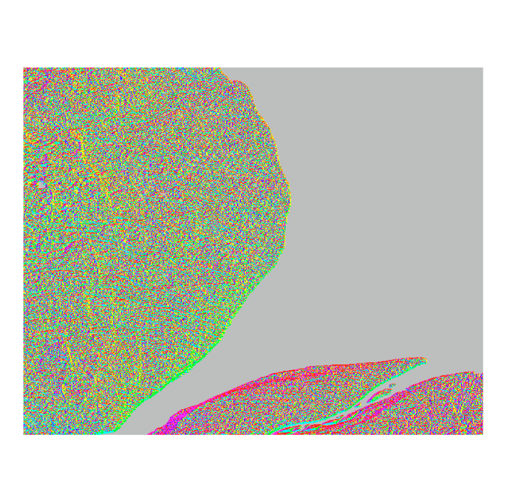
```
</br>

## Heat Load Index

One important derivative from aspect is a **heat load index (HLI)**, which quantifies the heat from incident solar radiation on a slope. There are several variations for computing the heat load on terrain, but a commonly used calculation is the HLI proposed by McCune and Keon [@mccune_equations_2002]:

$$
HLI=\frac{1-cos(aspect-45)}{2}
$$

If you imagine aspect represented by azimuths of a circle, then this calculation has the effect of "folding" that circle in half along the 45° azimuth (northeast-southwest) so that southwest-facing slopes have higher values and northeast-facing slopes have lower values. Although both southeast- and southwest-facing slopes theoretically receive the same amount of incident solar radiation, this heat load index reflects the fact that southwest-facing slopes will be significantly hotter and drier, which can help inform vegetation potential and fuel moisture content.

(ref:9-mount-assiniboine-nelson-river-heat-load-index-caption) Comparing Heat Load Index (HLI) for Mount Assiniboine and the Nelson River. Pickell, CC-BY-SA-4.0.

```{r 9-mount-assiniboine-nelson-river-heat-load-index, fig.cap = fig_cap, out.width= "75%", echo = FALSE}
    fig_cap = "(ref:9-mount-assiniboine-nelson-river-heat-load-index-caption)"
    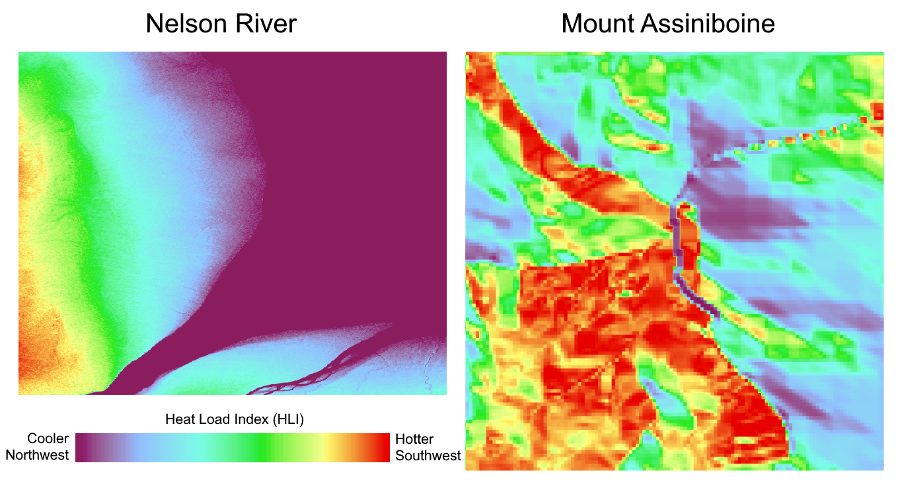
```

## Hillshade

A **hillshade** is a DEM with a simulated light source. The values in a hillshade represent the illumination of that cell given its slope, aspect, and position in the raster relative to a simulated light source. The light source has an elevation and azimuth that can be defined to reflect a particular time of day. Thus, hillshades can be useful to show a more 3-dimensional view of terrain from the bird's-eye view of the DEM. Hillshades can also reveal fine differences in terrain that are not apparent from a simple DEM. Figure \@ref(fig:9-mount-assiniboine-hillshade-animation) animates (online) a series of hillshades created with azimuths at 10° intervals from 0° to 350° with a light source at an elevation of 45° for Mount Assiniboine. This has the effect of rotating an approximately 9 AM high Sun on the solstice around Mount Assiniboine.

(ref:9-mount-assiniboine-hillshade-animation-caption1) Hillshade of Mount Assiniboine at the border of Alberta and British Columbia, Canada. Data from @natural_resources_canada_canadian_2015. Online version is animated across all azimuths from 0° to 350° by 10° intervals. Pickell, CC-BY-SA-4.0. Animated figure can be viewed in the web browser version of the textbook: https://ubc-geomatics-textbook.github.io/geomatics-textbook/raster-analysis-and-terrain-modelling.html

(ref:9-mount-assiniboine-hillshade-animation-caption2) Hillshade of Mount Assiniboine at the border of Alberta and British Columbia, Canada. Data from @natural_resources_canada_canadian_2015. Online version is animated across all azimuths from 0° to 350° by 10° intervals. Pickell, CC-BY-SA-4.0.

```{r 9-mount-assiniboine-hillshade-animation, fig.cap = fig_cap, out.width= "75%", echo = FALSE}
  if (knitr:::is_latex_output()) { fig_cap = "(ref:9-mount-assiniboine-hillshade-animation-caption1)"
  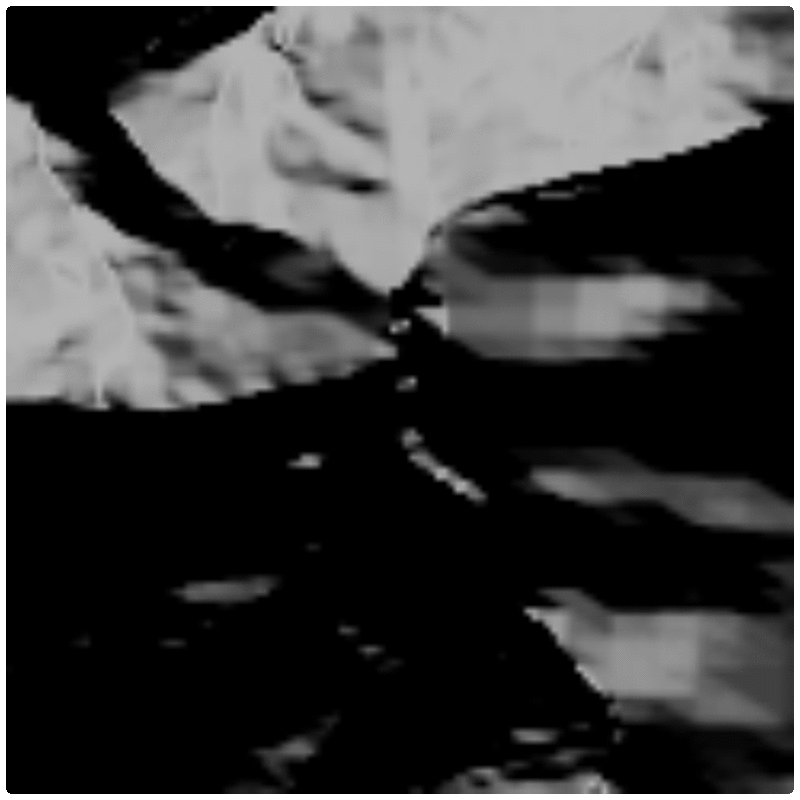
} else { fig_cap = "(ref:9-mount-assiniboine-hillshade-animation-caption2)"
  knitr::include_graphics("images/09-mount-assiniboine-hillshade-animation.gif")
}
```
</br>

A hillshade is still a 2D raster with 3D features simulated through an illumination process. A hillshade does not reveal much for flatter terrain since there is not much variation in slopes across the entire raster, as can be seen in Figure \@ref(fig:9-nelson-river-hillshade-animation) for Nelson River, which is also animated in the same way as Figure \@ref(fig:9-mount-assiniboine-hillshade-animation). As you can see, there is no change over the water of the river and Hudson Bay where slope is 0° and aspect is undefined and only some minor terrain features are apparent over the land. Still, if you watch closely, some finer scale features can be made apparent that are not otherwise visible from the original DEM and other terrain derivatives.

(ref:9-nelson-river-hillshade-animation-caption1) Hillshade of Nelson River pouring into Hudson Bay, Manitoba, Canada. Data from @earth_resources_observation_and_science_center_usgs_2018. Online version is animated across azimuths from 0° to 350° by 10° intervals. Pickell, CC-BY-SA-4.0. Animated figure can be viewed in the web browser version of the textbook: https://ubc-geomatics-textbook.github.io/geomatics-textbook/raster-analysis-and-terrain-modelling.html

(ref:9-nelson-river-hillshade-animation-caption2) Hillshade of Nelson River pouring into Hudson Bay, Manitoba, Canada. Data from @earth_resources_observation_and_science_center_usgs_2018. Online version is animated across azimuths from 0° to 350° by 10° intervals. Pickell, CC-BY-SA-4.0.

```{r 9-nelson-river-hillshade-animation, fig.cap = fig_cap, out.width= "75%", echo = FALSE}
if (knitr:::is_latex_output()) { fig_cap = "(ref:9-nelson-river-hillshade-animation-caption1)"
  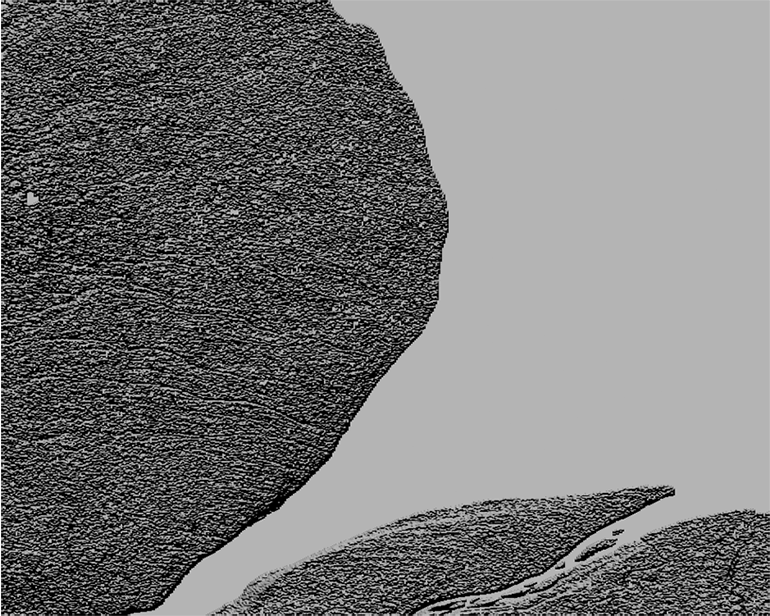
} else { fig_cap = "(ref:9-nelson-river-hillshade-animation-caption2)"
  knitr::include_graphics("images/09-nelson-river-hillshade-animation.gif")
}
```
</br>

## Sinks, Peaks, and Saddles Oh My!

**Sinks** are depressions in a DEM where the focal cell is surrounded by eight neighbouring cells with higher elevations (Figure \@ref(fig:9-sink)). Sinks are often naturally occurring (e.g., lakes, ponds, and wetlands), but can also be due to random error, elevation precision, DEM cell size, or other pre-processing that may have been applied to the DEM such as mosaicking. The problem with sinks when modeling runoff is that water will enter the cell, but will not be able to exit in any direction, so they must be filled prior to using a DEM in any hydrology workflow. 

(ref:9-sink-caption) A sink is shown in 3D for an array of 3x3 pixels. Pickell, CC-BY-SA-4.0.

```{r 9-sink, fig.cap = fig_cap, out.width= "75%", echo = FALSE}
    fig_cap = "(ref:9-sink-caption)"
    knitr::include_graphics("images/09-sink.png")
```

**Peaks** are the opposite of sinks, where a focal cell is surrounded by eight neighbouring cells that share the same lower elevation (Figure \@ref(fig:9-peak)). Like sinks, peaks are also naturally occurring (e.g., mountain peaks and ridge lines) and may also be artifacts of data resolution and processing.

(ref:9-peak-caption) A peak is shown in 3D for an array of 3x3 pixels. Pickell, CC-BY-SA-4.0.

```{r 9-peak, fig.cap = fig_cap, out.width= "75%", echo = FALSE}
    fig_cap = "(ref:9-peak-caption)"
    knitr::include_graphics("images/09-peak.png")
```

**Saddles** occur when a lowland is bounded by two or more peaks (Figure \@ref(fig:9-saddle)). Usually, saddles identify a divide between drainage basins because they often occur along ridgelines and precipitation will runoff into one or the other drainage basin, but not both. 

(ref:9-saddle-caption) A saddle is shown in 3D for an array of 3x3 pixels. Pickell, CC-BY-SA-4.0.

```{r 9-saddle, fig.cap = fig_cap, out.width= "75%", echo = FALSE}
    fig_cap = "(ref:9-saddle-caption)"
    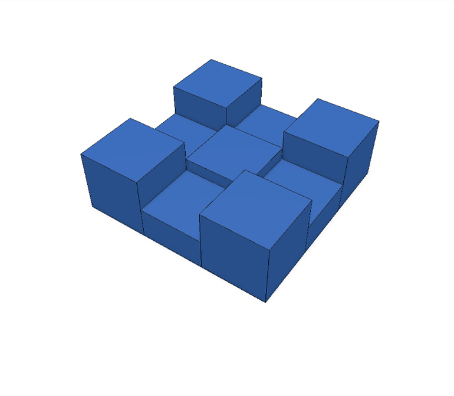
```

## Landform Classification

One of the motivations for deriving information from a DEM is to classify terrestrial landforms. Some of the derived information we have seen so far, like slope, can be used to classify landforms, but slope does not inform on geographic position. For example, a low slope value could be a plateau on top of a mountain or a river in a valley bottom. Therefore, we need more contextual information beyond these first or second terrain derivatives that we have looked at so far. There are two popular ways to derive these complex terrain derivatives by calculating terrain curvature and topographic position indices, which is what we will explore next. 

## Profile and Planform Curvature

Curvature of terrain is described as convex, flat, or concave, which impacts the flow acceleration or deceleration of runoff over the terrain. There are two components of terrain curvature representing the x- and y-axes of geographic space. **Profile curvature** describes the downslope curvature while **plan or planform curvature** describes the curvature that is perpendicular to the downslope curvature. In this way, the vertical expression of terrain can be described by two, perpendicular curves. Figure \@ref(fig:9-stacked-profile-planform) illustrates the nine different combinations of profile and planform curvature. change

(ref:9-stacked-profile-planform-caption) Conceptual diagram showing surfaces of all combinations of profile and planform curvature. Pickell, CC-BY-SA-4.0.

```{r 9-stacked-profile-planform, fig.cap = fig_cap, out.width= "75%", echo = FALSE}
    fig_cap = "(ref:9-stacked-profile-planform-caption)"
    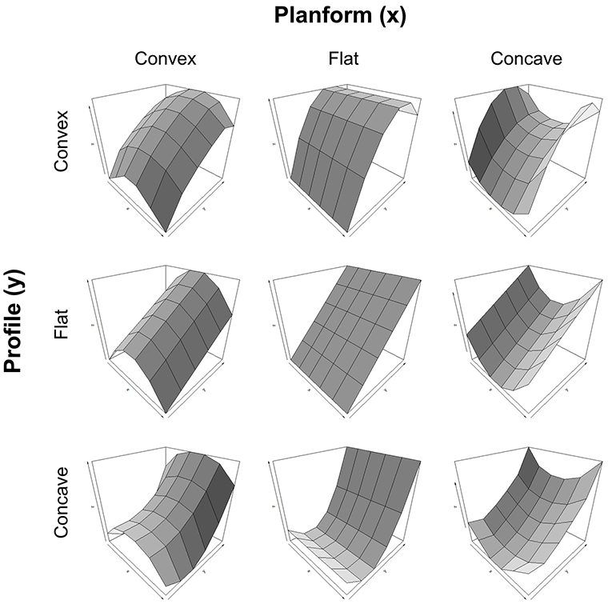
```

There are many ways to calculate curvature, which usually take the form of a polynomial that is fit by a focal function over some neighbourhood of pixels. A 3x3 kernel is typically used to calculate profile and planform curvature, however, it is also common to increase the kernel size to counteract the effect of noise in high resolution DEMs. Figure \@ref(fig:9-stacked-profile-planform-kernel) illustrates examples of 3x3 kernels for each of the profile and planform curvature combinations. You might recognize variations of sinks, peaks, and saddles amongst the examples, which are of course not exhaustive of all possible elevation value combinations, but they are otherwise representative of the primary patterns that are indicated by profile and planform curvature.

(ref:9-stacked-profile-planform-kernel-caption) Conceptual diagram showing 3x3 kernel examples of all combinations of profile and planform curvature. Pickell, CC-BY-SA-4.0.

```{r 9-stacked-profile-planform-kernel, fig.cap = fig_cap, out.width= "75%", echo = FALSE}
    fig_cap = "(ref:9-stacked-profile-planform-kernel-caption)"
    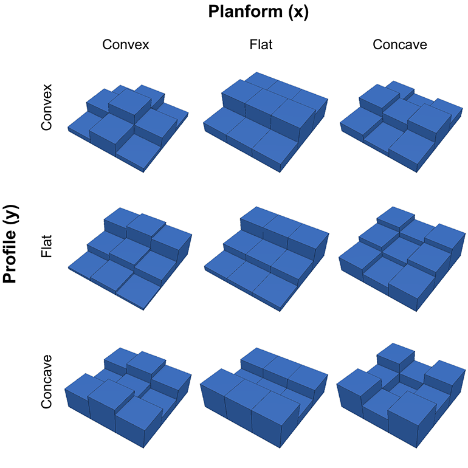
```

Both profile and planform curvature are calculated as continuous floating point integers where: positive values represent convex curvature in the profile and concave curvature in the planform; zero represents no curvature; and negative values represent concave curvature in the profile and convex curvature in the planform. Figure \@ref(fig:9-mount-assiniboine-profile-planform-curvature) shows the profile and planform curvature for Mount Assiniboine. What landforms can you start to identify from terrain curvature? Can you identify any sinks, peaks, or saddles in the DEM?

(ref:9-mount-assiniboine-profile-planform-curvature-caption) Profile and planform curvature for Mount Assiniboine at the border of Alberta and British Columbia, Canada. Data from @natural_resources_canada_canadian_2015. Pickell, CC-BY-SA-4.0.

```{r 9-mount-assiniboine-profile-planform-curvature, fig.cap = fig_cap, out.width= "75%", echo = FALSE}
    fig_cap = "(ref:9-mount-assiniboine-profile-planform-curvature-caption)"
    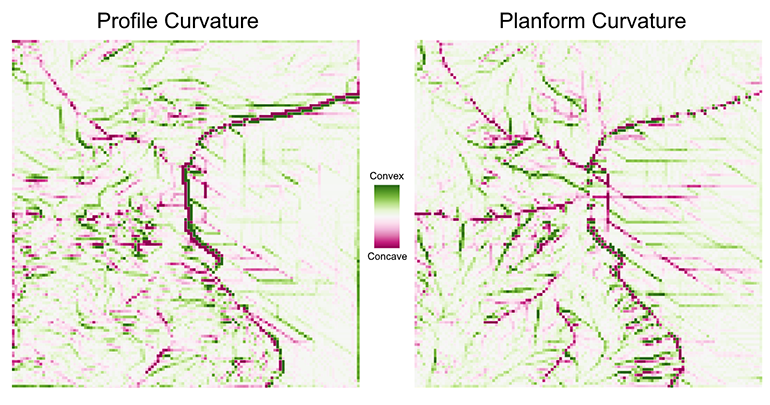
```

## Topographic Position Index

Another way to derive and classify landforms is through the use of a **topographic position index (TPI)**, which is a focal function that accounts for the difference between the focal cell elevation and the average elevation of the eight neighbouring cells (in the case of a 3x3 kernel). Therefore, positive TPI values indicate ridges or peaks, zero indicates either a constant slope or a flat area or a saddle, and negative TPI values indicate a valley or sink. Figure \@ref(fig:9-mount-assiniboine-nelson-river-topographic-position-index) shows the TPI for Mount Assiniboine compared with the Nelson River. The TPI is sometimes also referred to as a terrain ruggedness index and there are other variations for calculating it as well (e.g., computing the standard score of the focal cell instead of the mean difference).

(ref:9-mount-assiniboine-nelson-river-topographic-position-index-caption) Comparing Topographic Position Index (TPI) for Mount Assiniboine and the Nelson River. Data from @natural_resources_canada_canadian_2015 and @maxar_precision3d_nodate, respectively. Pickell, CC-BY-SA-4.0.

```{r 9-mount-assiniboine-nelson-river-topographic-position-index, fig.cap = fig_cap, out.width= "75%", echo = FALSE}
    fig_cap = "(ref:9-mount-assiniboine-nelson-river-topographic-position-index-caption)"
    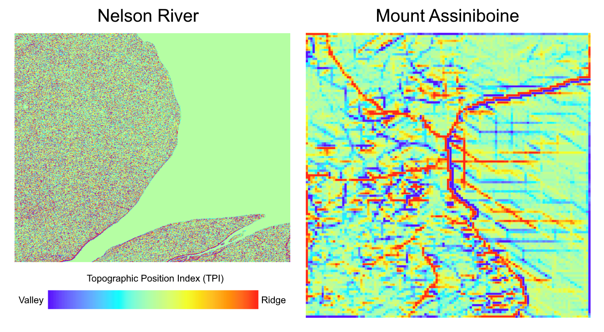
```

## Hydrology Work"flows"

By now, you should recognize that water can be modelled over a DEM by making the simple assumption that water will flow from higher elevations to lower elevations. We can undertake this modelling using a DEM because the continuous surface of elevation values can represent the runoff process. In this next section, we will look at how we can extract everything from runoff accumulation to stream networks and watersheds from a DEM.

## Flow Direction and Flow Accumulation

Runoff is the most fundamental process that can be modelled from a DEM. In fact, modelling runoff supports nearly every subsequent derived hydrological variable of interest (e.g., flow accumulation, stream order, and watersheds). The principle assumption is that water flows from higher elevations to lower elevations. So the first step in any hydrological workflow is to calculate **flow direction** or the path that water will flow given precipitation over a focal cell in the DEM. This is made possible because we also know the eight neighbouring cell elevations. There a several algorithms for calculating and assigning flow direction, but the simplest is a focal function known as _D8_, first proposed by @greenlee_raster_1987, that answers the question, _which neighbouring cell has the lowest elevation?_ With only eight neighbours, runoff can only travel in eight unique azimuths. Flow direction can be encoded as an azimuth with valid values of $FlowDir∈\{0,45,90,135,180,225,270,315,360\}$ (16-bit integer) where 0 is reserved for undefined flow direction, but more D8 flow direction is commonly encoded as an 8-bit integer with valid values of $FlowDir∈\{1,2,4,8,16,32,64,128,255\}$ where 255 is reserved for undefined flow direction. Once we know the flow direction we can calculate the **flow accumulation**, which is a focal function tally of the number of upslope DEM cells that flow into the focal cell. Figure \@ref(fig:9-flow-direction-accumulation) illustrates how flow direction and flow accumulation work together to model runoff over a DEM surface. 

(ref:9-flow-direction-accumulation-caption) Flow direction shown in arrows and flow accumulation of upslope cells shown in numbers for the D8 flow direction algorithm. Pickell, CC-BY-SA-4.0.

```{r 9-flow-direction-accumulation, fig.cap = fig_cap, out.width= "75%", echo = FALSE}
    fig_cap = "(ref:9-flow-direction-accumulation-caption)"
    knitr::include_graphics("images/09-flow-direction-accumulation.png")
```

Trouble arises when there are two or more neighboring cells with the same minima (e.g., a peak or saddle). This situation can arise for very flat terrain where the elevation might be the same in nearly every direction. As we have already seen, sinks can cause water to flow into but not out of the focal cell, and therefore result in an undefined flow direction. Sinks must therefore be identified and filled in a DEM before calculating flow direction. There are several algorithms for filling sinks, but generally the process involves calculating flow direction and then moving downslope from the highest elevations of the DEM to the valley bottoms and identifying depressions, which are then filled. This process continues to iterate until no more depressions are identified [@marks_automated_1984].  Figure \@ref(fig:9-sink-fill) animates this iterative process of filling sinks in a cross-sectional profile of elevation, but the process is actually applied simultaneously over both geographic dimensions. Each iteration can introduce new sinks since the filling process directly modifies the DEM, so flow direction must be recalculated after each iteration in order to solve the next set of sinks. As a result, this filling process can be quite time consuming and usually stopping criteria are imposed such as a minimum depth threshold or a minimum slope for all cells in the DEM (i.e., no cells with flat slopes) to ensure that runoff is continuously downslope.

(ref:9-sink-fill-caption1) Animated process of filling sinks in a DEM. Pickell, CC-BY-SA-4.0. Animated figure can be viewed in the web browser version of the textbook: https://ubc-geomatics-textbook.github.io/geomatics-textbook/raster-analysis-and-terrain-modelling.html

(ref:9-sink-fill-caption2) Animated process of filling sinks in a DEM. Pickell, CC-BY-SA-4.0.

```{r 9-sink-fill, fig.cap = fig_cap, out.width= "75%", echo = FALSE}
    if (knitr:::is_latex_output()) { fig_cap = "(ref:9-sink-fill-caption1)"
  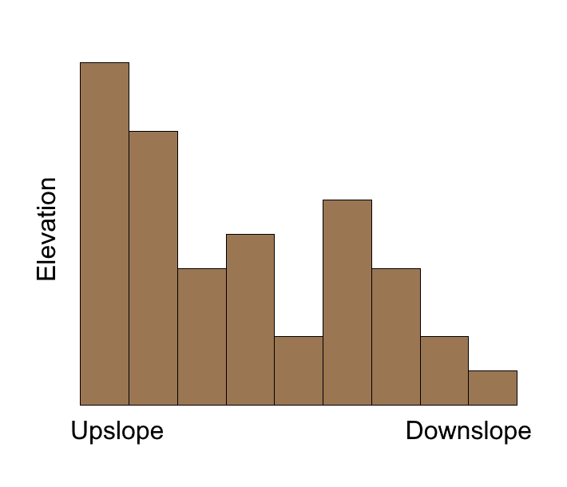
} else { fig_cap = "(ref:9-sink-fill-caption2)"
  knitr::include_graphics("images/09-sink-fill.gif")
}
```

The D8 algorithm is intuitive, fast, simple to implement and you will probably see it as the default option across many different GIS software. However, it is very sensitive to sinks, flat areas, and otherwise erroneous pixels because the D8 algorithm forces flow to a single raster pixel. If the raster pixel receiving the upslope flow is erroneous, then all downslope flow direction and, by extension, flow accumulation may also be erroneous. The D8 algorithm was developed in the the mid-1980s during a time when computers such as the AT&T 3B2/300 "mini computer" shipped with a 30 Mb hard disk drive, 1 Mb of random access memory, and a 10 Mhz central processing unit, all of which would have cost about US$10,000 in 1984. To put that in perspective, the 16-bit DEM of the Nelson River in Figure \@ref(fig:9-mount-assiniboine-dem) is 1.3 Mb and the combination of all the terrain derivatives that we have covered so far in this chapter (slope, aspect, HLI, hillshade, TPI, profile curvature, planform curvature, flow direction and flow accumulation) amounts to 19.5 Mb of disk space for a single, modest-sized study area (938 x 751 pixels).

More sophisticated flow direction algorithms have developed since then that are more robust against erroneous pixels in the input DEM, including the D-infinity flow (DINF) algorithm proposed by Tarboton [@tarboton_new_1997] and the multiple flow direction (MFD) algorithm developed by Qin et al. [@qin_adaptive_2007]. The DIF algorithm works by creating triangular facets within the 3x3 kernel, then flow direction is assigned as the azimuth of facet with the steepest slope. Calculated in this way, flow direction is represented as a continuous value between 1-360 instead of one of eight possible values with the D8 method. The MFD algorithm works by partitioning downslope flow to all eight neighbours. As a result, each neighbour receives a fraction of flow and the flow accumulation function then accumulates these fractions downslope. Figure \@ref(fig:9-mount-assiniboine-flow-dir-acc) shows the D8 flow direction and associated flow accumulation for Mount Assiniboine. Once flow direction and accumuation rasters have been generated, the floodgates open for a wide range of other derivative calculations, which are discussed in the next sections.

(ref:9-mount-assiniboine-flow-dir-acc-caption) D8 Flow direction and flow accumulation for Mount Assiniboine at the border of Alberta and British Columbia, Canada. Data from @natural_resources_canada_canadian_2015. Pickell, CC-BY-SA-4.0.

```{r 9-mount-assiniboine-flow-dir-acc, fig.cap = fig_cap, out.width= "75%", echo = FALSE}
    fig_cap = "(ref:9-mount-assiniboine-flow-dir-acc-caption)"
    knitr::include_graphics("images/09-mount-assiniboine-flow-dir-acc.png")
```

## Stream Delineation

Streams and rivers represent paths of accumulated flow and can be modeled from a flow accumulation raster by applying a simple threshold: values above this threshold are considered rivers or streams. The threshold that is applied to a flow accumulation raster should be selected based on expert knowledge and visual interpretation of the landscape. The actual value of the flow accumulation threshold is directly related to the extent of the flow accumulation raster. That is, larger flow accumulation rasters have more cells and therefore the accumulative values will be larger compared with a smaller flow accumulation raster. This means that a flow accumulation threshold of 100 can represent the same river that might be represented by a flow accumulation value of 10,000 in a larger raster. Thus, some initial visualization of the flow accumulation raster like in Figure \@ref(fig:9-mount-assiniboine-flow-dir-acc) is needed to determine what threshold should be applied. Once a threshold is determined, the flow accumulation raster can be reclassified to a binary (1 or 0) raster where 1 represents the presence of a stream or river channel. Usually, streams and rivers are represented using a vector data model instead of a raster, so the final step is to convert the binary raster to a set of line features that can be used in other workflows like network analysis (see [Chapter 8](https://ubc-geomatics-textbook.github.io/geomatics-textbook/network-analysis.html)).

##	Stream Order

Once a stream raster has been delineated from a flow accumulation raster, then it is possible to derive stream order. **Stream order** is an ordinal value that describes the level or hierarchy of branching in a stream network. Higher stream order values generally represent larger streams that are closer to an output such as the ocean. Thus, smaller stream orders will generally be found "upstream" at higher elevations. There are two primary methods for assigning a stream order value. Both methods assign the value of 1 to segments of stream networks that are the "outermost" branches or the generally the highest in elevation. Thus, a first order stream would have relatively smaller flow accumulation values than a second order stream because it drains a smaller area. The way the Strahler [@strahler_quantitative_1957] and Shreve [@shreve_statistical_1966] methods differ is how higher order stream values are assigned when two stream segments merge. For both methods, if two first (1-)order streams merge, then the next downstream segment is assigned a value of 2. However, if a first (1-)order and second (2-)order stream merge, then the Strahler method assigns the next downstream segment the higher of the two orders, which is 2 in this case, while the Shreve method adds together the orders of the upstream segments to assign the new value, which is 3 in this case. This pattern is repeated until all downstream segments have been labelled.

In the GIS, stream order can be automatically calculated by using the binary stream delineation raster (1 = stream) and the flow direction raster. In other words, the GIS tool needs to know what the stream skeleton is and in which direction it is flowing. The output is usually a raster that contains the stream order values for the streams delineated in the binary stream raster. Again, the stream orders can be easily converted to line features for further vector-baed analysis.

## Flow Length 

**Flow length** describes the distance of a stream path along the flow direction raster. This is calculated for all cells in the flow direction raster, not just the stream segments. In other words, each cell in the output raster takes on the value of how far water would flow downstream. Since the flow length of all cells in the output raster are known, it is possible to derive the longest flow path within a given basin. The longest flow path can be used to describe the time of concentration within a basin, which is a measure of the amount of time (i.e., a function of distance) that a precipitation event would take to exit or "flush" out of a given basin at an outlet. With some GIS software, flow length may be one of many optional outputs when calculating flow direction and flow accumulation from a DEM. You may also have the option of applying a raster of flow barriers, which modify the flow path and therefore the flow length.

##	Watershed Delineation

**Watersheds** represent a contributing area to a particular pour point and therefore the total upslope area that flows or drains through a particular cell of the DEM. **Pour points** represent the constrained location that upslope flow must pass through and is identified as a single cell in a raster. Thus, if a set of pour points are defined, then it is possible to simply look at the neighbours of any pour point and identify which of the neighbouring cells flow into the pour point cell. If a neighbouring cell flows into the pour point, then that neighbouring cell is labelled within the same watershed as the pour point. This iterative process continues until the edge of the watershed search boundary finds a ridge, in which case the flow direction of neighbouring cells would flow opposite to the watershed and the search would end in the iteration that adds no more cells to the watershed. This process is repeated for all pour points until all cells in the DEM are classified into their respective watersheds.

You might be wondering how pour points are initialized for this process. A common way to initialize pour points is to manually identify them within the context of your research objectives. Practically, pour points should be located on cells with high flow accumulation (i.e., not a random slope), so that you can be sure your watersheds will reach from ridge-to-ridge. Pour points can also be programmatically identified in several ways. For one, you could select all nodes of your stream network where the stream order transitions from a specific lower order to the next highest order number. For example, setting pour points to the transitions from third order to fourth order streams would yield a set of watersheds that contribute to fourth order streams with the caveat that you do not identify any watersheds downstream of fourth order streams. You can adjust this approach as needed if you are looking at larger darinage areas by increasing the stream order that you are considering. Typically, the transition between your highest order stream and the next lowest order represents all of the drainage areas for your DEM. If you need regularly-sized watersheds, then the flow accumulation raster conveniently indicates how many upslope cells flow into each downslope cell, so you can identify pour points along your stream network that contribute exactly 10,000 upslope cells. If your DEM cell size is 10 m, then this would be equivalent to mapping 1 km^2^ watersheds. If your goal is regularly-distributed watersheds along a particular reach of your stream network, then you could export the target stream segment and create points that are spaced at regular intervals along that stream segment. More on network analysis of hydrological networks in [Chapter 8](https://ubc-geomatics-textbook.github.io/geomatics-textbook/network-analysis.html).

## Topographic Wetness Index

**Topographic Wetness Index (TWI)** is a simple calculation that can be used to identify locations where draining water is likely to collect or pool. Sometimes also referred to as the Compound Topographic Index (CTI), the calculation is as follows: 

$$
TWI=ln\frac{a}{tan(b)}
$$

where $a$ is the local upslope area for a given cell and $b$ is the local slope (radians) for a given cell. This calculation is essentially a ratio of flow entering a cell and the discharge of that flow out of the cell, represented by the tangent of the slope. Figure \@ref(fig:9-Mattivi-et-al-2019-figure-1) illustrates an overview of the components of the TWI calculation in a conceptual geographic space. 

(ref:9-Mattivi-et-al-2019-figure-1-caption) Conceptual figure showing how Topographic Wetness Index (TWI) is a function of (a) upslope area, (b) area and direction of local flow, and (c) the tangent of the local slope angle. Reproduced from @mattivi_twi_2019, CC-BY-4.0.

```{r 9-Mattivi-et-al-2019-figure-1, fig.cap = fig_cap, out.width= "75%", echo = FALSE}
    fig_cap = "(ref:9-Mattivi-et-al-2019-figure-1-caption)"
    knitr::include_graphics("images/09-Mattivi-et-al-2019-figure-1.png")
```
</br>

The result is that cells with high flow accumulation and gentle slopes will have high TWI values (water pools), while cells with low accumulation and steep slopes will have low TWI values (water flows). The actual values of this ratio are unitless, but they are relative. If you are using the flow direction raster directly in your calculation, it is important to multiply $a$ by the area represented by each cell. For example, a 10 m resolution DEM would use the following calculation:

$$
TWI=ln\frac{a×100}{tan(b)}
$$

## Case Study: Topographic Indices for Wetland Mapping

*Case Study Author: Ramon Melser (CC BY 4.0. unless otherwise indicated), University of British Columbia, Master of Geomatics for Environmental Management graduate, 2021*

Natural processes on a landscape can be interpreted by analyzing its topography. DEMs can be used to create a wide range of topographic indices, which may be used to inform on landscape geomorphology, hydrology and biological processes in a study area [@mattivi_twi_2019]. To demonstrate the applications of topographic indices, and attempt was made to predict the distribution of wetlands across a study area in the Fort St. John Timber Supply Area, in North-eastern British Columbia, Canada (Figure \@ref(fig:9-fort-st-john-study-area)).

```{r map, echo=FALSE, include=FALSE}
ROI_2 <- st_read("data/09/FSJTSA.shp")
m = leaflet() %>%
  addProviderTiles("Esri.WorldImagery") %>% #http://leaflet-extras.github.io/leaflet-providers/preview/
  addScaleBar(position = c("topleft")) %>%
  addFeatures(ROI_2, group = "Fort St. John TSA", fill = FALSE)%>%
  addLayersControl(overlayGroups = c("Fort St. John TSA"), position = c("bottomleft"), options = layersControlOptions(collapsed = TRUE))
```

(ref:9-fort-st-john-study-area-caption) The Fort St. John Timber Supply Area, British Columbia, Canada. Data from Government of British Columbia and licensed under the Open Government Licence - British Columbia. Mesler, CC-BY-SA-4.0.

```{r 9-fort-st-john-study-area, echo=FALSE, fig.cap=fig_cap, ouwidth="75%"}
fig_cap = "(ref:9-fort-st-john-study-area-caption)"
```

The use of topographic indices was employed alongside spectral indices to perform land cover classification. For the successful prediction of wetland landscape classes, a particularly promising topographic index is Topographic Wetness Index (TWI). In brief, high TWI values indicate areas with high water accumulation and low slope, whilst low TWI values indicate areas that are well drained and on steep slopes. There are several GIS platforms that provide users with TWI tools, yet not all are the same. A particular tool used in this case study was the SAGA Wetness Index tool: relative to 'regular' TWI calculations, System for Automated Geoscientific Analyses (SAGA) Wetness modifies the calculation of the contributing catchment area to a cells 'wetness', and consequently produces a more realistic prediction of soil moisture potential [@mattivi_twi_2019]. The equations for SAGA Wetness ($WI_S$) (Equation 1), and for its unique computation of catchment area ($SCA_M$) (Equation 2) are given below [@bohner_spatial_2006].

$$
\tag{Equation 1} 
WI_S = ln (\frac{SCA_M}{tan\beta})
$$


$$
\tag{Equation 2}
SCA_M = SCA_{max} (\frac{1}{15})^{\beta exp(15^{\beta})}
$$

Both are functions of slope angle $\beta$, and $SCA_{max}$ is defined as drainage area per unit contour width ($m^2$*$m^{-1}$). SAGA Wetness across the study site is shown in Figure \@ref(fig:9-SAGA-Wetness).

(ref:9-SAGA-Wetness-caption) System for Automated Geoscientific Analyses (SAGA) Wetness Index across the Chowade Watershed. Melser, CC-BY-SA-4.0.

```{r 9-SAGA-Wetness, fig.cap = fig_cap, out.width= "75%", echo = FALSE}
    fig_cap = "(ref:9-SAGA-Wetness-caption)"
    knitr::include_graphics("images/09-SAGA-Wetness.png")
```

In addition to SAGA Wetness, another useful index that was included in the Case Study was the Multi-Resolution Valley Bottom Flatness (MRVBF) index. Introduced by [@gallant_multiresolution_2003], this index identifies hill slopes and valley bottoms, and characterizes hydrological and geomorphic dynamics. This index serves to identify areas that are likely to be occupied by water, and has been used widely in remote sensing studies [@huang_comparison_2017]. MRVBF is derived from flatness and lowness characteristics and is computed using slope and ranked elevation, see Figure \@ref(fig:9-MRVBF-diagram) [@gallant_multiresolution_2003]. Note that this is a simplification of the computational process, and Gallant and Dowling may be consulted for a more in-depth breakdown of the 18 equations involved in computing MRVBF. Figure \@ref(fig:9-MRVBF) shows MRVBF across the study site.

```{r 9-MRVBF-diagram, echo=FALSE, out.width = '75%', fig.cap=fig_cap}
fig_cap <- paste0("Multi-Resolution Valley Bottom Flatness (MRVBF) Computational Components described by @gallant_multiresolution_2003. Melser, CC BY 4.0.")
DiagrammeR::grViz("digraph {
  graph [layout = dot, rankdir = TB]
  node [shape = rectangle]        
  rec1 [label = 'Component 1. Slope']
  rec2 [label = 'Component 2. Elevation Percentile']
  rec3 [label =  'Component 3. Nonlinear Transformation']
  rec4 [label = 'MRVBF']
  # edge definitions with the node IDs
  rec1 -> rec2 -> rec3 -> rec4
  }", 
  height = 500)
```

(ref:9-MRVBF-caption) Multi-resolution Valley Bottom Flatness (MRVBF) across the Chowade Watershed. Melser, CC-BY-SA-4.0.

```{r 9-MRVBF, echo=FALSE, out.width = '75%', fig.cap=fig_cap}
fig_cap = "(ref:9-MRVBF-caption)"
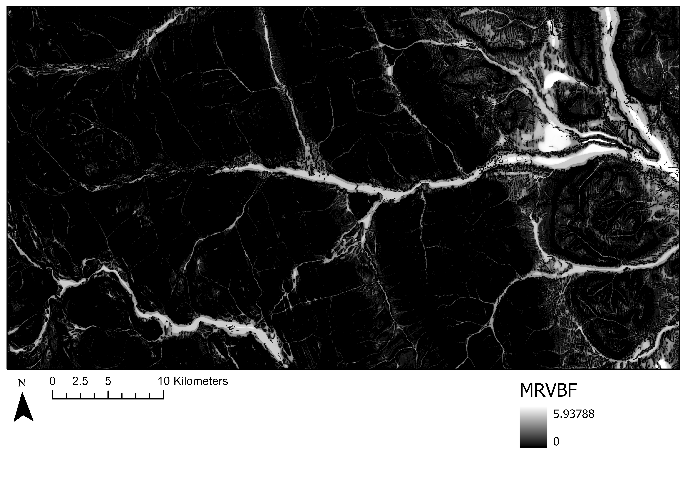
```

Figures \@ref(fig:9-MRVBF-DEM-profile) and \@ref(fig:9-DEM-profile) below demonstrate the relationship between Elevation and MRVBF through a comparison of cross sections from both layers. As is shown by the cross-sections of MRVBF and the DEM, high MRVBF values are directly correlated with low slope and elevation areas in the DEM.

(ref:9-MRVBF-DEM-profile-caption) Cross Section where elevation is expressed through Multi-Resolution Valley Bottom Flatness (MRVBF). High values represent valley bottoms, and low values represent steep slopes. Melser, CC-BY-SA-4.0.

```{r 9-MRVBF-DEM-profile, echo=FALSE, warning=FALSE, out.width = '75%', fig.cap=fig_cap}
fig_cap = "(ref:9-MRVBF-DEM-profile-caption)"
MRVBF <- raster("data/09/MRVBF.tif")
DEM <- raster("data/09/DEM.tif")
Line <- geojson_read("data/09/Line.geojson", what = "sp")
MRVBF_Profile <- topoProfile(MRVBF, Line, pts = 400, type = "base", singlePlot = FALSE, rows = NULL, cols = NULL, limits = NULL, legendx = "bottomright")
title(ylab = "                               (mrvbf)") # manually manipulate the axis title to include units. The axis titles are auto-generated by the function, so this is the only way I found to edit them. 
```

(ref:9-DEM-profile-caption) Elevation Cross Section. Melser, CC-BY-SA-4.0.

```{r 9-DEM-profile, echo=FALSE, warning=FALSE, out.width = '75%', fig.cap=fig_cap}
fig_cap = "(ref:9-DEM-profile-caption)"
DEM_Profile <- topoProfile(DEM, Line, pts = 400, type = "base", singlePlot = FALSE, rows = NULL, cols = NULL, limits = NULL, legendx = "bottomright")
title(ylab = "                         (m)") # manually manipulate the axis title to include units. The axis titles are auto-generated by the function, so this is the only way I found to edit them.
```

## DEM Derivatives and Classification

To exemplify the potential of topographic indices, SAGA Wetness, MRVBF, Slope and Aspect are combined with spectral information from satellite imagery in a classification algorithm. Using these layers, predictive mapping of three simple land cover classes - Alpine, Forested, and Wetland - was performed in the Chowade Watershed Management basin [@city_of_vancouver_notitle_2009]. The interactive map below in Figure \@ref(fig:9-leaflet-map-layers) allows for navigation of the classified map, as well as the input layers. An exploration of the input layers and prediction raster make it apparent how certain values in the input layers informed the prediction of wetlands. In other words, low slope values, high SAGA Wetness values and valley bottoms in MRVBF. The overall accuracy from this particular classification is 84.4%, showing the value of layer derivatives in classification exercises.

```{r files-1, echo = FALSE, include=FALSE}
#Load files
r1 <- raster("data/09/Aspect.tif")
r2 <- raster("data/09/MRVBF.tif")
r3 <- raster("data/09/NDVI.tif")
r4 <- raster("data/09/NDWI.tif")
r5 <- raster("data/09/SAGA_Wetness.tif")
r6 <- raster("data/09/Slope.tif")
r7 <- as.factor(raster("data/09/Prediction_Raster.tif"))
```

```{r files-2, echo = FALSE, include=FALSE}
#Set colors and legend titles
pal1 <- colorNumeric(c("#f07f0a", "#a02837", "#1b587c", "#4e8542", "#604878"), values(r1), na.color = "transparent")
pal2 <- colorNumeric(c("#0C2C84", "#41B6C4", "#FFFFCC"), values(r2), na.color = "transparent")
pal3 <- colorNumeric(c("#e5f5e0", "#a1d99b", "#1b7837"), values(r3), na.color = "transparent")
pal4 <- colorNumeric(c("#6e462c", "#9c8448", "#cccc66", "#9cab68", "#306466"), values(r4), na.color = "transparent")
pal5 <- colorNumeric(c("#c7eae5", "#5ab4ac", "#01665e"), values(r5), na.color = "transparent")
pal6 <- colorNumeric(c("#fee090", "#fc8d59", "#d73027"), values(r6), na.color = "transparent")
pal7 <- colorFactor(c("#fc8d59", "#238443", "#d9f0a3"), values(r7),na.color = "transparent")
```

```{r files-3, echo = FALSE, include=FALSE, cache=TRUE}
#Create labels for classified raster
labels1 = c("Alpine", "Upland", "Wetland")
#Run the leaflet
m2 = leaflet() %>%
  addProviderTiles("Esri.WorldImagery") %>% #http://leaflet-extras.github.io/leaflet-providers/preview/
  addScaleBar(position = c("topleft")) %>%
  addRasterImage(r1, colors = pal1, group = "Aspect", opacity = 1, maxBytes = "Inf") %>%
  addRasterImage(r2, colors = pal2, group = "MRVBF", opacity = 1, maxBytes = "Inf") %>%
  addRasterImage(r3, colors = pal3 ,group = "NDVI(Spectral)", opacity = 1, maxBytes = "Inf") %>%
  addRasterImage(r4, colors = pal4, group = "NDWI(Spectral)", opacity = 1, maxBytes = "Inf") %>%
  addRasterImage(r5, colors = pal5, group = "SAGA Wetness", opacity = 1, maxBytes = "Inf") %>%
  addRasterImage(r6, colors = pal6, group = "Slope", opacity = 1, maxBytes = "Inf") %>%
  addRasterImage(r7, colors = pal7, group = "Prediction Raster", opacity = 1, maxBytes = "Inf") %>%
  addLegend(pal = pal1, values = values(r1), group = "Aspect", opacity = 1, title = "Aspect")%>%
  addLegend(pal = pal2, values = values(r2), group = "MRVBF", opacity = 1, title = "MRVBF")%>%
  addLegend(pal = pal3, values = values(r3), group = "NDVI(Spectral)", opacity = 1, title = "NDVI")%>%
  addLegend(pal = pal4, values = values(r4), group = "NDWI(Spectral)", opacity = 1, title = "NDWI")%>%
  addLegend(pal = pal5, values = values(r5), group = "SAGA Wetness", opacity = 1, title = "SAGA Wetness")%>% 
  addLegend(pal = pal6, values = values(r6), group = "Slope", opacity = 1, title = "Slope")%>%
  addLegend(pal = pal7, values = values(r7), group = "Prediction Raster",  opacity = 1, title = "Chowade Land Cover Realms", labFormat = function(type, cuts, p){paste0(labels1)})%>%
  addLayersControl(overlayGroups = c("Aspect", "MRVBF", "NDVI(Spectral)", "NDWI(Spectral)", "SAGA Wetness", "Slope", "Prediction Raster"), position = c("bottomleft"), options = layersControlOptions(collapsed = TRUE))
```

(ref:9-leaflet-map-layers-caption) Input layers and output prediction raster for the Chowade Watershed Management basin. Animated figure can be viewed in the web browser version of the textbook: https://ubc-geomatics-textbook.github.io/geomatics-textbook/raster-analysis-and-terrain-modelling.html. Data from @city_of_vancouver_notitle_2009 and licensed under the  under the Open Government License - Vancouver. Lam, CC-BY-SA-4.0.

```{r 9-leaflet-map-layers, echo=FALSE, out.width="75%", fig.cap=fig_cap}
fig_cap = "(ref:9-leaflet-map-layers-caption)"
```

## 3D Geovisualization

**Geovisualization** is simply the process of visualizing geographic information at any stage of the GIS workflow. 3D geovisualization is distinguished by the motivation to create immersive scenes that utilize an elevation, height, or z-profile. Like their 2D map counterparts, 3D geovisualizations should be thought of as spatial models. 3D geovisualizations can represent real phenomena such as landforms and buildings, but they may also be non-real representations that map some phenomenon in the traditional x and y dimensions and mapping an attribute to the z dimension that is not necessarily height or elevation. The results can be dramatic forms to convey geospatial information, sometimes requiring specialized equipment to view them such as virtual reality headsets, polarized or shutter glasses, red/cyan glasses, and 3D stereo monitors. We will focus on a few digital options in this section.

## Anaglyphs

**Anaglyphs** are composed of two images that are simultaneously displayed in two colours, typically red and cyan. The result when viewed through red/cyan filtered lenses is a stereographic view of the frame. Anaglyphs are among the simplest 3D geovisualizations that are frequently used to represent terrain and landforms as the effect is essentially adding depth to an otherwise 2D frame. The depth of terrain is best visualized obliquely with an anaglyph as in Figure \@ref(fig:9-baffin-island-mount-odin-1) below showing Mount Odin, the highest peak on Baffin Island in Nunavut, Canada.

(ref:9-baffin-island-mount-odin-1-caption) Anaglyph of Mount Odin on Baffin Island, Nunavut, Canada. Imagery by @maxar_precision3d_nodate. Pickell, CC-BY-SA-4.0.

```{r 9-baffin-island-mount-odin-1, fig.cap = fig_cap, out.width= "75%", echo = FALSE}
    fig_cap = "(ref:9-baffin-island-mount-odin-1-caption)"
    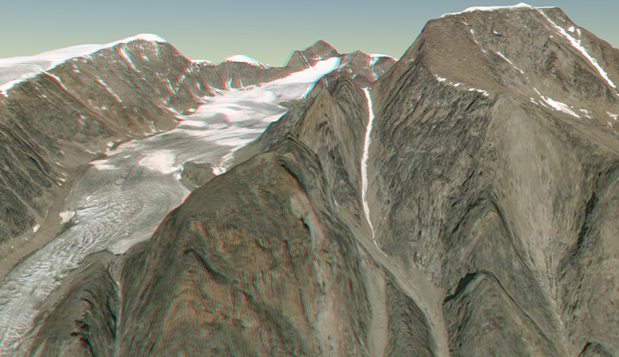
```

##	Viewsheds

A **viewshed** is an analysis that simulates a physical line-of-sight using a DEM to identify pixels that can be seen from an observer point or set of points. The result of a viewshed is usually a raster with the same dimensions as an input DEM that has pixels encoded with values of 1 indicating the pixel can be seen from the observer point. In other words, the elevations for each pixel in the DEM is used to calculate whether a line-of-sight would pass through it given some other observer location at another elevation. Viewsheds can be useful for incorporating landscape aesthetics into GIS workflows where an area may be visually sensitive. For example, forest harvests can be designed and planned to mitigate the visual impact at nearby towns or highways. As well, observing pull-outs along scenic highways can be identified using viewsheds.

##	Extrusion

**Extrusion** is the process of taking 2-dimensional features such as points, lines, or polygons and assigning an elevation to each feature so that it can be visualized in 3-dimensions. An extrusion is often performed using the values of an attribute in a feature class. In this way, extrusion can be used to create 3D buildings from 2D polygons of building footprints that contain an attribute of height (Figure \@ref(fig:9-vancouver-building-height-extruded)). 

(ref:9-vancouver-building-height-extruded-caption1) Animation showing building polygons in Vancouver, British Columbia extruded by a height attribute. Building data from @city_of_vancouver_notitle_2009, licensed under Open Government License - Vancouver. Base map © @openstreetmap_notitle_nodate contributors, licensed under Open Data Commons Open Database License. Pickell, CC-BY-SA-4.0. Animated figure can be viewed in the web browser version of the textbook: https://ubc-geomatics-textbook.github.io/geomatics-textbook/raster-analysis-and-terrain-modelling.html

(ref:9-vancouver-building-height-extruded-caption2) Animation showing building polygons in Vancouver, British Columbia extruded by a height attribute. Building data from @city_of_vancouver_notitle_2009, licensed under Open Government License - Vancouver. Base map © @openstreetmap_notitle_nodate contributors, licensed under Open Data Commons Open Database License. Pickell, CC-BY-SA-4.0.

```{r 9-vancouver-building-height-extruded, fig.cap = fig_cap, out.width= "75%", echo = FALSE}
    if (knitr:::is_latex_output()) { fig_cap = "(ref:9-vancouver-building-height-extruded-caption1)"
  knitr::include_graphics("images/09-vancouver-building-height-extruded.png")
} else { fig_cap = "(ref:9-vancouver-building-height-extruded-caption2)"
  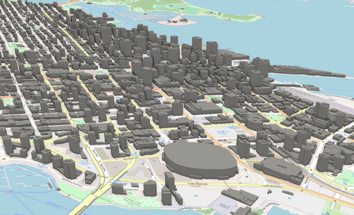
}
```

Extrusion is also frequently used to visualize non-height attributes. For example, population density can be extruded as a "height" value to give a unique perspective of the relative change in this attribute across space that may otherwise be difficult to appreciate from a 2D map with colour alone (Figure \@ref(fig:9-vancouver-population-density-2016)).

(ref:9-vancouver-population-density-2016-caption) Census dissemination areas extruded by population density (2016) for Vancouver, British Columbia. Census data from @government_of_canada_focus_2017, licensed under Statistics Canada Open License. Reproduced and distributed on an 'as is' basis with the permission of Statistics Canada. Base map © @openstreetmap_notitle_nodate contributors, licensed under Open Data Commons Open Database License. Pickell, CC-BY-SA-4.0.

```{r 9-vancouver-population-density-2016, fig.cap = fig_cap, out.width= "75%", echo = FALSE}
    fig_cap = "(ref:9-vancouver-population-density-2016-caption)"
    knitr::include_graphics("images/09-vancouver-population-density-2016.png")
```

##	Exaggeration

**Exaggeration** is the process of multiplying real height or elevation values by a constant factor in order create a larger range of values so that vertical features and patterns are made more apparent. Figure \@ref(fig:9-mount-logan-exaggeration) illustrates an example of exaggeration of a DEM for Mount Logan, the highest peak in Canada (5,959 m), located in the Yukon Territory.

(ref:9-mount-logan-exaggeration-caption) Elevation exaggeration of Mount Logan elevation, Yukon Terrotiry, Canada. Digital Elevation Model by @natural_resources_canada_canadian_2015. Pickell, CC-BY-SA-4.0.

```{r 9-mount-logan-exaggeration, fig.cap = fig_cap, out.width= "75%", echo = FALSE}
    fig_cap = "(ref:9-mount-logan-exaggeration-caption)"
    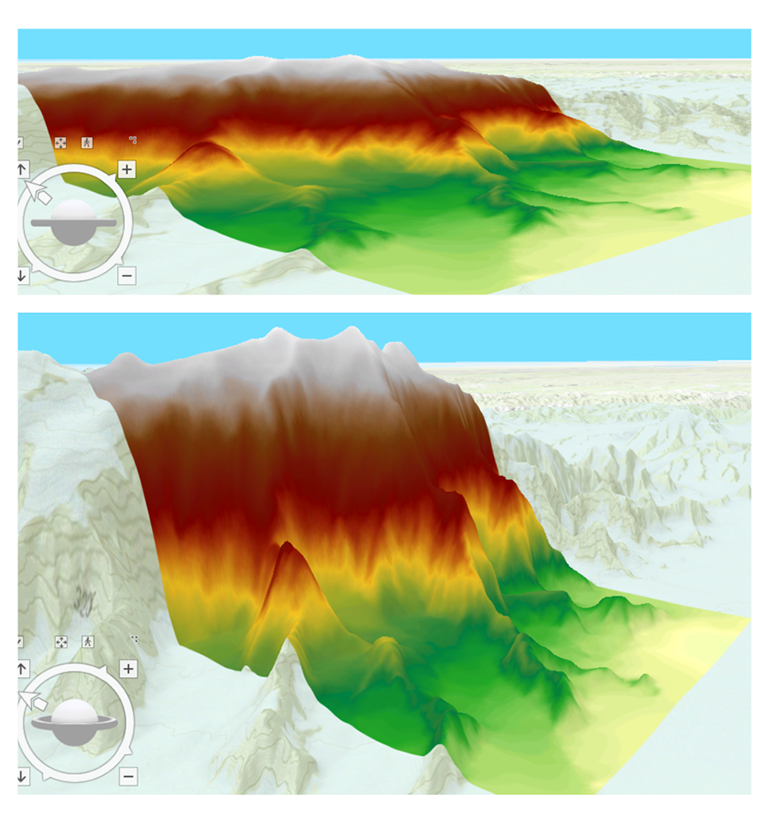
```

## Summary

Lorem ipsum dolor sit amet, consectetur adipiscing elit. Ut in dolor nibh. Lorem ipsum dolor sit amet, consectetur adipiscing elit. Praesent et augue scelerisque, consectetur lorem eu, auctor lacus. Fusce metus leo, aliquet at velit eu, aliquam vehicula lacus. Donec libero mauris, pharetra sed tristique eu, gravida ac ex. Phasellus quis lectus lacus. Vivamus gravida eu nibh ac malesuada. Integer in libero pellentesque, tincidunt urna sed, feugiat risus. Sed at viverra magna. Sed sed neque sed purus malesuada auctor quis quis massa.

## Reflection Questions {-}

1. Explain ipsum lorem.
2. Define ipsum lorem.
3. What is the role of ispum lorem?
4. How does ipsum lorem work?

## Practice Questions {-}

2. Given ipsum, solve for lorem.
3. Draw ipsum lorem.

## Recommended Readings {-}
