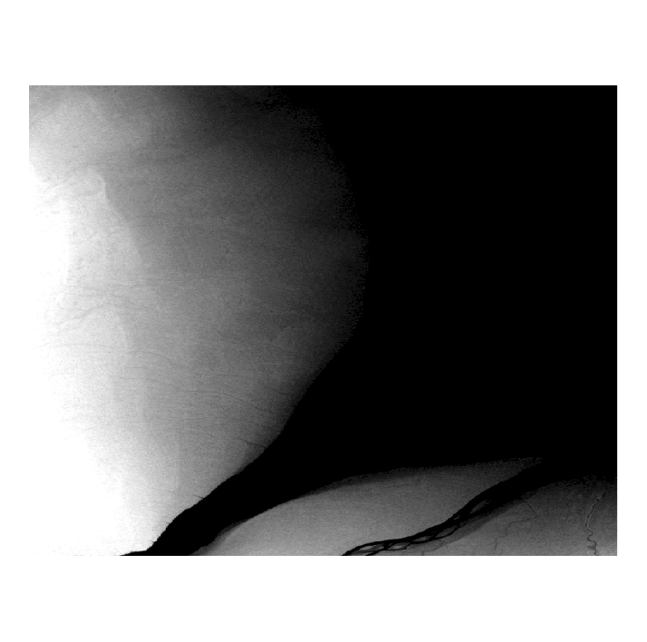

# Raster Analysis and Terrain Modelling {#raster-analysis-and-terrain-modelling}

Elevation data are frequently collected in a raster format. In this chapter, we will look at how rasters can be analyzed with a specific focus on deriving terrain information from elevation rasters. We will explore some useful properties of the raster structure that can be exploited for insightful analysis of land and water alike. Image-based raster analysis will be a later topic of Chapter 14.

:::: {.box-content .learning-objectives-content}

::: {.box-title .learning-objectives-top}
#### Learning Objectives {-}
::: 

1. Understand the principles of raster analysis
2. Recognize the types of digital vertical models and their uses
3. Synthesize the terrain and hydrological information that can be derived from a digital elevation model
4. Apply raster functions in terrain and hydrology workflows
5. Visualize terrain with 3D geovisualization methods

::::

### Key Terms {-}

Digital Elevation Model, Digital Vertical Model, Digital Terrain Model, Digital Surface Model, Anaglyph, 

## Raster analysis

### Base data

### Derived data

### Classified data

### Combined data

## Digital vertical models

```{r, echo=FALSE}
library(raster)
x <- raster(nrow=3,ncol=3,vals=1:9,crs="+proj=utm +zone=10 +ellps=WGS84 +datum=WGS84 +units=m +no_defs",xmn=0,xmx=300,ymn=0,ymx=300)
writeRaster(x,"saddle.tif",overwrite=T,format='GTiff',datatype='INT1U')
```

### Digital Elevation Models (DEM)

As the name suggests, a **Digital Elevation Model (DEM)** is a digital representation of elevation data or heights above a vertical datum. We call it a _model_ because, as you know from reading Chapter 3, all spatial data formats are inherently spatial data models. As is the case for all rasters, DEMs represent sampled data. That is, the elevations that are represented continuously in the raster DEM are in fact samples of elevation at the raster cell centres. For this reason, a DEM is a model that is simplifying elevation to some degree depending on the cell size. 

Figure 9.X shows a DEM for Mount Assiniboine near the Alberta and British Columbia border. Mount Assiniboine has a distinctive pyramidal peak that is not immediately apparent from the bird's-eye view of a DEM. It is common to see DEMs displayed in this black and white colour scheme, where black represents lower elevations and white represents higher elevations. Can you tell where the peak is? We will look at more sophisticated colour schemes and geovisualizations of terrain in a later section.

{.center}
Figure 9.X shows another DEM, but this time for some the flattest terrain in Canada over 1,600 km away from Mount Assiniboine on the Canadian Shield at the mouth of the Nelson River in Manitoba. The Nelson River drains an area of more than 1 million km^2 of land across much of the Canadian prairie provinces and pours into Hudson Bay. The Canadian Shield is home to the oldest terrain on Earth and millions of years of erosion have reduced it to rolling hills and flattened horizons. 

{.center}

Over an entire extent of 3,300 km^2, the Nelson River DEM in Figure 9.X only varies by 44 m. Compare that with the 1,328 m of difference from the white peak of Mount Assiniboine to the black valleys of the Rocky Mountains over about 5 km^2 in Figure 9.X. Throughout the remainder of this chapter, we will look at raster analysis applied to these two extreme examples of terrain.

### Digital Terrain Models (DTM)

A **Digital Terrain Model (DTM)** represents elevation through points and lines and is often erroneously confused with a DEM. The vector-based data format allows elevation to be sampled at a higher density in areas where elevation changes quickly in space (e.g., Mount Assiniboine) and at lower density in areas where elevation changes gradually (e.g., Nelson River). Lines can be used to model mountain ridges, river banks, fault lines, and coast lines where elevation might be constant and it would be useful to represent the elevation as a line feature instead of a point of elevation. It is important to recognize that DTMs can be converted to DEMs through a process of interpolation (more on that in Chapter 10), but a DEM cannot be converted to a DTM because a DEM is a regular grid or equally-spaced elevation samples.

### Digital Surface Models (DSM)

Up to this point, we have been looking digital vertical models of _bare Earth_, that is, just plain old elevation of terrain above a vertical datum. If you want to represent the height of features above the bare Earth, like houses and trees, then you would need to use a **Digital Surface Model (DSM)**. Whereas a DTM and DEM both represent elevation above a vertical datum, which is usually mean sea level represented by the geoid, a DSM represents height above a DTM or DEM. In this way, we can model features on the surface and their heights. We will look at more examples of working with DSMs in Chapter 15. 

## Raster functions

### Local

### Focal

### Global

### Zonal

## Derivatives of elevation models

You can probably recognize by now that if we apply a raster function to a DEM, then there is a lot of derived information that we can exploit in a raster analysis of terrain. These are further classified as first order, second order, and compound terrain derivatives. In this next section we will explore several common derivatives of a DEM and, importantly, we will see how they appear differently in the flat terrain of Nelson River and the rugged terrain of Mount Assiniboine.

### Slope

**Slope** is a first order terrain derivative using a focal raster function that represents the change in elevation over the distance of a cell edge. Slope can be expressed as a percentage or as angular degrees. As a percentage, a 0% slope would represent flat terrain and a 150% slope would represent steep terrain. It is worth pointing out that there is no upper bound for expressing slope as a percentage, but angular degrees are limited by an upper bound of 90°. It is mathematically impossible to achieve a slope of exactly 90° from a raster DEM because the cell size of a raster must always be great than 0 and a 90° angle would only be possible if two cells overlaid one another in the same raster, hence the impossibility. Slope is a derivative that is usually necessary in order to calculate other terrain derivatives. 

Figure 9.X shows the slope of Mount Assiniboine where red represents steeper slopes and green represents flatter slopes. For the Mount Assiniboine DEM, the slope values range from 2° at the flattest to 80° at the steepest. Can you see the peak yet? 

{.center}
Figure 9.X shows the slope of Nelson River pouring into Hudson Bay. Again, red is steeper and green is flatter, but the slope values here only range from 0° to 9° and the vast majority of cells are less than 2°. Very flat terrain that can hardly be distinguished from the sea.

{.center}

### Aspect

**Aspect** is another first order terrain derivative that represents the azimuthal direction that a slope faces. For example, an azimuth of 0° is North-facing slope, 90° is East-facing, 180° is South-facing, and 270° is West-facing with all other azimuths in between. Typically, aspect is most apparent when azimuths are dominate throughout the DEM. For example, the slope aspects are clearly visible in Figure 9.X showing Mount Assiniboine. By contrast, when slopes are very flat as is the case for the Nelson River, aspect can alternate frequently and produce a nearly random sequence except for the relatively steeper south bank of the river shown in Figure 9.X. It is possible to have an undefined aspect when the slope is 0°, which is the case for water seen coloured grey in Figure 9.X.

{.center}
{.center}

### Heat load index

```{r, echo=FALSE}
library(raster)
library(spatialEco)
mta <- raster("data/09/CDEM_Mount_Assiniboine.tif")
mta_hli <- hli(mta)
writeRaster(mta_hli,"data/09/CDEM_Mount_Assiniboine_HLI.tif",overwrite=T,format='GTiff',datatype='FLT4S')

nr <- raster("data/09/SRTM_Nelson_River.tif")
nr_hli <- hli(nr)
writeRaster(nr,"data/09/SRTM_Nelson_River_HLI.tif",overwrite=T,format='GTiff',datatype='FLT4S')

```

One important derivative from aspect is 

{.center}

### Hillshade

A **hillshade** is a DEM with a simulated light source. The values in a hillshade represent the illumination of that cell given its slope, aspect, and position in the raster relative to a simulated light source. The light source has an elevation and azimuth that can be defined to reflect a particular time of day. Thus, hillshades can be useful to show a more 3-dimensional view of terrain from the bird's-eye view of the DEM. Hillshades can also reveal fine differences in terrain that are not apparent from a simple DEM. Figure 9.X animates (online) a series of hillshades created with azimuths at 10° intervals from 0° to 350° with a light source at an elevation of 45° for Mount Assiniboine. This has the effect of rotating an approximately 9 AM high Sun on the solstice around Mount Assiniboine.

{.center}

A hillshade is still a 2D raster with 3D features simulated through an illumination process. A hillshade does not reveal much for flatter terrain since there is not much variation in slopes across the entire raster, as can be seen in Figure 9.X for Nelson River, which is also animated in the same way as Figure 9.X. As you can see, there is no change over the water of the river and Hudson Bay where slope is 0° and aspect is undefined and only some minor terrain features are apparent over the land.

{.center}

### Sinks, peaks, and saddles oh my!

**Sinks** are depressions in a DEM where the focal cell is surrounded by eight neighbouring cells with higher elevations (Figure 9.X). Sinks are often naturally occurring (e.g., lakes, ponds, and wetlands), but can also be due to random error, elevation precision, DEM cell size, or other pre-processing that may have been applied to the DEM such as mosaicking. The problem with sinks when modeling runoff is that water will enter the cell, but will not be able to exit in any direction. Therefore, sinks result in an undefined flow direction and a process must be undertaken to identify and fill them in the DEM prior to calculating flow direction.

{.center}

**Peaks** are the opposite of sinks, where a focal cell is surrounded by eight neighbouring cells that share the same lower elevation (Figure 9.X). Like sinks, peaks are also naturally occurring (e.g., mountain peaks and ridge lines) and may also be artifacts of data resolution and processing. Peaks also result in an undefined flow direction and must be removed before calculating flow direction. 

{.center}

**Saddles** occur when a lowland is bounded by two or more peaks (Figure 9.X). Usually, saddles identify a divide between drainage basins because they often occur along ridgelines and precipitation will runoff into one or the other drainage basin, but not both. 

{.center}


## Landform classification

One of the motivations for deriving information from a DEM is to classify terrestrial landforms. Some of the derived information we have seen so far, like slope, can be used to classify landforms, but slope does not inform on geographic position. For example, a low slope value could be a plateau on top of a mountain or a river in a valley bottom. Therefore, we need more contextual information beyond these first or second terrain derivatives that we have looked at so far. There are two popular ways to derive these complex terrain derivatives by calculating terrain curvature and topographic position indices, which is what we will explore next. 

### Profile and Planform curvature

Curvature of terrain is described as convex, flat, or concave, which impacts the flow acceleration or deceleration of runoff over the terrain. There are two components of terrain curvature representing the x- and y-axes of geographic space. **Profile curvature** describes the downslope curvature while **plan or planform curvature** describes the curvature that is perpendicular to the downslope curvature. In this way, the vertical expression of terrain can be described by two, perpendicular curves. Figure 9.X illustrates the nine different combinations of profile and planform curvature.

{.center}
There are many ways to calculate curvature, which usually take the form of a polynomial that is fit by a focal function over some neighbourhood of pixels. A 3x3 kernel is typically used to calculate profile and planform curvature, however, it is also common to increase the kernel size to counteract the effect of noise in high resolution DEMs. Figure 9.X illustrates examples of 3x3 kernels for each of the profile and planform curvature combinations. You might recognize variations of sinks, peaks, and saddles amongst the examples, which are of course not exhaustive of all possible elevation value combinations, but they are otherwise representative of the primary patterns that are indicated by profile and planform curvature.

{.center}

Both profile and planform curvature are calculated as continuous floating point integers where: positive values represent convex curvature in the profile and concave curvature in the planform; zero represents no curvature; and negative values represent concave curvature in the profile and convex curvature in the planform. Figure 9.X shows the profile and planform curvature for Mount Assiniboine. What landforms can you start to identify from terrain curvature? Can you identify any sinks, peaks, or saddles in the DEM?

{.center}

### Topographic position index

Another way to derive and classify landforms is through the use of a **topographic position index (TPI)**, which is a focal function that accounts for the difference between the focal cell elevation and the average elevation of the eight neighbouring cells (in the case of a 3x3 kernel). Therefore, positive TPI values indicate ridges or peaks, zero indicates either a constant slope or a flat area or a saddle, and negative TPI values indicate a valley or sink. Figure 9.X shows the TPI for Mount Assiniboine compared with the Nelson River. The TPI is sometimes also referred to as a terrain ruggedness index and there are other variations for calculating it as well (e.g., computing the standard score of the focal cell instead of the mean difference).

{.center}

## Hydrology work"flows"

### Flow direction

### Flow accumulation

### Flow length

### Stream delineation

###	Stream order

###	Pour points

###	Watershed delineation

### Topographic wetness index

### Case Study Here

## Geovisualization

### Anaglyphs

{.center}
{.center}
{.center}

###	Viewsheds

###	Extrusion

###	Exaggeration

###	Lighting and shadowing

###	Symbologies for relief

## Summary

Lorem ipsum dolor sit amet, consectetur adipiscing elit. Ut in dolor nibh. Lorem ipsum dolor sit amet, consectetur adipiscing elit. Praesent et augue scelerisque, consectetur lorem eu, auctor lacus. Fusce metus leo, aliquet at velit eu, aliquam vehicula lacus. Donec libero mauris, pharetra sed tristique eu, gravida ac ex. Phasellus quis lectus lacus. Vivamus gravida eu nibh ac malesuada. Integer in libero pellentesque, tincidunt urna sed, feugiat risus. Sed at viverra magna. Sed sed neque sed purus malesuada auctor quis quis massa.

### Reflection Questions {-}

1. Explain ipsum lorem.
2. Define ipsum lorem.
3. What is the role of ispum lorem?
4. How does ipsum lorem work?

### Practice Questions {-}

2. Given ipsum, solve for lorem.
3. Draw ipsum lorem.

`r if (knitr::is_html_output()) '
## Recommended Readings {-}
'`

Ensure all inline citations are properly referenced here.

```{r include=FALSE}
knitr::write_bib(c(
  .packages(), 'bookdown', 'knitr', 'rmarkdown', 'htmlwidgets', 'webshot', 'DT',
  'miniUI', 'tufte', 'servr', 'citr', 'rticles'
), 'packages.bib')
```
