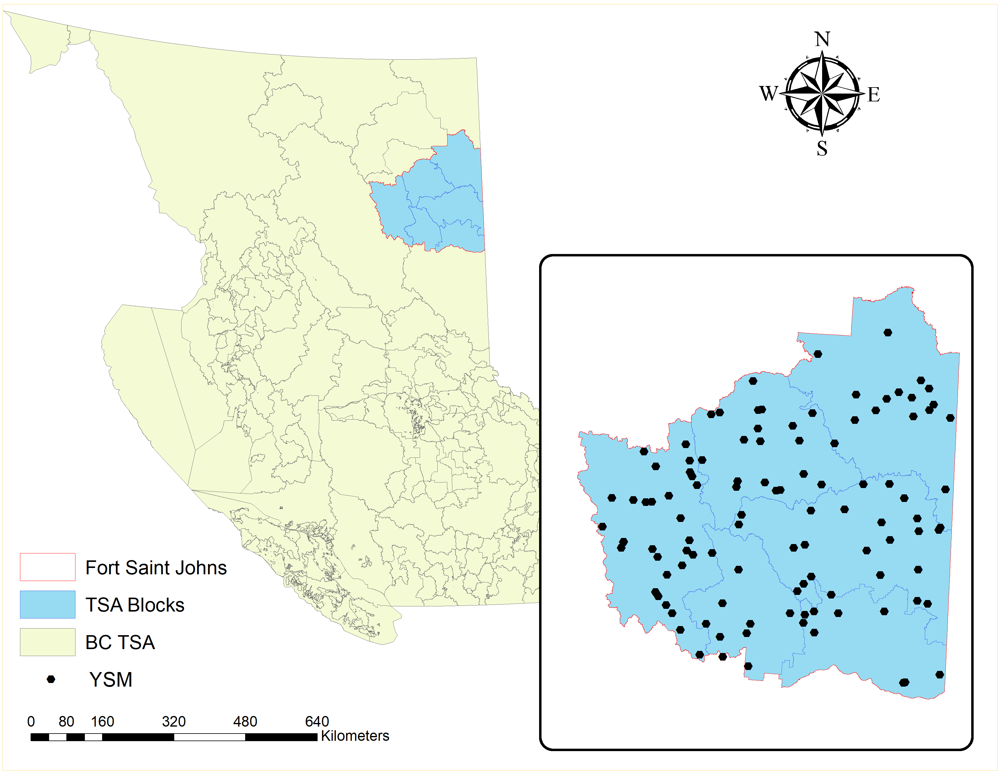

## Spatial Estimation {#spatial-estimation}

**Geostatistics** uses the metrics based on statistical tools that are used to characterize the distribution of an event across the geographical region of interest [@Getis2004]. In context of spatial data, it is important to understand what is occurring where. Sometimes there is a detailed and precise information of an **event** (spatial phenomenon defined by its location and the characteristics that can be measured in both quantitative or qualitative scale) across the geographical area such that a continuous map can be built out of that information. While, most of the time, only discrete and unrepresentative information on the spatial event is collected, which doesnot allow to create a precise continuous surface of the event over entire geographic area of interest. In such scenario, we should focus on two things; 

1) How can we best utilize the available discrete information to represent the event across entire area using the appropriate sampling strategies. 

2) Once a good sampling strategy is employed, we should be able to estimate the occurrence of the event across the unsampled region in the entirety of study area using proper spatial estimation technique.

This chapter introduces some basic ideas on different types of **sampling** strategies in spatial context. In addition, this chapter also introduces various type of spatial statistics that are being used in **predicting** the occurrence of events in the unsampled locations. 

:::: {.box-content .learning-objectives-content}

::: {.box-title .learning-objectives-top}
## Learning Objectives {-}
::: 

1. To be familiar with different types of spatial sampling
2. To understand the relationship between observations at spatial scale using autocorrelation and semivariogram
3. To be familiar with the methods of spatial interpolation to predict observations at unknown locations
4. To be familiar with the methods of spatial prediction using regression models

::::

## Key Terms {-}

Sampling, Spatial autocorrelation, Moran's I, Kriging, Interpolation, Spatial regression

## Introduction 

Like any other data, spatial data will only make true sense if it can represent the entire population of interest and provide some flexibility in level of spatial analysis that can be performed from it. A representative sample will allow us to make unbiased and more accurate inferences of certain attribute of the population. While, spatial analysis will allow to understand where and what is occurring in the area of our interest. Two kind of limitation are inherent in a spatial data:

1. There is a high chance that the information regarding an attribute may be similar at nearby locations that are sampled due to **spatial autocorrelation**.

2. On the other hand, a spatial data carry the unsampled locations within a study area. 

To overcome this limitation, one should come up with a proper **sampling** strategies to ensure that the given sample is representative of a population and lacks any redundant information. While the need to account for additional variables about a location may be intimidating, many spatial statistic analyses are out there to help with basic **prediction** and **estimation** of the information in an unobserved location. For example, interpolation and spatial regression can help us predict and estimate the value of a variable in an unsampled location. Similarly, **spatial autocorrelation** measures the degree of similarity between samples at different sampled locations.


:::: {.box-content .call-out-content}

::: {.box-title .call-out-top}
## Recall This {-}
:::

<p id="box-text"> 

## Geostatistics

Branch of statistics used to analyze and predict the values associated with spatial or spatiotemporal phenomenan often defined by the locations over a study area.

## Spatial Autocorrelation

The measures the degree of similarity between samples at different sampled locations.


## Sampling

The process of selecting a part of a population. 

## Prediction

Using the existing sampled data to compute the value of the variable in a unsampled location.

## Estimation

Using the existing data to find the best value of the coefficient while establishing the association between different variables 

</p>

::::


## Classical vs. Geostatistical Inferences

In classical statistics, the variance is assumed to be totally random when samples are drawn from a defined sampling space [@Jacquez1999] and are assumed to come from one distribution [@Steel1980PrinciplesAP]. The inference about the population is the based on the comparison of a test statistic calculated for a sample to the distribution of the statistic under the null hypothesis for the reference distribution [@Jacquez1999]. The significance level of a test statistics from the sample is compared with the critical value of test statistics obtained by repeatedly reordering the data at random proportion [@Jacquez1999]. Interpretation of this significance level on the classical model is done using a **p-value** which, if less than or equal to the a level of cutoff, also know as **alpha** (usually 5% or 0.05) the **null hypothesis** of **‘no difference’** is rejected [@Jacquez1999].

While in geostatistics, the variance is assumed to be partly random and each point in the field represents a sample from some distribution [@Jacquez1999]. However,the distribution at any one point may differ completely from that at all other points in its shape, mean, and variance [@Jacquez1999]. The distribution of differences in sample values separated by a specified distance is assumed to be the same over the entire field [@Jacquez1999]. In geostatistics, if the sample values are similar (also know as **spatial autocorrelation**) given that they are in proximity to each other, the random variance of the distribution of differences in sample values is relatively small [@Jacquez1999]. If the sample values doesnot show spatial autocorrelation, the variance is larger. In geostatistics, the **semi-variance**, i.e., half of the variance is used to measure the similarity between points at a given distance apart [@Jacquez1999]. Using the semivarince, a graph of semivariance versus distance is constructed, know as **semi-variogram** [@Jacquez1999]. Thus, beside conducting a hypothesis test , in geostatistics, there are two additional stages: 1) semivariogram construction and 2) incorporating semi-variogram to estimate the values at unsampled locations using various spatial methods. We will get into details about semivariogram construction and spatial methods in the later sections of this chapter. 

## Sampling

**Sampling** can be defined as the process of selecting some part of a population (also known as **sample**) in order to make an inference, and estimate some parameters about the whole population[@thompson2012sampling]. For example, to estimate the amount of biomass of trees in Malcom Knapp Forest, BC, scientist collects the data on tree size, and height from randomly distributed 100 small plots across the forest. Based on some equations and using the tree data on height and size from 100 plots, biomass of entire Malcom Knapp Forest can be estimated. Similarly, to estimate the amount of recoverable oil in a region, a few (highly expensive) sample holes are drilled (example adapted from @thompson2012sampling). The situation is similar in a national opinion survey, in which only a sample of the people in the population is contacted, and the opinions in the sample are used to estimate the proportions with the various opinions in the whole population (example adapted from @thompson2012sampling, pp.1). 

**Sampling** should not be confused with **observational** study. In an observational study, one has no control over the sample while in sampling one can deliberately select samples which prevent research bias[@thompson2012sampling]. Sampling accounts on how data can be collected out of every possibilities under the control of investigator [@thompson2012sampling]. 

Broadly, sampling can be categorized into two groups [@Teddlie2007]:

1. Probability sampling
2. Non-probability sampling

Before getting into the details about different types of sampling. We will make ourself familiar with some sampling key terms and their definitions.


:::: {.box-content .call-out-content}

::: {.box-title .call-out-top}
## Recall This {-}
:::

<p id="box-text">

## Population

Any large spatially defined entity of plots, people, trees, animals etc., from which samples are drawn and measurement of certain characteristics is conducted. 

## Sampling Design

The procedure by which the sample of units is selected from the population is called the sampling design. 

## Sampling Unit

The smallest entity within a population from which the information about population is drawn is known as sampling unit. For example, in a survey of potential internet user over entire BC , sampling unit can be the certain number of household in each city across BC. 

</p>

::::

## Probability Sampling

Probability sampling techniques are mostly used in studies that use extensive amount of quantitative analysis [@Tashakkori2010]. It involves selecting a large number of units from a population where the probability of inclusion for every member of the population is determinable [@Tashakkori2010].

## Simple Random Sampling

In simple random sampling, each sampling unit within a given population has equal probability of being selected in a sample [@thompson2012sampling].For example, suppose we would like to measure the tree heights of all the trees from a simple random sample of 60 plots with their spatial locations (given by plots center co-ordinates) from a forest divided into 625 spatially defined plots as given in **Figure 10.1**.  Notice, there is no distinctive pattern on how plots are being selected for the measurement of tree heights, this justify the **random part** of the simple random sampling. 

As an investigator, when we make a sequence of selections from a population, at each step, new and distinct set of sampling units are being selected in the sample, each having equal probability of being selected at each step.

For example, when we take another sample of 60 plots as in **Figure 10.2**, we can see that different **sampling units (plots)** are being selected from what we obtained in **Figure 10.1.**, this represent the **equal probability** of each sampling unit being selected.


```{r , echo=FALSE, warning=FALSE, message=FALSE}
library(plotly)
library(ggplot2)
library(scales)
m <- matrix(c(1:625), nrow=25, ncol=25)
df <- expand.grid(x=1:ncol(m),y=1:nrow(m))
df$val <- m[as.matrix(df[c('y','x')])]
n <- df[sample(nrow(df), 60, replace = FALSE, prob = NULL),]
p<-ggplot(n,aes(x=x, y=y, label=val)) + 
  geom_tile(data=df, fill='transparent', colour = 'black') + 
  geom_tile(data=n,fill='black')+
  scale_y_reverse() +
  theme_classic() + 
  theme(axis.text  = element_blank(),
        panel.grid = element_blank(),
        axis.line  = element_blank(),
        axis.ticks = element_blank(),
        axis.title = element_blank())
p
```

**Figure 10.1.** \ref{fig:figs} Simple random sample of 60 units from a population of 625 units.


```{r, echo=FALSE,warning=FALSE}
library(plotly)
library(ggplot2)
library(scales)
m <- matrix(c(1:625), nrow=25, ncol=25)
df2 <- expand.grid(x=1:ncol(m),y=1:nrow(m))
df2$val <- m[as.matrix(df[c('y','x')])]
n <- df2[sample(nrow(df2), 60, replace = FALSE, prob = NULL),]

p<-ggplot(n,aes(x=x, y=y, label=val)) + 
  geom_tile(data=df2, fill='transparent', colour = 'black') + 
  geom_tile(data=n,fill='black')+
  scale_y_reverse() +
  theme_classic() + 
  theme(axis.text  = element_blank(),
        panel.grid = element_blank(),
        axis.line  = element_blank(),
        axis.ticks = element_blank(),
        axis.title = element_blank())
p
```

**Figure 10.2.** \ref{fig:figs} Another simple random sample of 60 units.


## Stratified Random Sampling

When a population under study is not **homogeneous** (similar in biological characteristics) across the entire study area and consists of some sort of gradient, stratified random sampling method is used [@thompson2012sampling]. The principle of stratification is to partition the population in such a way that the units within a stratum are as similar as possible [@Teddlie2007]. Random samples from each strata are drawn to ensure adequate sampling of all groups [@Teddlie2007]. Even though one stratum may differ markedly from another, a stratified sample with the desired number of units from each stratum in the population will tend to be “representative” of the population as a whole [@Howell2020].

For example, a forest under study is divided **(stratified)** into similar  regions  **Figure 10.3** defined by elevation, soil moisture, and soil nutrient gradient and random samples are taken within each strata. The stratification of a study region despite of its size can help to spread the sample over the entire study area.


```{r, echo=FALSE, warning=FALSE, message=FALSE}
library(plotly)
library(ggplot2)
library(scales)
m <- matrix(c(1:400), nrow=20, ncol=20)
df3 <- expand.grid(x=1:ncol(m),y=1:nrow(m))
df3$val <- m[as.matrix(df3[c('y','x')])]
n <- df3[sample(nrow(df3), 40, replace = FALSE, prob = NULL),]
p<-ggplot(n,aes(x=x, y=y, label=val)) + 
  geom_tile(data=df3, fill='transparent', colour = 'black') + 
  geom_tile(data=n,fill='black')+
  geom_rect(aes(xmin =0.5,xmax = 10.5,ymin = 0.5, ymax = 20.5),
    fill = 'pink',alpha=0.02,color = "black",size = 2)+
  geom_rect(aes(xmin =10.5,xmax = 20.5,ymin = 0.5, ymax = 5.5),
    fill = 'skyblue',alpha=0.02,color = "black",size = 2)+
  geom_rect(aes(xmin =10.5,xmax = 20.5,ymin = 5.5, ymax = 20.5),
    fill = 'lightgrey',alpha=0.02,color = "black",size = 2)+
  scale_y_reverse() +
  theme_classic() + 
  theme(axis.text  = element_blank(),
        panel.grid = element_blank(),
        axis.line  = element_blank(),
        axis.ticks = element_blank(),
        axis.title = element_blank())
p
```

**Figure 10.3.** \ref{fig:figs} Stratified random sample within unequal strata within a study area.


```{r, echo=FALSE,warning=FALSE}
library(plotly)
library(ggplot2)
library(scales)
m <- matrix(c(1:400), nrow=20, ncol=20)
df <- expand.grid(x=1:ncol(m),y=1:nrow(m))
df$val <- m[as.matrix(df[c('y','x')])]
n <- df[sample(nrow(df), 40, replace = FALSE, prob = NULL),]
p<-ggplot(n,aes(x=x, y=y, label=val)) + 
  geom_tile(data=df, fill='transparent', colour = 'black') + 
  geom_tile(data=n,fill='black')+
  geom_rect(aes(xmin =0.5,xmax = 10.5,ymin = 0.5, ymax = 10.5),
    fill = 'pink',alpha=0.02,color = "black",size = 2)+
  geom_rect(aes(xmin =0.5,xmax = 10.5,ymin = 10.5, ymax = 20.5),
    fill = 'skyblue',alpha=0.02,color = "black",size = 2)+
  geom_rect(aes(xmin =10.5,xmax = 20.5,ymin = 10.5, ymax = 20.5),
    fill = 'lightgrey',alpha=0.02,color = "black",size = 2)+
  geom_rect(aes(xmin =10.5,xmax = 20.5,ymin = 0.5, ymax = 10.5),
    fill = 'brown',alpha=0.02,color = "black",size = 2)+
  
  scale_y_reverse() +
  theme_classic() + 
  theme(axis.text  = element_blank(),
        panel.grid = element_blank(),
        axis.line  = element_blank(),
        axis.ticks = element_blank(),
        axis.title = element_blank())
p

```
**Figure 10.4.** \ref{fig:figs} Stratified random sample from equal strata within a study area.

## Systematic Sampling

A systematic sample uses a fixed grid or array to assign plots in a regular pattern **Figure 10.5** [@McRoberts2014]. The advantage of systematic sampling is that it maximizes the average distance between the plots and therefore minimizes spatial correlation among observations and increases statistical efficiency [@McRoberts2014]. In addition, a systematic sample, which is clearly seen to be representative in some sense, can be very convincing to decision-makers who lack experience with sampling [@McRoberts2014]. Raster grids such as digital elevation models (DEM) are some examples of systematic sample.

```{r, echo=FALSE,warning=FALSE,message=FALSE}
library(ggplot2)
library(scales)
library(dplyr)
m <- matrix(c(1:400), nrow=20, ncol=20)

# Create row indicator
df <- expand.grid(x=1:ncol(m),y=1:nrow(m))
df$val <- m[as.matrix(df[c('y','x')])]
row_odd <- seq_len(nrow(df)) %% 2 
col_odd<- seq_len(ncol(df)) %% 2
data_row_odd <- df[row_odd == 0,] 
data_col_odd <- df[col_odd == 0,]
# Subset odd rows

p<-ggplot(data_col_odd,aes(x=x, y=y, label=val)) + 
  geom_tile(data=df, fill='transparent', colour = 'black') + 
  geom_rect(data=data_col_odd,aes(xmin = x, ymin = y, xmax = x + 0.3, ymax = y + 0.6),fill='black')+
  scale_y_reverse() +
  theme_classic() + 
  theme(axis.text  = element_blank(),
        panel.grid = element_blank(),
        axis.line  = element_blank(),
        axis.ticks = element_blank(),
        axis.title = element_blank())
p

```

**Figure 10.5.** \ref{fig:figs} Sample every second observation in the row 

```{r, echo=FALSE,warning=FALSE}
library(ggplot2)
library(scales)
library(dplyr)
m <- matrix(c(1:400), nrow=20, ncol=20)

# Create row indicator
df <- expand.grid(x=1:ncol(m),y=1:nrow(m))
df$val <- m[as.matrix(df[c('y','x')])]
row_odd <- seq_len(nrow(df)) %% 2 
data_row_odd <- df[row_odd == 0,] 
# Subset odd rows

p<-ggplot(data_row_odd,aes(x=x, y=y, label=val)) + 
  geom_tile(data=df, fill='transparent', colour = 'black') + 
  geom_rect(data=data_row_odd,aes(xmin = x, ymin = y, xmax = x + 0.3, ymax = y + 0.6),fill='black')+
  scale_y_reverse() +
  theme_classic() + 
  theme(axis.text  = element_blank(),
        panel.grid = element_blank(),
        axis.line  = element_blank(),
        axis.ticks = element_blank(),
        axis.title = element_blank())
p

```
**Figure 10.6.** \ref{fig:figs} Sample all the observation in every second column 

## Cluster Sampling 

In cluster sampling, rather than sampling individual units, which might be geographically spread over great distances, we can sample groups (clusters) of plots that occur naturally in the study area [@Teddlie2007]. Cluster sampling is employed when we want to be more efficient in terms of the use of time and money to generate a more efficient probability sample [@Teddlie2007].

```{r, echo=FALSE, warning=FALSE, message=FALSE}
library(plotly)
library(ggplot2)
library(scales)
m <- matrix(c(1:400), nrow=20, ncol=20)
df <- expand.grid(x=1:ncol(m),y=1:nrow(m))
df$val <- m[as.matrix(df[c('y','x')])]
p<-ggplot(df,aes(x=x, y=y,label=val)) + 
  geom_tile(data=df, fill='transparent', colour = 'black') +
  geom_rect(aes(xmin = 0.5,xmax = 3.5,ymin = 14.5, ymax = 20.5),
    fill = 'lightgrey',alpha=0.02,color = "black",size = 2)+
  geom_rect(aes(xmin = 5.5,xmax = 7.5,ymin = 5.5, ymax = 7.5),
    fill = 'lightgrey',alpha=0.02,color = "black",size = 2)+
  geom_rect(aes(xmin = 12.5,xmax = 14.5,ymin = 12.5, ymax = 14.5),
    fill = 'lightgrey',alpha=0.02,color = "black",size = 2)+
  geom_rect(aes(xmin = 15.5,xmax = 20.5,ymin = 0.5, ymax = 5.5),
    fill = 'lightgrey',alpha=0.02,color = "black",size = 2)+
  scale_y_reverse() +
  theme_classic() + 
  theme(axis.text  = element_blank(),
        panel.grid = element_blank(),
        axis.line  = element_blank(),
        axis.ticks = element_blank(),
        axis.title = element_blank())
p 
```
**Figure 10.7.** \ref{fig:figs} Cluster of plots selected from entire study area

## Non-probability Sampling

Non-probability sampling is generally used in qualitative studies. They are also know as **purposive or adaptive sampling**, and defined as selecting units (e.g.,individuals, groups of individuals, institutions) based on specific purposes associated with answering some research questions. **Purposive or Adaptive** sampling can be classified into three broad categories [@Teddlie2007]:

## Representative Sampling

This type of sampling is used when we want to select samples that will represent broader groups as closely as possible [@Teddlie2007]. One of the example of representative sampling is selecting 100 Douglas fir and 50 Spruce tree from study area within Malcom Knapp Forest, BC consisting of 500 Douglas fir and 300 Spruce trees for the measurement of tree height.

## Unique Case Sampling

In this sampling, we want to focus on more specific case which is unique and rare in terms of one or more characteristics [@Teddlie2007]. One of the example of unique case sampling could be understanding the genetic makeup of person who is not affected by Covid-19 virus. 

## Sequential Sampling

In this sampling method, we would pick up a single or group of cases in an interval of time, analyzes the results and then move on to the next group of cases and so on [@Teddlie2007]. The goal of the research project is to generate some theory (or broadly defined themes) [@Teddlie2007]. 


## Spatial Autocorrelation

When an attribute or variable is mapped across a study area or domain, geologist ask a question on whether a variable is cluster, randomly distributed or dispersed [@Carr1993]. In some cases, the nature of a cluster is distinctive visually, while in others it is not apparent [@Carr1993]. Hence, to come up with a quantitative measure on variable is clustered or randomly distributed in the domain, **spatial autocorrelation** is used. The concept of autocorrelation comes from Tobler’s first law of geography which states, “things that are closer in distance are related” [@Tobler1970]. **Spatial autocorrelation** can be defined as the relationship between a variable of interest with itself when measured at different location [@Getis1995CliffAA]. In other words, if a variable is measured at different locations which are at proximity, the value of variable is almost same. There could be both positive and negative spatial autocorrelation. Consider the following example; **Figure 10.8** shows the clustering pattern in the given square boxes (can be variable of interest) representing the positive spatial autocorrelation (left) and a complete checkerboard (right) distribution of square boxes (variable of interest) indicating a negative spatial autocorrelation.

:::: {.box-content .call-out-content}

::: {.box-title .call-out-top}
## Recall This {-}
:::

<p id="box-text"> 

## Domain
The study area from where spatial sample is taken. 

## Attributes
The information attached to the study objects that are spatially distributed in a Domain. Often termed as variable of interest.

</p>

::::

```{r, echo=FALSE, warning=FALSE, message=FALSE}
n<- matrix(c(1:400), nrow=20, ncol=20)

# Create row indicator
df <- expand.grid(x=1:ncol(n),y=1:nrow(n))
df$val <- n[as.matrix(df[c('y','x')])]
df$val<-rep(c(1:5), each = 80)
# Subset odd rows
cols <- c("1" = "red", "2" = "blue", "3" = "darkgreen", "4" = "orange", "5"="black")
p <- ggplot(df)+ geom_tile(aes(x, y, fill =val), 
                            colour = "black", width=1, height=1, size=1)+

  scale_fill_gradient2(low=muted("blue"), high=muted("red"))+
  scale_y_reverse() +
  theme_classic() + 
  theme(legend.position = "none")+
  theme(axis.text  = element_blank(),
        panel.grid = element_blank(),
        axis.line  = element_blank(),
        axis.ticks = element_blank(),
        axis.title = element_blank())
############# negative#########
m <- matrix(c(1:625), nrow=25, ncol=25)
df3 <- expand.grid(x=1:ncol(m),y=1:nrow(m))
df3$val <- m[as.matrix(df3[c('y','x')])]
odd_indexes<-seq(1,nrow(df3),2)
even_indexes<-seq(2,nrow(df3),2)
df3[odd_indexes, "val"] <- "0"
df3[even_indexes, "val"] <- "1"

q <- ggplot(df3)+ geom_tile(aes(x, y, fill = ifelse(val > 0,val, NA)), 
                   colour = "black", width=1, height=1, size=1)+
#n <- df3[sample(nrow(df3), 40, replace = FALSE, prob = NULL),]

  scale_y_reverse() +
  theme_classic() + 
  theme(legend.position = "none")+
  theme(axis.text  = element_blank(),
        panel.grid = element_blank(),
        axis.line  = element_blank(),
        axis.ticks = element_blank(),
        axis.title = element_blank())

library(cowplot)

grids_bs <- plot_grid(p,q,ncol = 2, labels = c('Positive autocorrelation', 'Negative autocorrelation'), align = "h")
grids_bs
```

**Figure 10.8.** \ref{fig:figs} Example of a positive (left) and negative spatial autocorrelation (right) for a give domain.

## Moran's I 

**Moran’s I** [@Moran1950], is a correlation coefficient that measures the degree of spatial autocorrelation in certain attributes of the data. It is based on the spatial covariance standardized by the variance of the data [@Moran1950]. It works based on the neighborhood list created based on spatial weight matrix [@Suryowati2018]. The value of Moran’s I ranges between -1 to 1, where 1 indicates the perfect positive spatial autocorrelation, 0 indicates the random pattern, and -1 indicates the perfect negative autocorrelation [@Moran1950]. Moran’s I is calculated using the following formula [@Moran1950]:  

$$
I= \frac{1}{s^2} \frac{\sum_{i}\sum_{j}({y_i-\bar{y})({y_j-\bar{y}})}}
{\sum_{i}\sum_{j}w_{ij}}
$$
Where, $$I=\text{the Moran I statistics}$$, $$y_i=\text{variable measure at location i}$$
$$y_j=\text{variable measure at location j}$$

$$S^2=\text{the variance}$$
$$w_{ij}=\text{the spatial weight matrix}$$ 


:::: {.box-content .case-study-content}

::: {.box-title .case-study-top}
## Case Study: Title of Case Study Here 
You see textual case study content here

For this case study, we will use ground plot data from Change Monitoring Inventory (CMI) program [for details: @ProvinceofBC2018] for Williams Lake and 100-miles House timber supply area (TSA) in the province of British Columbia, Canada. William Lake TSA and 100-miles House TSA are divided into 18 and 8 blocks respectively **Figure 10.9**. There is a total of 456 CMI plots used in this study **Figure 10.9**. The total basal area (m2/ha) is our variable of interest in this study. For each of the polygon in Williams lake and 100-miles house TSA, total basal area was calculated by taking the sum of the basal area of each CMI plots in each polygon. For this part of exercise, we want to understand if there is any spatial relationship (autocorrelation) between the total basal area measured in each polygon of TSA. We will quantitatively measure the presence or absence of **spatial autocorrelation** using **Moran’s I** and **Geary's C**. 

<p id="box-text">
</p>

<p id="box-text">
</p>

<p id="box-text">
</p>
```{r , echo=FALSE, warning=FALSE, message=FALSE}
###Morans'I using spdep'#########################################
library(raster)
library(rgdal)
filename <- readOGR(dsn="data/10",layer="Block_basa_area")

####################### Plot the data #######################

library(sf)
library(ggplot2)
library(broom)
library(RColorBrewer)
library(rgeos)
library(dplyr)
library(ggspatial)
# note that you don't need to call maptools to run the code below but it needs to be installed.
library(maptools)
# to add a north arrow and a scale bar to the map
library(ggsn)
library(mapproj)
# set factors to false
options(stringsAsFactors = FALSE)

### Convert the spatial data into ata frame ##########

filename_df <- tidy(filename)
# make sure the shapefile attribute table has an id column
filename$id <- rownames(filename@data)

# join the attribute table from the spatial object to the new data frame
filename_df <- left_join(filename_df,
                         filename@data,
                         by = "id")

will<- readOGR(dsn="data/10",layer="100_and_will")

will_df <- tidy(will)
# make sure the shapefile attribute table has an id column
will$id <- rownames(will@data)

# join the attribute table from the spatial object to the new data frame
will_df <- left_join(will_df,
                         will@data,
                         by = "id")


###################### Bringing the CMI plots over williams lake block and 100 miles block

plots<- read.csv("data/10/CMI.csv",header=T)

##################### Creating the map using ggplot###################


t<-ggplot() +
  geom_polygon(data = filename_df,
               aes(x = long, y = lat, group = group,
                   fill =Basal ),color="black")+
  geom_polygon(data = will_df,
               aes(x = long, y = lat, group = group),alpha=0.005,color="red")+
  geom_label(aes(x=400000,
                 y=5750000,label="Williams lake TSA"),
             label.padding = unit(0.55, "lines"), # Rectangle size around label
             label.size = 0.35,
             color = "black",
             fill="#69b3a2")+
  geom_label(aes(x=620000,
                 y=5700000,label="100 miles house TSA"),
             label.padding = unit(0.55, "lines"), # Rectangle size around label
             label.size = 0.35,
             color = "black",
             fill="#69b3a2")+
  geom_point(data=plots, aes(utm_eastin,utm_northi), inherit.aes = FALSE, 
             alpha = 0.5, size =1.5) + coord_equal()+
  scale_fill_continuous(type="viridis",option="E")+
  ggsn::north(filename_df, scale =0.15, location = "bottomleft")+
  annotation_scale(line_width = 1.5,
                   height = unit(0.3, "cm"),text_cex =1.5)+
  theme_bw()+  
  labs(x = "", y = "")+
  theme(axis.text = element_blank(), axis.ticks = element_blank())+
  guides(alpha=F)+
  labs(fill="Basal_area")+
  theme(legend.position = c(0.93,0.10), legend.direction = "vertical")+
  theme(legend.key = element_rect(fill = "white", colour = "white"))+
  theme(legend.background = element_rect(fill="grey",
                                         size=0.6, linetype="solid", 
                                         colour ="white"))+
  theme(legend.key.size = unit(0.3, "cm"))+
  theme(legend.text=element_text(size=10),
        legend.title=element_text(size=10))
t
```
**Figure 10.9.** \ref{fig:figs} CMI plots location for williams lake TSA and 100 miles house TSA. Basal area has been calculated using the sum of the basal area for each plot (dot) over the given polygon.
:::

## Calculating Moran's I {-}

We will calculate the Moran's I for the basal area variable pertaining to the polygon. 


## Using Contiguity {-}

**Define Neighborhood**

The Moran’s I statistic is the correlation coefficient for the relationship between a variable and its surrounding values. But before we go about computing this correlation, we need to come up with a way to define a neighborhood. There are two ways to define neighborhood namely; contiguity for spatial **polygon data** and distance-based approach for the spatial **point data** and polygon data both. For polygon data, contiguity based neighborhood selection can be adopted using two widely used method, respectively known as ***Rook's case*** or ***Queen's case*** **Figure 10.10**.

```{r, echo=FALSE, Message=FALSE, Warinig=FALSE}
library(plotly)
library(ggplot2)
library(scales)
m <- matrix(c(1:9), nrow=3, ncol=3)
df3 <- expand.grid(x=1:ncol(m),y=1:nrow(m))
df3$val <- m[as.matrix(df3[c('y','x')])]
#n <- df3[sample(nrow(df3), 40, replace = FALSE, prob = NULL),]
p<-ggplot(df3,aes(x=x, y=y, label=val)) + 
  geom_tile(data=df3, fill='transparent', colour = 'black') + 
  #geom_tile(data=n,fill='black')+
  geom_rect(aes(xmin =1.5,xmax = 2.5,ymin = 1.5, ymax = 2.5),
            fill = 'black',alpha=0.5,color = "black",size = 2)+
  geom_rect(aes(xmin =0.5,xmax = 1.5,ymin = 2.5, ymax = 3.5),
            fill = 'black',alpha=0.02,color = "black",size = 2)+
  geom_rect(aes(xmin =2.5,xmax = 3.5,ymin = 2.5, ymax = 3.5),
           fill = 'black',alpha=0.02,color = "black",size = 2)+
  geom_rect(aes(xmin =0.5,xmax = 1.5,ymin = 0.5, ymax = 1.5),
            fill = 'black',alpha=0.02,color = "black",size = 2)+
  geom_rect(aes(xmin =2.5,xmax = 3.5,ymin = 0.5, ymax = 1.5),
            fill = 'black',alpha=0.02,color = "black",size = 2)+
  scale_y_reverse() +
  theme_classic() + 
  theme(axis.text  = element_blank(),
        panel.grid = element_blank(),
        axis.line  = element_blank(),
        axis.ticks = element_blank(),
        axis.title = element_blank())

q<-ggplot(df3,aes(x=x, y=y, label=val)) + 
  geom_tile(data=df3, fill='transparent', colour = 'black') + 
  #geom_tile(data=n,fill='black')+
  geom_rect(aes(xmin =1.5,xmax = 2.5,ymin = 1.5, ymax = 2.5),
            fill = 'black',alpha=0.5,color = "black",size = 2)+
  geom_rect(aes(xmin =0.5,xmax = 1.5,ymin = 2.5, ymax = 3.5),
            fill = 'black',alpha=0.02,color = "black",size = 2)+
  geom_rect(aes(xmin =2.5,xmax = 3.5,ymin = 2.5, ymax = 3.5),
            fill = 'black',alpha=0.02,color = "black",size = 2)+
  geom_rect(aes(xmin =0.5,xmax = 1.5,ymin = 0.5, ymax = 1.5),
            fill = 'black',alpha=0.02,color = "black",size = 2)+
  geom_rect(aes(xmin =2.5,xmax = 3.5,ymin = 0.5, ymax = 1.5),
            fill = 'black',alpha=0.02,color = "black",size = 2)+
  geom_rect(aes(xmin =0.5,xmax = 1.5,ymin = 1.5, ymax = 2.5),
            fill = 'black',alpha=0.02,color = "black",size = 2)+
  geom_rect(aes(xmin =2.5,xmax = 3.5,ymin = 1.5, ymax = 2.5),
            fill = 'black',alpha=0.02,color = "black",size = 2)+
  geom_rect(aes(xmin =1.5,xmax = 2.5,ymin = 2.5, ymax = 3.5),
            fill = 'black',alpha=0.02,color = "black",size = 2)+
  geom_rect(aes(xmin =1.5,xmax = 2.5,ymin = 0.5, ymax = 1.5),
            fill = 'black',alpha=0.02,color = "black",size = 2)+
  scale_y_reverse() +
  theme_classic() + 
  theme(axis.text  = element_blank(),
        panel.grid = element_blank(),
        axis.line  = element_blank(),
        axis.ticks = element_blank(),
        axis.title = element_blank())

library(cowplot)

grids_bs <- plot_grid(p,q,ncol = 2, labels = c('Rooks contiguity', 'Queens contiguity'), align = "h")
grids_bs
```
**Figure 10.10.** \ref{fig:figs} Rook's  (left) and Queen's (right) case for searching the neighborhood (grey unit) for the darker unit in the center.

**Step 1: Build Neighborhood** 

Since we are working with the polygons, we will use the queen's contiguity to build the neighborhood list using **polyn2b** function in **spdep** package in R and plot the the linkage**

```{r, warning=FALSE, message=FALSE}
############################################ read in the shape file ###
library(raster)
library(rgdal)
filename <- readOGR(dsn="data/10",layer="Block_basa_area")

####################### Plot the data #######################

library(sf)
library(ggplot2)
library(broom)
library(RColorBrewer)
library(rgeos)
library(dplyr)
library(ggspatial)
# note that you don't need to call maptools to run the code below but it needs to be installed.
library(maptools)
# to add a north arrow and a scale bar to the map
library(ggsn)
library(mapproj)
# set factors to false
options(stringsAsFactors = FALSE)

### Convert the spatial data into data frame ##########

filename_df <- tidy(filename)
# make sure the shapefile attribute table has an id column
filename$id <- rownames(filename@data)

# join the attribute table from the spatial object to the new data frame
filename_df <- left_join(filename_df,
                         filename@data,
                         by = "id")

library(spdep)
#Searching neighborhood
w1 <- poly2nb(filename,row.names=filename$id,queen=T) ###### queens case
coords <- coordinates(filename)

plot(w1, coords, col="grey")
```

**Step 2: Getting a Spatial Weight Matrix for Neighborhood List**

```{r, warning=FALSE, message=FALSE}
ww <- nb2listw(w1,style='B')
#ww
```

**Step 3: Calculate Moran's Correlation Coefficient Using the Spatial Weight Matrix for Neighbors**

```{r, warning=FALSE, message=FALSE}
## calculating Moran's I 
moran(filename$Basal, ww, n=length(ww$neighbours), S0=Szero(ww))
```

**Step 4: Conduct the Significance Test for the Calculated Moran's I Value**
```{r, warning=FALSE, message=FALSE}
moran.test(filename$Basal, ww)
```

#### Using the Knearest Neighborhood Imputation {-}

**Step 1: We will select 3 Nearest Neighbor Using Distance-based Approach**

The function knearneigh in 'spdep" package in R and build a spatial weight 

```{r, warning=FALSE, message=FALSE}
# Searching neighborhood
col.knn <- knearneigh(coords, k=3)
w<-knn2nb(col.knn,row.names = filename$id)

coords <- coordinates(filename)
plot(w, coords, col="grey")
```
**Step 2: Build a Spatial Weight Matrix for the Neighborhood List**

```{r, warning=FALSE, message=FALSE}
#spatial weight 
ww1 <- nb2listw(w,style='B')
#ww1
```

**Step 3: Calculate the Moran's I Coefficient** 

```{r, warning=FALSE, message=FALSE}
## Calculating Moran's I 
moran(filename$Basal, ww1, n=length(ww1$neighbours), S0=Szero(ww1))
```

**Step 4: Significance Test for Calculated Moran's I**

```{r, warning=FALSE, message=FALSE}
moran.test(filename$Basal, ww1)

```

Note that the value of Moran's I changed based on how we calculated the neighborhood list using two different approach. The interpretation change here based on the way we created the neighborhood. With contiguity based neighbor, we found a negative value for I (-0.11), indicating a negative weak spatial autocorrelation. When we run the significance test we can see that the p-value < 0.05 indicating the autocorrealtion is not significant. While using nearest neighbor we found that I (0.017) indicated a weak positive spatial autocorrelation. One reason for the difference is k-nearest neighbor uses polygon within a greater distance and can include more polygons as compared to contiguous neighbor which uses either "queens" or "rooks" contiguity [@Suryowati2018].

## Geary's C 

Another more local measure of spatial autocorrelation unlike Moran's I is **Geary's C** [@Geary1954]. While Moran's I is calculated by standardizing the spatial autocovariance by the variance of the data. Geary's c on the other had uses the sum of the squared differences between pairs of data values as it is a measure of covariance [@Geary1954]. However, both statistics depends on the spatial nature of data and are based on neighborhood. Both of these statistics depend on a spatial structure specified by a spatial weights matrix. The value of Geary's C ranges between 0 to some unknown positive value, where 0 indicates the spatial randomness, values less than 1 indicates the positive spatial autocorrelation, while value greater than 1 indicates negative spatial autocorrelation [@Geary1954]. It is calculated using following formula:
$$ C=\frac{(n-1) \sum_{i}^n\sum_{j}^nw_{ij}(y_i-y_j)^2}{2\sum_{i}^n\sum_{j}^nw_{ij}\sum_{i}(y_{i}-\bar{y})^2}$$

**Step 1 and 2: We will calculate all the neighborhood list exactly how we did for Moran's I and get our spatial weight matrix**

**Step 2: In our final step, we will use geary funtion from "spdep" package to calculate the value of Geary's** 

***For Queens Case***

```{r, warning=FALSE, message=FALSE}
## Geary C 
geary(filename$Basal, ww, n=length(ww$neighbours),n1=length(ww$neighbours)-1, S0=Szero(ww))
## Significance test for Geary C
geary.test(filename$Basal, ww)

```
***For Nearest Neighbour Method***

```{r, warning=FALSE, message=FALSE}
## Geary C
geary(filename$Basal, ww1, n=length(ww1$neighbours),n1=length(ww1$neighbours)-1, S0=Szero(ww1))
## Significance test for Geary C
geary.test(filename$Basal, ww1)
```
Note that the value of Geary's C indicated a positive spatial autocorrelation using both queens case and k-nearest neighbor. However, the spatial autocorrelation was not significant as given by p-value < 0.05. Both Moran's I and Geary's C are in agreement in terms of results.

## Semivariogram Modeling 

**Semivariogram** is a basic geostatistical tool for measuring spatial autocorrelation of a variable measured at different spatial location. A semivariogram is a measure of variance of a variable between two specified location separated by certain distance which is termed as **lag** distance [@Hohn1989]. For example, we can measure how a variable y changes in value between site i and j by calculating the difference y(i) - y(i + j), where i+j=h is a lag distance. If the surface represented by the two points is continuous and j is a small distance, one expects the difference to be small [@Hohn1989]. With increasing j, the difference increases. Let’s translate this intuitive statement into a formula:

$$\gamma_{h}= \frac{1}{2N} \sum_{i,j= 1}^{N(h)}{({y_i} - y_i)}^2$$ 

Where, $$\gamma{h}=\text{semivariance at a spatial lag h}$$
$$ i=\text{measure spatial coordinate (latitude/UTM easting)}$$
$$ j=\text{measure spatial coordinate (longitude/UTM northing)}$$
$$y_{i}=\text{measured value of variable of interest at the spatial location i} $$
$$y_{j}=\text{measured value of variable of interest at the spatial location j} $$
$$N=\text{number of sampled differences or lag} $$

Like the familiar variance of basic statistics, it is a sum of squares divided by the number N of sampled differences. Unlike simple variance about a mean, the semivariogram measures difference between two samples. The 'semi' in semivariogram comes from the fact that the variance is divided by 2.

A **semivariogram** is a graph that consists of **semivariance** on the y-axis and a **lag distance** on the x-axis **Figure 10.11**. There are various components in a semivariogram that can be used to interpret the nature and structure of spatial autocorrelation. Various components of a semivariogram are:

Nugget (C): Nugget refers to an unaccounted autocorrelation due to a small lag distance than sampling distance or due to sampling errors **Figure 10.11**.

Range (R): The distance at which a variogram model first flattens out. This is the distance upto which y variables are spatially autocorrelated or aggregated **Figure 10.11**.

Sill (S): The value of semivariance that a variogram model attains at a given range is called sill **Figure 10.11**.

Partial sill: The sill minus nugget

$$S_{i}= S-R$$

Partial sill to total sill ratio: This is the structural variance explained by the fitted semivariogram model [@Rossi1992]. Amount of variance that is spatially autocorrelated [@Rossi1992].
$$ Ratio =\frac {S_{i}}{S+R}$$

```{r , echo=FALSE, warning=FALSE, message=FALSE}
library(sp)
library(gstat)
data(fulmar)
fulmar.spdf <- SpatialPointsDataFrame(cbind(fulmar$x,fulmar$y),
                                      fulmar)
fulmar.spdf <- fulmar.spdf[fulmar.spdf$year==1999,]
proj4string(fulmar.spdf) <- CRS("+init=epsg:32631")
evgm <- variogram(fulmar~1,fulmar.spdf,
                  boundaries=seq(0,250000,l=51))
fvgm <- fit.variogram(evgm,vgm(3,"Sph",100000,1))
preds = variogramLine(fvgm, maxdist = max(evgm$dist))

g<-ggplot(evgm,aes(x=dist,y=gamma))+geom_point()+
  geom_line(data = preds)+
  geom_segment(aes(x=110000,y=0,xend=110000,yend=13.1)) +
  geom_segment(aes(x = 0, y = 1.8, xend = 110000, yend = 1.8))+
  geom_segment(aes(x = 0, y = 0, xend = 0, yend = 1.8))+
  geom_label(aes(x=50000,
                 y=2,label="Range"),
             label.padding = unit(0.55, "lines"), # Rectangle size around label
             label.size = 0.35,
             color = "black",
             fill="#69b3a2")+
  geom_label(aes(x=110000,
                 y=7.5,label="Sill"),
             label.padding = unit(0.55, "lines"), # Rectangle size around label
             label.size = 0.35,
             color = "black",
             fill="#69b3a2")+
  geom_label(aes(x=0,
                 y=0.8,label="Nugget"),
             label.padding = unit(0.20, "lines"), # Rectangle size around label
             label.size = 0.15,
             color = "black",
             fill="#69b3a2")+
  labs(x = "lag distance (h)", y = "Semi-variance")+
  theme_bw()
g

```
**Figure 10.11.** \ref{fig:figs} An example semivariogram with all the components using the "Fulmar" [see details @Pebesma2005] data from "gstat" package in R.

:::: {.box-content .case-study-content}

::: {.box-title .case-study-top}
## Case Study: Title of Case Study Here
You see textual case study content here 

For this case study, we will use the ground plot data from Young stand monitoring (YSM) program data [@ProvinceofBC2018] for Fort Saint Johns timber supply area (TSA) in the province of British Columbia, Canada. Fort Saint Johns is divided into 6 blocks respectively **Figure 10.12**. There is a total of 108 YSM plots used in this study **Figure 10.12**. The total basal area (m2/ha) is our variable of interest in this study. For each of the YSM plots, we will calculate the total basal area by adding the basal area for all trees within the plot. We will explore different type of semivariogram model with the same dataset and check which one will best fit the data. 

{.center}

<p id="box-text">
</p>

<p id="box-text">
</p>

<p id="box-text">
</p>
::::

### Gaussian 

In actual application, Gaussian model usually suggest that at shorter lag distance the correlation is extremely high and it drops faster compared to any other variogram models.

```{r , warning=FALSE, message=FALSE}
#load the libraries and data
library(sp)
library(gstat)
library(ggplot2)
data<-read.csv("data/10/FSJ.csv",header=T) ## plot data in the raw format
library(dplyr) ## for data manupulation
## summarize the basal area at plot level
data1<- data%>% 
  group_by(utm_easting,utm_northing) %>%
  summarise(Basal=sum(baha_L))
coordinates(data1)= ~ utm_easting+utm_northing
#bubble(data1, zcol='Basal', fill=TRUE, do.sqrt=FALSE, maxsize=3)

## Model formula

TheVariogram=variogram(Basal~1, data=data1)
## Initiating the parameters for the variogram , starting search window
TheVariogramModel <- vgm(psill=3000, model="Gau", nugget=100, range=20000)
## fitting a variogram model (Gaussian)
FittedModel <- fit.variogram(TheVariogram, model=TheVariogramModel) 

preds = variogramLine(FittedModel, maxdist = max(TheVariogram$dist))

## Making some nice plots
g<-ggplot(TheVariogram,aes(x=dist,y=gamma))+geom_point()+
  geom_line(data = preds)+ theme_classic()+ 
  labs(x = "lag distance (h)", y = "Semi-variance")
g
```
**Figure 10.13.** \ref{fig:figs} A semivariogram using the Gaussian model for the basal area (m2/ha) for young stand monitoring plots.

## Spherical

This model shows a progressive decrease of spatial autocorrelation (equivalently, an increase of semivariance) until some distance, beyond which autocorrelation is zero. The spherical model is one of the most commonly used models.

```{r , warning=FALSE, message=FALSE}
#load the libraries and data
library(sp)
library(gstat)
library(ggplot2)
data<-read.csv("data/10/FSJ.csv",header=T) ## plot data in the raw format
library(dplyr) ## for data manupulation
## summarize the basal area at plot level
data1<- data%>% 
  group_by(utm_easting,utm_northing) %>%
  summarise(Basal=sum(baha_L))
coordinates(data1)= ~ utm_easting+utm_northing
#bubble(data1, zcol='Basal', fill=TRUE, do.sqrt=FALSE, maxsize=3)

## Model formula

TheVariogram=variogram(Basal~1, data=data1)
## Initiating parameters
TheVariogramModel <- vgm(psill=3000, model="Sph", nugget=60, range=20000)

## Fitting and predicting 
FittedModel <- fit.variogram(TheVariogram, model=TheVariogramModel) 

preds = variogramLine(FittedModel, maxdist = max(TheVariogram$dist))

## Some nice graph
g<-ggplot(TheVariogram,aes(x=dist,y=gamma))+geom_point()+
  geom_line(data = preds)+ theme_classic()+ 
  labs(x = "lag distance (h)", y = "Semi-variance")
g
```
**Figure 10.14.** \ref{fig:figs} A semivariogram using the Spherical model for the basal area (m2/ha) for for young stand monitoring plots.

## Exponential

Exponential model is used when spatial autocorrelation decreases exponentially with increasing distance. Here, the autocorrelation disappears completely only at an infinite distance.

```{r ,  warning=FALSE, message=FALSE}
#load the libraries and data
library(sp)
library(gstat)
library(ggplot2)
data<-read.csv("data/10/FSJ.csv",header=T) ## plot data in the raw format
library(dplyr) ## for data manupulation
## summarize the basal area at plot level
data1<- data%>% 
  group_by(utm_easting,utm_northing) %>%
  summarise(Basal=sum(baha_L))
coordinates(data1)= ~ utm_easting+utm_northing
#bubble(data1, zcol='Basal', fill=TRUE, do.sqrt=FALSE, maxsize=3)

## Model formula

TheVariogram=variogram(Basal~1, data=data1)

TheVariogramModel <- vgm(psill=3000, model="Exp", nugget=60, range=20000)

FittedModel <- fit.variogram(TheVariogram, model=TheVariogramModel) 

preds = variogramLine(FittedModel, maxdist = max(TheVariogram$dist))

g<-ggplot(TheVariogram,aes(x=dist,y=gamma))+geom_point()+
  geom_line(data = preds)+ theme_classic()+ 
  labs(x = "lag distance (h)", y = "Semi-variance")
g
```
**Figure 10.15.** \ref{fig:figs} A semivariogram using the exponential model for the basal area (m2/ha) for for young stand monitoring plots.

## Circular

A circular variogram means that there is no preferred orientation in the data. We are only interested in the values of the variable of interest without considering the spatial orientation of the data. 

```{r ,  warning=FALSE, message=FALSE}
#load the libraries and data
library(sp)
library(gstat)
library(ggplot2)
data<-read.csv("data/10/FSJ.csv",header=T) ## plot data in the raw format
library(dplyr) ## for data manupulation
## summarize the basal area at plot level
data1<- data%>% 
  group_by(utm_easting,utm_northing) %>%
  summarise(Basal=sum(baha_L))
coordinates(data1)= ~ utm_easting+utm_northing
#bubble(data1, zcol='Basal', fill=TRUE, do.sqrt=FALSE, maxsize=3)

## Model formula

TheVariogram=variogram(Basal~1, data=data1)

TheVariogramModel <- vgm(psill=3000, model="Cir", nugget=60, range=20000)

FittedModel <- fit.variogram(TheVariogram, model=TheVariogramModel) 

preds = variogramLine(FittedModel, maxdist = max(TheVariogram$dist))

g<-ggplot(TheVariogram,aes(x=dist,y=gamma))+geom_point()+
  geom_line(data = preds)+ theme_classic()+ 
  labs(x = "lag distance (h)", y = "Semi-variance")
g
```
**Figure 10.16.** \ref{fig:figs} A semivariogram using the circular model for the basal area (m2/ha) for for young stand monitoring plots.

Just looking at the variograms, it appears that all of the four models fit our data well and indicates there is a strong correlation in basal area per hectare of live trees between the plots. However, we will use all the components of semivariogram models to pick our best fitting variogram.

**Table 10.1** Summary of various component of variogram for four different models.
```{r, echo=FALSE, warning=FALSE, message=FALSE, tab.cap = FALSE}
library(knitr)
Model<-c("Circular", "Gaussian", "Spherical", "Exponential")
Range<-c("7433.68", "4446.62","9729.37", "3871.76")
Nugget<-c("552.71","0.00","14.13","0.00")
Sill<-c("2338.27","2995.05","2980.05","2994.05")
Partial_sill<-c("1785.56","4446.62","2966.37","2994.05")
Sill_to_Sill<-c("0.76","1.00","0.99","1.00")
summary<-data.frame(Model,Range,Nugget,Sill,Partial_sill,Sill_to_Sill)
View(summary)
knitr::kable(summary, caption =NULL)
```

We can see that the partial sill to total sill ratio is highest for Gaussian and Exponential variogram. This indicated a highest total amount of semi-variance that is spatially correlated. Similarly, we can see that both models are indicating that we are observing a spatial autocorrelation in basal area at a very shorter range. Since with, exponential variogram autocorrelation only disappear at a infinite distance in reality , it is better to pick Gaussian model in most of the similar cases like we have in this study.

## Spatial Interpolation  

**Spatial interpolation** can be defined as the process of predicting the given **variable of interest** at an unmeasured location given we have the sample in the proximity of the unknown location. Spatial interpolation methods can be categorized into two broad groups:

1. Methods without using semivariogram
2. Methods using semivariogram

We will discuss both method with a case study in detail.

:::: {.box-content .case-study-content}

::: {.box-title .case-study-top}
## Case Study: Title of Case Study Here
You see textual case study content here 

For this case study, we will use ground plot data from Young stand monitoring (YSM) program data [@ProvinceofBC2018] for Fort Saint Johns timber supply area (TSA) in the province of British Columbia, Canada.Fort Saint Johns is divided into 6 blocks respectively **Figure 10.17**. There is a total of 108 YSM plots used in this study **Figure 10.17**. The total basal area (m2/ha) is our variable of interest in this study. For each of the YSM plot the total basal area was calculated by adding the basal area for all trees within the plot. We will use this dataset to explore different interpolation technique to find the variable of interest (basal area) within the unsampled locations.

{.center}

<p id="box-text">
</p>

<p id="box-text">
</p>

<p id="box-text">
</p>
::::

## Methods Without Using Semi-variogram 

## Nearest Neighbor

Nearest neighbor interpolation approach uses the value of variable of interest from the nearest sampled location and assign the value to the unsampled location of interest [@Titus2013]. It is very simple method and is most widely used for image processing in remote sensing research [@Titus2013].

**Step 1:Match the projection of plot data with the study area boundary**

```{r  warning=FALSE, message=FALSE}
rm(list=ls())

library(spatstat)  # Used for the dirichlet tessellation function
library(maptools)  # Used for conversion from SPDF to ppp
library(raster)    # Used to clip out thiessen polygons
library(tmap)
library(sp)
library(gstat) # Use gstat's idw routine
library(sp) 
library(sf)
filename <-read_sf(dsn="data/10",layer="Fort_St_Jh")
spdf <- as_Spatial(filename)
plot1<- read.csv("data/10/FJS_plots.csv",header=T)
dsp <- SpatialPoints(plot1[,14:15], proj4string=CRS("+proj=utm +zone=10 +ellps=GRS80 +datum=NAD83"))
dsp <- SpatialPointsDataFrame(dsp, plot1)
###############
TA <- CRS("+proj=utm +zone=10 +ellps=GRS80 +datum=NAD83")
library(rgdal)
dta <- spTransform(dsp, TA)
cata <- spTransform(spdf, TA)

```

**Step 2: Create polygons throughout the study area where interpolation is to be done and rasterize the polygons**

```{r  warning=FALSE, message=FALSE}
library(dismo)
v <- voronoi(dta)
plot(v)
vca <- intersect(v, cata)
spplot(vca, 'baha_L', col.regions=rev(get_col_regions()))
################### rasterize the data ####################
r <- raster(cata, res=100)
vr <- rasterize(vca, r, 'baha_L')
#plot(vr)
```

**Figure 10.18.** \ref{fig:figs} An intermediate step in creating polygon and rasterizing it over the entire Fort Saint Johns TSA.

**Step 3: Nearest neighbor with five unsampled points to be interpolated at a time and plot the results**

```{r  warning=FALSE, message=FALSE}
library(gstat)##package to create semivariogram model, kriging an dinterpolation
gs <- gstat(formula=baha_L~1, locations=dta, nmax=5, set=list(idp = 0))
nn <- interpolate(r, gs)
nnmsk <- mask(nn,vr)
#plot(nnmsk)

tm_shape(nnmsk) +
  tm_raster(n=8,palette = "RdBu", auto.palette.mapping = FALSE,title="Predicted basal area") +
  tm_legend(legend.outside=FALSE)
```
**Figure 10.19.** \ref{fig:figs} Predicted basal area over the entire Fort Saint Johns TSA using five nearest neighbor.

**Step 4: Leaflet map for some interactions**

```{r echo=FALSE, warning=FALSE, message=FALSE}
library(leaflet)

pal <- colorNumeric(c("#fef0d9","#fdcc8a","#fc8d59","#e34a33","#b30000"), values(nnmsk),
  na.color = "transparent")
leaflet() %>% addTiles() %>%
  addRasterImage(nnmsk, colors = pal, opacity = 0.5) %>%
  addLegend(pal = pal, values = values(nnmsk),
    title = "Predicted basal area")
```

**Figure 10.20.** \ref{fig:figs} Predicted basal area over the entire Fort Saint Johns TSA using five nearest neighbor projected over the province of British Columbia.

## Thiessian Polygon

In this method, the domain is determined into the area/polygons of regions containing one sampling point from the original data [@Coulston].The thiessen polygons are assigned with the same values of the variable of interest as the point sampled [@Yamada2016].

**Step 1: Match the projection of the Shape file and the plot data**

```{r warning=FALSE, message=FALSE}
#load the library needed
library(spatstat)  # Used for the dirichlet tessellation function
library(maptools)  # Used for conversion from SPDF to ppp
library(raster)    # Used to clip out thiessen polygons
library(tmap)
library(gstat) # Use gstat's idw routine
library(sf)
library(raster)    # Used to clip out thiessen polygons
library(sp)
filename <-read_sf(dsn="data/10",layer="Fort_St_Jh")
spdf <- as_Spatial(filename)

# read in the plot data
plot1<- read.csv("data/10/FJS_plots.csv",header=T)

# project the plot data based to UTM zone 10 and NAD83

dsp <- SpatialPoints(plot1[,14:15], proj4string=CRS("+proj=utm +zone=10 +ellps=GRS80 +datum=NAD83"))
# convert the data into spatial object
dsp <- SpatialPointsDataFrame(dsp, plot1)

## change the projection of both shape file and plot data

TA <- CRS("+proj=utm +zone=10 +ellps=GRS80 +datum=NAD83")
library(rgdal)
dta <- spTransform(dsp, TA)
cata <- spTransform(spdf, TA)

```

**Step 2: Create the thiessian polygon around the sample points for entire TSA using**

```{r  warning=FALSE, message=FALSE}
#"dirichlet" function from "spatstat" package
# Create a tessellated surface
th  <-  as(dirichlet(as.ppp(dta)), "SpatialPolygons")

# The dirichlet function does not carry over projection information
# requiring that this information be added manually to the thiessian polygons
proj4string(th) <- proj4string(dta)

```

**Step 3: The tessellated surface does not store attribute information from the point data layer. Hence, the information from the data layer should be carried over to tesselllated surface **

```{r  warning=FALSE, message=FALSE}
#We'll use the over() function from the "sp" package to join the point attributes to the thiessian polygon via spatial join
th.z     <- over(th,dta, fn=mean)
th.spdf  <-  SpatialPolygonsDataFrame(th, th.z)

# Finally, we'll clip the tessellated  surface to the Texas boundaries
th.clp   <- raster::intersect(cata,th.spdf)
```

**Step 4: Visualize the results**

```{r  warning=FALSE, message=FALSE}
# Map the data
#using package "tmap"
tm_shape(th.clp) +
  tm_polygons(col="baha_L", palette="RdBu", auto.palette.mapping = FALSE,title="Predicted basal area") +
  tm_legend(legend.outside=FALSE)
```
**Figure 10.21.** \ref{fig:figs} Predicted basal area over the entire Fort Saint Johns TSA using thiessian polygon.

#### Inverse Distance Weighing

***Inverse distance weighing (IWD)** [@Shepard1968] estimates the variable of interest by assigning more weight to closer points using the weighing function (w) based on the weighing exponent know as power (p) [@Babak2009]. The influence of one data point on the other decreases as the distance increases. Hence, higher power of the exponent will result in point of interest having less effect on the points far from it [@Babak2009]. It is a simple technique that does not require prior information to be applied to spatial prediction [@Shepard1968]. Lower value of exponents mean more averaging, and the weights are more evenly distributed among the surrounding data points [@Shepard1968].

**Step 1: Fix the projections between data points and shape file**

```{r  warning=FALSE, message=FALSE}
#load the library needed
library(sp)    # Used for the spsample function
library(spatstat)  # Used for the dirichlet tessellation function
library(maptools)  # Used for conversion from SPDF to ppp
library(raster)    # Used to clip out thiessen polygons
library(tmap)
library(gstat) # Use gstat's idw routine
library(sf)
library(raster)    # Used to clip out thiessen polygons
filename <-read_sf(dsn="data/10",layer="Fort_St_Jh")
spdf <- as_Spatial(filename)

# read in the plot data
plot1<- read.csv("data/10/FJS_plots.csv",header=T)
# project the data based on the colorado plateau boundry projection

dsp <- SpatialPoints(plot1[,14:15], proj4string=CRS("+proj=utm +zone=10 +ellps=GRS80 +datum=NAD83"))
# convert the data into spatial object
dsp <- SpatialPointsDataFrame(dsp, plot1)

TA <- CRS("+proj=utm +zone=10 +ellps=GRS80 +datum=NAD83")
library(rgdal)
dta <- spTransform(dsp, TA)
cata <- spTransform(spdf, TA)
```

**Step 2: Create empty grid or over-lay empty grid over the study area**

An empty grid over Fort Saint Johns TSA is created, where n is the total number of cells over which interpolation is to be done.

```{r  warning=FALSE, message=FALSE}
grd              <- as.data.frame(spsample(dta, "regular", n=5000))
names(grd)       <- c("X", "Y")
coordinates(grd) <- c("X", "Y")
gridded(grd)     <- TRUE  # Create SpatialPixel object
fullgrid(grd)    <- TRUE  # Create SpatialGrid object

# Add P's projection information to the empty grid
proj4string(dta) <- proj4string(dta) # Temp fix until new proj env is adopted
proj4string(grd) <- proj4string(dta)
```

**Step 3: Interpolate the grid cells using a power value of 2 **

Power values can be adjusted depending on characteristics of variable being interpolated

```{r  warning=FALSE, message=FALSE}
P.idw <- gstat::idw(baha_L ~ 1, dta, newdata=grd, idp=2.0)

# Convert to raster object then clip to Texas
r       <- raster(P.idw)
r.m     <- mask(r, cata)
```

**Step 4: Plot the results from inverse distance weighing interpolation using**

```{r  warning=FALSE, message=FALSE}
tm_shape(r.m) + 
  tm_raster(n=8,palette = "RdBu", auto.palette.mapping = FALSE,
            title="Predicted basal area") + 
  tm_shape(dta) + tm_dots(size=0.2) +
  tm_legend(legend.outside=FALSE)
```
**Figure 10.22.** \ref{fig:figs} Predicted basal area over the entire Fort Saint Johns TSA using inverse distance weighing.

**Step 5: Leaflet map for some interaction**

```{r echo=FALSE, warning=FALSE, message=FALSE}
library(leaflet)

pal <- colorNumeric(c("#fef0d9","#fdcc8a","#fc8d59","#e34a33","#b30000"), values(r.m),
  na.color = "transparent")
leaflet() %>% addTiles() %>%
  addRasterImage(r.m, colors = pal, opacity = 0.5) %>%
  addLegend(pal = pal, values = values(r.m),
    title = "Predicted basal area")
```

**Figure 10.23.** \ref{fig:figs} Predicted basal area over the entire Fort Saint Johns TSA using inverse distance weighing projected over the province of Brithish Columbia.

## Methods Using Semi-variogram 

## Kriging 

The spatial interpolation technique such as inverse distance weighing(IWD), nearest neighbor, and polygon approach are based on the surrounding neighborhood. There is another group of interpolation methods generally know as **kriging** [@Krige1951] which is based on both surrounding neighborhood and statistical models, especially **spatial autocorrelation**. Kriging uses the variogram modeling approach we studied in section **10.3** as a statistical model and incorporates the information about **spatial autocorrelation** while performing the interpolation. Since kriging uses the geostatistical model it has capacity of both prediction and provides some measure of the accuracy of prediction [@Goovaerts2008].The basic assumption of kriging is that the distance based samples reflect some degree of spatial correlation [@Goovaerts2008]. We should note one thing that kriging works with raster surfaces where variable of interest are to be interpolated using the sampled locations. Kriging works with the following basic mathematical model: 
$$\hat{Z_{s_0}}=\sum_{i}^N \lambda_{i}Z_{s_i}$$

Where, $$\hat{Z_{s_o}}=\text{variable of interest to predicted at unsampled loaction}\ s_0 $$
$$ \lambda=\text{an unknown value of weight at the measured } s_{i} location$$
$$Z_{s_i}=\text{measured value at the sampled location} \ s_i$$

The goal of kriging is to determine the weights $$\lambda_i$$ that will minimize the variance estimator of the predicted value and actual value at the unsampled location: 
$$ Var|\hat{Z}_{s_o}-Z_{s_o}|$$
The $$\hat{Z}_{s_0}$$ is decomposed into a trend component $$\mu_{s_o}$$, which is the mean function as seen in the following equation:
$$\hat{Z}_{s_o} = \mu_{s_o} + \epsilon_{s_o}$$
Where,  
$$\epsilon_{s_o} = \text{spatially autocorrelated erros}$$

### Linear Kriging

Linear kriging are distribution free linear interpolation techniques that are in alignment with linear regression methods [@Asa2012]. There are three principle linear kriging techniques as discussed below:

:::: {.box-content .case-study-content}

::: {.box-title .case-study-top}
## Case Study: Title of Case Study here 
You see textual case study content here 

For this case study, we will use ground plot data from Young stand monitoring (YSM) program data [@ProvinceofBC2018] for Fort Saint Johns timber supply area (TSA) in the province of British Columbia, Canada.Fort Saint Johns is divided into 6 blocks respectively **Figure 10.17**. There is a total of 108 YSM plots used in this study **Figure 10.17**. The total basal area (m2/ha) is our variable of interest in this study. For each of the YSM plot the total basal area was calculated by adding the basal area for all trees within the plot. We will use this dataset to explore different interpolation technique to find the variable of interest (basal area) in the unsampled locations.
<p id="box-text">
</p>

<p id="box-text">
</p>

<p id="box-text">
</p>
::::

## Simple Kriging

Simple kriging works with the assumption that the mean is known and constant over entire domain and calculated as the average of the data [@Wackernagel2002]. The number of sampled points used to make the prediction of the variable of interest in unmeasured location depends upon the range of semivariogram model used [@Burrough1998].

$$\hat{Z}_{s_o}=\mu_{s_o} + \epsilon_{s_o}$$
Where, $$\hat{Z}_{s_o}=\text{variable of interest predicted at a given saptial location}\ s_{o}$$
$$\mu_{s_o}=\text{an known constant mean} $$

**Step 1: Make sure the projection of the point data and shape file is same**

```{r  warning=FALSE, message=FALSE}
#### load the libraries needed
#setwd("C:\\Users\\adamp\\Desktop\\chapter-10\\data")
library(spatstat)  # Used for the dirichlet tessellation function
library(maptools)  # Used for conversion from SPDF to ppp
library(raster)    # Used to clip out the raster to polygon extent
library(tmap)
library(sp)
library(gstat) ### for variaogram modeling and krigging
library(dplyr) ## summarize the data 

### load the TSA polygon Fort Saint Johns

filename <-read_sf(dsn="data/10",layer="Fort_St_Jh")
#convert into spatial object

spdf <- as_Spatial(filename)

### lod the plot data for TSA plots
plot1<- read.csv("data/10/FJS_plots.csv",header=T)
# summarize the data to individual plots
data<-plot1 %>% 
  group_by(utm_eastin,utm_northi) %>%
  summarise(total= sum(baha_L))
# convert the data to saptial point data frame and change the projection to NAD83
dsp <- SpatialPoints(data[,1:2], proj4string=CRS("+proj=utm +zone=10 +ellps=GRS80 +datum=NAD83"))
dsp <- SpatialPointsDataFrame(dsp, data)

# Make the projection similar for plot and polygon data

TA <- CRS("+proj=utm +zone=10 +ellps=GRS80 +datum=NAD83")
library(rgdal)
dta <- spTransform(dsp, TA)
cata <- spTransform(spdf, TA)
```
**Step 2: Create an empty grid**

A grid with the total number of n cells where basal area is to be predicted is overlaid over Forty Saint Johns. The grid will be a raster

```{r  warning=FALSE, message=FALSE}
grd              <- as.data.frame(spsample(dta, "regular", n=10000))
names(grd)       <- c("X", "Y")
coordinates(grd) <- c("X", "Y")
gridded(grd)     <- TRUE  # Create SpatialPixel object
fullgrid(grd)    <- TRUE  # Create SpatialGrid object

# Add projection information to the empty grid relative to the plot and polygon projection 
proj4string(dta) <- proj4string(dta) # Temp fix until new proj env is adopted
proj4string(grd) <- proj4string(dta)
```
**Step 3: Calculate the overall mean of the variable to be interpolated **

Simple kriging, which assumes that mean is a known constant over entire domain need a mean value of variable of interest (basal area)

```{r  warning=FALSE, message=FALSE}
basal<-mean(data$total)
basal
```

**Step 4: Semivariogram modeling**

Start by fitting the semivariogram model for the variable of interest (basal area) and see which model best fit the data

```{r  warning=FALSE, message=FALSE}
#### Exponential variogram ###############
TheVariogram=variogram(total~1, data=dta)

TheVariogramModel <- vgm(psill=2500, model="Exp", nugget=1500, range=20000)

FittedModel <- fit.variogram(TheVariogram, model=TheVariogramModel) 


preds = variogramLine(FittedModel, maxdist = max(TheVariogram$dist))

library(ggplot2)
g<-ggplot(TheVariogram,aes(x=dist,y=gamma))+geom_point()+
  geom_line(data = preds)+ theme_classic()+ 
  labs(x = "lag distance (h)", y = "Semi-variance")+
   theme_bw()+ ggtitle("Exponential")+
  theme(text = element_text(size =14))+
  theme(axis.title.x=element_blank(),
        axis.title.y=element_text(size=14),
        axis.text.x =element_blank(),
        axis.text.y =element_text(size=14))

#### Spherical Variogram
TheVariogramModel1 <- vgm(psill=2500, model="Sph", nugget=1500, range=20000)

FittedModel1 <- fit.variogram(TheVariogram, model=TheVariogramModel1) 


preds1 = variogramLine(FittedModel1, maxdist = max(TheVariogram$dist))

h<-ggplot(TheVariogram,aes(x=dist,y=gamma))+geom_point()+
  geom_line(data = preds1)+ theme_classic()+ 
  labs(x = "lag distance (h)", y = "Semi-variance")+
   theme_bw()+ggtitle("Spherical")+
  theme(text = element_text(size =14))+
  theme(axis.title.x=element_blank(),
        axis.title.y=element_blank(),
        axis.text.x =element_blank(),
        axis.text.y =element_blank(),
        axis.ticks.y= element_blank())

## Gaussian Variogram

TheVariogramModel2 <- vgm(psill=2500, model="Gau", nugget=1500, range=20000)

FittedModel2 <- fit.variogram(TheVariogram, model=TheVariogramModel2) 


preds2 = variogramLine(FittedModel2, maxdist = max(TheVariogram$dist))

i<-ggplot(TheVariogram,aes(x=dist,y=gamma))+geom_point()+
  geom_line(data = preds2)+ theme_classic()+ 
  labs(x = "lag distance (h)", y = "Semi-variance")+
   theme_bw()+ggtitle("Gaussian")+
  theme(text = element_text(size =14))+
  theme(axis.title.x=element_text(size=14),
        axis.title.y=element_text(size=14),
        axis.text.x =element_text(size =14),
        axis.text.y =element_text(size=14))

## circular Variogram
TheVariogramModel3 <- vgm(psill=2500, model="Cir", nugget=1500, range=20000)

FittedModel3 <- fit.variogram(TheVariogram, model=TheVariogramModel3) 


preds3 = variogramLine(FittedModel3, maxdist = max(TheVariogram$dist))

j<-ggplot(TheVariogram,aes(x=dist,y=gamma))+geom_point()+
  geom_line(data = preds3)+ theme_classic()+ 
  labs(x = "lag distance (h)", y = "Semi-variance")+
  theme_bw()+ggtitle("Circular")+
  theme(text = element_text(size =14))+
  theme(axis.title.x=element_text(size=14),
        axis.title.y=element_blank(),
        axis.ticks = element_blank(),
        axis.text.x =element_text(size =14),
        axis.text.y =element_blank())


########### combine all the plots together #########
####################################################################################
library(cowplot)
library(ggpubr)
library(gridExtra)
grids_bs <- plot_grid(g,h,i,j,ncol=2,align = "h")
grids_bs
```

**Figure 10.24.** \ref{fig:figs} Variogram models fitted for basal area using the YSM plot data. 

**Step 5: Put all the variogram parameters in a table and see which fits best**

**Table 10.2** Summary of various components of variogram fro four variogram models.
```{r, echo=FALSE, warning=FALSE, message=FALSE, tab.cap = FALSE}
library(knitr)
Model<-c("Exponential", "Spherical", "Gaussian", "Circular")
Range<-c("3872.10", "9704.83","4552.88", "7801.57")
Nugget<-c("0.00","0.00","0.00","729.25")
Sill<-c("2994.10","2994.64","2995.03","2161.74")
Partial_sill<-c("2994.10","2994.64","2995.03","1432.49")
Partial_sill_to_Sill<-c("1","1","1","0.66")
summary<-data.frame(Model,Range,Nugget,Sill,Partial_sill,Partial_sill_to_Sill)
knitr::kable(summary, caption =NULL)
```

Looking into the variogram and the parameter **(Figure 10.24, Table 10.2)**, we can see that exponential variogram fits the data quite well compared to spherical and Gaussian as it has short range, low nugget and high partial sill to total sill ratio. As pointed earlier, the spatial autocorrelation only disappear at infinite lag using exponential model and best way to go is Gaussian for our data.

**Step 6: We will use beta = 95.73, as we know the assume mean is a known constant over the domain for simple kriging**

```{r warning=FALSE, message=FALSE}
simple<- krige (total ~ 1, dta, grd, model=FittedModel2,beta=95.73)

```

**Step 6: Visualize the predicted surface**

```{r warning=FALSE, message=FALSE}
#convert the kriging results to raster
raster_krig      <- raster(simple)
raster_clip    <- mask(raster_krig, cata)

# Plot the kriging result using the library tmap
tm_shape(raster_clip) + 
  tm_raster(n=8,palette = "RdBu", auto.palette.mapping = FALSE,
            title="Predicted basal area using simple kriging") + 
  tm_shape(dta) + tm_dots(size=0.2) +
  tm_legend(legend.outside=FALSE)

```
**Figure 10.25.** \ref{fig:figs} Predicted basal area using simple kriging.

**Step 7: Cross validation**

```{r warning=FALSE, message=FALSE}
cv_sK <- krige.cv(total~ 1, dta, model=FittedModel2, nfold=nrow(dta),
verbose=FALSE)
### calculate RMSE
res <- as.data.frame(cv_sK)$residual
sqrt(mean(res^2))
#### Mean residual
mean(res)
#### Mean squared deviation of the prediction VS the sample
mean(res^2/as.data.frame(cv_sK)$var1.var)

```

## Ordinary Kriging

Ordinary krigning [@Matheron1973] is one of the most widely used method of kriging which assume that the mean for variable of interest is an unknown constant within the domain. The mean is calculated based on the sample that is within the search window, i.e.,local mean instead of assumed constant mean over entire domain [@Clark2007,@Goovaerts2008]. It assumes the following model:

$$\hat{Z}_{s_o}=\mu_{s_o} + \epsilon_{s_o}$$
Where, $$\hat{Z}_{s_o}=\text{variable of interest predicted at a given saptial location}\ s_{o}$$

$$\mu_{s_o}=\text{an unknown constant mean}$$

**Steps 1, 3, 4, are similar to what we did for simple kriging and we don't need step 2 as mean is assumed to be a unknown constant**

**Step 5: Using ordinary kriging**

Krigging model is specified only using variable of interest.  

```{r  warning=FALSE, message=FALSE}
ordinary<- krige (total ~ 1, dta, grd, model=FittedModel2)

```
**Step 6: Visualize the predicted surface**

```{r warning=FALSE, message=FALSE}
#convert the kriging results to raster
raster_Ok      <- raster(ordinary)
Ok_clip    <- mask(raster_Ok, cata)

# Plot the kriging result using the library tmap
tm_shape(Ok_clip) + 
  tm_raster(n=8,palette = "RdBu", auto.palette.mapping = FALSE,
            title="Predicted basal area using ordinary kriging") + 
  tm_shape(dta) + tm_dots(size=0.2) +
  tm_legend(legend.outside=FALSE)

```
**Figure 10.26.** \ref{fig:figs} Predicted basal area using ordinary kriging.

**Step 7: Cross validation**

```{r warning=FALSE, message=FALSE}
cv_oK <- krige.cv(total~ 1, dta, model=FittedModel2, nfold=nrow(dta),
verbose=FALSE)
### calculate RMSE
res <- as.data.frame(cv_oK)$residual
sqrt(mean(res^2))
#### Mean residual
mean(res)
#### Mean squared deviation of the prediction VS the sample
mean(res^2/as.data.frame(cv_oK)$var1.var)

```

## Universal Kriging

The universal kriging is one of the variant of ordinary kriging. This method assume that the mean varies from location to location in a deterministic way (trend or drift) while the variance is constant throughout the domain [@matheron1962trait]. One example could be measurements of temperatures, which are commonly related to elevation (at a known rate of oC by m difference).

**Step 1: This is similar to what we did for simple kriging and we will calculate the mean based on the drift or trend in data (more localized mean) using the spatial location of the plots**

```{r warning=FALSE, message=FALSE}

# Add X and Y to our original point dataframe, it is just how universal kriging formula takes the value of the co-ordinates.

dta$X <- coordinates(dta)[,1]
dta$Y<- coordinates(dta)[,2]

## We will model the trend or drift using the location as X and y 

TheVariogram4=variogram(total~X+Y, data=dta)

TheVariogramModel4 <- vgm(psill=2500, model="Gau", nugget=1500, range=20000)

FittedModel4 <- fit.variogram(TheVariogram4, model=TheVariogramModel4) 


preds4 = variogramLine(FittedModel4, maxdist = max(TheVariogram4$dist))

library(ggplot2)
g<-ggplot(TheVariogram4,aes(x=dist,y=gamma))+geom_point()+
  geom_line(data = preds4)+ theme_classic()+ 
  labs(x = "lag distance (h)", y = "Semi-variance")+
   theme_bw()+ ggtitle("Gaussian")+
  theme(text = element_text(size =14))+
  theme(axis.title.x=element_blank(),
        axis.title.y=element_text(size=14),
        axis.text.x =element_blank(),
        axis.text.y =element_text(size=14))

## using locations of the sample to calculate the localized mean
universal<- krige(total~X+Y,dta, grd, model=FittedModel4)

```

**Step 2: Visualize the results as we usually**

```{r warning=FALSE, message=FALSE}
#convert the kriging results to raster
raster_uk      <- raster(universal)
uk_clip    <- mask(raster_uk, cata)

# Plot the kriging result using the library tmap
tm_shape(uk_clip) + 
  tm_raster(n=8,palette = "RdBu", auto.palette.mapping = FALSE,
            title="Predicted basal area using universal kriging") + 
  tm_shape(dta) + tm_dots(size=0.2) +
  tm_legend(legend.outside=FALSE)

```
**Figure 10.27.** \ref{fig:figs} Predicted basal area using universal kriging.

**Step 3: Cross validation**

```{r  warning=FALSE, message=FALSE}
cv_uK <- krige.cv(total~ X+Y, dta, model=FittedModel4, nfold=nrow(dta),
verbose=FALSE)
### calculate RMSE
res <- as.data.frame(cv_uK)$residual
sqrt(mean(res^2))
#### Mean residual
mean(res)
#### Mean squared deviation of the prediction VS the sample
mean(res^2/as.data.frame(cv_uK)$var1.var)

```

##  Which method is the best given our data? {-}

We will put the cross validation results together and cross compare across three methods.

**Table 10.3** Cross-validation results for different type of kriging.
```{r, echo=FALSE, warning=FALSE, message=FALSE, tab.cap = FALSE}
library(knitr)
Method<-c("Simple", "Ordinary", "Universal")
RMSE<-c("60.42", "60.42","68.48")
ME<-c("-0.69","-0.69","-1.37")
MSDR<-c("5.25","5.25","10.97")

summary<-data.frame(Method,RMSE,ME,MSDR)
knitr::kable(summary, caption =NULL)
```

From the cross validation results **(Table 10.3)**, we want root mean squared error (RMSE) to be low for greater predictive accuracy [@Tziachris2017]. We also want mean error (ME) to be as close to 0 as possible [@Tziachris2017]. And we want mean squared deviation Ratio (MSDR) to be closer to 1 for the good kriging model [@Tziachris2017]. The RMSE is lowest for simple and ordinary kriging, the ME is negative and below zero, and the MSDR of the predictions vs. the sample is low and closer to 1 for both simple and ordinary kriging (Table 10.3). This means the variability in predictions from both kriging are somewhat closer to real values than universal kriging [@Tziachris2017]. Looks like universal kriging is predicting more negative basal area for some of the location within TSA. The choice between simple and ordinary kriging may vary with researchers discretion here.

## Co-Kriging

Co-kriging uses the information about different covariates to predict the value of the variable of interest at an unsampled location [@Cressie1994]. It utilizes the autocorrelation of the variable of interest and the cross correlations between the variable of interest with all the covariates to make the prediction [@Cressie1994]. In order to implement co-kriging we need to have a strong correlation between the covariates [@Tziachris2017]. The spatial variability of one variable should be correlated with the spatial variability of the other covariates [@Tziachris2017].


## Non-Linear Kriging

In principle, nonlinear kriging algorithms are linear kriging algorithms applied to nonlinear transformations of the data points into a continuous variable [@Deutsch1993GSLIBGS]. We will briefly talk about four principal non-linear kriging techniques in this chapter while our focus mostly is on linear kriging methods.

## Indicator Kriging

Indicator kriging is a non-parametric approach of estimating a binary variable (presence absence or variables that takes 0 or 1 value) of interest at an unsampled or unmeasured location [@Journel1983]. For example, we might have a sample that consists of information on presence or absence of  Douglas-fir tree species within Williams lake timber supply area, where 0 indicates absence and 1 indicates the presence of species. Indicator kriging assumes that mean is a unknown constant over the domain. The only difference between the indicator kriging and ordinary krigging is in the use of binary variable. The basic mathematical formulation of indicator kriging is given below: 
$$I_{s}= \mu + \epsilon_{s}$$
where, $$I= \text{binary variable preicated at the location s}$$
$$\mu= \text{unknown mean}$$
$$\epsilon_{s}=\text{spatially autocorrelated error}$$

## Probability Kriging

Probability kriging is useful when the variable of interest is binary as in case of indicator kriging. It is a special form of co-kriging which estimate the conditional probability that the unknown value of a variable at an unsampled location is above a specified cutoff level [@Carr1993]. As in co-kriging, this method utilizes the autocorrelation of variable of interest and the cross correlations between the variable of interest with all the covariates to make the prediction [@Carr1993]

## Disjunctive Kriging

Disjunctive kriging allows to estimate the value of a variable of interest at an unsampled location and estimating the conditional probability that the unknown value of a variable at an unsampled location is above a specified cutoff level [@Yates1986]. Disjunctive kriging transforms the data into a normal distribution and then determine the probability that true value of variable at each location of interest exceeds the predefined threshold or cut-off probability [@Daya2015].


## Spatial Regression Models

For classical statistics tests,**spatial autocorrelation** is problematic as ordinary least square (regression) or analysis of variance (ANOVA) assumes that observations are independent in space and time [@Meng2009]. However, geostatistical data violates the assumptions of independence, and using regression and ANOVA might inflate the significance of t and F statistics, when, in fact, they may not be significant at all [@Meng2009]. In that case one should try to improve the regression model by adding important **auxiliary** (independent variables that are associated or important in predicting the variables of interest) and incorporating the spatial autocorrelation structure [@Meng2009] using spatial regression models [@Anselin1998]. **The whole objective of spatial regression is to understand the association of the variable of interest with the independent variables while accounting for the spatial structure present in the data.** We will show two examples of spatial regression model in this section using our familiar YSM data for Fort Saint Johns TSA. 


:::: {.box-content .case-study-content}

::: {.box-title .case-study-top}
## Case Study: Title of case study here 
You see textual case study content here

For this case study, we will use ground plot data from Young stand monitoring (YSM) program data [@ProvinceofBC2018] for Fort Saint Johns timber supply area (TSA) in the province of British Columbia, Canada.Fort Saint Johns is divided into 6 blocks respectively **Figure 10.17**. There is a total of 108 YSM plots used in this study **Figure 10.17**. The total basal area (m2/ha) is our variable of interest or response variable in this study. For each of the YSM plot the total basal area was calculated by adding the basal area for all trees within the plot. We will use the auxiliary variables such as trees per hectare (TPH), elevation (m), site index, top height(m), and tree volume (m3/ha)
<p id="box-text">
</p>

<p id="box-text">
</p>

<p id="box-text">
</p>
::::

## Spatial Lag Model 

Spatial lag models assume that the spatial autocorrelation only exist in the response variable or the variable of interest [@Anselin1998]. Spatial lag model has the following general mathematical formulations:

$$ y=  (\rho)WY + \beta X + \epsilon$$
where, $$y= \text{response variable or variable of interest}$$
$$\rho= \text{coefficients for the spatial weight matrix W}$$
$$\beta= \text{coefficients for the predictor variables}$$
$$WY=\text{spatially lagged response variable for the weight matrix W}$$
$$X=\text{matrix of observations for the predictor variables}$$
$$\epsilon=\text{vector of error terms}$$


## Steps in Fitting Spatial Lag Model:

**Step 1: Build spatial weight matrix**

We will create a **spatial weight matrix** using the **distance-based approach** usign the **nearest-neighbor** approach. This spatial weight matrix will be used in our spatial lag model to account for the spatial autocorreltion. 

```{r, echo=FALSE, warning=FALSE, message=FALSE, tab.cap = FALSE}
library(sf) ## read the point spatial data frame
library(raster)
library (spdep) ##  claculate the neighborhood list and Moran's I/

YSM_pots <- read_sf(dsn="data/10",layer="YSM_point")
YSM.coords <- st_coordinates(YSM_pots) 
YSM.nb <- dnearneigh(YSM.coords, 0, 60000, longlat = FALSE) ## neighbors between between 0 km and 60 km distance 

YSM.W<-nb2listw(YSM.nb, style = "W", zero.policy = T) # Creates a matrix W object with zero policy=TRUE as some plot might not have any neighbors

```

**Step 2: Check for the spatial autocorrelation**

We will check the spatial autocorrelation using the Moran's I adn Moran's test using our distance based spatial weight matrix [@Getis2010] we have just calculated. For the details on Moran's I, please refer to **section 4.3**.

```{r, echo=FALSE, warning=FALSE, message=FALSE, tab.cap = FALSE}
moran.test(YSM_pots$Basal, YSM.W)
```
Moran's I value was (I=0.065), which was significant (p-value < 0.05) indicting a positive spatial autocorrelation. It seems like a weak autocorrelation but for the purpose of demonstration in this section we will proceed further assuming there is a spatial autocorrelation.

**Step 3: Fit a spatial lag model**

In this step, we will fit a spatial lag model using basal area (m2/ha) as a **response variable.** While, trees per hectare (TPH), elevation (m), site index, top height(m), and tree volume (m3/ha) will be used as **predictor variable.** 

```{r, echo=FALSE, warning=FALSE, message=FALSE, tab.cap = FALSE}
library(spatialreg)
f1<- Basal~TPH+Elevation+Volume+Height+Site_index ## formula for basal area as response and auxiliary variables as predictor  
basal_lag<- lagsarlm(f1,data=YSM_pots,YSM.W,zero.policy = T)
summary(basal_lag)

```
**Step 4: Select auxiliary variables and refit the model** 

Varieties of ways has been proposed to select the auxiliary variables to get the best spatial model. We will go through them briefly. First, we will Use the alpha=0.005 to check whether our auxiliary variables are significantly associated with the basal area. From the summary, we can see that TPH, Elevation and Volume has p-value < 0.05 indicating that they are significantly associated with basal area. 

```{r, echo=FALSE, warning=FALSE, message=FALSE, tab.cap = FALSE}
f2<- Basal~TPH+Elevation+Volume ## formula for basal area as response and auxillary variables as predictor  
basal_lag1<- lagsarlm(f2,data=YSM_pots,YSM.W,zero.policy = T)

summary(basal_lag1)

```
**Step 5: Assess both models using Akaike Information Criteria (AIC)**

Sometime, only using the p-value to assess significant variables will not be useful while assessing which models best fits the data as multiple models can have potential to describe the association between response and predictor variables. In the context, when we have different competing models, we can use AIC [for details see, @Akaike1973] to compare the models. For example, suppose models we have fitted in **step 3** and **step 4** were competing and potential. We can select the best model between two with lowest AIC values. AIC value of model from **step 3** is 867.44 while the AIC value of model from **step 4** is 865.65, indicating later one is the best fit to our data.

**Step 6: Interpreting rho coefficient for our selected model**

Rho (0.16445), reflects the spatial dependence inherent in our sample data, measuring the average influence on observations by their neighboring observations. It has a positive effect and it is significant (p-value < 0.05). As a result, the general model fit improved over the linear model.

## Spatial Error Model 

Spatial error models assume that the spatial autocorrelation exists in the residuals or the error term of the regression equation [@Anselin1998]. The general mathematical formula for spatial error model is given below: 


$$ y=\beta X + \epsilon$$ 
$$\epsilon= \lambda (W)\epsilon+ u$$

where, $$y= \text{response variable or variable of interest}$$
$$\beta= \text{coefficients for the predictor variables}$$
$$\lambda= \text{coefficients for the spatial weight matrix W for spatially autocorrelated erros}$$

$$(W)\epsilon=\text{spatial weight matrix W}$$
$$X=\text{matrix of observations for the predictor variables}$$
$$u=\text{indepndent errors}$$


## Steps in Fitting Spatial Error Model:

**Step 1 and Step 2** in fitting spatial error model is exactly similar to what we did for spatial lag model. 

**Step 3: Fit the spatial error model**

We will use the function **errorsarlm** from the package **spatialreg** to fit the error model indicating that we are accounting the spatial autocorrelation that exists in the residuals or the error terms instead of the response variable (**basal area**).


```{r, echo=FALSE, warning=FALSE, message=FALSE, tab.cap = FALSE}
library(spatialreg)

f3<- Basal~TPH+Elevation+Volume+Height+Site_index ## formula for basal area as response and auxiliary variables as predictor  
basal_lag2<- errorsarlm(f3,data=YSM_pots,YSM.W,zero.policy = T)

summary(basal_lag2)

```
**Step 4: Select auxiliary variables and refit the model** 

We will use the alpha=0.05 to check whether our auxiliary variables are significantly associated with the basal area. From the summary, we can see that TPH, Elevation and Volume has p-value < 0.05 indicating that they are significantly associated with basal area. 

```{r, echo=FALSE, warning=FALSE, message=FALSE, tab.cap = FALSE}
f4<- Basal~TPH+Elevation+Volume ## formula for basal area as response and auxillary variables as predictor  
basal_lag3<- errorsarlm(f4,data=YSM_pots,YSM.W,zero.policy = T)
summary(basal_lag3)

``` 
**Step 5: Assess both models using akiekie information criteria (AIC)**

AIC value of model from **step 3** is 868.83 while the AIC value of model from **step 4** is 866.04, indicating later one is the best fit to our data.

**Step 6: Interpret lambda parameter from the summary from our selected model**

The lag error parameter Lambda for the model in **step 4** is positive and significant (p-value < 0.05), indicating the need to control for spatial autocorrelation in the error

## Selection Between Lag and Error Model

When it is not so clear theoretically that either of the spatial model works for our data, we can compare the model performance parameters: the AIC and Log likelihood. In our case, the spatial error model has lowest AIC and highest negative Log likelihood values. Hence, spatial lag model best fits our data.

:::: {.box-content .call-out-content}

::: {.box-title .call-out-top}
## Remember This? {-}
:::

<p id="box-text"> When the question is which of the two models is better? This is an open question. The general advice is first to look for a theoretical basis to inform your choice. If there are strong substantive grounds for one model instead of the other, you should adopt it. </p>

::::

## Reflection Questions {-}

1. Explain probability and non-probability sampling.
2. Define spatial autocorrelation and semivariogram.
3. When do you use spatial contiguity vs. nearest neighbor?
4. What is spatial regression mostly used for? Estimation or Prediction?

