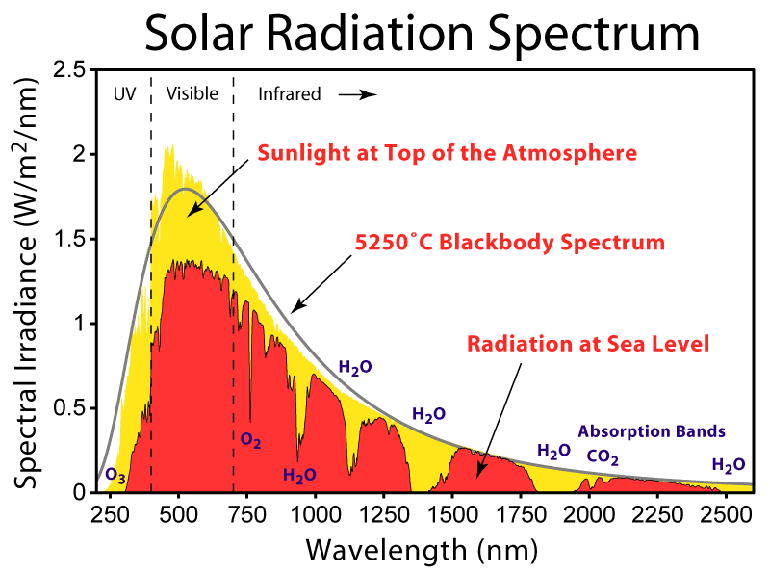
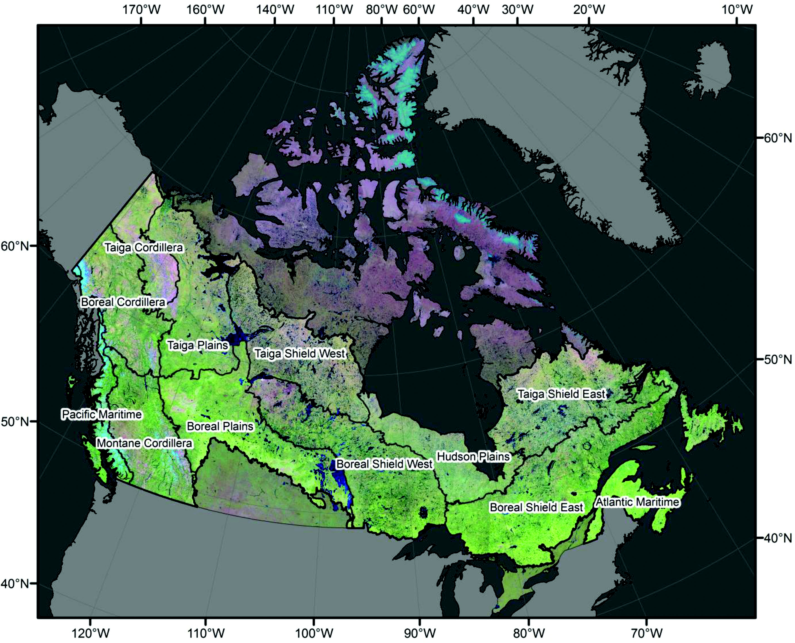
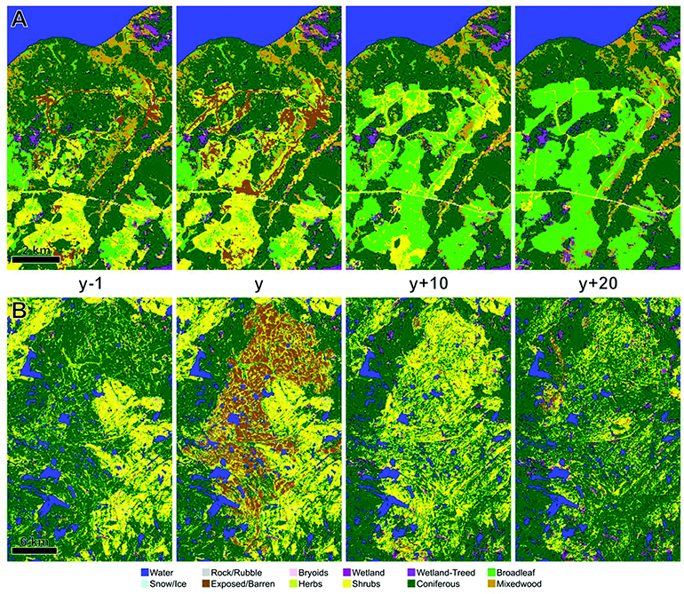

```{r, include=FALSE}
baseurl <- "https://ubc-geomatics-textbook.github.io/geomatics-textbook/"
covlicence <- "https://opendata.vancouver.ca/pages/licence/"
library("dplyr")
library("rgdal")
library("leaflet")
library("xtable")
library("plyr")
```

```{r echo=FALSE}
yml_content <- yaml::read_yaml("chapterauthors.yml")
author <- yml_content[["fundamentalsOfRemoteSensing"]][["author"]]
coauthor <- yml_content[["fundamentalsOfRemoteSensing"]][["coauthor"]]
```
# Fundamentals of Remote Sensing {#fundamentals-of-remote-sensing}

Written by
```{r results='asis', echo=FALSE}
cat(author, "and", coauthor)
```

At some point in your life you may have wondered why the sky is blue.
You may have noticed that two leaves on the same tree are slightly
different shades of green. It would be perfectly natural to wonder these
things and simply allow the questions to remain unanswered. After all,
they likely carry minimal significance compared to the other queries of
your life. What if, however, these questions could not only be answered,
but also lead you to profound insights relating to your environment?
What if differences in leaf color indicated an early summer drought or
the initial stages of a pest outbreak that would wreak havoc on the
economy? *Remote sensing* is the overarching term that refers any
scientific exploration that seeks to address these, and many other
questions.

::: {.box-content .learning-objectives-content}
::: {.box-title .learning-objectives-top}
## Learning Objectives {-}
:::

1.  Understand key principles underpinning remote sensing science
2.  Become familiar with specific types of energy used in remote sensing
3.  Define key interactions between energy and surface materials that
    enable remote sensing
4.  Comprehend various considerations that effect the use of remote sensing
:::

## Key Terms {-}

Electromagnetic, Energy, Photons, Pixel, Radiation, Resolution,
Spectrum, Wavelength

## What is Remote Sensing?

Simply put, remote sensing is any method of gathering information about
an object, or objects, without physical contact. Over the course of
human history, a variety of remote sensing techniques have been used. In
fact, one could argue that any organism capable of observing
**electromagnetic radiation (EMR)** has a built in optical remote sensing
system, such as human vision. Similar arguments could be made for other
senses, such as smell or hearing, but this chapter will focus strictly
on techniques that capture and record electromagnetic radiation.

One of the first recorded conceptualizations of remote sensing was
presented by Plato in the Allegory of a Cave, where he philosophized
that the sense of sight is simply a contracted version of reality from
which the observer can interpret facts presented through transient
images created by light. Over the next few centuries a variety of
photosensitive chemicals were discovered which enabled the transient
images humans see to be recorded. This technology was called
photography (see [A History of
Photography](https://www.scienceandmediamuseum.org.uk/objects-and-stories/history-photography)).
The ability to record the interaction of light and specific objects
within a scene proved enabled the preservation of information in an
accessible medium. Eventually, photography became a prominent means of
immortalizing everything from individual humans to exotic landscapes.
After all, a picture says a thousand words.

In 1858, an enthusiastic Frenchman named Gaspard Tournachon mounted a
camera on a hot air balloon and captured images of the earth below him.
Eventually, Tournachon used his balloon method to capture images of
Paris (Figure \@ref(fig:11-nadar)). For the first time it was possible
to examine the distribution of buildings, fields, forests and roads
across the landscape. With this, airborne remote sensing was born.
Remote sensing technologies continued to advance throughout the 19th and
20th centuries, with major socio-political conflicts like World War I
and II acting as crucibles for innovation. The advancement of remote
sensing has continued into the 21st century and is unlikely to slow down
in the future. This is due to the relevance of three key aspects.

```{r 11-nadar, fig.cap = fig_cap, out.width= "75%", echo = FALSE}
    fig_cap <- paste0("Images of the Arc de Triomphe in Paris, France taken by Tournachone from a balloon in 1968 [@nadar_arc_1868].")
    knitr::include_graphics("images/11-nadar-triomphe-1868.png")
```

First and foremost, remote sensing enables the observation of objects
in, or from, locations that are otherwise inaccessible for humans. The
observation of Mars' surface from an orbiting satellite is a one current
example. A second aspect that makes remote sensing so useful is the
collection of information over a large area. For example, airborne
remote sensing technologies enable observations of land cover across
Canada (Figure \@ref(fig:11-hermosilla-canada-landcover)). The ability
to evaluate inaccessible objects or large areas over time is a third
valuable aspect of remote sensing and is particularly relevant for land
management, as predictions can be informed through the observation of
historic patterns and processes. This is especially true for projects
aiming to restore degraded ecosystems or plan sustainable land use
practices. Before exploring the designs of specific sensor or their
applications, however, it is essential to grasp some key components that
underpin remote sensing science.

```{r 11-hermosilla-canada-landcover, fig.cap = fig_cap, echo = FALSE}
    fig_cap <- paste0("Landcover classification of Canada generated by Hermosilla et al. for the year 2005 [@hermosilla_disturbance-informed_2018].")
    knitr::include_graphics("images/11-hermosilla-canada-landcover.png")
```

## Measuring Energy

## Introduction

At it's core, remote sensing is simply the measurement of photons.
Although simple, this description captures the essence of remote
sensing as the capacity to observe objects in our universe, from a single
leaf to a distant star You see, if an object exists it has a
temperature, and any object that has a temperature emits photons. The
properties of those photons are determined by how hot the object is. To
really understand remote sensing, then, we must first understand
photons, or electromagnetic radiation.

Essentially, photons are the smallest physical property in the
electromagnetic field. Photons can be emitted from objects engaged in
nuclear processes (such as the sun), objects excited thermally (like a
light bulb) or objects that reflect or emit absorbed radiation. The
interactions between emitted photons and other particles can be observed
and used to evaluate the properties of the object. A fundamental
component of a photon is it's **wavelength**, defined as the measured
space between two consecutive peaks of a wave. The wavelength of a
photon determines if and how it will interact with the particles around
it, as well as defines the amount of **energy** it has. Measuring the
differences in photon energy before and after interacting with
another particle is the core of any remote sensing utilizing EMR.
Equation \@ref(eq:energy-wvl) defines the relationship between a
photon's energy and wavelength.

```{=tex}
\begin{equation}
E = hc/λ 
(\#eq:energy-wvl)
\end{equation}
```
Where E is the energy of a photon, h is Planck's constant, c is the
speed of light (c = 3 x 10^8^ m·s^-1^) and λ is the wavelength of the
radiation. This equation contains more variables, but incorporates
wavelength and in doing so utilizes an easy to measure (hc always equals
1240 eV·nm^-1^) and familiar photon property. Due to the large range of
wavelengths that photons can exhibit it is necessary to use a specific
style of writing to describe them, called scientific notation.

## Electromagnetic Spectrum

Now that you have an understanding of how the properties of photons can
be measured and how to write them, we can begin to explore the
**electromagnetic spectrum (EMS)**. The EMS is the continuum along
within photons are located based on their properties (Figure
\@ref(fig:11-EMS)). We have discussed both wavelength and frequency,
which are inversely related and commonly used to describe EMR. Figure
\@ref(fig:11-EMS) also depicts a thermometer laying sideways, which
demonstrates that as an object's temperature increases, the wavelength
of the photons emitted decreases. This follows Equation
\@ref(eq:energy-wvl), which demonstrates that photons with shorter
wavelengths have higher energy. A practical example of this would be
that the majority of photons emitted from the sun (5,788 K) are around
0.5 x 10^-6^ nm, while the majority of photons emitted from the human
body (\~310 K) are around 10^-4^ nm. These measurements are theoretical
and are calculated using theoretical object, often called a blackbody
that allows all energy to enter (no reflectance, hence "black") and
be absorbed (no transmission). The resulting EMR that is emitted would
be generated thermally and be equal or greater than any other body at
the same temperature. It is important to remember, however, that
blackbodies do not exist and any real object will always emit a
temperature less than a theoretical blackbody.

```{r 11-EMS, fig.cap = fig_cap, out.width = "200%", echo = FALSE}
    fig_cap <- paste0("Electromagnetic (also known as Milton) spectrum depicting the type, wavelength, frequency and black body emission temperature [@inductiveload_em_2007].")
    knitr::include_graphics("images/11-EMS.png")
```

::: {.box-content .call-out-content}
::: {.box-title .call-out-top}
## Call Out {-}
:::

<p>

Visualizing the electromagnetic spectrum (EMS) in Figure \@ref(fig:11-EMS) certainly
enables a wonderful comprehension of many concepts relating to photons.
Perhaps more astounding, however, is the truth of how the faculty of
human vision has incorporated these properties. The portion of the EMS
that humans can see is between 400 nm and 750 nm, which correlates with
the peak energy emitted from the sun. Perhaps it should not be
surprising, but of all the possible wavelengths emitted in our
environment, human eyes have evolved to maximize solar photon emission.

</p>
:::

## Scientific Notation

Expressing extremely large or small numbers presents a challenge to both
efficiency and accessibility that has existed likely since the creation
of mathematics. Scientific notation presents a simple solution to this
problem through simplifying numeric presentation to a value less than 10
that is raised to a particular power. Put simply, the decimal point of a
large or small number is moved to make the smallest, single digit whole
number. The number of places and direction that the decimal point moves
is described by an associated power of 10. Equations \@ref(eq:SI-large)
and \@ref(eq:SI-small) depict how large and small numbers are presented
in scientific notation, respectively.

```{=tex}
\begin{equation}
1,000,000 = 1.0 × 10^{6} 
(\#eq:SI-large)
\end{equation}
```
```{=tex}
\begin{equation}
0.000001 = 1.0 × 10 ^{-6} 
(\#eq:SI-small)
\end{equation}
```

It is common to use mathematical operators to add, subtract, divide or
multiply large numbers written in scientific notation. Addition and
subtraction require the number with the smallest exponent to be altered
to match the exponent of the largest number \@ref(eq:SI-add). The
multiplication of two numbers written in scientific notation you simply
multiply their coefficients and add their exponents
\@ref(eq:SI-multiply). Division of two scientific numbers follows a
similar structure, in which you divide the coefficients and subtract the
exponents \@ref(eq:SI-divide).

```{=tex}
\begin{equation}
2.6 × 10 ^{5} + 2.0 × 10 ^{4}   ->
2.6 × 10 ^{5} + 0.2 × 10 ^{5} = 2.8 × 10 ^{5} 
(\#eq:SI-add)
\end{equation}
```
```{=tex}
\begin{equation}
1.5 × 10 ^{5} ✕ 2.0 × 10 ^{3} = 3.0 × 10 ^{8} 
(\#eq:SI-multiply)
\end{equation}
```
```{=tex}
\begin{equation}
1.5 × 10 ^{5} / 2.0 × 10 ^{3} = 0.75 × 10 ^{2} = 75
(\#eq:SI-divide)
\end{equation}
```

## Radiation Types

Since it is possible for photon energy to vary widely across the
EMS, it can be useful to group photons based on their wavelength.
Generally, there are seven accepted categories. it is important to note
that these categories have gradual boundaries, rather than sharp
dividing lines. In order of increasing wavelength they are: radio,
microwave, infrared, visible, ultraviolet, X ray and Gamma ray. We will
detail each of these seven groups in Table 1 [@zwinkels_encyclopedia_2020]. If you
wish a visual tour of the EMS you can explore [this
document](https://books.google.ca/books?id=DfLPpxogdM4C&pg=PP1#v=onepage&q&f=false "Tour of the electromagnetic spectrum")
created by Ginger Butcher for NASA in 2010.

| Name             | Wavelength                       |
|------------------|----------------------------------|
| Radio            | 1 cm - 1,000 km (10^3^ - 10^10^) |
| Microwave        | 1 mm - 1 cm (10^10^ - 10^11^)    |
| Infrared (IR)    | 700 nm - 1 mm (10^11^ - 10^14^)  |
| Visible (Vis)    | 400 - 700 nm (10^14^ - 10^15^)   |
| Ultraviolet (UV) | 10 - 400 nm (10^15^ - 10^17^)    |
| X rays           | 0.1 - 10 nm (10^17^ - 10^20^)    |
| Gamma rays       | \< 0.1 nm (10^20^ - 10^23^)      |

: Table 1. Names and associated wavelengths for the seven regions of the
electromagnetic spectrum [@zwinkels_encyclopedia_2020].

## Factors Affecting Radiation

With a solid grasp of why EMR is useful for remote sensing science and
how EMR is categorized along the EMS, we can begin to apply this core
knowledge with ideas and applications related to practical use. As with
radiation, there are a number of key terms used to describe the
fundamental concepts that make remote sensing science possible. Some of
the most common terms have been included below. They are organized into
three categories: Radiation Basics, Foundations of Measurement and
Methods of Normalization.

## **Radiation Basics**

The use of radiation to quantify properties of an object is
inherently linked with relatively complex theories of physics. To
minimize both confusion and workload, we will highlight a select number
of key concepts that support the use of the EMS for remote sensing. The
first concepts to become familiar with are radiant energy and
radiant flux

Radiant energy is essentially the energy carried by photons,
which is measured in Joules (J). Recall that the amount photon
energy defines what wavelength (Equation \@ref(eq:energy-wvl).
Radiant flux, which is interchangeable with radiant power, is the amount
of radiant energy that is emitted, reflected, transmitted or
absorbed by an object per unit time. Radiant flux considers energy
at all wavelengths and is often measured per second, making it's SI
Watts (W), which is simply Joules per second (J·s^-1^) . Spectral flux is an
associate of radiant flux and simply reports the amount of energy
per wavelength (W·nm^-1^) or (W·Hz^-1^). Combined, these two terms allow us to
describe the interaction with electromagnetic radiation and it is
environment; radiant energy interacts with an object, which results
in radiant flux.

Now that you are familiar radiant energy and flux, we can discuss
irradiance. Irradiance refers to the amount of radiant energy that
contacts a 1 m^-2^ area each second (W · m^-2^). This includes all
electromagnetic energy that contacts the 1 m^-2^ surface, which
could be a combination of radiation from the sun, a halogen light
bulb overhead and your computer screen. Another important concept is
solar irradiance, which strictly refers to the amount of solar
radiation interacting with our 1 m^-2^ area. Solar irradiance is
very important in many remote sensing applications as it determines
which photons an optical sensor *could* detect in naturally illuminated
environments. An associate of irradiance is radiance, which refers the
the amount of radiant flux is a specific direction. The direction in
question is often called the *solid angle* and makes radiance a
directional quantity. You could imagine holding a DLSR camera 90 degrees
above a flat leaf so that the only item visible to the shutter is the
leaf. The camera would capture the radiance reflected from the leaf's
surface and the solid angle would be 90 degrees. Essentially, irradiance
is used to measure the radiant energy that contacts a 1 m^-2^ area,
while radiance measures the radiant flux of an object from a specific
angle.

Another key idea central to understanding radiation is the
theoretical blackbody. We discussed theoretical blackbodies in Section
\@ref(electromagnetic-spectrum) and outlined that they are essentially
an ideal body that perfectly absorbs all energy it interacts with.
Blackbodies can reach thermal equilibrium and therefore can emit thermal
energy in amounts directly related to their temperature. These
characteristics enable the estimation of spectral emission and can be
used to determine the expected spectral emission of other objects.

There are three important physical laws related to theoretical
blackbodies. Plank's Law describes that an increase in a bodies
temperature causes both an increase in the total radiation from the
body and shift in the peak of the emitted spectrum to shorter
wavelengths. Wein's Law highlights the inverse relationship between
temperature and wavelength and enables the estimation of the wavelength
at which the peak of the emitted spectrum will occur. A third important
law relevant to blackbodies is the Stefan-Boltzmann Law, which
demonstrates that the temperature of a blackbody is four powers greater
than the total energy it emits. Combined, these three laws
demonstrate a fundamental concept of electromagnetic radiation: the
temperature of a body determines how much energy is emitted and at
what wavelength the spectrum peak will occur.

So far we have discussed radiant energy and flux as basic concepts
interacting with a single object (leaf) or 1 m^-2^ surface. In reality,
radiant energy from the sun begins interacting with objects as soon
as it enters Earth's atmosphere. The process by which radiation is
reflected by other particles is called scattering. Scattering occurs
throughout the atmosphere and is generally separated into three
categories: Rayleigh, Mie and non-selective.

The three categories of atmospheric scattering are defined by the
energy's wavelength and the size of the interacting particle. When
the wavelength of incoming radiation is larger than the particles
(gases and water vapor) with which it interacts, Rayleigh scattering
occurs. Phenomenon related to Rayleigh scattering include Earth's sky
appearing blue (Figure \@ref(fig:11-scattering)). When the wavelength of
incoming radiation is similar to that of the particles with which it
interacts Mie scattering occurs. The size of particles generally
considered to similar is between 0.1 - 10 times that of the wavelength
(Figure \@ref(fig:11-scattering)). Smoke and dust are common causes of
Mie scattering. A third type of scattering occurs when the particles
involved are lager than the wavelength of the incoming radiation.
This is called non-selective scattering and results in the uniform
scattering of light regardless of the wavelength (Figure
\@ref(fig:11-scattering)). Examples of non-selective scattering are
clouds and fog.

```{r 11-scattering, fig.cap = fig_cap, echo = FALSE}
    fig_cap <- paste0("Depiction of Rayleigh, Mie and non-selective scattering [@the_good_doctor_fry_diagram_2011]. CC BY-SA 4.0.")
    knitr::include_graphics("images/11-scattering.png")
```

The combination of these three scattering types leads to drastic
differences between the amount of solar irradiance at the top of the
atmosphere and at sea level (Figure \@ref(fig:11-solar-radiation)).
There are also a variety of wavelengths at which ozone, oxygen, water
and carbon dioxide absorb incoming radiation, precluding entire
sections of the EMS from reaching the surface. Overall, only a small
portion of energy emitted from the sun reaches the Earth's surface
(\~1360 W · m^-2^), depending on the time of day and year. Most
energy is absorbed or scattered by particles in the Earth's
atmosphere.

```{r 11-solar-radiation, fig.cap = fig_cap, echo = FALSE}
    fig_cap <- paste0("Solar radiation spectrum from 250 - 2500 nm. Irradiance measurements at the top of the atmosphere (yellow) and sea level (red) are depicted. The grey line represents the theoretical curve of a 5250 degree C blackbody spectrum [@rohde_solar_2008]. CC BY-SA 3.0.")
    
```

The process of scattering is also affected by the properties with which
the scattering EMR interacts. The angle at which EMR interacts with a
surface, as well as the surface material, determine the properties of
reflection. A reflector is described based on the properties of EMR that
are reflected from it and range from specular to diffuse (Figure
\@ref(fig:11-reflectors)). Specular reflectance occurs when EMR is
reflected in a single direction and can also be called ansiotropic
reflectance. A mirror is an example of a specular reflector. A diffuse,
or Lambertian, reflector reflects EMR in all directions equally and can
also be called an isotropic reflector. An example of a surface that
reflects EMR isotropically is paper.

```{r 11-reflectors, fig.cap = fig_cap, out.width="75%",out.height="75%", echo = FALSE}
    fig_cap <- paste0("Depictions of specular and diffuse reflectors [@beck_specular_2012]. CC BY-SA 3.0.")
    knitr::include_graphics("images/11-reflectors.png")
```

This is not to say that diffuse reflectors are perfect, however, as some
issues remain related to the angle of incidence and the position of the
sensor. For example, both back scattering and forward scattering affect
the amount of radiation that reaches a sensor, depending on where the
sensor is located. If a sensor is observing an object at the same angle
as the incident radiation, the majority of reflected EMR will be from
backscatter, or EMR that is scattered back towards its source. If the
object being observed is perfectly specular, no EMR reflected off the
object would be captured by the sensor. If the object is a diffuse or
near-perfect diffuse reflector, then there is less of a concern with
regards to capturing reflected EMR.

## Foundations of Measurement

Now that we have discussed radiant energy and the concepts
underpinning its interactions with other objects, we can begin to
explore the measurements that our sensors record. One of the most
important concepts to understand is that of the spectral signature, or
spectra. A spectral signature refers to the amount of electromagnetic
energy recorded across a defined section of the EMS. A nice example
of a spectral signature is Figure \@ref(fig:11-solar-radiation), which
presents the sun's radiation between 250 - 2500 nm in the units of
solar irradiance (W/m-2/nm). Similar graphs are common throughout remote
sensing and can employ different units of measure.

The base measurements taken to generate spectral signatures is of an
objects radiance. Acquiring radiance across a defined section of the EMS
can be conducted by a variety of sensors and at different spatial
scales, highlighting the practical advantages of evaluating surfaces
using EMR. To fully capture and compare the objects being measured,
however, it is often necessary to normalize radiance. The need for
normalization stems mainly from the aforementioned issues of atmospheric
effects, source and sensor location and sensor calibration. As with any
normalization, the first step is to identify our minimum and maximum
values.

There are two common reference measurements used to determine minimum
and maximum radiance: dark and white reference. A dark reference is
often taken by measuring the amount of energy recorded by a sensor
when the input device is ignored. In theory, this would be the internal
darkness of the machine and is considered to be the minimum radiance
value in practice. The maximum radiance value is slight more challenging
to determine as it requires a perfectly diffuse, flat white surface. A
commonly used material is Spectralon, which has almost 100% reflectance
between 400 - 1500 nm and greater than 95% reflectance over the entire
optical region of the EMS (250 - 2500 nm). With both minimum and maximum
values defined, it becomes possible to calculate normalized spectral
values for a variety of properties across changing conditions.

## Methods of Normalization

Upon calibrating an instrument to both 100% and 0% reflectance, it is
possible to determine three normalized measurements of EMR: reflectance,
transmittance and absorption. Each of these measurements provides useful
information for understanding the interactions between EMR and the
environment.

Reflectance refers to EMR that has interacted with and been reflected b
a surface. It has emerged as a popular method of evaluating a variety of
environmental properties, including land use change, plant health and
plant diversity [@asner_spectroscopy_2011]. Another popular normalized measure of the
interaction between photons and a surface is transmittance. A photon
that is transmitted has passed through the surface with which it
interacted and provides insight regarding how much energy can reach
other surfaces below. In a forestry context, this information can be
particularly useful when determining the amount of radiation that
reaches below the upper canopy (cite LAI, etc.). Absorptance is a third,
related measurement that refers to the amount of energy absorbed by
the cells within a surface and is roughly equal to the amount of
energy not captured as reflectance or transmittance (Equation
\@ref(eq:absorptance)).

```{=tex}
\begin{equation}
Absorptance = 1 - Reflectance - Transmittance 
(\#eq:absorptance)
\end{equation}
```

Although relatively straight forward, these definitions allow us to
start exploring a variety of remote sensing applications. In fact, most
optical remote sensing techniques employ at least one of reflectance,
transmittance and absorptance to examine the world. Before moving on to
the next section, please review the work flow below highlighting what we
have learned so far. In our next steps we will move from theory to
application and begin to explore the factors that define the quality,
and therefore capability, of remotely sensed data.

## The Four Resolutions

One of the first considerations any user must make regarding remotely
sensed data is its quality. For most scientific research, good quality
data needs to contain information that is relevant to the scale and time
period of the study. meaning that sensors are often designed for a
specific application. The manner in which we describe a sensor is
through four key resolutions.

## Spatial Resolution

Although each resolution is important, spatial resolution holds a key
position when determine the usefulness of a dataset as it determines the
scale at which information is collected. When a sensor collects
information it does so in a single area. That area could be the size of
a single tree or a single city, but all the EMR measured by the sensor
will be an average of that area. Generally, this area is referred to as
a picture element, or **pixel.** A pixel is the smallest addressable
digital element and basic unit of remotely sensed data. When multiple
pixels are collected in adjacent areas, perhaps using an instrument with
multiple sensors on it, the output is called an image. In short, an
image is a collection of pixels, which represent mean values of
reflected or transmitted radiation over some area. Spatial
resolution, then, is the ground area represented by a pixel.

There are a variety of factors that affect spatial resolution, or the
size of a pixel. One important factor is the sensor's field of view
(FOV). A field of view refers to the observable area of a sensor and is
defined by two things: the angle of the FOV and the sensors distance
from it's target. Changes in these two factors result in an increase or
decrease in the amount of area captured by a senor and therefore a
change in pixel size. Pixels that cover larger areas are considered to
have lower spatial resolution, while a relatively smaller pixel is
considered high spatial resolution. When a sensor is in motion,
collecting multiple pixels across space and time, the term instantaneous
field of view (IFOV) is used to describe the FOV at the time each pixel
was collected. We will learn more about the challenges of collecting
data over space and time in [Chapter 12 and 15](https://ubc-geomatics-textbook.github.io/geomatics-textbook/remote-sensing-systems.html,https://ubc-geomatics-textbook.github.io/geomatics-textbook/LiDAR-acquisition-and-analysis.html ).

It is a trade off when determining if a certain spatial resolution is
useful for a given application, the pixel size needs to be fine enough
to observe features of interest, but large enough to be stored and
processed in a reasonable manner. It must also cover the entire study
area, which can vary significantly depending on the research objectives
and the image's pixel size. Each of these considerations will direct the
data user to a specific sensor. From here, the user can begin to
consider the remaining three resolutions.

## Temporal Resolution

Much like spatial resolution deals with the space that a sensor
observes, temporal resolution refers to the time interval between
successive observations of a given space. Temporal resolution can span
seconds or years and is requirement when investigating change. An
acceptable temporal resolution is defined inherently by the nature of
the study. For example, a study monitoring the annual urban expansion of
Vancouver, B.C. would have a temporal resolution of 1 year. Other common
temporal resolutions include hourly, for applications monitoring
weather, and daily, which is often used when monitoring plant phenology.

The interval between successive observations is often called *revisit
time* and is determined by the type of platform on which a sensor is
deployed. Sensors that remain stationary can have revisit times measured
in seconds, while sensors moving faster or slower than their target area
can take multiple days before they observe a location again.
Interestingly, sensors have been designed to be both stationary and
mobile at a variety of spatial scales. Both airborne and spaceborne
sensors have the capacity to remain stationary over a single location or
travel faster than the Earth rotates and capture imagery over most of
the Earth's surface in a matter of days.

## Spectral Resolution

Earlier in this chapter the concepts and theories surrounding EMR were
presented. These theories related directly to the concept of spectral
resolution, which refers to the number and dimension of specific EMR
wavelengths that a remote sensing instrument can measure. Due to the
large range of the EMS and properties of EMR, the term spectral
resolution is often used to refer to any single component of its
definition. In scientific literature, it is not uncommon to find
"spectral resolution" referring to:

-   the number of spectral bands (discrete regions of the EMS) that are
    sensed as a single unit.

-   the location of these units, or groups of bands, along the EMS.

-   the number of individual bands within each unit. Also called
    bandwidth.

Each of these components plays a role is describing the spectral
resolution of a pixel and enables users to identify appropriate sensors
for their application. It is also important to consider the laws
associated with the energy of EMR. Recall that shorter wavelengths
have more energy, which makes it easier to detect. The implications
of this is that longer wavelengths require larger bandwidths for the
sensor to observe them. An easy visualization of this concept involves
selecting two wavelengths along the EMS. If we select the first
wavelength at 0.4 nm and the second wavelength at 0.8 nm, we can use
Equation \@ref(eq:energy-wvl) to demonstrate that the first wavelength
has twice as much energy as the second. This is an important theory
to note as the consequences of a decrease in energy is a decrease in
spatial resolution (a larger number of bands need to be combined to
collect enough information).

A common method for visualizing the spectral resolution of a sensor is
to place each band along the EMS according to it's associated bandwidth
and wavelengths (Figure \@ref(fig:11-landsat-bands)). This allows users
to determine which sensor best captures the information they are
interested in studying. For some applications, such as land cover, it is
acceptable to use sensors with relatively wide bands collecting
information in a small number of strategic locations along the EMS. For
other applications, spectral information may need to be more detailed
and capture information using thin, adjacent bands spanning a large
region of the EMS. These specifications will be discussed in greater
detail in [Chapter 12](https://ubc-geomatics-textbook.github.io/geomatics-textbook/remote-sensing-systems.html), so for now we'll focus on how spectral information
can be useful.

```{r 11-landsat-bands, fig.cap = fig_cap, out.width = "100%", echo = FALSE}
    fig_cap <- paste0("Locations of bands for various sensors deployed by NASA on one of more Landsat misison. Landsat 1-5 had the Multispectral Scanner System (MSS), while the Thematic Mapper (TM) was aboard Landsat 4-5. The Enrinched TM Plus (ETM+) had 8 bands and was aboard Landsat 7. Grey distributions in the background represent the atmospheric transmission values for a mid-latitude, hazy, summer atmosphere [@nasa_atmospheric_nodate].")
    knitr::include_graphics("images/11-landsat-bands.png")
```

The collection of spectral data across more than one band allows the
creation of a spectral curve, or spectral signature. Spectral signature
are the cornerstone of many remote sensing applications and highlight
many properties of the surface from which they were collected. The
creation of a spectral signature is quite simple and can be depicted in
two dimensions (Figure \@ref(fig:11-specsig)). Essentially, the observed
value of each band is connected to the observed value of each adjacent
band in 2D space. When all bands are connected, a spectral signature is
born. As we will see in a later case study, spectral signatures can
provide a plethora of relevant information relating to the composition
of an object.

```{r 11-specsig, fig.cap = fig_cap, out.width = "200%", echo = FALSE}
    fig_cap <- paste0("Five spectral signatures of various living and non-living samples collected using an ASD FieldSpec3 Imaging Spectroradiometer. Live = live broadleaf, Dead = dead broadleaf, Fir = Douglas-fir needles on branch, Rock = rock, soil = dry humus soil.")
    knitr::include_graphics("images/11-spectralsig.png")
```

## Radiometric Resolution

In short, radiometric resolution is the quantification of a sensors
ability to detect differences in energy. Photons enter a sensor
through a filter that only permits specific wavelengths.The energy
of the photon is recorded as a digital number (DN) and the digital
number is assigned to a pixel.

A simple visualization of radiometric resolution would be to think of
three colors: red, green and blue. A sensor
detecting energy in the ranges of these three wavelengths would
contain three separate detectors. Each detector is specialized to record
energy in a single, unique range, say red (\~700 nm). The amount of
energy that is recorded while observing an area is stored in a pixel
as a DN, with the lowest DN number representing zero sensor detected
energy in this wavelength range and the highest DN representing
maximum sensor detected energy.

The radiometric resolution of a detector, then, is the number of
discernible values, or segments, present between zero and maximum DN
values. These segments are usually referred to as bits and can be
mathematically represented as an exponent of 2 (Equation
\@ref(eq:bits)). The number of bits in that a detector can resolve may
also be called the *colour depth* of the image. Figure
\@ref(fig:11-radiometric) clearly presents the increase in detail
provided by additional bits, but recall that increasing any resolution
generally increases storage and processing time. As such, it is
important to select an appropriate radiometric resolution based on the
needs of your study.

```{=tex}
\begin{equation}
8 bits = 2^8 = 256 levels
(\#eq:bits)
\end{equation}
```
```{r 11-radiometric, fig.cap = fig_cap, echo = FALSE}
    fig_cap <- paste0("Discernable values of sensors with 1, 2 and 4 bot radiometric resolutions. Created by Paul Hacker CC BY-SA 4.0.")
    knitr::include_graphics("images/11-radiometric-res.png")
```

## Key Applications

So far in this chapter we have covered the theories and concepts that
justify the use of EMR for remote sensing. With these fundamentals in
mind, we can begin discussing some common applications of remote
sensing. For the purposes of this book, we will focus on studies related
to environmental management.

The use of optical remote sensing (400 - 2500 nm) to analyze the
environment has become popular over the past half century. Sensor
development, improved deployability and decreasing costs have enabled
many researchers to use selected sections of the EMS to monitor
everything from the chlorophyll content of a single leaf [@curran_remote_1989]
to global forest cover [@hansen_high-resolution_2013].

Large-scale research projects focused at national or international
levels have perhaps benefit the most from improved sensor deployment.
Since the 1960s, a variety of satellites have been launched with the
sole purpose of observing the Earth. Landsat, created by NASA and is now
run by the United States Geological Survey (USGS), is a suite of
satellites designed specifically for this purpose. By the end of 2021, a
total of nine Landsat missions will have been launched, eight of which
have successfully reached orbit and provided imagery in at least 5 broad
spectral bands at 30 m^2 spatial resolution. This information has been
used to monitor of land cover change, ecosystem services and a variety
of other environmentally relevant metrics [@deel_relationship_2012]. The case study at
the end of this section highlights a particularly novel approach to
optical remote sensing that has become a popular methodology to evaluate
plant health and biodiversity [@ustin_imaging_2009; @wang_spatial_2018].

As far as Canada's contributions to remote sensing sensors rank,
RADARsat is among the most important [@raney_radarsat_1991]. This satellite was
launched in 1995 and has grown to a constellation of three space-borne
synthetic aperture radar (SAR) sensors that feature variable resolution.
As an active sensor, RADARsat produces and measures EMR with wavelengths
between 7.5 - 15 cm and is capable of penetrating clouds and smoke. These characteristics make RADARsat ideal for applications
such as ecosystem monitoring, maritime surveillance and disaster
management. It's active nature also enables RADARsat to record
observations at night. [Chapter 12](https://ubc-geomatics-textbook.github.io/geomatics-textbook/remote-sensing-systems.html) will discuss radar in more detail.

Another active remote sensing technique that has become popular is light
detection and ranging (LiDAR), which can also be called airborne laser
scanning (ALS). LiDAR is particularly useful in evaluating structural
components of the environment, such as forest canopies and elevation
[@coops_estimating_2007]. More details regarding the theories and applications of
LIDAR will be presented in [Chapter 15](https://ubc-geomatics-textbook.github.io/geomatics-textbook/LiDAR-acquistion-and-anlysis.html).

## Case Study: Optical Remote Sensing to Evaluate Land Cover in Canada

The capacity to evaluate change in an environment relies on the ability
to capture information at useful resolutions. Land cover, which is
simply the combination of abiotic and biotic components existing in a
defined area, is a useful metric for evaluating changes across an
ecosystem and land cover analyses have been deployed at a variety of
scales. Land cover is also an essential climate variable and is
considered an important metric that can aid in the prediction of future
climate regimes. These studies can be limited, however, by the
resolutions at which information is collected. Hermosilla et al. provide an interesting method of land cover assessment that utilizes Landsat to derive land cover and land cover change across Canada over a
29 year span [@hermosilla_disturbance-informed_2018].

Before exploring the methods of this study, it is important to highlight
the qualities of the Landsat program that enabled it. Launched in 1972,
Landsat was NASA's first satellite designated for evaluating Earth's
surface. Although a variety of technological upgrades have been
introduced since the 1972 launch, the majority of Landsat sensors have a
spatial resolution of 30m^2^. Considering the spatial coverage of this
mission includes the majority of our planet, this spatial resolution is
quite useful.

Another important quality of Landsat is that every satellite carries a
multi-spectral sensor with at least four bands, which enables the
differentiation between multiple land cover classes, including
vegetation and urban building. More information regarding the changes in
spectral resolution between Landsat satellites can be found in Figure
\@ref(fig:11-landsat-bands). The temporal resolution of Landsat is the
third high-quality characteristic of this satellite mission that enables
the accurate evaluation of land cover. With a return interval of 16
days, Landsat provides information for the same location on Earth almost
twice per month. This is particularly important for a country as large
as Canada, which contains 12 ecozones dominated by forest, and enables
the selection of a Best Available Pixel (BAP), which is selected based
on a variety of criteria that quantifies a pixels quality (Figure
\@ref(fig:11-hermo-false)). You can learn more about Landsat BAP in the article by Thompson et al. [@thompson_mapping_2015].

```{r 11-hermo-false, fig.cap = fig_cap, out.width="90%", echo = FALSE}
    fig_cap <- paste0("False colour composite (bands: shortwave infrared, near infrared and red) for 2010. Each pixel in this image was selected based on its classification as a Best Available Pixel (BAP) [@hermosilla_disturbance-informed_2018].")
    
```

For their analysis, the authors Hermosilla et al. used imagery captured from
Landsat 5 onward with the Thematic Mapper, which means their data
contained seven unique spectral bands spanning segments between 0.45 nm
to 2.35 nm. The ability to observe reflectance values across a
relatively wide range of the EMS enabled land cover analysis across all
forested eco-regions in Canada. After applying a masking model, the
authors devised a framework to generate annual land cover maps for
all of Canada's forested areas, which were presented at the beginning of
this chapter (Figure \@ref(fig:11-hermosilla-canada-landcover)). From
these annual composites, it was also possible for the authors to
identify land cover change over time and quantify the effects of
specific disturbance types, such as harvesting and fire (Figure
\@ref(fig:11-hermo-disturb)). These comprehensive maps demonstrate the
capability of well-designed remote sensing technologies to obtain
scientifically relevant information and highlight the potential of
remote sensing in environmental assessment [@hermosilla_disturbance-informed_2018].

```{r 11-hermo-disturb, fig.cap = fig_cap, out.width="90%", echo = FALSE}
    fig_cap <- paste0("Temporal sequences depicting landcover before and after (a) harvesting and (b) fire. The year of change is represented by 'Y' [@hermosilla_disturbance-informed_2018].")
    
```

## Summary

In this chapter we have covered a variety of physical theories that
support the use of electromagnetic **radiation** for the remote analysis
of objects. These ideas provide the fundamental knowledge needed to
employ remote sensing technologies. From sensor selection to data
processing, your ability to perform remote sensing science will rely
almost exclusively on your capacity to comprehend the relationships
between the objects of interest and the physical properties that
comprise them.

In the next chapter you will enter the world of sensors and explore a
vast amount of technologies that collect information remotely. This
journey will include active and passive instruments, as well as examples
of scientific studies that have successfully employed the data they
collect. Much like a carpenter selecting the correct tool for a specific
task, you will need apply your knowledge of the fundamentals to identify
the best sensor for your research.

## Reflection Questions

1.  What section of the electromagnetic spectrum is adjacent to, but
    shorter in wavelength than, what the human eye can see?
2.  What is the general term used to describe the process that stops
    large amounts of electromagnetic radiation from reaching the Earth's
    surface. Name the three types?
3.  List and describe the four resolutions.
4.  Why is using the Best Available Pixel important for land cover
    mapping?

```{r include=FALSE}
knitr::write_bib(c(
  .packages(), 'bookdown', 'knitr', 'rmarkdown', 'htmlwidgets', 'webshot', 'DT',
  'miniUI', 'tufte', 'servr', 'citr', 'rticles'
), 'packages.bib')
```
