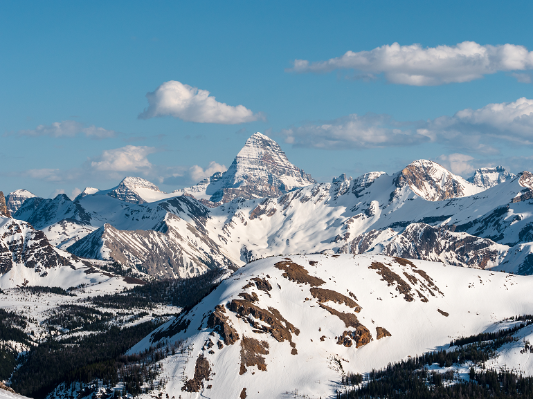
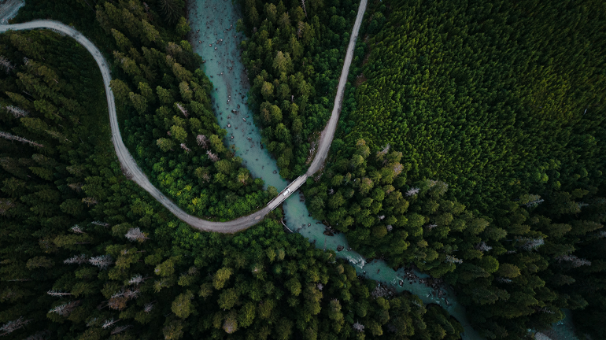
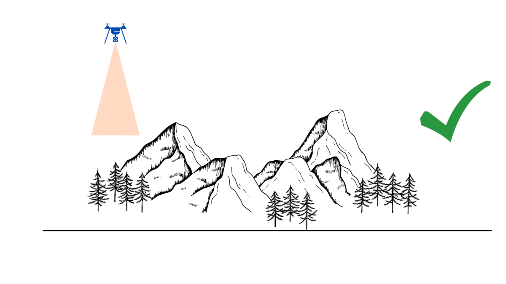
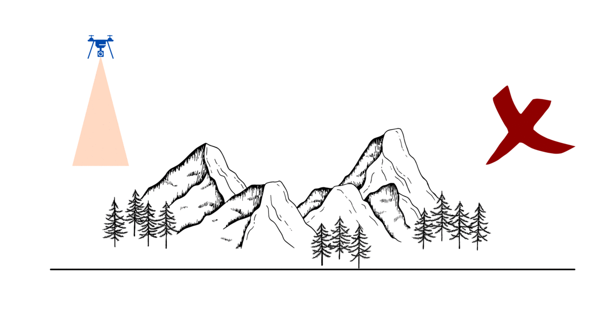
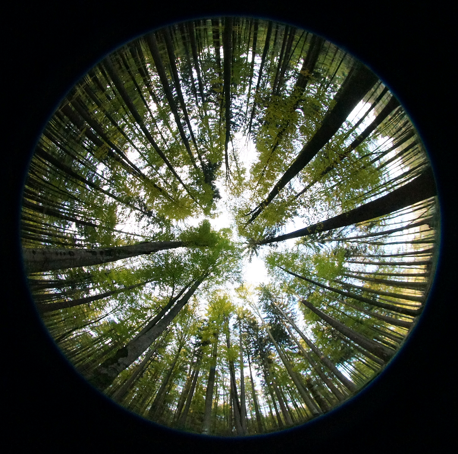

```{r, include=FALSE}
baseurl <- "https://ubc-geomatics-textbook.github.io/geomatics-textbook/"
covlicence <- "https://opendata.vancouver.ca/pages/licence/"
library("dplyr")
library("rgdal")
library("leaflet")
library("xtable")
library("plyr")
```

```{r echo=FALSE}
yml_content <- yaml::read_yaml("chapterauthors.yml")
author <- yml_content[["remoteSensingSystems"]][["author"]]
coauthor <- yml_content[["remoteSensingSystems"]][["coauthor"]]
```
# Remote Sensing Systems {#remote-sensing-systems}

Written by
```{r results='asis', echo=FALSE}
cat(author, "and", coauthor)
```

You probably know that you are using your very own organic remote sensing system to read this sentence. Our eyes take in information from the world around us by detecting changes in light and relaying that information through the optic nerve into our brains, where we make sense of what we are seeing. As you learned in [Chapter 11](https://ubc-geomatics-textbook.github.io/geomatics-textbook/fundamentals-of-remote-sensing.html), this is what constitutes remote sensing - gathering information (“sensing”) without directly measuring or interacting with that information (“remote”). Whereas our eyes are limited to the visible light portion of the electromagnetic spectrum and by the location of our bodies, remote sensing systems use powerful sensors and flight-equipped platforms to paint a broader and deeper picture of the world around us. The picture in figure \@ref(fig:12-GOES-1-earth) is an example of the beautiful imagery we can capture from space, taken from the GOES-1 satellite.

```{r 12-GOES-1-earth, fig.cap = fig_cap, out.width="90%", echo = FALSE}
fig_cap <- paste0("North and South America as seen from the NASA GOES-1 satellite [@nasa_goes-1_nodate]. Captured from KeepTrack.space. [Copyright (C) 2007 Free Software Foundation, Inc.](https://fsf.org/)")
knitr::include_graphics("images/12-GOES_1_earth.png")
```
<br/>

Remote sensing systems range in size and complexity from a handheld camera to the Hubble telescope and capture images of areas ranging from a few meters to several kilometers in size. Though devices such as microscopes, X-ray machines, and handheld radios are technically remote sensing systems, the field of remote sensing typically refers to observing Earth on a small spatial scale (1:100 to 1:250,000).

:::: {.box-content .call-out-content}

::: {.box-title .call-out-top}
#### NOTE {-}
:::

<p id="box-text">
Remember, in spatial scale, “small” means a big picture. If you want a refresher on how to read and understand map scales, check out section 2.5 in [Chapter 2](https://ubc-geomatics-textbook.github.io/geomatics-textbook/mapping-data.html).
</p>

::::

<br>

The range of uses for remote sensing platforms are dazzling in number, allowing us to monitor severe weather events, ocean currents, land cover change, natural disturbances, forest health, surface temperature, cloud cover, urban development, and so much more with high precision and accuracy. In this chapter, we will break down the how and where of remote sensing systems and discover a few different systems used for Earth observation today.

:::: {.box-content .learning-objectives-content}
::: {.box-title .learning-objectives-top}
#### Learning Objectives {-}
::: 
1. Break down remote sensing technology into its basic components
2. Understand how different settings and parameters impact remote sensing system outcomes
3. Review the key remote sensing systems used in Canada and around the world for environmental management
::::

### Key Terms {-}

Absorption, Aerial, Along-Track, Atmospheric Window, Biconcave, Biconvex, Convex, Concave, Cross-Track, Curvature, Field of View (FOV) Focus, Geosynchronous Equitorial Orbit (GEO), Hyperspectral, Instantaneous Field of View (IFOV), Low Earth Orbit (LEO), Medium Earth Orbit (MEO), Multispectral, Nadir, Near-Polar Orbit, Oblique, Orbit, Panchromatic, Pitch, Push broom Scanner, Radiometric, Radius of Curvature, Reflection, Refraction, Resolution, Roll, Spectral, Sun-Synchronous Orbit, Thermal, Whisk Broom Scanner, Yaw, Zenith

## Optical System Basics

Remote sensing systems contain a number of common components and operate using similar principles despite their differences in capabilities. In the subsequent sections, we will discover the technical specifications of remote sensing systems that allow them to “see”.

### Lenses

Picture the view from a window onto a busy street on a rainy day: you have cars driving by with headlights, traffic lights reflecting off a wet road, raindrops pouring down the windowpane and distorting the view, and hundreds of people and objects on the street scattering light beams in every possible direction from a huge range of distances. In order for us to take in any of this, these light beams need to reach the retina, the photosensitive surface at the very back of the eye.How do our relatively tiny eyeballs take in all that disparate light and produce crystal clear images for our brains? By using one of the most basic components of any optical system: a lens. A lens is a specially shaped piece of transparent material that, when light passes through it, changes the shape and direction of light waves in a desired way. 

The property of transparent mediums to change the direction of light beams is called **refraction**, or transmittance. This is why objects in moving water look misshapen. The arrangement of molecules within a medium disrupts both the direction and speed of the photons – the measurement of this disruption is called the refractive index.

The lens at the front of your eyeball changes refracts light beams from varying distances precisely onto your retina. The optical systems on remote sensing platforms are the same: they use a specially designed lens to focus light beams at the desired distance to onto their own recording medium. Below in figure \@ref(fig:12-focus-example-humaneye) is a simple visualization of how optical systems focus light onto a desired point to produce an in-focus image.

```{r 12-focus-example-humaneye, fig.cap = fig_cap, out.width="90%", echo = FALSE}
fig_cap <- paste0("Focusing lens [@vorenkamp_how_2015]. <a href='",baseurl,"#fig:12-focus-example-humaneye'>Animated figure can be viewed in the web browser version of the textbook</a>. Copyright Todd Vorenkamp. Used with permission.)")
knitr::include_graphics("images/12-focus_example_humaneye.gif")
```
<br/>

Now, picture another scene: you are scrolling through social media and you see a beautiful photo of Mt Assiniboine taken by your friend, a professional photographer based in the Canadian Rockies. You think to yourself, “Wow, that peak looks ENORMOUS! I want to visit there and see it for myself.” So, you ask your friend exactly where they went, drive to Banff National Park, hike to the very same spot, and squint skywards. Hmm…though the mountain is still imposing, it is certainly not towering over you at close range as it was in the photo. You also notice that there are several surrounding peaks that you couldn’t see before. Your friend’s picture was crystal-clear, and you have 20/20 vision, so you know its not an issue with focusing properly. Are you being deceived?

Actually, yes, you are – by both your eyes *and* the camera your friend used. We like to think that our eyes show us the world as it truly is and that everything else is a facsimile, but in truth, all optical systems alter the scenes around us to show us what we need to see. From an evolution standpoint, you can see why clear resolution of close-range objects would be of vital importance for humans – think distinguishing edible plants from poisonous ones, hunting prey, reading facial expressions, etc. We can make out human-sized objects up to a distance of three kilometres in good lighting [@wolchover_how_2012], but if you are interested in seeing something far away, such as a mountainside or a celestial body, you’ll have to trade in your natural close-range viewing abilities for a system specialized for distant details – e.g., binoculars or a telescope. The distance at which objects can be resolved and how they appear in an image lies with the lens. Read on below to learn about how different lens designs influence the appearance of a scene or object, and keep in mind how these designs may be used in various earth observation applications.

Most, if not all, lenses on optical systems for remote sensing are **spherical lenses**, called that because each side of the lens is spherical in shape, similar to a bowl. A **convex** optical surface curves outward from the lens centre, whereas a **concave** optical surface curves inward toward the lens centre. Though not spherical, a planar or flat optical surface may be used as well. A spherical lens is formed by joining two optical surfaces – concave, convex, and/or planar – back-to-back. A **biconvex** or positive lens is two convex surfaces, and a **biconcave** or negative lens is - you guessed it - two concave surfaces. The **radius of curvature** is the measure of how much an optical surface “bulges” or “caves”. If you imagine tracing the edge of the surface in an arc and continuing the curve all the way around in a circle, the radius of this imagined circle would be the radius of curvature. Biconvex and biconcave lenses can be “equiconvex”, meaning they have the same spherical curvature on each side, but may also have uneven curvatures. The lens in the human eye is an example of a lens with uneven curvatures – our radius of curvature is higher at the front. Figures \@ref(fig:12-RoC-convex) and \@ref(fig:12-RoC-concave) demonstrate how the radius of curvature is measured for both concave and convex optical surfaces.

```{r 12-RoC-convex, fig.cap = fig_cap, out.width="90%", echo = FALSE}
fig_cap <- paste0("Measuring the radius of curvature for a convex optical surface. Claire Armour. [CC BY 4.0](https://creativecommons.org/licenses/by/4.0/)")
knitr::include_graphics("images/12-ROC_convex.png")
```
<br/>

```{r 12-RoC-concave, fig.cap = fig_cap, out.width="90%", echo = FALSE}
fig_cap <- paste0("Measuring the radius of curvature for a concave optical surface. Claire Armour.[CC BY 4.0](https://creativecommons.org/licenses/by/4.0/)")
knitr::include_graphics("images/12-ROC_concave.png")
```
<br/>

:::: {.box-content .your-turn-content}

::: {.box-title .your-turn-top}
#### Your Turn! {-}
:::

<p id="box-text">
  What is the radius of curvature for a perfectly flat lens? See answer at end of chapter.
</p>

::::

### Focal Length

Now that we know a little bit about what lenses look like, let us turn to consider how an image is projected onto the recording medium. As you might expect, different combinations of optical surfaces and radii of curvature will behave in different ways. Remember that for an image to be in-focus, we need to ensure the light beams are landing precisely on the recording medium or screen.

**Convex optical surfaces cause light beams to *converge*, or focus, to a point behind the lens.** 

**Concave lenses cause light beams to *diverge*, or spread out, resulting in the light appearing to converge (focus) to a point in front of the lens.** 

The point where the light converges or appears to converge is called the *focal point*, and the distance between the focal point and the centre of the lens is called the *focal length*. For a converging lens, the focal length is positive; for a diverging lens, it is negative. Figures \@ref(fig:12-convex-focal-diagram) and \@ref(fig:12-concave-focal-diagram) illustrate the behaviour of light when travelling through a biconvex and biconcave lens. See the paragraph below the diagrams for variable labels.

```{r 12-convex-focal-diagram, fig.cap = fig_cap, out.width="90%", echo = FALSE}
fig_cap <- paste0("Measurements in a biconvex lens. [@drbob_positive_2006]. [CC BY 3.0 Unported](https://creativecommons.org/licenses/by/3.0/)")
knitr::include_graphics("images/12-convex_focal_diagram.png")
```
<br/>

```{r 12-concave-focal-diagram, fig.cap = fig_cap, out.width="90%", echo = FALSE}
fig_cap <- paste0("Measurements in a biconcave lens. [@drbob_negative_2006]. [CC BY 3.0 Unported](https://creativecommons.org/licenses/by/3.0/)")
knitr::include_graphics("images/12-concave_focal_diagram.png")
```
<br/>

The optical power of a lens – the degree to which it can converge or diverge light – is the reciprocal of focal length. Essentially, a “powerful” lens will be able to refract light beams at sharper angles from the horizontal, causing them to converge or appear to converge closer to the lens, i.e., at a smaller focal length. The **Lensmaker’s Equation** (Equation 1) allows us to calculate the focal length ($f$) and/or optical power ($\frac{1}{f}$) as a function of the radii of curvature ($R$), the thickness of the lens between the optical surfaces ($d$), and the refractive index of the lens material ($n$). Note that $R_1$ is the front surface - the side of the lens closest to the origin of the light - and $R_2$ is the back surface.

Equation 1:     \[\frac{1}{f} = (n-1)[\frac{1}{R_1} - \frac{1}{R_2} + \frac{(n-1)d}{nR_1R_2}]\] 

We know how lenses impact focal length, but how does focal length impact a photo? Let us return to our scenario in Banff National Park where we have two mismatched images of the same mountain. You’ve done some investigating and found that the camera your friend used is very large (and expensive). The lens at the front is quite far from the recording medium in the body of the camera – many times the distance between your own eye lens and recording medium, the retina. This difference in focal length is the cause of the differing images. A low optical power lens with a long focal length will have high magnification, causing distant objects to appear larger and narrowing the field of view (see section 12.something). A high optical power lens with a short focal length, such as your eye, will have low magnification and a larger field of view by comparison. Mystery solved!
<br/>

:::: {.box-content .your-turn-content}
::: {.box-title .your-turn-top}
#### Your Turn! {-}
:::
<p id="box-text">
When you return from your trip, your friend decides to test you on your new skills and shows you these additional photos they took of Mt Assiniboine in nearly identical spots on the same day. They ask you which photo was taken with a longer camera lens. How can you know?
*Try this*: from the peak of Mt Assiniboine (the very big one), draw a line straight downwards or cover half of the photo with a piece of paper, and then do the same for the other photo. Does the line or paper edge intersect at the same points of the foreground in each photo? Can you see the same parts of the mountains in the foreground? Use the rock and snow patterns for reference. If the cameras were the same focal length, even with different cropping and lighting as seen here, the answers should both be yes. Can you tell which photo was taken with a 67mm lens and which was taken with a 105mm lens? See the answers at the end of the chapter.
</p>

```{r 12-assiniboine-day, fig.cap = fig_cap, out.width="90%", echo = FALSE}
fig_cap <- paste0("Mt Assiniboine, image one [@maguire_mt_nodate]. [CC BY 4.0](https://creativecommons.org/licenses/by/4.0/)")

```
<br/>

```{r 12-assiniboine-sunset, fig.cap = fig_cap, out.width="90%", echo = FALSE}
fig_cap <- paste0("Mt Assiniboine, image two [@maguire_mt_nodate-1]. [CC BY 4.0](https://creativecommons.org/licenses/by/4.0/)")
knitr::include_graphics("images/12-assiniboine_sunset.png")
```
<br/>
::::

### Sensors

The **sensor** is the subsystem that is responsible for digitally recording the intensity of electromagnetic radiation. Sensors are  engineered in different ways to suit the type of electromagnetic radiation that needs to be recorded. However, most sensors will by comprised by three primary elements: a filter, an array of detectors, and an analog-to-digital converter. The **filter** is responsible for ensuring that only the desired wavelength of electromagnetic radiation enters the sensor. For example, in order to image only the near infrared part of the spectrum, a filter is needed to block out photons of all other wavelengths from entering the sensor. Once the desired wavelength of electromagnetic radiation is in the sensor, then the photons fall onto **detectors**, which are responsible for recording the electromagnetic radiation at a specific location in the array. Finally, the **analog-to-digital converter** is responsible for converting the photon energy into a measurable electrical charge that eventually becomes the digital number in the image for a given pixel. In summary, the photons enter the telescope or camera lens, are focused onto a plane through a lens, then filtered by wavelength, then they fall onto individual detectors before being converted to digital signals that represent numbers in a raster image. This whole process is illustrated in Figure \@ref(fig:12-lens-sensor-filter-detector-ADC) below.

```{r 12-lens-sensor-filter-detector-ADC, fig.cap = fig_cap, out.width="90%", echo = FALSE}
fig_cap <- paste0("Electromagnetic radiation enters the lens, where it is refracted and focused onto a surface containing the digital sensor. An array of detectors are arranged on the digital sensor that represent different pixel locations in the output raster image. Filters are used to ensure only specific wavelengths are recorded by each detector. Energy from photons is converted to electrical charges and then converted to digital numbers by the analog-to-digital converter. Pickell, CC-BY-SA-4.0")
knitr::include_graphics(here::here("images", "12-lens-sensor-filter-detector-ADC.png"))
```
<br/>

### Field of View

When you look at something, there are likely other objects you can see above, below, and beside it through your peripheral vision. Remote sensing systems have an analogous **field of view (FOV)** that describes the angular range of observation. By contrast, the **instantaneous field of view (IFOV)** describes the angular range of what an individual detector can observe. In other words, the FOV tells us what the remote sensing system is capable of seeing through its entire range of motion and the IFOV tells us what the a single detector can see in a given moment. Both of these measures are important for describing the quality of the imagery that is collected, both in terms of how large of an area can be imaged as well as the spatial resolution of the imagery.

Building remote sensing systems can be costly, so it is in our best interest to have them see as much as possible with the least expenditure of effort. We can maximize the FOV of a remote sensing system by giving it the freedom to "look around". Humans have three degrees of motion that allow us to change our FOV: scanning with our eyes, swiveling our heads, and shifting the position of our bodies. Remote sensing systems can have three analogous degrees of motion: the motion of the lens elements (eyes - analogous to focus or zoom), the motion of the camera (head - analogous to scanning), and the motion of the platform (body - analogous to direction of travel).

Remote sensing systems typically have zero, one, or two degrees of motion. Rarely do remote sensing systems have all three. It is usually not necessary to have so much range of motion and more moving parts means a higher possibility of malfunction, which can be a real headache when the defunct system is orbiting 700 km above the Earth's surface. These combinations of degrees of motion give rise to the three primary types of scanners. **Push broom** scanners are a type of scanner that have detectors arranged in a single-file line and take advantage of the forward movement of the remote sensing platform, known as **along-track** scanning, to build images line-by-line (Figure \@ref(fig:12-push-broom)). In other words, push broom scanners have two degrees of motion: the platform and the lenses. 

```{r 12-push-broom, fig.cap = fig_cap, out.width="90%", echo = FALSE}
fig_cap <- paste0("Visualization of how a push broom scanner captures imagery. The dark purple squares represent the subset of the area seen by the scanner at any given time and the lighter purple squares show previously scanned areas. <a href='",baseurl,"#fig:12-push-broom'>Animated figure can be viewed in the web browser version of the textbook</a>. Armour, CC-BY-SA-4.0.")
knitr::include_graphics(here::here("images", "12-push-broom.gif"))
```
</br>

By contrast, **whisk broom** scanners have an array of detectors that are mechanically moved from side-to-side, known as **cross-track** scanning because the image is produced by scanning across the track of the remote sensing platform direction of motion ((Figure \@ref(fig:12-whisk-broom)). Thus, whisk broom scanners have three degrees of motion: the platform, the lenses, and the camera. The last type of scanner is known as a **staring array**, so-called because the sensors are arranged in a rectangular array that are pointed at the surface or object to be imaged. In this way, the image is built all at once as the light is focused onto the focal plane. Most consumer cameras use staring arrays, which usually have two or fewer degrees of motion, depending on the application.

```{r 12-whisk-broom, fig.cap = fig_cap, out.width="90%", echo = FALSE}
fig_cap <- paste0("Visualization of how a whisk broom scanner captures imagery. The dark blue squares represent the subset of the area seen by the scanner at any given time and the lighter blue squares show previously scanned areas. The size of the subset may change between a single pixel (one square) or a spotlight (multiple squares) but the motion remains the same. <a href='",baseurl,"#fig:12-whisk-broom'>Animated figure can be viewed in the web browser version of the textbook</a>. Armour, CC-BY-SA-4.0.")
knitr::include_graphics(here::here("images", "12-whisk-broom.gif"))
```
</br>

In remote sensing systems, the FOV is usually expressed as an angle with the following equation:

$$
FOV = 2 × θ + β
$$
where $θ$ is the scan angle and $β$ is the IFOV. The **scan angle** describes the physical limits of the system to mechanically turn from side-to-side (e.g., whisk broom sensor) or the physical limits of the incoming light to be refracted by the lens onto the focal plane (e.g., push broom sensor). We can also derive the distance on the vertical datum or ground, known as the **swath width (W)**, if we know the altitude or height that the sensor is at:

$$
W = 2 × H × tan(θ + β/2) 
$$
where $H$ is the height of the sensor above the vertical datum or ground. Figure \@ref(fig:12-swath-width) illustrates how height, IFOV, and scan angle are related.

```{r 12-swath-width, fig.cap = fig_cap, out.width="100%", echo = FALSE}
fig_cap <- paste0("Swath width. Pickell, CC-BY-SA-4.0.")
knitr::include_graphics(here::here("images", "12-swath-width.png"))
```
<br/>

All of these parameters (scan angle, IFOV, and height) are incredibly important for how much of the ground a sensor is actually observing within a given pixel. In fact, pixels that are imaged at the edge of the focal plane will necessarily represent larger areas on the ground. Figure \@ref(fig:12-scan-angle) illustrates how a pixel at nadir $P_n$ will represent a ground distance equal to $H × tan(β)$ while a pixel at the extreme of the scan angle will represent a ground distance equal to $H × tan(θ + β/2) - H × tan(θ - β/2)$. This is referred to as the "bow-tie" effect because pixel ground distance becomes elongated in both the cross-track and along-track dimensions (Figure \@ref(fig:12-cross-track-along-track)) the farther you move away from nadir. The bow-tie effect is most evident when the scan angle exceeds 19°.

```{r 12-scan-angle, fig.cap = fig_cap, out.width="75%", echo = FALSE}
fig_cap <- paste0("Scan angle. Pickell, CC-BY-SA-4.0.")
knitr::include_graphics(here::here("images", "12-scan-angle.png"))
```
<br/>

```{r 12-cross-track-along-track, fig.cap = fig_cap, out.width="75%", echo = FALSE}
fig_cap <- paste0("Pixel dimensions shown as a function of cross-track and along-track travel of the remote sensing platform. Pickell, CC-BY-SA-4.0.")
knitr::include_graphics(here::here("images", "12-cross-track-along-track.png"))
```
<br/>

For example, the Visible Infrared Imaging Radiometer Suite (VIIRS) is a sensor aboard two weather satellites that orbit at an altitude of 829 km, have a scan angle of 56.28°, and a cross-track IFOV of 0.79°. With these parameters, the pixel cross-track ground distance at nadir is:

$$
P_n = 829 km × tan(0.79) = 11.43 km
$$

and the pixel cross-track ground distance at the extreme of the scan angle is:

$$
P_c = 829 km × tan(56.28+\frac{0.79}{2}) - 829 km × tan(56.28-\frac{0.79}{2})=37.09km
$$
The cross-track ground distance of a pixel at the edge of a VIIRS image may be more than three times the cross-track ground distance at nadir!

## Perspectives

All sighted creatures that we know of - save those from the water-dwelling genus *Copepoda* (https://askdruniverse.wsu.edu/2016/05/31/are-there-creatures-on-earth-with-one-eye/) - have two or more eyes. As the eyes are at different locations in space, each eye perceives a slightly different image. We also have precise information on the location of our eyes, the angle of our heads, and their distance to the ground surface. Our brains combine this information to create a three-dimensional scene. Our binocular ("two-eyed") vision means we can estimate the size, distance, and/or location of most objects - no further information needed.

However, almost all remote sensing systems have monocular ("one-eyed") vision, which limits them to producing flat, two-dimensional imagery. Using the image alone, we cannot readily measure the size, distance, and location of objects in a scene, nor can we compare it with other images in that location - a must for earth observation applications! Much like the auxiliary information our brain uses to create a three-dimensional scene, we can make a two-dimensional image "spatially explicit" by measuring the following:

1. The precise location of the camera in three-dimensional space
2. The positioning or perspective of the camera

Finding the camera location is fairly straightforward. We can use a Global Positioning System (GPS) to record our exact coordinates. Depending on the platform - terrestrial, aerial, or spaceborne - we can use various tools to record the platform's height, altitude, and/or elevation.

The camera perspective, including lens angle and direction, heavily influences how objects are perceived in imagery.  Similarly to how accidentally opening your phone camera on selfie mode is not ideal for a flattering photo of your face, there are favourable perspectives for observing different natural phenomena. It's therefore of high importance to carefully select the best perspective for the desired use of your imagery.

The precise angle of the camera is also crucial. Thinking back to map projections in [Chapter 2](https://ubc-geomatics-textbook.github.io/geomatics-textbook/mapping-data.html), you will recall that representing our three-dimensional planet in a two-dimensional space causes certain regions to be heavily distorted in shape and size. You will also recall from earlier in this chapter how a camera's optical power changes the way objects at varying distances are seen.

There are four camera perspectives used for Earth observation discussed here: aerial, nadir (pronounced NAY-der), oblique and hemispherical. Each one is briefly explained below with photos and some example applications.

## Aerial Perspective

The plane of the lens is perpendicular to the ground plane and the lens vector is pointed straight downwards at the ground. Figure \@ref(fig:12-aerial-plane) is an example.

```{r 12-aerial-plane, fig.cap = fig_cap, out.width="90%", echo = FALSE}
fig_cap <- paste0("Aerial photo of forest, road, and river near Kitimat, BC [@den_engelsen_photo_2020]. [Unsplash License.](https://unsplash.com/license)")

```

Aerial imagery can be taken from remotely piloted aircraft systems (RPAs), airplanes, or satellites and thus has a huge range of resolutions and area coverage. It's highly sensitive to adverse weather, cloud cover or poor air quality, and variable lighting, so it needs to be carefully timed or collected at frequent intervals to account for unusable data.

Common applications:
  - *Mapping land cover and land use*
  - *Assessing ecosystem disturbance frequency and severity*
  - *Calculating indices such as Normalized Difference Vegetation Index (NDVI) and Normalized Difference Burn Ratio (NDBR)*
  - *Collecting climate and weather data - think thermal maps, storm tracking, coastline changes, etc*

_It's important to note that the "ground plane" refers to a plane tangent to the geoid and not the physical ground surface. In variable terrain such as mountains, much of the ground will be seen "at an angle", but the overall camera perspective is unchanged. See figures \@ref(fig:12-aerial-good) and \@ref(fig:12-aerial-bad) for a visualization of what this looks like with regards to aerial imagery._

```{r 12-aerial-good, fig.cap = fig_cap, out.width="90%", echo = FALSE}
fig_cap <- paste0("How aerial imagery should be taken. Claire Armour.<a href='",baseurl,"#fig:12-aerial-good'> Animated figure can be viewed in the web browser version of the textbook</a>. [CC BY 4.0](https://creativecommons.org/licenses/by/4.0/)")

```

```{r 12-aerial-bad, fig.cap = fig_cap, out.width="90%", echo = FALSE}
fig_cap <- paste0("How aerial imagery should NOT be taken. Claire Armour.  <a href='",baseurl,"#fig:12-aerial-bad'>Animated figure can be viewed in the web browser version of the textbook</a> --> [CC BY 4.0](https://creativecommons.org/licenses/by/4.0/)")

```
<br/>

## Nadir and Zenith Perpsectives

When the focal plane of the lens is parallel to and pointed towards the vertical datum, then this perspective is known as **nadir**. The point opposite to nadir is the **zenith**, which is simply the location directly above nadir relative to the vertical datum (Figure \@ref(fig:12-zenith-image)). The imaginary line that connects the zenith and nadir points is usually perpendicular to the focal plane of a remote sensing system. In other words, the sensor is typically pointed straight up from the ground or straight down towards the ground. Any deviation from this is an oblique perspective, which is discussed in the next section.

```{r 12-zenith-image, fig.cap = fig_cap, out.width="90%", echo = FALSE}
fig_cap <- paste0("Zenith perspective taken from the ground looking up to the canopy of an old growth tree on Vancouver Island, British Columbia. Pickell, CC-BY-SA-4.0.")
knitr::include_graphics(here::here("images", "12-zenith-image.png"))
```
<br/>

Common applications:
- *Determining crown closure or canopy cover*
- *Viewing branch networks*
- *Measuring leaf area for the upper canopy*
- *Astronomy and cosmological observation*

## Oblique Perspective

If the plane of the lens is _not_ perpendicular to the vertical datum, then the imagery is considered to be **oblique**. Oblique imagery is ideally suited for comparing object sizes or viewing areas that would be otherwise occluded in aerial imagery. Nearly all terrestrial platforms take oblique imagery and it is readily used for airborne and spaceborne platforms. A scanning platform will have an oblique perspective when it is not at the nadir or zenith of its scan arc. Figure \@ref(fig:12-oblique-image) is an example of an oblique image of a natural area.

```{r 12-oblique-image, fig.cap = fig_cap, out.width="90%", echo = FALSE}
fig_cap <- paste0("Oblique image of a forest harvest near Cold Lake in Saskatchewan. Ignacio San-Miguel, CC-BY-SA-4.0.")
knitr::include_graphics(here::here("images", "12-oblique-image.png"))
```
<br/>

Common applications:
- *Viewing and measuring forest understorey and mid canopy*
- *Assessing post-disturbance recovery*
- *Assessing wildfire fuel loading*
- *Providing context for aerial and nadir imagery*
- *Comparing individual trees or vegetation*

## Hemispherical Perspective

A hemispherical perspective has less to do with camera positioning and more to do with field of view, but it is still a "perspective". It captures imagery in the half-sphere (hemisphere) directly in front of the lens. The radius of the hemisphere is dependent on the lens size and optical power of the hemispherical lens used in the camera. Figure X below visualizes a hemispherical perspective.

```{r 12-hemisphere-view, fig.cap = fig_cap, out.width="90%", echo = FALSE}
fig_cap <- paste0("Visualization of a hemispherical perspective. Claire Armour. [CC BY 4.0](https://creativecommons.org/licenses/by/4.0/)")
knitr::include_graphics("images/12-hemisphere-view.png")
```
<br/>

Due to the unusual shape of the lens, it captures a much larger proportion of a scene than we could normally take in without swiveling our heads or stitching photos into a mosaic, such as a panorama. A hemispherical lens will produce a circular rather than rectilinear output. The lens curvature will cause objects in the image to be highly distorted and, unlike rectilinear photos, cannot be easily divided into pixels for analysis. However, hemispherical perspectives are uniquely suited to viewing large expanses of a scene all at once. For this reason, it is highly favourable for sports cameras, security cameras, and natural monitoring. Figures \@ref(fig:12-hemispherical-lens) and \@ref(fig:12-newfoundland-from-space) shows hemispherical perspectives from two very different angles.

```{r 12-hemispherical-lens, fig.cap = fig_cap, out.width="90%", echo = FALSE}
fig_cap <- paste0("Hemispherical photo taken in the Bavarian forest [@wegmann_hemispherical_2011]. [CC BY 3.0 Unported](https://creativecommons.org/licenses/by/3.0/)")

```
<br/>

```{r 12-newfoundland-from-space, fig.cap = fig_cap, out.width="90%", echo = FALSE}
fig_cap <- paste0("Picture of Newfoundland, Canada, taken by David Saint-Jacques during his space mission [@canadian_space_agency_newfoundland_2019]. [CC BY 3.0 Unported.](https://creativecommons.org/licenses/by/3.0/)")
knitr::include_graphics("images/12-newfoundland_from_space.png")
```
<br/>

Common applications
- *Astronomy and cosmological observation*
- *Tracking road and trail usage by wildlife, humans, and/or transport vehicles*
- *Measuring Leaf Area Index (LAI) for the entire canopy*

## Platforms

Remote sensing **platforms** are simply whatever a camera system or sensor is attached or affixed to. The platform can be stationary like a camera on a tripod or it can be mobile in the atmosphere or orbiting in space (Figure \@ref(fig:12-platforms)). The choice of platform can impact everything from the type of imagery that can be collected to the scale and frequency of the imagery. As a general rule of thumb, the farther you are above Earth, the more expensive the platform becomes, but the cost per area imaged is reduced drastically. For example, a handheld camera is relatively cheap compared with a multi-million dollar satellite, but it would cost a lot of time and resources to image large areas with a handheld camera compared with a satellite. Scale or resolution of your imagery will also tend to decrease the farther that you get from Earth. This means that each pixel in an image is representing a larger area on the Earth's surface. In the following sections, we will look at some examples and applications of various platforms for remote sensing systems.

```{r 12-platforms, fig.cap = fig_cap, out.width="90%", echo = FALSE}
fig_cap <- paste0("Different types of platforms for remote sensing systems. Image scale is represented on the y-axis in log scale. Pickell, CC-BY-SA-4.0.")
knitr::include_graphics(here::here("images", "12-platforms.png"))
```
<br/>

### Terrestrial Systems

Terrestrial platforms describe any platform that is near the ground surface. Usually terrestrial remote sensing systems are fixed and immobile where the sensors or camera systems are attached to a tower or a tree, but they may also be attached to vehicles such as the Google™ Street View vehicles that collect imagery  from a 360 degree camera (Figure \@ref(fig:12-google-street-view-car)). One of the obvious limitations for mounting sensors to vehicles is that they are limited to traveling on roads, which limits what can be seen from the camera. But the clear advantage is that this is a cheap platform that only requires a driving licence to operate.

```{r 12-google-street-view-car, fig.cap = fig_cap, out.width="90%", echo = FALSE}
fig_cap <- paste0("A 360 degree camera mounted on a vehicle is used for collecting street view imagery for Google™ Maps [@leggett_google_2014]. CC-BY-SA-4.0.")
knitr::include_graphics(here::here("images", "12-google-street-view-car.png"))
```
<br/>

Many other terrestrial platforms are fixed or stationary, which means that they are either always observing the same feature or they might have a limited motorized range to pan from a fixed point. Phenological studies that aim to monitor the timing of different plant growth stages throughout the growing season such as budding, leaf-out and flowering will often use a stationary camera pointed towards the plant of interest. Figure \@ref(fig:12-phenological-camera-sequence) shows a time-lapse of images taken once per day at noon during the spring time near Grand Cache, Alberta. The changing leaf colour is clearly visible in the time lapse, which can be important for monitoring springtime wildfire risk [@pickell_early_2017] or forage quality for wildlife such as grizzly bear [@bater_using_2010].

```{r 12-phenological-camera-sequence, fig.cap = fig_cap, out.width="90%", echo = FALSE}
fig_cap <- paste0("Time lapse from a camera mounted on a tree. Each image is taken on a different day at noon [@bater_timelapse_nodate]. <a href='",baseurl,"#12-phenological-camera-sequence'>Animated figure can be viewed in the web browser version of the textbook.</a> CC-BY-SA-4.0.")
knitr::include_graphics(here::here("images", "12-phenological-camera-sequence.gif"))
```

Spectral responses from forest canopies can be monitored by radiometers such as the Automated Multiangular SPectro-radiometer for Estimation of Canopy reflectance (AMSPEC) instrument that can be mounted to a tower and sits high above the forest canopy (Figure \@ref(fig:12-flux-tower-radiometer)). These "eyes above the forests" can provide important information about forest health and physiology. Since forest canopies are usually imaged from airborne and spaceborne platforms, these terrestrial observations provide a critical link for calibration with other imagery.

```{r 12-flux-tower-radiometer, fig.cap = fig_cap, out.width="90%", echo = FALSE}
fig_cap <- paste0("AMSPEC radiometer affixed to a carbon flux tower located in Buckley Bay, Vancouver Island, Canada [@coops_amspec_nodate]. Used with permission.")
knitr::include_graphics(here::here("images", "12-flux-tower-radiometer.png"))
```
<br/>

In Canada, there are significant stores of historical terrestrial imagery that were collected by the government for surveying the west. From the 1880's to as late as the 1950's, various government agencies of Canada collected over 5,000 terrestrial images of Canada's western territories and provinces primarily within the Rocky Mountains. Some of these locations have been re-imaged at the same terrestrial perspective during the modern era and show dramatic changes to the landscape such as glacial retreat and afforestation. Figure \@ref(fig:12-mountain-legacy-project) shows the retreat of the Athabasca Glacier over nearly 100 years near the Wilcox Pass in Jasper National Park. 

```{r 12-mountain-legacy-project, fig.cap = fig_cap, out.width="90%", echo = FALSE}
fig_cap <- paste0("Image pair of Athabasca Glacier from Wilcox Pass in Jasper National Park, Alberta, Canada. The historical image was taken in 1917 by A.O. Wheeler [@library_and_archives_canada_athabasca_1917], and the modern image was taken nearly a hundred years later in 2011 by the Mountain Legacy Project [@mountain_legacy_project_modern_2011]. <a href='",baseurl,"#12-mountain-legacy-project'>Animated figure can be viewed in the web browser version of the textbook.</a> CC-BY-SA-4.0.")
knitr::include_graphics(here::here("images", "12-mountain-legacy-project.gif"))
```
<br/>

### Aerial Systems

Historically, aerial platforms have played a major role in capturing remotely sensed imagery across Canada. Aerial systems were the first to achieve the bird's eye view and allow for large areas of sparsely populated Canada to be imaged in a standard way. The National Air Photo Library in Canada contains more than 6 million air photos across the country, some dating back to the 1920's. This historical archive consists of monochromatic, colour, and infrared imagery collected from fixed wing aircraft. Imagery can also be acquired from other types of aircraft including high altitude helium balloons, helicopters and even unmanned aerial vehicles (UAV).

One of the main reasons to acquire imagery from aircraft is the benefit of being able to image large areas at a relatively high spatial resolution. Most aerial photography can resolve objects between 1-10 cm on the ground. For forests, this means the ability to see branches and texture of the canopy, which can aid in idetentification of forest types and tree species. This resolution also allows for rare and relatively small ecosystems to be identified that would otherwise be obscured in satellite imagery. However, aerial systems are limited by the fact that they must be piloted under optimal weather conditions. Cost can also be prohibitive due to the need to pay for the aircraft and labour of a pilot. As a result, aerial images are usually not acquired very frequently or with any regularity.

Significant advancements have been made in recent years to reduce costs of aerial imagery through the use of UAVs. The benefits of a UAV system is that they are relatively cheap to operate, can be deployed rapidly in remote areas, and may be operated by a pilot with relaxed licensing and certification standards. However, UAVs are limited in the extent of the area that they may image due to battery life and the need for the aircraft to maintain a visible sight-line with the pilot on the ground. In Canada, UAVs are not permitted to operate within 5.6 km of airports and 1.9 km of heliports, which also limits their use in most urban areas. Some of the most advanced UAV systems can operate semi-autonomously and fly pre-planned routes and land before the battery drains down or if weather conditions are unsuitable.

Aircraft are subject to rotation along three axes (Figure \@ref(fig:12-pitch-roll-yaw)). **Pitch** refers to rotation around the wings and controls whether the aircraft is ascending or descending. **Roll** refers to rotation around the fuselage (body) of the aircraft and controls which wing of the aircraft is higher than the opposite wing. **Yaw** refers to rotation around the vertical axis that is perpendicular to the fuselage and controls whether the aircraft is moving left or right. Each of these axes are important for understanding the conditions under which aerial photographs are acquired. The pitch and roll of the aircraft have perhaps the most pronounced effect on aerial imagery because any non-zero angle of pitch or roll (positive or negative) will produce an oblique image and cause scale to be inconsistent across the image. Because yaw is an axis that is perpendicular to the aircraft and also to Earth's surface, there is no impact from positive or negative yaw on image scale. However, large angles of yaw or roll can impact the ability to produce overlapping and adjacent stereo image pairs. Aerial photography is covered in more detail in [Chapter 14](https://ubc-geomatics-textbook.github.io/geomatics-textbook/image-analysis.html).

```{r 12-pitch-roll-yaw, fig.cap = fig_cap, out.width="90%", echo = FALSE}
fig_cap <- paste0("Pitch is the rotation of the aircraft over the axis of the wings, roll is the rotation of the aircraft over the axis of the fuselage, and yaw is the rotation of the aircraft over the axis of vertical axis that is perpendicular to the fuselage [@jrvz_image_2010]. CC-BY-SA 3.0.")
knitr::include_graphics(here::here("images", "12-pitch-roll-yaw.png"))
```
<br/>

### Satellite Systems

Canada entered space in 1962 with the launch of the Alouette 1 satellite, the first country to launch a satellite after the Soviet Union and the United States. Since then, Canada has invested significantly into satellite-based remote sensing systems in order to monitor the vast and sparsely inhabited areas of the country. One of the primary advantages of remote sensing from satellite systems is the continuity of standard repeat images over large areas. These standards and imaging frequency are only made possible by a stable orbit and the autonomous nature of the satellite. All aerial systems are subject to atmospheric turbulence and therefore the quality of the imagery can depend on the rotation of the aircraft (pitch, roll, and yaw) and how well the human pilot can maintain the altitude, speed, and direction of the aircraft. By contrast, satellite systems can image continuously in a semi-autonomous mode, on a fixed orbit, at a relatively fixed speed and altitude. As a result, the sheer volume of images collected by satellite systems far exceeds any single aerial system. For example, the Landsat satellite program alone has collected over 10 million images from space since 1972 or approximately 555 images per day on average!

The primary limitation of satellite remote sensing systems is that imagery is not available prior to when Earth observing satellites were first launched in the late 1950's. Beyond the limitation of historical imagery, the main disadvantages to satellite systems are related to their orbits. Since satellites can not be easily maneuvered, it could take days before a particular satellite returns over some location of Earth to take an image. Some satellite systems have motorized sensors, which can be "tasked" in an off-nadir, oblique perspective. Other satellite systems are comprised of a constellation of copies of the same satellite and sensor to provide additional and more frequent coverage. The other limitations associated with satellites in orbit are the relatively low spatial resolution offered by space-based images (especially when compared with aerial systems that routinely achieve centimeter-level spatial resolution) and also the fact that space-based images are subject to atmospheric effects that can obscure the surface (e.g., clouds) or distort the reflectance of the ground surface (e.g., smoke, haze). The atmosphere is comprised of many aerosols and particles that can absorb, reflect or scatter electromagnetic radiation at different wavelengths. Thus, satellite systems are limited to observing only the wavelengths that can be transmitted through the atmosphere, known as **atmospheric windows**.

In the following sections, we will look at orbits and their role in different satellite systems and then turn to look at some important satellite systems for environmental management.

## Orbital Physics

**Orbits** are curved paths around a celestial object like the Earth or the Moon. Sir Issac Newton observed three important Laws of Motion that are relevant for describing how orbits work:
- The First Law of Inertia: an object will remain at rest or a constant speed of motion until acted upon by another force
- The Second Law of Acceleration: the acceleration of an object depends on its mass and and the amount of force applied
- The Third Law of Action and Reaction: every force acting on an object has an equal force that reacts in the opposite direction 

The First Law says that anything moving through space will continue to move through space at a constant speed forever (even if that speed is 0) unless another object exerts some force on it. The Second Law says that objects can accelerate with force, but more massive objects require more force. Finally, the Third Law constrains the other two with the fact that every interaction between two objects causes two forces to occur in opposite directions.

In the simplest terms, orbits form when two objects are in motion near each other in the vacuum of space. For satellites to reach orbit around Earth, they must accelerate at very high speeds to escape Earth's gravity and maintain their inertial motion (Second Law). At specific speeds, satellites can maintain their motion and continue to interact with Earth, exerting a small force on Earth that is reciprocated (Third Law). The exact path of an orbit is a function of the mass and gravitational acceleration between the two objects. In other words, objects orbit each other and are in constant free fall towards the other due to the Third Law. For example, the Earth is falling towards the Moon and the Moon is falling towards the Earth. Both objects are orbiting around the same imaginary point representing the center of mass of both objects. The same physics apply to the orbits of satellites around Earth. Since Earth has much more mass than any artificial satellite, the center of mass between Earth and any satellite is generally near the center of Earth itself, thus we see the illusion that the satellite "orbits" Earth.

Consider Newton's cannonball thought experiment: you fire a cannonball perpendicular to Earth's surface at the top of a tall mountain. If the cannonball is traveling at 0 $km·s^{-2}$, then the cannonball falls to the ground due to the force of gravity. If the cannonball is traveling at 1 $km·s^{-2}$, then the cannonball travels some distance over an arc before it eventually falls back to Earth due to gravity (Figure \@ref(fig:12-newtons-cannonball) A). If you fire the cannonball at a slightly faster speed of 3 $km·s^{-2}$, then the cannonball travels a distance farther than before but still eventually falls back to Earth due to gravity (Figure \@ref(fig:12-newtons-cannonball) B). If the cannonball is traveling at least 7.8 $km·s^{-2}$, then the speed of the cannonball is roughly equivalent to the force of gravity that is trying to pull the cannonball back to Earth and therefore the cannonball maintains an approximately circular orbit around Earth (Figure \@ref(fig:12-newtons-cannonball) C). In other words, the velocity of the  cannonball is faster over Earth than it is falling towards Earth, which results in a curved path or orbit. Fire the cannonball at any faster speed and you can achieve elliptical orbits (Figure \@ref(fig:12-newtons-cannonball) D) or even orbits that escape Earth's gravity altogether (Figure \@ref(fig:12-newtons-cannonball) E).

```{r 12-newtons-cannonball, fig.cap = fig_cap, out.width="75%", echo = FALSE}
fig_cap <- paste0("Netwon's Cannonball thought experiment. [Brian Brondel](https://upload.wikimedia.org/wikipedia/commons/archive/7/73/20070210061321%21Newton_Cannon.svg), CC-BY-SA-3.0.")
knitr::include_graphics(here::here("images", "12-newtons-cannonball.png"))
```

Another important force is drag, which is the equal force applied in the opposite direction to acceleration (Third Law). Drag is important for satellites to reach orbit and stay there. Earth's atmosphere exerts an equal and opposite force to the direction the space vehicle is leaving the launchpad and also creates friction that can slow down satellites that are near the transition between the atmosphere and space. Thus, in order for satellites to maintain orbit, they must travel at high speeds and also high altitudes above the ground to avoid the force of drag. Generally, the speed of a satellite is inversely related to the altitude. So satellites that are closer to Earth must travel at much faster speeds than satellites that are farther from Earth. In the following sections, we will look at some examples of different types of orbits and their role in specific remote sensing systems.

### Low Earth Orbit (LEO)

**Low Earth Orbit (LEO)** is a critical entry point to space because it marks the transition between Earth's upper atmosphere and the vacuum of space. Many Earth-observing satellites are placed in LEO between 200-2,000 km altitude above Earth and this region comprises Earth's thermosphere and exosphere layers of the atmosphere. At the extreme of this range, Earth's atmosphere becomes so rarefied that individual atoms of hydrogen and helium can travel hundreds of kilometers without encountering another atom. Many of these atoms will be swept away by solar winds into the depths of space and the density of the atmosphere is so low that it is treated as a vacuum. Thus, drag on a satellite from Earth's atmosphere is practically nonexistent at these altitudes. 

Relatively speaking, LEO is the most crowded region of near-Earth space due to decades of space vehicle launches and rare satellite collisions that have left behind debris, small particles, and whole components of past space vehicles. As a consequence, it is also the most dangerous region of near-Earth space because even the smallest space debris can be traveling at orbital speeds of up to 14 $km·s^{-2}$. Significant care is taken to track and model space debris because all satellite and human space craft must navigate LEO in order to reach higher orbital altitudes. 

### Near-Polar and Sun-synchronous Orbits

**Near-polar or sun-synchronous orbits** are a special type of LEO where the satellite follows a path that travels approximately from pole to pole. The special property for this orbit is that the orbital period of 96-100 minutes (the time needed to complete a full orbit around Earth) is approximately equivalent to the timing of Earth's rotation. This results in the satellite crossing the Equator (or any other parallel on Earth, depending on the inclination) twice at the same local time, once during the day and once during the night. This synchronization with the Sun is very important for many passive Earth observing satellites that require consistent illumination conditions from image to image. 

:::: {.box-content .call-out-content}

::: {.box-title .call-out-top}
## Recall This {-}
:::

<p id="box-text">
Earth is an oblate ellipsoid with a slightly shorter axis of rotation than the equatorial axis, so a polar orbiting satellite with a near perfect circular orbit can vary in "altitude" by as much as 30 km.
</p>

::::

### Medium Earth Orbit (MEO)

**Medium Earth Orbit (MEO)** occurs at altitudes between 2,000-35,786 km or orbital periods more than 2 hours and less than 24 hours. This region of space is much less crowded compared with LEO and satellite activity is primarily characterized by navigation and communication services. Satellites in MEO are traveling at nearly half the speed (~4 $km·s^{-2}$) compared with LEO satellites (7.8 $km·s^{-2}$) and can therefore remain above the visible horizon of Earth for several hours, which is what makes satellite communication, TV broadcasts, and navigation possible. For example, Global Navigation Satellite Systems (GNSS) such as the Global Positioning Service (GPS) use a constellation of satellites in MEO that are oriented with different inclinations relative to Earth's Equator to ensure that several satellites are always in view for nearly any location on Earth (see [Chapter 4](https://ubc-geomatics-textbook.github.io/geomatics-textbook/collecting-and-editing-data.html) for more on GNSS).

### Geosynchronous Equitorial Orbit (GEO)

Were you wondering why MEO extends to such an exact number at the extreme altitude of 35,786 km? That is because 35,786 km is the distance from Earth at which the orbital period of a satellite at the Equator is equivalent to Earth's rotational period of 24 hours. This is known as **Geosynchronous Equatorial Orbit (GEO)** because this orbit only occurs directly above the Earth's Equator. Satellites in GEO are __geosynchronous__, meaning they are always visible in the same location of the sky no matter the time of day or the season. For this reason, these orbits are sometimes referred to as __geostationary__. The advantage of geostationary orbit is that the satellite can continuously image the same visible portion of Earth 24 hours a day. Thus, nearly all weather and communication satellites are in geostationary orbit, allowing transmissions to be relayed across a network of geostationary satellites and ground antenna like a ping-pong ball.

```{r 12-sunsynchronous-geosynchronous-orbits, fig.cap = fig_cap, out.width="75%", echo = FALSE}
fig_cap <- paste0("Comparing Sun-synchronous and geosynchronous orbits. The yellow area shows the portion of Earth's surface that is visible during a single orbit. Notice that Sun-synchronous orbit observes at a consistent local time while the geosynchronous orbit observes a constant location. href='",baseurl,"#12-sunsynchronous-geosynchronous-orbits'>Animated figure can be viewed in the web browser version of the textbook.</a> Credit: [NOAA/JPL-Caltech](https://scijinks.gov/about/).")
knitr::include_graphics(here::here("images", "12-sunsynchronous-geosynchronous-orbits.gif"))
```

## Summary

## Reflection Questions {-}

1. What other “remote sensing systems” can you think of that you use day-to-day?
2. How do you define space? How far is space from the ground?
3. Search the web for any satellite or remote sensing system discussed in this chapter. What applications or research did you find?

## Practice Questions {-}

1. How many degrees of motion does the Enhanced Thematic Mapper + (ETM+) aboard the Landsat 7 satellite have?
2. The visible band of the Advanced Very High Resolution Radiometer (AVHRR) has an instantaneous field of view (IFOV) of 1.300 × 10^-3^ radians (rad). The satellite that carries AVHRR currently orbits Earth at a nominal altitude of 833 km. What is the spatial resolution at nadir for this band?
3. AVHRR is an example of a whisk broom scanning system that uses a scanning mirror to reflect radiation into a single detector, one pixel at a time across the track of the orbit. If the system has a scan angle of ±55.37 degrees from nadir, what is the approximate swath width of the visible band?

The Operational Land Imager (OLI) on board Landsat 8 is an example of a push broom system. There are a total of 6,916 detectors on the OLI, but the sensor is designed so that the detectors are staggered in a butcher block pattern across the focal plane, which ensures a 15° field of view without any moving parts. Due to this design, the blocks of linear detectors overlap slightly to create a gap-free swath width of 185 km with a spatial resolution of 30 m.

4. What is the approximate instantaneous field of view for the OLI detectors in degrees?
5. What is the necessary flying altitude of the spacecraft to maintain the swath width and spatial resolution?
