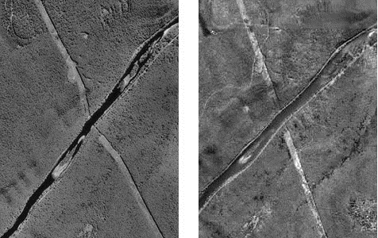
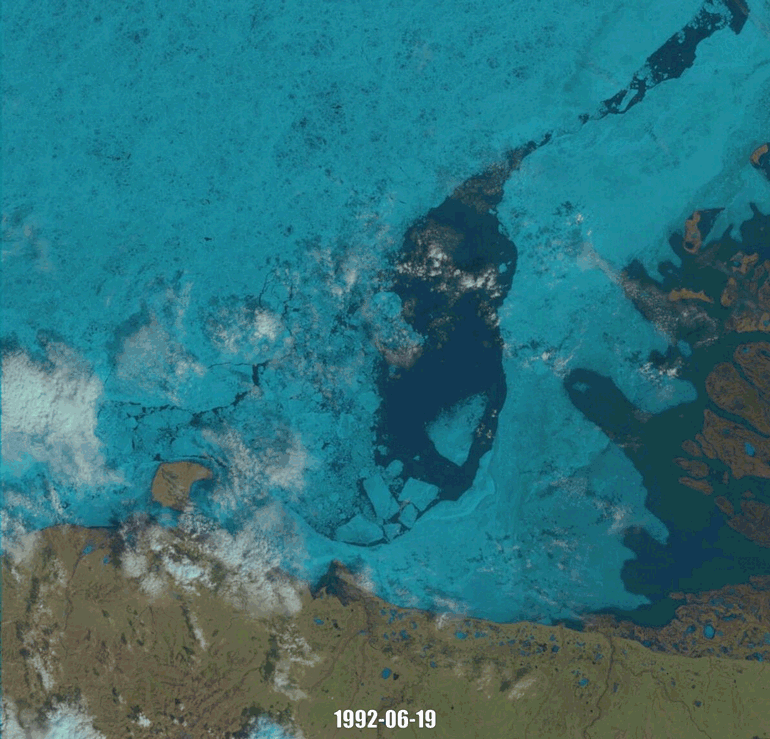
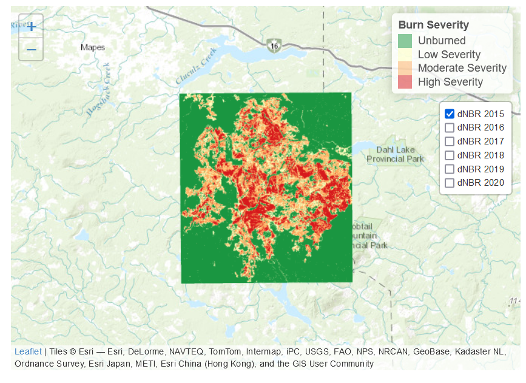

---
editor_options:
  markdown:
    wrap: 72
output:
  html_document:
    df_print: paged
  word_document: default
---

```{r echo=FALSE, warning=FALSE}
yml_content <- yaml::read_yaml("chapterauthors.yml")
author <- yml_content[["imageProcessingAndAnalysis"]][["author"]]
coauthor <- yml_content[["imageProcessingAndAnalysis"]][["coauthor"]]
baseurl <- "https://ubc-geomatics-textbook.github.io/geomatics-textbook/"
knitr::opts_chunk$set(echo = TRUE)
library(raster)
library(leaflet)
library(htmlwidgets)
```

# Image Processing and Analysis {#image-processing-and-analysis}

Written by
```{r results='asis', echo=FALSE}
cat(author, "and", coauthor)
```

The collection of imagery is challenging and time consuming, with sensor design and deployment often requiring the development of new technologies. Driven by the growing demand for relevant information about environmental change, great emphasis is placed on the creation of "the next new satellite" or "a smaller, yet more powerful drone". Although innovation in these physical technologies is critical for the advancement of image collection, they don't guarantee that the imagery will be useful. In reality, the pixel values collected by a sensor are not purely the reflectance values from the surface of interest. Depending on the wavelengths being observed, there may be variations in the amount of photons emitted from the light source and a variety of atmospheric effects, such as scattering. There may also be slight inconsistencies in images collected by the same sensor on the same day or adjacent areas, which would affect the quality of analyses.

::: {.box-content .learning-objectives-content}
::: {.box-title .learning-objectives-top}
## Learning Objectives {.unnumbered}
:::

1. Relate common issues of image collection to relevant image processing techniques
2. Understand the logic supporting the use of specific image processing techniques
3. Explore a variety of processing methodologies employed by published research
4. Synthesize the process of time series image analysis and pattern analysis and their applications

:::

## Key Terms {.unnumbered}

Atmospheric Correction, Geometric Correction, Image, Noise, Orthorectification, Pixel, Radiometric Resolution, Raster, Signal, Spatial Resolution, Spectral Resolution, Temporal Resolution 

## Overview

The application of correction methods that address these inconsistencies are often described generally as "image processing". In this chapter we will explore a variety of common image processing techniques and strive to understand the logic behind employing one, or more, to remote sensed imagery. Before diving into specific processing workflows that render imagery scientifically useful, however, it is important to review some key terms.

First and foremost, image processing, or digital image analysis, refers to any actions taken to improve the accuracy of one or more component of raw imagery. In remote sensing science, the goal of image processing is to generate a product that provides accurate and useful information for scientific pursuit. This is in contrast to image processing for artistic purposes, which could include many similar steps, but focus on generating a product that is visually appealing.

**Noise** is another common term associated with image processing and it refers to any element of the data that is not wanted. There are a variety of noise types, which we will discuss later. In contrast to noise, **signal** describes wanted components of the imagery. Combined, signal and noise provide guidance on what specific steps should be taken in relation to the data during image processing. Before they are addressed, however, it is also important to confirm the spatial accuracy of the data.

It is also important to review the elements of an **image**, or **raster**. The term raster refers to a data type comprised of a number of cells to which values are assigned. An image is a raster with cells values that represented some function of observed electromagnetic radiation. The raster cells in images are often referred to as *picture elements**, or **pixels**. The terms cell and pixel are considered interchangeable when discussing imagery. An empty raster, or image, would contain pixels with no information. To say an image has been collected would simply mean that a sensor has collected information and stored that information in adjacent pixels. Although this seems straight forward there are a multitude of environmental and engineering factors that can affect the accurate collection of information. It is these confounding factors that image processing attempts to resolve in hopes of generating a data product that can be compared across space and time.

## Geometric Correction

By definition, remotely sensed data is collected by a sensor at some distance apart from the object(s) being observed. The design of a sensor generally determines the distance at which the desired observation is to be made. For example, the camera in a cell phone is designed for relatively close range observations of electromagnetic radiation, while a sensor mounted on a satellite to operate relatively far from the target objects.

In many instances, the sensor is in motion and in many cases is subject to influence from environmental factors like wind. Interactions with phenomena like wind can cause the instantaneous field of view (IFOV) to move slightly during data collection, introducing spatial errors to the imagery. On top of issues relating to sensor displacement, sensors in motion may also observe adjacent areas with different topographic properties.

A combination of these two effects could be visualized by imagining an airplane flying over a forested hillside. As the sensor collects data the plane can be buffeted with wind, changing the direction of a sensor's IFOV to an location that is not the original target. On top of issues with sensor movement, the elevation of the ground is constantly undulating, altering the distance at which the sensors observes the landscape below. These two issues that affect the spatial components of image collection compromise the accuracy of an image and need to be corrected. The general term used to refer to the spatial correction of an image is geometric correction.

### Orthoimagery

An orthoimage is an aerial photograph or satellite imagery geometrically corrected so that the scale is uniform. Unlike orthoimages, the scale of ordinary aerial images varies across the image, due to the changing elevation of the terrain surface (among other things). The process of creating an orthoimage from an ordinary aerial image is called **orthorectification**. Photogrammetrists are the professionals who specialize in creating orthorectified aerial imagery, and in compiling geometrically-accurate vector data from aerial images.

Digital aerial photographs can be rectified using specialized photogrammetric software that shifts image pixels toward or away from the principal point of each photo in proportion to two variables: the elevation of the point of the Earth's surface at the location that corresponds to each pixel, and each pixel's distance from the principal point of the photo. Aerial images need to be transformed from perspective views into plan views before they can be used to trace the features that appear on topographic maps, or to digitize vector features in digital data sets.

```{r 13-orthorectification, echo=FALSE, out.width = '75%', fig.cap=fig_cap}
fig_cap <- paste0("An aerial image pair that has been orthorectified showing a gas pipeline. Hacker, CC-BY-SA-4.0.")

```

Compare photographs in Figure \@ref(fig:13-orthorectification). Both show the same gas pipeline, which passes through hilly terrain. Note the deformation of the pipeline route in the photo on the left relative to the shape of the route on the orthoimage to the right. The deformation in the photo is caused by relief displacement. The original photo would not serve well on its own as a source for topographic mapping.

Think of it this way: where the terrain elevation is high, the ground is closer to the aerial camera, and the photo scale is a little larger than where the terrain elevation is lower. Although the altitude of the camera is constant, the effect of the undulating terrain is to zoom in and out. The effect of continuously-varying scale is to distort the geometry of the aerial photo. This effect is called relief displacement.

### Relief Displacement

An important component of geometric correction deals with the effects of elevation on the pixels in an image. Changes in the terrain over which an image is collected lead to inconsistencies in the distances at which information is collected. These differences lead to objects in the image appearing in location inaccurate with reality and can be rectified using
the spatial information of the sensor, datum and object. Examples of this effect can be observed in any photograph containing tall structures, which would appear to be leaning outward from the center of the image, or principal point. The rectification of relief displacement can be represented by the equation:

```{=tex}
\begin{equation}
d = rh/H
(\#eq:ortho)
\end{equation}
```

where $d$ is relief displacement, $r$ is distance from the principal point to the image point of interest, $h$ is difference in height between the datum and the point of interest and $H$ is the height of the sensor above the datum.

### Georeferencing

The removal of inaccuracies in the spatial location of an image can be conducted using a technique called georeferencing. The basic concept of georeferencing is to alter the coordinates of an image through the association of highly precise coordinates collected on site using a GPS. Coordinates collected in the field are often called ground, or control points, and form the base of successful georeferencing. In general, increasing the amount and accuracy of ground points leads to increased spatial accuracy of the image.

There are a variety of techniques used to transform the coordinates of an image based on control points, all of which are require some level of mathematics. The complexity of the polynomials used to transform the dataset, the more accurate the output spatial coordinates will be. Of course, the overall accuracy of the transformation depends on how accurate the control points are. Upon transforming a rasters coordinates it is important to evaluate how accurate the output raster is compared to the input raster. A common method of evaluating the success is through the calculating the square root of the mean of the square of all error, often called the Root Mean Squared Error (RMSE). In short, RMSE represents the average distance that the output raster is from the ground or control points. The smaller the RMSE, the more accurate the transformation.

### Georegistration (georectification)

Similar to georeferencing, georegistration involves adjusting the raw coordinates of an image to match more accurate ones. In the case of georegistration, however, ground points collected in the field are replaced with coordinates from a map or image that has been verified as spatially accurate. This method could be considered a matching of two products, enabling the two products to be analyzed together. An example would be matching two images collected one year apart. If the first image is georeferenced accurately the second image can simply be georegistered by identifying shared features, such as intersections or buildings, and linking them through the creation of control points in each image.

## Resampling

Despite all the efforts to accurately place an image in space, it is likely that any spatial alterations also change the shape or alignment of the image's pixels. This dislocation between pixel sizes within the image, as well as potential changes in their directionality alter the capacity to evaluate the radiation values stored within them. Imagine that a raw image is represented by a table cloth. On top of the table cloth are thousands of pixels, all of uniform height and width. The corners of this table cloth each have X and Y coordinates. Now imagine that you have to match these coordinates (the corners) to the four more accurate ground points that don't match the table cloth. Completion of this task requires you to stretch one corner of the table cloth outwards, while the other three corners are shifted inside, leading the table cloth to alter it's shape and, in doing so, altering the location and shape of the raw pixels.  This lack of uniformity in pixel size and shape could compromise futureimage analysis and need to be corrected for. To do so, users can implement a variety of methods to reassign the spatially accurate values to spatially uniform pixels. This process of transforming an image from one set of coordinates to another is called resampling [@parker_comparison_1983].

The most important concept to understand about resampling is also the first step in the process, which is the creation of a new, empty raster in which all cells are of equal size and are aligned North. The transformed raster is overlaid with the empty raster with a user defined cell size before each empty cell is assigned a value based on values from the transformed raster. Confusing? Perhaps, but there are a variety of process that can be used to assign cell values to the empty raster and we will discuss three in hopes of clarifying this methodology.

### Nearest Neighbor

Nearest neighbor (NN) is the most simple method of resampling as it looks only at one pixel from the transformed raster. This pixel isselected based on the proximity of it's center to the center of the empty cell and the value is added without further transformation. The simplicity of this method makes it excellent at preserving categorical data, like land cover or aspect, but struggles to capture transitions between cells and can result in output rasters that appear somewhat crude and blockish.

### Bilinear Interpolation

In contrast to NN resampling, bilinear interpolation (BI) uses the values of multiple neighboring cells in the transformed raster to determine the value for a single cell in the empty raster. Essentially,the four cells with centers nearest to the center of the empty cell are selected as input values. A weighted average of these four values is calculated based on their distance from the empty cell and this averaged value becomes the values of the empty cell. The process of calculating an average means that the output value is likely not the same as any of the input values, but remains within their range. These features make BI ideal for datasets with continuous variables, like elevation, rather than categorical ones.

### Cubic Convolution

Similar to bilinear interpolation, cubic convolution (CC) uses multiple cells in the transformed raster to generate the output for a single cell in the empty raster. Instead of using four neighbors, however, this method uses 16. The idea supporting the use of the 16 nearest neighbors is that it results in an output raster with cell values that are more similar to each other than the values of the input raster. This effect is called smoothing and is effective at removing noise, which makes CC the ideal sampling method for imagery. There is one drawback of this smoothing effect, however, as the output value of a cell may be outside the range of the 16 input cell values.

```{r 13-cubic, fig.cap = fig_cap, out.width = "75%", out.height="75%", echo = FALSE}
    fig_cap <- paste0("Demonstration of neighbour selection (red) using cubic convolution resampling to determine the value of a single cell (yellow) in an empty raster. Hacker, CC-BY-4.0.")
    knitr::include_graphics("images/13-cubic_convolution.png")
```

## Atmospheric Correction

Following similar logic to that promoting the need for geometric correction, atmospheric correction is intended to minimize discrepancies in pixel values within and across images that occur due to interactions between observed radiation and atmosphere. The severity of impact that the atmosphere has on the observation of electromagnetic radition relates to changes in the atmosphere during collection and the specific wavelengths being collected. The majority of impacts are caused by the three main types of scattering, which were presented in Chapter \@ref(fundamentals-of-remote-sensing).

### Atmospheric Windows

A key characteristic of the earth's atmosphere that impacts the collection of passive remotely sensed data is the impediment of certain wavelengths. If solar radiation of a specific wavelength cannot reach Earth's surface, it is impossible for a sensor to detect the radiance of that wavelength. There are, however, certain regions of the electromagnetic spectrum (EMS), called atmospheric windows, that are less effected by absorption and scattering than others and it is the observation of these regions that remote sensing relies on. Upon reaching the Earth's surface, however, there are a variety of atmospheric constituents that can affect image quality.

### Clouds and Shadows

Two of the most common culprits in the disturbance of remotely sensed imagery are clouds and shadows. Both are relatively transient, making the prediction of their inclusion in an image difficult and rendering their effects within an image relatively inconsistent. On top of issues of presence, each introduces unique challenges for image correction. Clouds are an inherent component of Earth's atmosphere and therefore should warrant respect and care in image processing, rather than sighs of frustration. You could imagine that a single image with 30% cloud cover may not be entirely useful, but their aforementioned permanent transience means that data users must work to reduce their effects, if not remove them entirely.

When approaching the removal of clouds, it is important to recall the physics that drive Mie scattering (Chapter \@ref(fundamentals-of-remote-sensing)). Essentially, water vapors in the atmosphere scatter visible and near infraredlight and generate what appears to be white objects in the sky. Since the visible and near infrared regions of the EMS fall within an atmospheric window in which many sensor detect radiation, clouds can be recorded as part of an image.

The removal of clouds is often referred to as masking and can prove challenging depending on the region in question as they also generate cloud-shadows. You could imagine a study attempting to evaluate snowcover over a landscape using imagery comprised of wavelengths in the visible region of the EMS. If there was intermittent cloud cover, cloudy areaswith no snow could be classified as having snow and snowy areas  with cloud-shadows may be classified as no snow. Essentially, the removal of clouds utilizes the fact that clouds are cooler than the Earth's surface and can be identified using thermal data. Albedo, which is the capacity of a surface to reflect measured from 0 (no reflectance) to 1 (full, pure white reflectance), can also be calculated and used to identify the significantly brighter clouds. Once the clouds are identified and the mask is created, it is possible to identify and remove cloud-created shadows.

Shadows present unique problems for image analysis as they can shade out underlying structures and also be classified as separate, individual objects. The former issues presents problems for studies evaluating land cover, while the latter confounds machine learning algorithms attempting to identify unique classes in the image based on spectral similarities. Another confounding issue is that the location and size of shadows change throughout the day in accordance with the sun. 
An important feature of any shadow is that the area shaded is still considered to be illuminated, but only by skylight . The exclusion of sunlight from the area creates a unique opportunity for shadow identification and removal [@finlayson_color_2001]. Finlayson and Hordley's method of shadow removal is complex, using derivative calculus to capitalize on the fact that a illumination invariant function can be recognized based solely on surface reflectance.Although more complicated that Martinuzzi et al.'s approach, it may be worth reviewing Finlayson's work if you are interested in learning more about shadow removal.

### Smoke and Haze

Smoke and haze present unique issues to image processing as they tend to vary in presence, consistency and density. They also represent different types of scattering, with smoke causing Mie scattering and haze causing non-selective scattering. Makarau et al. demonstrated that haze can be somewhat removed through the creation of a haze thickness map [@makarau_haze_2014]. This methodology is equally as complex as that of Finlayson's and is perhaps beyond the scope of this book. It is important to note, though, that removal of shadows, clouds, smoke and haze relies on an understanding of how their respective scattering types affect incoming solar radiation. Successful removal, then, depends on understanding which spectral bands relatively uneffected by the particular type of scattering occurring within the image.

## Radiometric Correction

We have discussed how the creation of an image by a remote sensor leads to slight variations in spatial and atmospheric properties between pixels and that these inconsistencies must be corrected for. In this section, we will discuss some issues affecting the information within a pixel and some common remedies. In essence, we will explore how the raw digital numbers collected by a sensor can be converted to radiance and reflectance.

### Signal-to-noise

A key concept of radiometric correction is the ratio of desired information, or signal to background information (noise) within a pixel. The signal-to-noise ratio (SNR) is a common method of presenting this information and provides an overall statement about image quality. A common method of calculating SNR is to divide the mean (µ) signal value of the sensor by its standard deviation (𝛔), where signal represents an optical intensity (Equation \@ref(eq:snr)).

```{=tex}
\begin{equation}
SNR = µ _{signal} /𝛔 _{signal}
(\#eq:snr)
\end{equation}
```

It is clear, through Equation \@ref(eq:snr), that the average signal value of an instrument represents the value that its designers desire to capture. It is also clear that an increase in signal leads to an improved SNR. What remains unclear, however, is what causes a sensor to observe and record undesired noise to be recorded. In reality, there are a variety of noise types that can affect the SNR of a sensor.

### Readout Noise

Readout noise is created through the inconsistencies relating to the interaction of multiple physical measurement electronic devices. Since it is impossible to have a sensor without physical devices, readout noise is inherent in all sensors. Readout noise is therefore equal to any difference in pixel value when all sensors are exposed to identical levels of illumination. There are a variety of technical methods used to correct for this error, but the concepts and mathematics supporting them are perhaps beyond the scope of this book. If you are interested in learning more about readout noise, check out this [webpage](http://spiff.rit.edu/classes/phys445/lectures/readout/readout.html "Readout Noise by Michael Richmond") created by Michael Richmond.

### Thermal Noise

Another inherent type of sensor noise is thermal noise. Thermal noise occurs in any device using electricity and is caused by the vibrations of the devices charge carriers. This means that thermal noise can never fully be removed from an image, although it can be reduced by lowering the temperature of the environment at which the sensor is operating.

::: {.box-content .your-turn-content}
::: {.box-title .your-turn-top}
## Your turn! {.unnumbered}
:::
<p>
Calculate SNR or the associated values for various Landsat sensors:
1.  OLI = signal 5288.1, standard deviation - 18.7
2.  TM = 𝛔: 0.4, µ: 5.8
3.  ETM+ = SNR: 22.3, µ: 13.4
</p>
:::

## An overview of Landsat Processing

The field of remote sensing has witnessed the creation of a variety of national programs designed to observe the Earth's surface. Landsat is one of these programs and has enabled the collection of terrestrial information from space for over 40 years. Initiated by United States National Aeronautics and Space Administration, Landsat is now run by the United States Geological Survey (USGS) who provide the data they collect to users for free. The imagery collected from Landsat sensors has proven to be highly useful for environmental monitoring and the mission is scheduled to continue into the future. 

Despite its success, however, the imagery collected by Landsat sensors continues to face the same processing issues as most other sensors. Variations in geometric and atmospheric characteristics exist within and across images, and radiometric inconsistencies also occur. To combat these issues, the USGS has implemented a tiered image processing structure.

Level-1 processing is designed to address the geometric and radiometric inconsistencies present in an image. The USGS utilizes a combination of ground control points (GCP), digital elevation models (DEM) and internal sensor calibrations to correct an image. Within Level 1 there are a variety of sub-levels that users can select from, each varying based on the amount of correction that has been completed. More information about the specific of Landsat Level-1 processing can be found [here](https://www.usgs.gov/core-science-systems/nli/landsat/landsat-level-1-processing-details "Landsat Level-1Processing").

With the geometric and radiometric correction complete in Level-1, Level-2 processing is designed to reduce atmospheric inconsistencies. The output images created from Level-2 processing are considered to be Science Products (images with corrections completed at a quality suitable for scientific inquiry without further processing) and accurately represent surface reflectance and surface temperature. Data regarding surface reflectance is useful for evaluating a variety of environmental metrics, such as land cover, while surface temperature lends insight to vegetation health and the global energy balance. It is important to note that there are two Collection levels at which Landsat processing takes place, with Collection 2 representing the highest quality processing stream. You can explore the differences between Collections [here](https://prd-wret.s3.us-west-2.amazonaws.com/assets/palladium/production/atoms/files/Landsat-C1vsC2-2 21-0430-LMWS.pdf "Landsat Collection 1 vs 2"), while information about Collection 2 images processed at a Level-2 standard can be observed[here](https://www.usgs.gov/core-science-systems/nli/landsat/landsat-collection-2-level-2-scien e-products "Landsat Colleciton 2 Level-2").

```{r 13-landsat-c2-l2, fig.cap = fig_cap, out.width="90%", echo = FALSE}
    fig_cap <- paste0("Three unique Landsat 8 Collection 2 images. In order from left to right: Level-1 Top of Atmosphere reflectance image (no atmospheric correction), Level-2 atmospherically corrected surface reflectance and Level-2 surface temperature. Images were collected on May 3, 2013 over the Sapta Kosh River in Bairawa, Nepal [@bouchard_example_2013]. Public domain.")
    knitr::include_graphics("images/13-landsat-c2-l2.png")
```

As you may realize, there are a variety of processing options that Landsat users can select from. Each of these Collections and Levels present different opportunities for scientific study and allow users to customize processing streams based on the needs of their project. Such flexibility is key for the continued improvement of Landsat products and promotes the use of Landsat imagery across a broad range of users. It is important to remember, however, that the selection of pre-processed data for scientific inquiry requires the user to understand the foundations upon which correction were made. Be sure to draw on the fundamentals learned in this chapter to evaluate the usefulness of any processed data you consider in your work.

## Image Enhancement

So far, in this Chapter, we have discussed methods of correcting spatial, atmospheric and radiometric errors that are commonly present in remotely sensed images. While the removal of these artifacts is necessary, it is also important to explore some common methods of enhancing an image once these aforementioned corrections have been made. Both image stretching and sharpening have roots in spatial and radiometric correction, so keep your mind open to the inherent links that arise.

### Stretching

Image stretching refers to the adjustment of radiometric values of the input methods to better exploit the radiometric resolution of an image. In principle, the distribution of radiometric values within a image is altered in a manner that improves its capacity to perform a desired task. For instance, if an image collected with an 8-bit radiometric resolution (256 radiometric values; 0-255). appears too dark, it is likely that the distribution of pixel values is centered on a radiometric value greater than 127 (middle of a 8-bit scale). In fact, of 0 represents white and 255 represents black, it is very likely that the majority of pixels are closer to 255. In this case, the lowest value(s) observed in the image can be adjusted to 0, the relationship of this change can be determined and then applied to all other observed values.

```{r 13-stretch, fig.cap = fig_cap, out.width = "100%", echo = FALSE}
    fig_cap <- paste0("Example of how (a) the original distribution of radiometric values in a image is (b) stretched. Hacker, CC-BY-4.0.")
    knitr::include_graphics("images/13-stretch.png")
```

### Smoothing

Image smoothing is a process used to reduce the noise in an image. Essentially, a filter of specific window size is passed over surrounding cells and an output value for the center cell is determined by a pre-defined algorithm. Similar to the windows used for resampling, smoothing window sizes can be user defined to generate images that are useful for specific applications. Despite its usefulness as a noise reduction technique, smoothing can also have negative effects on image quality through the loss of detail.

If you are interested in learning more about how sharpening can impact hyperspectral imagery you can check out [@inamdar_characterizing_2020]. Their research demonstrates that recorded pixel values contain information from areas beyond the traditional spatial boundary of a cell. These findings have interesting implications for a variety of applications. 

*Case Study Author: Natasha Sharma (CC-BY-SA-4.0 unless otherwise indicated), University of British Columbia, Bachelors of Environment and Sustainability, 2022*

Landsat 8-7 has regularly acquired images of Beaufort Sea and Mackenzie River Delta through true-color image to show abundance surface melt, fast ice break up, leaf fraction, ice motion, and changes in coastal features during early springtime. The Beaufort Sea has seen dramatic summer ice losses, particularly in 2009, with regions that were dominated by thick multi-year ice now completely melting out. For comparison, the timeline GIF from 1992 to 2021 depicts different stages of ice breakup in the month of June. Notice the extensive fracturing of Beaufort Sea ice occurring in 1996, but the 2009 and 2014 fracturing appears more widespread until nearly disappearing in 2017.

```{r 14-Beaufort-Sea-Ice, echo=FALSE, fig.cap=fig_cap, message=FALSE, warning=FALSE}
    fig_cap <- paste0("True-color image of Beaufort Sea Ice Deterioration. Sharma, CC-BY-SA-4.0.")
    
```

Similarly, in the high arctic polar desert of Ellesmere Island in Nunavut, Canada, what were once the twin St. Patrick Bay ice caps have now chipped away due to decades of rising temperatures and unusually warm summers. Once the remnants of the Little Ice Age that covered about 7.5 square km and 3 square km across respectively, the formation has reduced to only 5% of their former area and are predicted to extinct within a decade. St.Patrick Bay Ice caps are emblematic of the Arctic change - a reality of how climate change is affecting the whole of Canadian Arctic. 

<!--Slider code -->
<div id="container">   <input type="range" min="0" max="100" value="50" id="slider" oninput="slide()"> </div>

<p class="caption">Death of the St. Patrick Ice Caps. Sharma, CC-BY-SA-4.0 </p>

<style> #container{position:relative;top: 0; left: 0;} #before-img{width:100%;top: 0; left:0; position:absolute;clip-path: polygon(0 0 , 50% 0, 50% 100%, 0 100%);} #after-img{ position:relative; top:0; left:0;width:100%;}#slider{ position: absolute; top:0; left:0;  -webkit-appearance: none; width: calc(100% + 40px); height: 100%; margin-left: -20px; background-color: transparent; outline: none; } #slider::-webkit-slider-thumb{ -webkit-appearance: none; height: 40px; width: 40px; background: url("./images/scroll-icon.png"); background-size: contain; cursor: pointer; }</style>

<script> slider.oninput = () => {document.getElementById("before-img").style.clipPath = "polygon(0 0," + document.getElementById("slider").value + "% 0," + document.getElementById("slider").value + "% 100%, 0 100%)";}</script>
<!--End of Slider code -->

## Case Study: Spatial Patterns of Wildfire in British Columbia

*Case Study Author: Brent Murray (CC BY 4.0. unless otherwise indicated), University of British Columbia, Master of Geomatics for Environmental Management, 2022*

Understanding the changes that occur overtime is extremely important for environmental studies. These changes can be monitored using remote sensing data and has been used in a variety of studies. This case study looks at how changes in vegetation health derived from Landsat-8 data were impacted by the burn severity of the 25 569 hectare Little Bobtail Lake wildfire in North-Central British Columbia.

Four vegetation indices were calculated for each of the images in the study. The Normalized Difference Vegetation Index (NDVI) [@rouse_monitoring_1974], and Tasseled Cap Transformation (TCT) [@crist_physically-based_1984] were calculated to measure vegetation health. NDVI is calculated as (Equation 1):

\begin{equation}
\tag{1}
  NDVI = \frac{NIR - RED}{NIR + RED}
\end{equation}

Additionally, the Normalized Burn Ratio (NBR) [@lopez_garcia_mapping_1991], and the Difference Normalized Burn Ratio (dNBR) [@key_landscape_2006] were calculated. NBR (Equation 2) and the dNBR (Equation 3) are used to measure burn severity.

\begin{equation}
\tag{2}
  NBR = \frac{NIR - SWIR}{NIR + SWIR}
\end{equation}


\begin{equation}
\tag{3}
  dNBR = NBR_{pre fire} - NBR_{post fire}
\end{equation}

The dNBR values were then scaled for each image to a range of 0-255 by using the following equation (Equation 4):

\begin{equation}
\tag{4}
  dNBR_{Scaled} = \frac{(dNBR * 1000) + 275}{5}
\end{equation}

Each of the scaled dNBR images were then classified into four burn severity classes (Table \@ref(tab:13-murray-case-study-table-1)). The classified dNBR image for right after the wildfire was polygonised and the burn severity polygons were then used to extract the NDVI and each of the TCT values for each year of the study.

```{r 13-murray-case-study-table-1, echo = FALSE, results='asis'}
dnbr_table <- data.frame(dNBR = c("< 75", "75-118", "118-187", "> 187"),
                        Classified = c("0", "1", "2", "3"), 
                        Description = c("Unburned", 
                                        "Low Severity", 
                                        "Moderate Severity",
                                        "High Severity"))
knitr::kable(dnbr_table, caption = "Classified Burn Severity Values based on the scaled dNBR values.")
```

The change in value of the NDVI and the TCT Greenness and Wetness based on burn severity can be seen in the box plots below (Figure 1). This shows the changes in the vegetation index values from before the wildfire and every year after. The burn severity had an impact on these values as there was a greater decrease in value immediately after the wildfire with the higher burn severity as well as a slower return to the pre-fire state. Additionally, based on the vegetation index used, it can be seen that there different rates of return to a pre-fire state. These differences are important to understand when choosing a vegetation index for a study.

```{r, echo=FALSE, results='asis', fig.cap = "Changes in the values of NDVI (a), TCT Greenness (b), and TCT Wetness(c) based on the burn severity of the Little Bobtail Lake wildfire from 2014 (before the wildfire) to 2020 (five years after the wildfire)."}
knitr::include_graphics("images/13-VIPlots.png")
```

Wildfires create spatial patterns on the landscape which is a key factor in forest regrowth. Pattern metrics can be calculated and used to understand the changes in the spatial patterns overtime. Using the `calculate_lsm()` function found in the Landscape Metrics (v1.5.0) R package [@hesselbarth_landscapemetrics_2019], the Core Area (`lsm_p_core()`) patch metric was calculated for each of the classified dNBR images. Additionally, the NDVI images were classified into four classes (Table \@ref(tab:13-murray-case-study-table-2)) and then the Core Area Metric was calculated.

```{r 13-murray-case-study-table-2, echo = FALSE, results='asis'}
ndvi_table <- data.frame(NDVI = c("< 0.1", "0.1-0.14", "0.14-0.5", "> 0.5"),
                        Classified = c("0", "1", "2", "3"), 
                        Description = c("No Vegetation", 
                                        "Sparse Vegetation", 
                                        "Moderately Healthy Vegetation",
                                        "Healthy Vegetation"))
knitr::kable(ndvi_table, caption = "Classified Vegetation Health Values based on the NDVI values.")
```

The changes in the Core Area of the burn severity classes showed that the High Severity class had a decrease of 2.6 hectares every year. The Low Severity class had a increase of 1.5 hectares every year and the Moderate and Unburned classes showed little change in Core Area. This was to be expected because as the vegetation regrows in the High Severity areas it changes to a lesser severity (Figure \@ref(fig:13-dnbr-leaflet)). For the vegetation health classes, the Sparse Vegetation class showed a 3.7 hectare increase in Core Area every year, while the other vegetation classes showed little change. These is due to the initial increase in the new vegetation in the first years after the wildfire.

```{r, echo = FALSE, results='asis', message=FALSE, warning=FALSE}
r1 <- as.factor(raster("data/13/dNBR_Class_2015.tif"))
r2 <- as.factor(raster("data/13/dNBR_Class_2016.tif"))
r3 <- as.factor(raster("data/13/dNBR_Class_2017.tif"))
r4 <- as.factor(raster("data/13/dNBR_Class_2018.tif"))
r5 <- as.factor(raster("data/13/dNBR_Class_2019.tif"))
r6 <- as.factor(raster("data/13/dNBR_Class_2020.tif"))

pal <- colorFactor(c("#1a9641", "#ffffbf", "#fdae61", "#d7191c"), values(r1),
                   na.color = "transparent")
labels = c("Unburned", "Low Severity", "Moderate Severity", "High Severity")

dnbrMap = leaflet() %>%
  addProviderTiles("Esri.WorldTopoMap") %>%
  addRasterImage(r6, colors = pal, group = "dNBR 2020") %>%
  addRasterImage(r5, colors = pal, group = "dNBR 2019") %>%
  addRasterImage(r4, colors = pal, group = "dNBR 2018") %>%
  addRasterImage(r3, colors = pal, group = "dNBR 2017") %>%
  addRasterImage(r2, colors = pal, group = "dNBR 2016") %>%
  addRasterImage(r1, colors = pal, group = "dNBR 2015") %>%
  addLegend(pal = pal, values = values(r1),
  title = "Burn Severity",
  labFormat = function(type, cuts, p){paste0(labels)})%>%
  addLayersControl(overlayGroups = c("dNBR 2015", "dNBR 2016", "dNBR 2017",
                                     "dNBR 2018", "dNBR 2019", "dNBR 2020"),
                   options = layersControlOptions(collapsed = FALSE))%>%
  hideGroup(c("dNBR 2016", "dNBR 2017", "dNBR 2018", "dNBR 2019", "dNBR 2020"))
#htmlwidgets:::knit_print.htmlwidget(dnbrMap)
```

``` {r 13-dnbr-leaflet, echo=FALSE, out.width="75%", fig.cap=fig_cap}
if (knitr:::is_latex_output()) { fig_cap <- paste0("Classified Burn Severity images for the Little Bobtail Lake wildfire from 2015 to 2020. <a
  href='",baseurl,"#fig:13-dnbr-leaflet'>Interactive figure can be viewed in the web browser version of the textbook</a>. Data from @natural_resources_canada_natural_nodate and licensed under the <a href='https://www.nrcan.gc.ca/terms-and-conditions/10847'>Open Government Licence - Canada </a>. Murray, CC-BY-SA-4.0.")
  
} else { fig_cap <- paste0("Classified Burn Severity images for the Little Bobtail Lake wildfire from 2015 to 2020. Data from @natural_resources_canada_natural_nodate and licensed under the <a href='https://www.nrcan.gc.ca/terms-and-conditions/10847'>Open Government Licence - Canada </a>. Murray, CC-BY-SA-4.0.")
dnbrMap
}
```

## Summary

This chapter provided an overview of common image processing techniques and discussed the logic that supports their usage. Overall, each technique strives to create imagery that is consistent across time and space in order for individual pixel values to be evaluated and/or compared. Although necessary, these processes can take time and need to be applied in accordance with the desired application. Understanding the general workflow of image processing will allow you to determine what steps should be taken to create the highest quality imagery for your research.

## Reflection Questions {.unnumbered}

1. Define geometric correction and discuss one of its components.
2. List three resampling techniques and describe the differences.
3. What is the differences between cloud and smoke with regards to scattering?
4. Why is the signal-to-noise ratio important for evaluating image quality?
5. What is the image displacement of a pixel that is 0.5 mm from the principal point, 57 m below the datum, and collected from a sensor that is 135 m above the datum?
