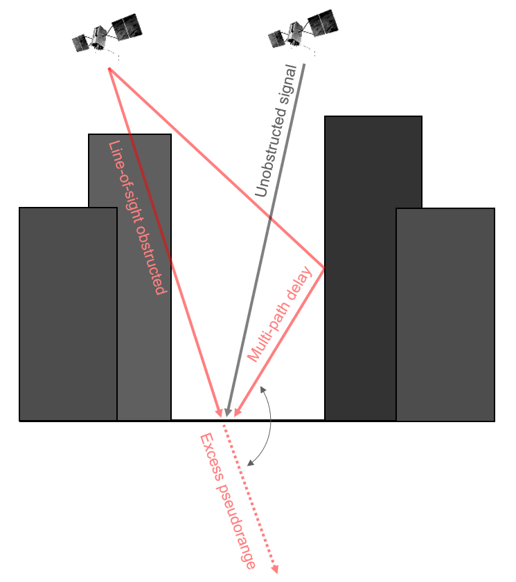
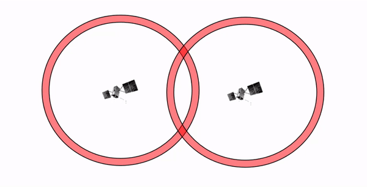
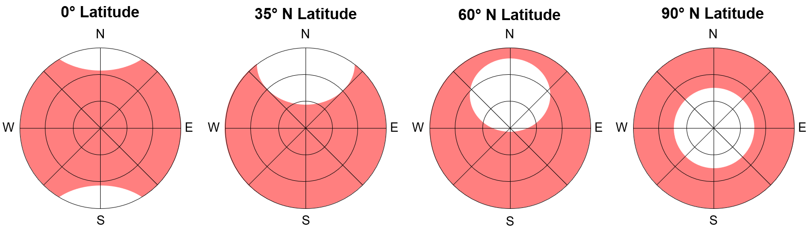

---
html_document:
  df_print: paged
title: 'null'
editor_options:
  markdown:
    wrap: 72
---

# Global Navigation Satellite Systems {#global-navigation-satellite-systems}

```{r 14-load-packages-and-setup, include=FALSE}
baseurl <- "https://ubc-geomatics-textbook.github.io/geomatics-textbook/"
knitr::opts_chunk$set(echo = TRUE)
```

```{r echo=FALSE}
yml_content <- yaml::read_yaml("chapterauthors.yml")
author <- yml_content[["globalNavigationSatelliteSystems"]][["author"]]
```

```{r setup, include=FALSE}
## This allows us to add an id attribute to a chunk
knitr::opts_chunk$set(echo = FALSE)

knitr::opts_hooks$set(out.extra = function(options) {
  options$out.extra <- paste0(ifelse(!is.logical(options$out.extra), options$out.extra, "")," id='", options$label, "'")
  options
})
```

```{js, echo=FALSE}
var images = new Array()
var tec1date = new Date();
tec1date.setDate(tec1date.getDate() - 1);
var tec2date = new Date();
tec2date.setDate(tec2date.getDate() - 2);
var tec3date = new Date();
tec3date.setDate(tec3date.getDate() - 3);
var tec4date = new Date();
tec4date.setDate(tec4date.getDate() - 4);
var tec5date = new Date();
tec5date.setDate(tec5date.getDate() - 5);
var tec6date = new Date();
tec6date.setDate(tec6date.getDate() - 6);
var tec7date = new Date();
tec7date.setDate(tec7date.getDate() - 7);

var part1 = "https://www.spaceweather.gc.ca/service/tools/tec/?date="
var part2 = ":00&format=png&maxlevel=40&type=1&lang=en"

var loaded = [];
function preload() {
    for (var i = 0; i < arguments.length; i++) {
        loaded[i] = new Image();
        loaded[i].src = preload.arguments[i];
    }
}

preload(
  part1 + tec7date.toISOString().substring(0,13) + part2,
  part1 + tec6date.toISOString().substring(0,13) + part2,
  part1 + tec5date.toISOString().substring(0,13) + part2,
  part1 + tec4date.toISOString().substring(0,13) + part2,
  part1 + tec3date.toISOString().substring(0,13) + part2,
  part1 + tec2date.toISOString().substring(0,13) + part2,
  part1 + tec1date.toISOString().substring(0,13) + part2,
  "https://www.spaceweather.gc.ca/auto_generated_products/tec/latest/tec-en.png"
)
```

Written by
```{r results='asis', echo=FALSE}
cat(author)
```

Introduction here.

:::: {.box-content .learning-objectives-content}

::: {.box-title .learning-objectives-top}
## Learning Objectives {-}
::: 
1. Understand how data are collected by Global Navigation Satellite Systems (GNSS)
::::

## Key Terms {-}

Almanac, Control Segment, Dilution of Precision (DOP), Ephemeris, Global Navigation Satellite Systems (GNSS), Ionospheric Delay, Multipath Error, Pseudorange, Space Segment, Total Electron Count (TEC), Tropospheric Delay, User Segment

## Collecting Data from Global Navigation Satellite Systems

Most likely, the type of data that you will need to collect in the field will be location. You might need to locate some plots in the forest or walk the perimeter of a rare ecosystem in order to map these features. To do this, we rely on Global Navigation Satellite Systems (GNSS). In this section, we will explore how GNSS works, what are the sources of error, identify the main segments, and discuss how you can collect your own positional data from a GNSS.

### How GNSS Work

A GNSS is, fundamentally, a ranging system. Range is simply the distance between two points that are connected by a line-of-sight. One of those points is you, holding your GNSS receiver, and the other point is a satellite that is orbiting somewhere between 20,000 and 23,000 km above the surface of the Earth. The satellite is broadcasting a radio wave signal that is traveling at the speed of light $c = 299,792,458 m·s^{-1}$, which at a distance of 20,000 km would take about 67 _milliseconds_ to reach you on the ground if the satellite was directly above you. But the range to a single satellite cannot tell you much. For example, how would you know where you are if you knew that you were 20,000 km away from Vancouver, Canada? You could literally be 20,000 km in any direction, and you might visualise that as a sphere with a radius $r = 20,000 km$. The radius of the Earth's semi-major axis measures only $a=6,378.137km$ for the World Geodetic System 1984 (WGS 1984), which means a range of 20,000 km could place you anywhere on Earth, but also many other locations off in space. So how do we narrow our possible location and solve our position on Earth? We need more satellites!

With a range to a single satellite, you know you are somewhere on the surface of a sphere with a radius equal to that range. With known ranges to two satellites, you can reduce your possible positions to the intersection of the two spheres that are formed from the two ranges (Figure \@ref(fig:14-two-gnss-satellites)). It is important to recognize here that when you intersect two spheres, the arc (line) that forms the intersection represents the possible locations where both ranges are true. In other words, we have now reduced our possible positions from a 3D surface of a sphere to a 2D arc.

```{r 14-two-gnss-satellites, fig.cap = fig_cap, out.width= "75%", echo = FALSE}
    fig_cap <- paste0("Range to two satellites gives an intersection, which spatially is represented as a 2D arc of possible positions. Pickell, CC-BY-SA-4.0.")
    knitr::include_graphics("images/14-two-gnss-satellites.PNG")
```
<br/>

Adding the range to a third satellite gives us two more intersecting arcs, one with the first satellite and another with the second satellite. The intersection of these three arcs reduces our possible positions to just two locations (Figure \@ref(fig:14-three-gnss-satellites)) and usually only one of these is actually logical. This process of intersecting spheres from three or more satellites is known as **trilateration**.

```{r 14-three-gnss-satellites, fig.cap = fig_cap, out.width= "75%", echo = FALSE}
    fig_cap <- paste0("Range to three satellites gives us three intersections. These three arcs intersect only at two positions. Pickell, CC-BY-SA-4.0.")
    knitr::include_graphics("images/14-three-gnss-satellites.PNG")
```
<br/>

In theory, you could estimate your position with just three satellites if you were lucky and these three spheres perfectly intersected at a single location. But the satellites are of course in motion, orbiting the Earth at a speed of about $14,000 km·s^{-1}$, which complicates things in two ways. First, the range to the satellite is always changing because the satellite is moving, so any chance of having three intersect perfectly at a single location would not only be extremely rare but also instantaneous. Second, the satellite will eventually disappear over the horizon and then we do not have a line-of-sight anymore, so we end up losing and gaining satellites as they move across the sky. More importantly, however, we cannot know our exact range to any particular satellite because there are numerous errors that can compound and lead to uncertainty. Thus, in practice, we work with *estimated* ranges with bounds of uncertainty rather than the true range. For this reason, we typically use four or more satellites to estimate an accurate position on Earth.

### Segments of GNSS

GNSS consists of three segments that are important to distinguish for their differing roles and management.

The **user segment** describes the people, industries, and ground receivers and antennae that rely on the positioning accuracy provided by GNSS. 

The **space segment** describes the satellites, orbits, and launch vehicles that are controlled remotely.

The **control segment** describes the official management and control of the qualities and parameters of the other two segments. 

### Sources of Error

It is not possible for GNSS receivers to calculate the exact ranges to each satellite due to a number of factors that accumulate errors. For this reason, we usually refer to the estimated range to a single satellite as the **pseudorange**, which is calculated as:

$$
R_p=ρ+c(dt-dT)+I_f+T+E+M+ε_R+ε_S
$$

Where $ρ$ is the actual geometric range between the receiver and the satellite antennae, $c(dt-dT)$ is the difference between the satellite and receiver clock offsets multiplied by the speed of light $c$, $I_f$ is the distance of ionospheric delay for a particular frequency $f$, $T$ is the distance of tropospheric delay, $M$ is the distance of multipath delay, $E$ is the distance caused by ephemeris or satellite positional errors, $ε_R$ is the distance caused by receiver instrument noise, and $ε_S$ is the distance caused by satellite instrument noise. These terms are ordered in the approximate declining sequence of magnitude. In other words, clock errors will usually contribute more delay (range) than instrument noise. It is important to remember that any delay in the GNSS signal reaching the receiver from the satellite will cause $R_p>ρ$. You should think of each of these error terms as __delays__ that are multiplied by the speed of light $c$ and result in a distance or range. Next, we will look at each of these sources of error and how they are dealt with.

An important source of error in GNSS is clock drift: $c(dt-dT)$. Clock errors arise from both the satellite $dT$ and the user $dt$ segments of GNSS. The clocks on the satellites are highly precise atomic clocks that are synchronized and periodically corrected. This clock synchronization among the satellites is important because it allows us users, on the ground with our receivers, to rely on a consistent and comparable time stamp in the GNSS signal. So when we get a signal from one satellite and calculate the time difference, that time difference should be comparable to the time difference we get with any other satellite. However, the clocks in our receiver have no where near the same precision and are not synchronized with the clocks on the satellites. This means that the current time in our receiver on the ground is not precisely the same time as the satellite orbiting overhead and receiver clocks are more prone to time drift, which requires a periodic offset to be used to account for the drift. 

No matter how small this time difference is between the satellite and receiver, it is multiplied by the speed of light and ultimately impacts our estimation of position. For example, if the current time on the satellite differed by one-thousandth of a second (0.001 s or 1 ms) from our receiver, then our range to a single satellite will be off by about 300 km! All clocks drift over time which requires periodic corrections or offsets to keep them synchronised. Most receivers in the user segment are manufactured with clocks that have an estimated drift that can be corrected through a periodic offset, while satellite clocks are closely monitored by the control segment and offsets are periodically broadcast over the space segment. With offsets, we can reduce clock errors significantly, but some drift will always occur and result in error. Each nanosecond (one-billionth of a second) of clock error causes 30 cm of error in the pseudorange.

An important feature that exists between the GNSS user and space segments is Earth's atmosphere. The atmosphere has varying density, temperature, pressure, and composition, which can interact with the GNSS signals and result in delays. The speed of light $c$ in the equation above is given in a vacuum, but once light hits the atmosphere its path elongates as the wavelength is absorbed and reflected by the gases and suspended aerosols in the atmosphere. The two primary layers of the atmosphere that cause delays for the GNSS signal are the ionosphere and the troposphere. 

The ionosphere is the last layer of the upper atmosphere where the last oxygen, hydrogen, and helium atoms meet the vacuum of space and become ionized (gain electrons) from X-rays and ultraviolet radiation emitted by the Sun. The density of electrons in the ionosphere is usually expressed as the **Total Electron Count (TEC)**, which varies diurnally as the Sun rises and sets as well as sporadically due to solar activity and space weather. Figure \@ref(fig:14-total-electron-count-canada) shows the TEC for Canada over the last 7 days for the current hour. These electrons cause **ionospheric delay** in the GNSS signal $I_f$ and this delay is also frequency-dependent $f$ (i.e., the radio wavelength).

```{r 14-total-electron-count-canada, out.extra='id="tec"', fig.cap = fig_cap, out.width= "75%", echo = FALSE}
    fig_cap <- paste0("Total Electron Count (TEC) over Canada from the last 7 days. <a href='",baseurl,"#14-total-electron-count-canada'>Animated figure can be viewed in the web browser version of the textbook.</a> Data from Natural Resources Canada, Environment Canada, and the Canadian Space Agency. <a href='",canadalicense,"'>Open Government License - Canada</a>.")
    knitr::include_graphics("https://www.spaceweather.gc.ca/auto_generated_products/tec/latest/tec-en.png")
```

```{js, echo=FALSE}
images = [
  part1 + tec7date.toISOString().substring(0,13) + part2,
  part1 + tec6date.toISOString().substring(0,13) + part2,
  part1 + tec5date.toISOString().substring(0,13) + part2,
  part1 + tec4date.toISOString().substring(0,13) + part2,
  part1 + tec3date.toISOString().substring(0,13) + part2,
  part1 + tec2date.toISOString().substring(0,13) + part2,
  part1 + tec1date.toISOString().substring(0,13) + part2,
  "https://www.spaceweather.gc.ca/auto_generated_products/tec/latest/tec-en.png"
];

setInterval("Animate()", 1250);
var x = 0;

function Animate() {
  document.getElementById("tec").src = images[x]
  x++;
  if (images.length == x) {
    x = 0;
  }
}
```

The troposphere is the layer of atmosphere that we breath and live in near Earth's surface. It is considerably more dense and prone to changes in temperature and pressure from weather. **Tropospheric delays** $T$ are not dependent on the radio frequency of the GNSS signal (i.e., all frequencies are impacted similarly by the troposphere). Both ionospheric and tropospheric delays can be physically modeled from meteorological observations from ground stations, weather balloons, and weather satellites to improve accuracy of GNSS positional data.

The next significant source of errors are **multipath errors** $M$, which are caused by the reflection of the radio wave off of a flat or shiny surface thereby extending the range of the signal from the satellite to the receiver (Figure \@ref(fig:14-GNSS-multipath-error)). Usually, multipath errors occur as a result of an obstructed line-of-sight to a satellite in the sky, but the signal still reaches the receiver via reflection off another surface. Multipath errors are very common especially in urban areas where concrete, steel, and glass buildings are ubiquitous. Many professional receivers do attempt to filter out multipath signals through complex signal analysis and some receivers allow the user to "deselect" certain satellites below a threshold elevation above the horizon.

```{r 14-GNSS-multipath-error, fig.cap = fig_cap, out.width= "75%", echo = FALSE}
    fig_cap <- paste0("Multipath errors are caused by reflection of the GNSS signal off of another surface, thereby extending the pseudorange to the receiver. Pickell, CC-BY-SA-4.0.")
    
```

There are also some small errors that can occur due to how well our receiver can track satellites. Each satellite broadcasts two types of information: an **almanac** that contains coarse orbital information about all the satellite orbits in the constellation and is used to speed up the receiver's ability to get the first satellite fix; and the **ephemeris** (sometimes you see the plural, **ephemerides**) that contains more specific orbital information about that particular satellite, which is used to help the receiver continuously track the satellite. The control segment broadcasts the almanac across the entire satellite constellation, so that once a receiver gets a fix on one satellite it can quickly find the other satellites that are expected to be in view. The almanac is a larger amount of data that takes about 12 minutes to download from the satellite if it is not already pre-loaded onto your receiver. Howevere, the almanac is not needed or used to calculate the pseudorange, its only role is to speed up the first satellite fix. On the other hand, the ephemeris is necessary to track each individual satellite and is also used to refining the pseudorange calculation. Thus, errors in the ephemeris data $E$ can propagate into the pseudorange calculation.

Finally, there are many electrical components that can contribute instrument noise to the signal from the receiver $ε_R$ and satellite $ε_S$. Instrument noise is caused primarily by the conversion between the analog radio signal and the digital signal as radiowave photons are converted into electrons and vice versa. Noise can be introduced by electrical components adjacent to the antenna, the temperature of the components, the wiring, cabling, and circuitry, as well as the antenna itself. Imagine the sounds that you sometimes hear on a radio: hissing, buzzing, whining. GNSS receivers also "hear" this noise in the signal, which can make it difficult to track satellites and accurately estimate the pseudorange. Instrument noise $ε$ usually contributes very little error to the pseudorange estimation, but it is theoretically always nonzero.

One important measure of error that is usually displayed on your GNSS receiver is the **Geometric Dilution of Precision (GDOP)**. GDOP is a measure of the uncertainty in your positional measurement as a result of the apparent satellite geometry in your sky. Since the pseudorange is an estimate with limited precision, the final measured position is prone to error propagation when the satellites in view are very close together in the sky. This phenomenon is illustrated in Figure \@ref(fig:14-GNSS-DOP): as two satellites converge on the same location in the sky, the ability to resolve the position is greatly reduced due to significant overlap in the pseudoranges. In fact, the pseudoranges are 3-dimensional spheres around the satellites, so in reality these intersecting uncertainties are actually volumes of space instead of areas. 

```{r 14-GNSS-DOP, fig.cap = fig_cap, out.width= "75%", echo = FALSE}
    fig_cap <- paste0("Geometric Diluation of Precision (GDOP) shown as the overlap between the pseudoranges of two satellites in a 2-dimensional view. GDOP increases with increasing overlap as the satellites are closer to each other. Lower DOP values are desired when collecting positional measurements. Pickell, CC-BY-SA-4.0.")
    
```

### Planning Your GNSS Data Collection

You may recognize that many of the errors described in the previous section can be avoided or mitigated with careful planning. Choosing a GNSS receiver that is suitable for your data collection need is the first factor within your control. If you need centimeter-level accuracy for survey work, then you will probably be using a high-quality receiver with a pole- or tripod-mounted antenna. The pole allows the antenna to be above vegetation and other obstacles and away from electrical equipment near the ground that might interfere with the GNSS signal. The pole is also an effective way to ensure that your skull and hardhat do not block, reflect or attenuate the signal. On the other hand, if you are collecting positional data with meter-level accuracy, then a hand-held receiver from a reputable manufacturer will do just fine.

Equipment in hand, the next decision you can control is when and where you collect your measurements. When you go out is more important than where. You should use any of several free services to quickly analyze the satellite ephemeris and almanac to decide the time of day that you will have many satellites in your line-of-sight and good viewing geometry to reduce your dilution of precision. Additionally, check the space weather forecast and current conditions of the Total Electron Count (TEC) to minimize ionospheric delay. If you need high precision in your positions, then you will also want to consider software and services to model ionospheric and tropospheric errors. Finally, deciding where to collect your measurements can impact your line-of-sight to the satellites, availability of satellites generally, and possible multipath errors from buildings or other highly reflective surfaces. 

Although GNSS satellite constellations are launched into orbits that allow for wide global coverage, there are some locations on Earth that are limited in their coverage by these orbits. For example, GPS satellites have a maximum orbital inclination of 55° relative to the Equator, so if you are standing at the North or South Pole (i.e., 90° latitude), you will never observe a GPS satellite directly overhead or higher than about 45° above your horizon (Figure \@ref(fig:14-GNSS-satellite-coverage-by-latitude)). Similarly, if you are standing at the Equator (i.e., 0° latitude), you will never have a direct line-of-sight to a satellite in the far north or south of your horizon. The consequence of estimating position at higher latitudes where there are fewer satellite paths is that your GDOP will always be higher than lower latitudes. Since the orbits are fixed, this means you must take even more care to plan the timing of your acquisition to ensure you achieve the best possible GDOP for your data.

```{r 14-GNSS-satellite-coverage-by-latitude, fig.cap = fig_cap, out.width= "75%", echo = FALSE}
    fig_cap <- paste0("Sky plots showing the approximate coverage (red) of Global Position System satellites at different latitudes. The centre of the sky plot is directly overhead at the local latitude and the edge of the sky plot circle represents the horizon with the cardinal directions. Pickell, CC-BY-SA-4.0.")
    
```
