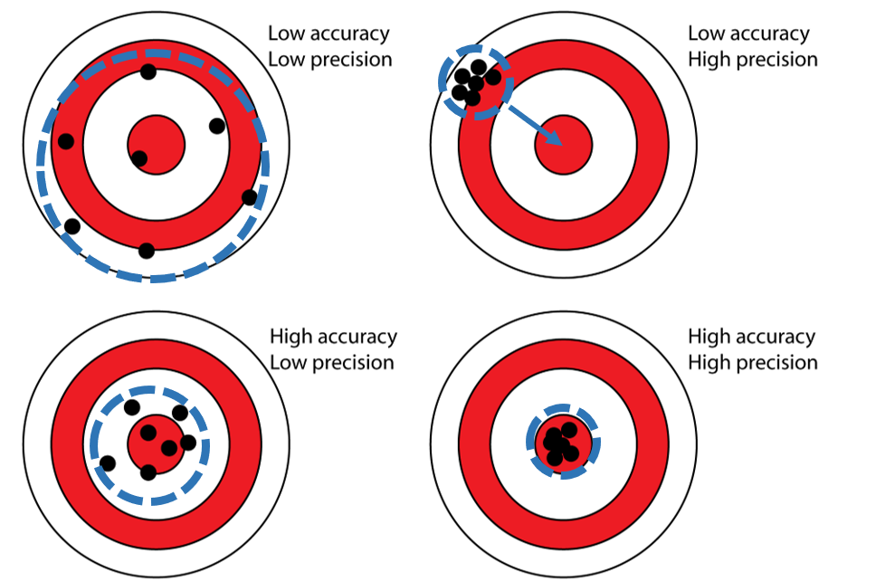
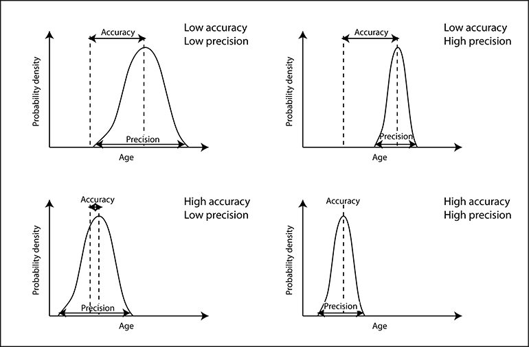
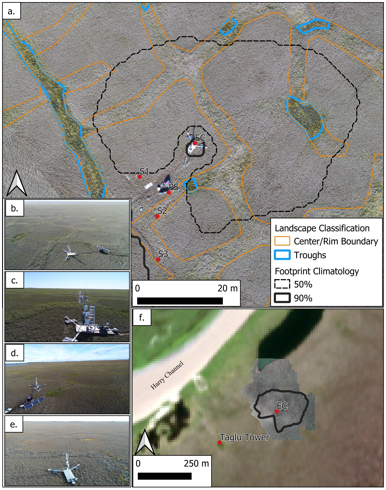
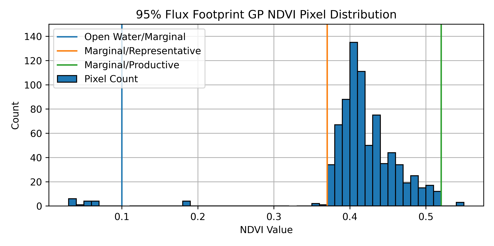
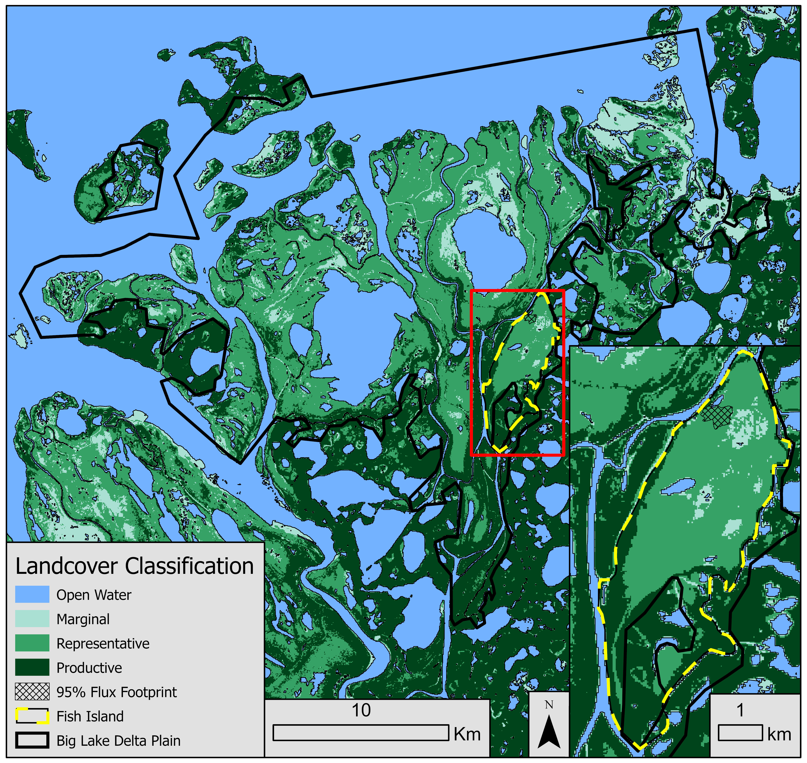

# Chapter Title {#data-integration}

**Data Integration**, This chapter is about ....


**This will be a bit easier to finalize after I see a draft of the book, so I know more broadly what has been covered in the previous chapters.**

:::: {.box-content .learning-objectives-content}

::: {.box-title .learning-objectives-top}
#### Learning Objectives {-}
::: 

1. Objective one
2. Objective two
3. Objective three

::::

### Key Terms {-}

Ipsum lorem, Phasellus, sollicitudin, finibus


16.1  Problems with data integration    
16.1.1  Data types, sources, formats    
16.1.2  Datums, extents, scales   
16.1.3  Data resolutions    

##  Integrating vector and raster data

16.2.1  Rasterization   

16.2.2  Vectorization   
 - Could make a cool little visualization showing how to go between the two.  Either static images an animation, or video screen share.

16.2.5  Smoothing   

16.2.6  Simplifying   


##  Spatial data errors   

###  Accuracy vs. Precision   
Measurement Errors
Accuracy:
The degree to which a set of measurements correctly matches the real world values.  How close are we to the real value?
If there is a consistent (systematic) offset from that real world value, our measurements are inaccurate. They have a bias.
Precision:
The degree of agreement between multiple measurements of the same real world phenomena. How repeatable is a measurement? 
If you take five measurements of the same feature, how likely are they to be similar?  Lack of precision can be attributed to random errors.

{.center}

{.center}

### Vaugeness and Ambiguity
Vaugeness - Victoria ... does it mean Victoria BC vs. Victoria AU

Ambiguity - coastline - is it the high water line? Low water line? mean water level?

###  Quantifying spatial errors    RMSE, Euclid's distance


### Logical Errors

Data incongruencies

### Ecological Fallacy, Atomistic Fallacy, MAUP etc.  Its important to include these, whether here or elsewhere?

### Other Errors?
- source data errors, out of date data, data entry & digitization?

::::


:::: {.box-content .case-study-content}

::: {.box-title .case-study-top}
#### Case Study {-}
:::

#### Large Scale {#box-text -}

<p id="box-text">Footprint mapping, temporal upscaling.  I'll fill in more text here later, these figs are just grabbed from my thesis chapters.  The gist of it - Measured NEE in one year.  Have 10 years of climate data + Reanalysis data + satellite data.  Combine these data sources & train a model to do a temporal upscale/sensitivity analysis to see how inter-annual climate variability impacts NEE.  Then do a landscape classification with a greenest pixel NDVI image, intersecting with the flux footprint.  Use that to find the representative areas to do a "back of the envelope" spatial upscaling. </p>

{.center}


{.center}

{.center}

{.center}

{.center}

{.center}

{.center}


::::


::::


:::: {.box-content .case-study-content}

::: {.box-title .case-study-top}
#### Case Study {-}
:::

#### Small Scale {#box-text -}

<p id="box-text">Case Study: UBC Trees in a Changing Climate</p>


<p id="box-text">The file structure for this case study doesn't match the structure of the template, so I've left it out for now, until I can get a bit more guidance on it.</p>

::::


```{r include=FALSE}
knitr::write_bib(c(
  .packages(), 'bookdown', 'knitr', 'rmarkdown', 'htmlwidgets', 'webshot', 'DT',
  'miniUI', 'tufte', 'servr', 'citr', 'rticles'
), 'packages.bib')
```
