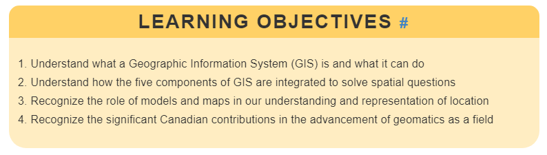

--- 
title: "Geomatics for Environmental Management: An Open Textbook for Students and Practitioners"
documentclass: book
bibliography:
- bibliographies/ch1.bib
- bibliographies/ch2.bib
- bibliographies/ch3.bib
- bibliographies/ch4.bib
- bibliographies/ch5.bib
##- bibliographies/ch6.bib
- bibliographies/ch7.bib
- bibliographies/ch8.bib
- bibliographies/ch9.bib
- bibliographies/ch10.bib
- bibliographies/ch11.bib
- bibliographies/ch12.bib
- bibliographies/ch13.bib
- bibliographies/ch14.bib
- bibliographies/ch15.bib
##- bibliographies/ch16.bib
- packages.bib
link-citations: true
github-repo: ubc-geomatics-textbook
url: https\://github.com/ubc-geomatics-textbook
description: Advancing teaching and learning in geomatics
always_allow_html: true
site: bookdown::bookdown_site
---

# About this textbook {.unnumbered}

```{r 00-book-cover, fig.cap = fig_cap, out.width= "75%", echo = FALSE}
    fig_cap <- paste("Cover design by Du Toit, CC-BY-SA-4.0.")
    knitr::include_graphics("images/15-las-treetops.png")
```
</br>

Geomatics is a large and growing field that encompasses the art, science and technology of measuring attributes about Earth's systems. From the earliest observations of Earth's shape in ancient Greece to the space and information age, humans have wondered about their place on this planet. Nearly every aspect of our modern geographic lives can be attributed to advances in the field of geomatics. Today, location is real-time and precise, made easy by millennia of observations and incremental advances in technology that have culminated in a wondrous field of study.

The purpose of this textbook is to give students and practitioners a solid survey (pun intended) of what modern geomatics is capable of when confronting environmental management problems. We take a Canadian perspective to this approach, by telling the historical contributions of Canadians to the field and sharing real-world case studies of environmental management problems in Canada. Inside, you will find interactive web-based content and tools, case studies with real geographic data, and tons of reflection and practice questions. Best of all, unless otherwise stated, the content is free to use, adapt, and remix for any purpose with attribution to us and under the same [Creative Commons 4.0 license](https://creativecommons.org/licenses/by-sa/4.0/).

<a rel="license" href="http://creativecommons.org/licenses/by-sa/4.0/"></a><br />

## Who Should use this textbook {.unnumbered}

This textbook is designed to be used by students, instructors, and practitioners of geomatics. All the basics are covered for introducing Geographic Information Systems (GIS) and remote sensing at any level or as a refresher. We throw in a little extra for understanding common GIS workflows and some more advanced topics that are suitable for advanced students. Unlike many other geomatics textbooks, we do not adopt any specific GIS software and therefore any student or practitioner should be able pick up this textbook and apply the methods and knowledge to the software of your choice. That said, the textbook is created with many geospatial packages in R and because it is open, anyone is free to poke their head under the hood in the GitHub repository for specific workflows and geospatial data handling with R.

## How to adopt this textbook in your geomatics classroom {.unnumbered}

Depending on what you are teaching and how you organize your course, you can easily assign readings that are thematic or sequential. A great way to get started with adopting this textbook is to read the clear and concise **Learning Objectives** that are displayed at the very beginning of each chapter and then compare with your own curriculum.

```{r 00-learning-objectives, out.width= "75%", echo = FALSE}
    
```
</br>

Chapter 1 provides an overview of the field with some key definitions and a detailed history of much of the technology that is presented in later chapters. The remainder of the textbook can be divided into four parts:

- **Part 1** Chapters 2-5 cover **Geospatial Data Fundamentals** such as types of data, collecting and editing data, and relational database management systems.
- **Part 2** Chapters 6-9 focus on **Spatial Analysis** and cover a wide variety of common workflows, some of which might be found in more advanced geomatics coursework like network analysis and spatial estimation.
- **Part 3** Chapters 10-14 focus on everything **Remote Sensing** including theory, systems, image processing and analysis, Global Navigation Satellite Systems, and LiDAR (light detection and ranging).

Chapters are written to stand alone as authoritative contributions on specific topics, but an accumulative approach is taken to content organization. In this way, the textbook can be adopted in sequence as-is for an entire semester or you can adopt the chapters that suit the needs for your course and compliment them with other materials. Each chapter is also subdivided into subsections that can be easily linked to for an assigned reading.

## How to get involved {.unnumbered}

Because this is an open project, we highly encourage contributions from the community through our **Open Geomatics Community of Practice** on GitHub. The textbook is hosted on our GitHub repository and from there you can open an issue or start a discussion. Feel free to open an issue for any typos, factual discrepancies, bugs, or topics you want to see in a future edition. We are always looking for great Canadian case studies to share! Beyond the built versions of the textbook (e.g., [www.opengeomatics.ca](http://www.opengeomatics.ca), pdf, epub, etc.), you can fork our GitHub repository to explore the source code.

## Acknowledgements {.unnumbered}

So many folks helped with the development of this textbook and many of them are named as authors in various chapters. For those not explicitly named with contributions, we greatly thank the efforts by Nick Murphy for collating our bibliographic sources, Natasha Sharma for editing and fixing things, students enrolled in the Master of Geomatics for Environmental Management program at the University of British Columbia for contributing case studies and early reviews. This textbook would not have been possible without the support of an Open Educational Resources (OER) Implementation Grant from the University of British Columbia.
